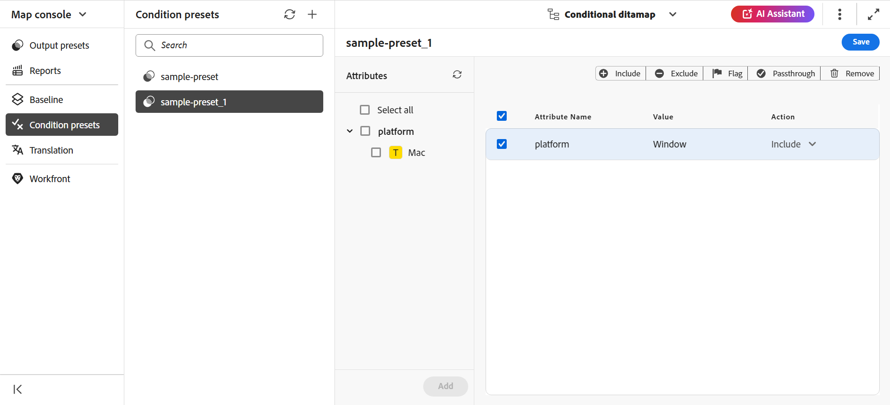

# 条件プリセットの使用 {#id1825FL004PN}

DITA トピックで属性を定義し、条件プリセットを使用して、最終出力の属性の動作を指定できます。 例えば、コンテンツにバージョン 1.0 およびバージョン 2.0 として属性を追加し、条件プリセットを使用してリリース 1.0 のバージョン 1.0 を含め、バージョン 2.0 を除外できます。同様に、OS Windows および OS Linux として属性をコンテンツに追加し、オペレーティングシステムに応じて、最終的な出力に関連するコンテンツを含めたり除外したりできます。

条件プリセットは、次の 2 つの方法で作成できます。

* Web エディタから：Web エディタから DITA マップの条件プリセットを作成および管理できます。
* マップダッシュボードから：マップダッシュボードから DITA マップの条件プリセットを作成および管理できます。

## Web エディターからの条件プリセット

Experience Manager Guidesでは、web エディターから条件プリセットを管理し、それらのプリセットを出力プリセット内で使用して最終的な出力を生成できます。
Web エディターの **条件プリセット** ビューで、条件プリセットの作成と表示、属性の表示、現在のマップのアクションの管理を行うことができます。

### 条件プリセットの作成

**条件プリセット** ビューには、属性、値、アクションなど、条件プリセットに関する詳細情報が表示されます。
次の手順を実行して、トピックの条件プリセットを作成できます。

1. **リポジトリ** パネルで、DITA マップファイルをマップビューで開きます。
1. 「**管理** タブを選択します。
1. 左側の **条件プリセット** を選択します。 DITA マップに定義された条件プリセットのリストが表示されます。
1. **条件プリセット** の横にある「+」アイコンを選択して、「**新規条件プリセット** ダイアログを開きます。
1. プリセットの一意の名前を入力します。

   >[!NOTE]
   >
   > 「名前」フィールドが空の場合や、無効な文字または既存の条件プリセットと同じ名前を入力した場合は、エラーが表示されます。 ハイフン「–」またはアンダースコア「_」を区切り文字として使用できます。

1. 「**作成**」を選択します。
新しい条件プリセットがリストに追加されます。
1. 条件プリセットをダブルクリックして、属性とアクションを表示します。
**属性** パネルには、マップ内に存在する参照に追加されたすべての属性が表示されます。 右側のパネルには、条件プリセットに追加した条件のみが表示されます。
1. 次のいずれかの操作を行って、属性を追加します。
   * 1 つ以上の属性を選択して、その下のすべての値を条件プリセットに追加します。 例えば、`platform` 属性を選択して、そのすべての値を追加できます。
   * 1 つ以上の属性値を選択して、条件プリセットに追加します。 例えば、platform 属性の `Unix` と `Win` の値を選択できます
   * 任意の属性と値のペアを選択して、中央のパネルにドラッグします。 例えば、platform 属性の `Unix` 値を選択してドラッグできます。
   * **すべてを選択**：すべての属性とその値を条件プリセットに追加します。
デフォルトでは、属性のアクションは `Include` です。

1. 「**追加**」を選択します。この手順を繰り返して、さらに属性を追加できます。 追加する属性は、中央のパネルから右側のパネルに移動します。
1. 上部のアクションバーから「削除」を選択して、右側のパネルで選択した属性を削除します。
1. （オプション）必要に応じて、属性に適用されるアクションを上書きできます。
次のいずれかの操作を行います。
   * 任意の属性で、「アクション」ドロップダウンから次のいずれかのアクションを選択します。
      * 包含
      * 除外
      * パススルー
      * フラグ
   * 右側のパネルから複数の属性行を選択し、上部のアクションバーからアクションを選択します。 例えば、選択した属性に対して除外アクションを選択できます。
1. 「**保存**」を選択して、条件プリセットを保存します。

   >[!NOTE]
   >
   > 別のプリセットを選択した場合や、保存せずにプリセットを閉じた場合は、警告が表示されます。

条件プリセットを作成すると、出力プリセットの **条件プリセット** ドロップダウンの下に表示されます。 [PublishPDF出力 ](../web-editor/native-pdf-web-editor.md) の方法の詳細をご覧ください。

### 条件プリセットの名前の変更

条件プリセットの名前を変更するには、次の手順を実行します。

1. **条件プリセット** パネルの条件プリセットの上にマウスポインターを置きます。
1. オプションメニューから **名前を変更** を選択して、**条件プリセットの名前を変更** ダイアログを開きます。
1. 条件プリセットの名前を編集します。
1. **名前変更** をクリックします。

### 条件プリセットの複製

条件プリセットを複製するには、次の手順を実行します。

1. **条件プリセット** パネルの条件プリセットの上にマウスポインターを置きます。
1. オプションメニューから **複製** を選択して、**条件プリセットを複製** ダイアログを開きます。
   >[!NOTE]
   >
   > プリセットのデフォルト名は `<selected condition preset name>_1` です。 必要に応じて名前を変更できます。

1. **複製** をクリックします。

### 条件プリセットを削除

条件プリセットを削除するには、次の手順を実行します。

1. **条件プリセット** パネルの条件プリセットの上にマウスポインターを置きます。
1. オプションメニューから **削除** を選択して **条件プリセットを削除** ダイアログを開きます。
1. 「**削除**」をクリックします。

## マップダッシュボードからの条件プリセット

### 条件プリセットの作成

条件プリセットを作成するには、次の手順を実行します。

1. DITA マップコンソールで「**条件プリセット**」タブを選択します。
1. **作成** ボタンをクリックします。
1. **名前条件** にプリセットの名前を入力します。
1. **デフォルトアクションの設定** ドロップダウンから、次のデフォルトアクションのいずれかを選択します。

   * 包含
   * 除外
   * パススルー
   * フラグ
アクションは、条件プリセットに追加されるかどうかにかかわらず、すべての属性に対してデフォルトのアクションとして設定されます。

   例えば、ドキュメントに 15 の条件属性があり、そのうち 4 つを条件プリセットに含めたとします。 デフォルトのアクションとして **除外** を選択した場合、15 個のすべての属性に適用されます。

1. 次のいずれかの操作を行って、属性を追加します。
   * 条件プリセットに属する 1 つの属性に「**追加**」をクリックします。 この手順を繰り返して、さらに属性を追加できます。
   * **すべて追加** をクリックして、すべての属性を条件プリセットに追加します。
1. \（オプション\）必要に応じて、手順 4 で属性に適用したデフォルトのアクションを上書きできます。 次のいずれかの操作を行います。
   * 複数の属性を選択し、**選択した条件のアクションを設定** からアクションを選択して、「**適用**」をクリックします。
   * **アクション** ドロップダウンから属性のアクションを選択します。
1. 「**保存**」をクリックします。

### 条件プリセットの編集

既存の条件プリセットを変更して、条件プリセット内の属性に適用されるアクションを変更することができます。 条件プリセットを編集するには、次の手順を実行します。

1. DITA マップコンソールで「**条件プリセット**」タブを選択します。
1. **編集** ボタンをクリックします。
1. 条件プリセット内のすべての属性に対して、必要な変更を行います。
1. 「**保存**」をクリックします。

### 条件プリセットのコピーの作成

条件プリセットのコピーを作成し、必要に応じて変更できます。 条件プリセットのコピーを作成するには、次の手順を実行します。

1. DITA マップコンソールで「**条件プリセット**」タブを選択します。
1. 「**複製** ボタンをクリックします。

   >[!NOTE]
   >
   > プリセットのデフォルト名は `<selected condition preset name>_Duplicate` です

   必要に応じて名前を変更できます。

1. \（オプション\）条件プリセット内のすべての属性に対して、必要な変更を行います。
1. 「**保存**」をクリックします。

### 条件プリセットを削除

DITA マップコンソールの「**条件プリセット**」タブから、1 つ以上の条件プリセットを削除できます。 条件プリセットを削除するには、次の手順を実行します。

1. DITA マップコンソールで「**条件プリセット**」タブを選択します。
1. 削除する条件プリセットを選択します。
1. **削除** ボタンをクリックします。
1. 「**削除**」をクリックして、アクションを確定します。

**親トピック：**[ 出力生成 ](generate-output.md)
