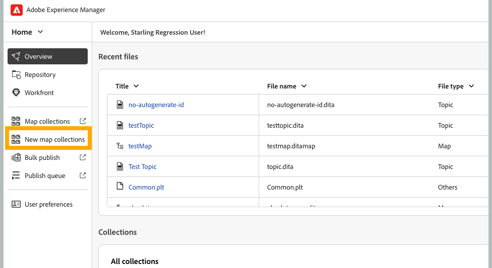
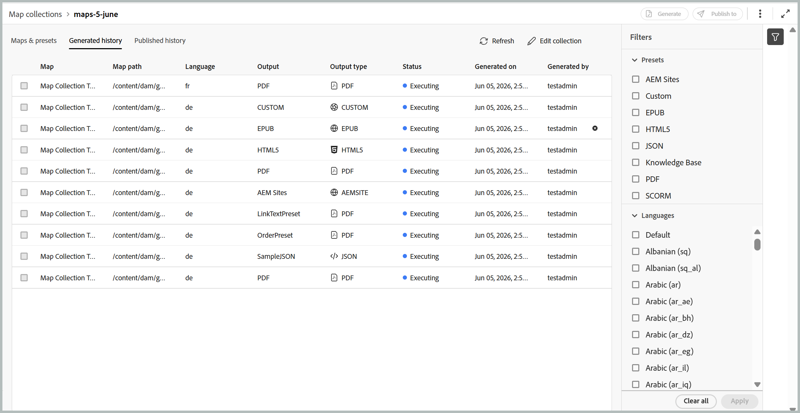

# 出力生成に新しいマップコレクションを使用する（Beta）

>[!IMPORTANT]
>
> 新しいマップコレクションは、2026.06.0 リリース以降のExperience Manager Guides as a Cloud Serviceで利用できます。 この機能を有効にするには、カスタマーサクセス チームにお問い合わせください。

Adobe Experience Manager Guidesのマップコレクションを使用すると、パブリッシングスペシャリストは、複数のドキュメントを1つのコレクションに整理し、各ドキュメントに対して生成された出力を制御し、一元化されたダッシュボードから一括で出力を効率的に生成およびパブリッシュできます。 また、出力生成の進捗状況を可視化し、最後に公開された出力以降にマップに加えられた変更をハイライト表示し、必要に応じてコンテンツを再公開できます。

新しいマップコレクションは、以前に旧マップコレクション全体に広がった機能を統合し、一括公開を単一の統合インターフェイスに統合します。 有効にすると、マップ、プリセット、生成履歴、公開履歴、メタデータ、コレクションメンバーシップを1か所で管理できます。

## マップコレクションの作成とDITA マップの追加

マップコレクションを作成してマップを追加するには、次の手順を実行します。

1. Experience Manager Guides ホームページを開き、**新しいマップコレクション**&#x200B;を選択します。

   **マップコレクション** ページが開きます。

   {width="650"}

1. **マップコレクション** ページで、右上の&#x200B;**作成**&#x200B;を選択し、新しいマップコレクションに&#x200B;**名前**&#x200B;を指定します。

   {width="350"}

1. 「**作成**」を選択します。

   マップコレクションの作成時に成功メッセージが表示されます。

1. マップを追加する目的のマップコレクションを開きます。

   

   マップコレクションのタイトルにカーソルを合わせると、次のアクションを実行できます。

   - **履歴を生成**：定義されたプリセットの生成された出力を含むすべてのマップを一覧表示する「生成履歴」タブに直接移動します。
   - **履歴を公開**：定義されたプリセットの公開済み出力を含むすべてのマップを一覧表示する「公開済み履歴」タブに直接移動します。
   - **名前を変更**: マップコレクションの名前を変更します。

1. **コレクションを編集**&#x200B;を選択し、**マップを追加**&#x200B;を選択します。

   

1. 目的のマップを選択し、**使用可能な翻訳を選択** トグルを有効にすると、そのマップのすべての使用可能な翻訳コピーがマップコレクションに自動的に追加されます。 マップに翻訳コピーがない場合、デフォルトの言語がマップに追加されます。

   

1. 「**追加**」を選択します。

   マップファイルは、使用可能なすべての翻訳コピーとともに一覧表示されます。 翻訳されたコピーがないマップの場合、デフォルトの言語が表示されます。

   

1. 必要なマップまたはすべてのリストされたマップを選択し、「**プリセットを取得**」ボタンを選択して、選択したマップで使用可能なプリセットを取得します。

   選択したマップで使用可能なすべてのプリセットのリストが表示され、**フォルダープロファイルプリセット**&#x200B;と&#x200B;**その他のプリセット**&#x200B;の2つのカテゴリにグループ化されます。 **フォルダープロファイルプリセット**&#x200B;は、選択したすべてのマップに共通ですが、**その他のプリセット**&#x200B;は個々のマップに固有です。 **その他のプリセット**&#x200B;の下のプリセットの場合、対応するトグルの横に関連するマップが表示されます。

   

1. 要件に応じて、**すべてのプリセットを有効にする**&#x200B;または&#x200B;**すべてのフォルダープロファイルプリセットを有効にする**&#x200B;を選択します。 右側のフィルターアイコンを使用して、リストを絞り込むこともできます。 フィルターには、2つのレベルのフィルタリングが用意されています。リストされているプリセットを絞り込む&#x200B;**プリセットタイプ**&#x200B;と、マップパネルから特定のマップを選択する&#x200B;**マップステータス**。

   

1. 「**保存**」を選択します。

マップのタイトル、対応するファイル名、使用可能な言語、設定されたプリセットを含むすべての目的のマップのリストが表示されます。

「**マップとプリセット**」タブには、特定の言語に対して選択したマップに基づく情報が次の列に表示されます。

- **プリセット**: マップファイルで設定された出力プリセットタイプを表示します。
- **ベースライン**：出力プリセットで使用されるベースラインを表示します。  ベースラインが使用されていない場合は、ハイフン `-`が表示されます。
- **生成後に変更**: DITA マップが生成後に更新されるかどうかを示します。 この情報に基づいて、このDITA マップの出力を公開するかどうかを決定できます。
- **公開後に変更**：最後の公開後にDITA マップが更新されるかどうかを示します。 この情報に基づいて、このDITA マップの出力を再公開するかどうかを決定できます。
- **最終生成**：最終生成された出力の日時を表示します。
- **最終公開日**：最後に公開された出力の日時を表示します。

**フィルターオプション**

次のフィルターオプションは、マップとプリセットページの右側のパネルで使用できます。

- **生成後に変更**:「はい」、「いいえ」、「まだ生成されていません」を選択できます。 「はい」を選択すると、生成後に変更されたマップのみが「マップとプリセット」タブに表示されます。
- **公開以降に変更**：はい、いいえ、まだ生成されていません。 「はい」を選択すると、「マップとプリセット」タブには、公開後に変更されたマップのみが表示されます。
- **プリセット**: マップファイルを除外するプリセットを選択します。 例えば、*AEM サイト* プリセットを選択した場合、*AEM サイト*&#x200B;出力プリセットが設定されているマップのみが表示されます。
- **言語**：使用可能な言語コードのいずれかを選択し、「マップとプリセット」タブに選択した言語のみを表示できます。

  

## マップコレクションを使用した出力の生成

マップコレクションを使用して出力を生成するには、次の手順を実行します。

1. マップコレクションを開きます。 AEM Sites、PDF（ネイティブPDFを含む）、HTML5、EPUB、カスタムプリセットなどの様々な出力プリセットを設定に従って表示できます。

1. 選択したマップの出力を生成するには、必要なマップファイルと特定のプリセットを選択し、**Generate**&#x200B;を選択します。

   >[!IMPORTANT]
   >
   > プリセットまたはDITA マップの出力生成プロセスがキュー内または処理中の場合、同じプリセットまたはマップに対して別の出力生成タスクを開始することはできません。

1. 出力が生成されたら、「**生成履歴**」タブに移動して、生成されたすべてのマップのリストを表示します。 生成の進行状況は、**ステータス**&#x200B;列で追跡できます。この列は、生成が実行中か完了しているかを示します。

   

1. 生成プロセスの最新ステータスを表示するには、**更新**&#x200B;を選択します。 ステータス列が更新され、各マップの現在の状態と関連するプリセットが反映されます。

   - **完了（緑）**：生成が正常に完了しました。
   - **完了（赤）**：生成が完了しましたが、エラーが発生しました。 エラーの詳細はログで確認できます。
   - **実行中（青）**：生成は現在進行中です。

   

1. タスクのステータスが実行中になるまで、**生成をキャンセル** アイコンを選択して、出力生成タスクをキャンセルすることもできます。

   

1. さらに、出力生成が完了したマップの生成された出力を表示するには、マップ名にカーソルを合わせると表示される「**出力を開く**」アイコンを選択するか、隣接する「**ログ**」アイコンを選択して生成ログを表示します。

   

## マップコレクションを使用した出力の公開

マップコレクションを使用して出力を公開（設定されている場合）するには、次の手順を実行します。

1. 「**マップとプリセット**」タブまたは「**生成履歴**」タブから目的のマップを選択し、**公開先**」を選択します。
1. 出力を公開するターゲット環境を選択します：**プレビュー**&#x200B;または&#x200B;**公開** インスタンス。

   

1. 「**公開履歴**」タブに切り替えて、公開タスクのステータスを監視します。

   

1. タスクの最新のステータスを表示するには、**更新**&#x200B;を選択します。
1. ステータスが&#x200B;**Successful**&#x200B;に変わったら、選択したターゲットインスタンスで公開されたコンテンツを確認します。

## メタデータプロパティの設定

マップコレクションでは、DITA マップのメタデータプロパティを一括設定できます。 「**マップとプリセット**」タブから「**メタデータを設定**」アイコンを選択して、**アセットメタデータ** ページを開きます。 **アセットメタデータ** ページでは、コレクションに存在するすべてのマップが左側に一覧表示されます。

メタデータプロパティを設定するには、次の手順を実行します。

1. メタデータを更新するマップを選択できます。 デフォルトでは、存在するすべてのDITA マップが選択されます。

1. DITA マップを選択すると、メタデータ、スケジュール（非アクティブ化）、参照、ドキュメント状態などのプロパティを表示できます。

1. メタデータプロパティを更新します。

1. 上部の「**保存して閉じる**」を選択して、更新を保存します。
1. （オプション）タグを更新する場合、**保存して閉じる** ドロップダウンで「追加」を選択して、新しいタグを既存のリストに追加することもできます。
1. 「**保存して閉じる**」ドロップダウンから「**送信**」を選択します。
マップコレクションから選択したDITA マップのメタデータプロパティが一括で更新されます。

>[!NOTE]
> 
>**文書状態** ドロップダウンでは、選択したすべてのDITA マップに共通で許可されている文書状態のみを選択できます。 詳しくは、[**ドキュメントの状態**](./web-editor-document-states.md)&#x200B;を参照してください。

メタデータプロパティはファイルプロパティと同期しています。 更新したら、エディターの&#x200B;**ファイルのプロパティ** パネルから表示できます。

**親トピック：**&#x200B;[&#x200B;出力生成](generate-output.md)
