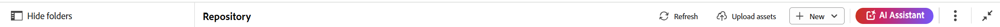
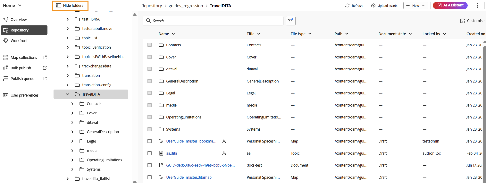
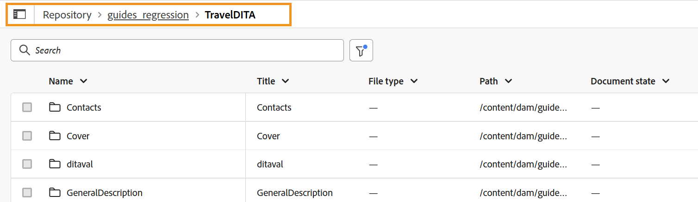
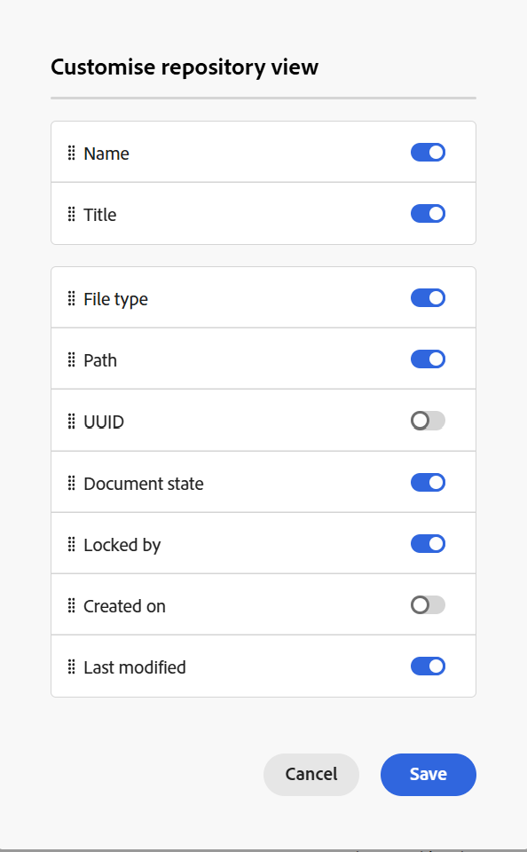
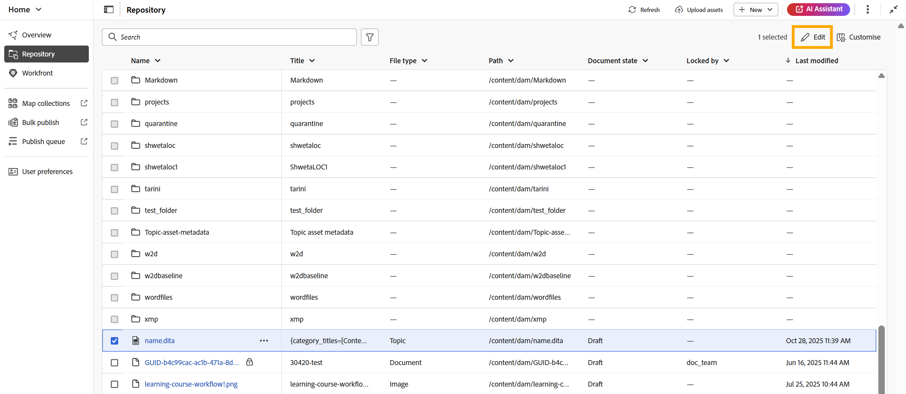
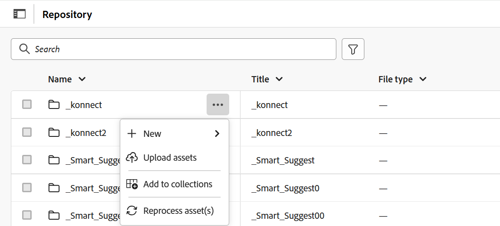
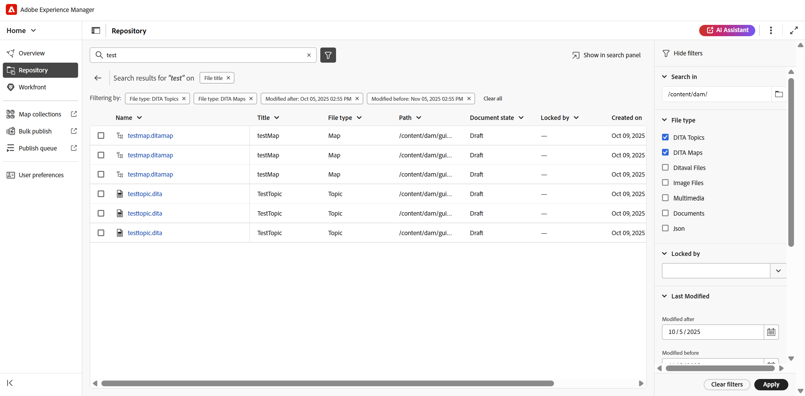

# リポジトリインターフェイスについて

リポジトリは、フォルダーとファイルの見つけやすさを向上させるための一元化されたスペースとして機能します。 複数の列を持つフォルダーとファイルの包括的な表形式のリスト表示を提供し、すべてのファイルとアセットのコンテキストの詳細を提供します。

この統合されたインターフェイスにより、新しいファイルやフォルダーの作成、ファイルの編集、アセットのアップロード、堅牢なフィルターオプションを備えたファイルの検索など、複数の機能が合理化され、効率と使いやすさが確保されます。

リポジトリインターフェイスは、次のセクションに分かれています。

- リポジトリーナビゲーションバー
- リポジトリの表形式表示

## リポジトリーナビゲーションバー

リポジトリナビゲーションバーは、リポジトリインターフェイスの上部にあり、リストに記載されている重要なアクションにすばやくアクセスできます。

- **フォルダーナビゲーションパネル**: リポジトリー内のフォルダーの階層的なツリー表示を表示し、シームレスなナビゲーションを実現します。 このパネルには、フォルダーレベルの情報のみが表示されます。 ここでフォルダーを選択すると、その内容、ファイル、サブフォルダーがリポジトリビューに表示されます。 以下に強調表示されているアイコンを使用して、このパネルを表示または非表示にできます。

  

- **パンくず**: リポジトリ内の現在のパスを示し、現在のフォルダーに至るフォルダーの階層を示します。 これを選択すると、階層内の特定のフォルダーに戻すことができます。

  {width="650"}

- **更新**: リポジトリを更新して、最新の変更を反映します。
- **Assetsをアップロード**: パンくずリストでハイライト表示されているように、現在のフォルダーにアセットを直接アップロードできます。
- **新規**：現在のフォルダー内の新しいトピック、マップ、フォルダーを、パンくずリストでハイライト表示して作成できます。
- **AI アシスタント**：スマートヘルプ機能を通じて生産性を向上させるように設計された、AIを活用した強力なツールです。 [AI アシスタント ](./ai-assistant.md)機能は現在、Adobe Experience Manager as Cloud Serviceでのみ使用できます。
- **その他のアクション**：追加のオプションへのアクセスを提供します。 このボタンを選択すると、次のオプションを含むメニューが開きます。
   - **Assets**：設定に基づいて宛先に移動します。
      - **Cloud Services**: Cloud Servicesを使用している場合、**Assets** オプションを選択すると、AEM ナビゲーション ページに移動します。
      - **オンプレミスソフトウェア**: Adobe Experience Manager Guides（4.2.1以降）を使用している場合、**Assets** オプションを選択すると、Assets UIの現在のファイルパスに移動します。
   - **Workspace settings**: **Workspace settings** ダイアログに移動します。 詳しくは、[Workspace設定の設定](../cs-install-guide/workspace-settings.md)を参照してください。
- **ビューを展開**: **展開** アイコンを使用してページビューを展開できます。 このビューでは、ヘッダーバーは非表示になり、コンテンツ領域が最大化されます。 標準ビューに戻るには、「拡張ビューを終了」アイコンを使用します。

## リポジトリの表形式表示

リポジトリは、すべてのフォルダーとファイルの表形式のリストを提供する中央スペースとして機能します。 次の機能を提供します。

- **カスタマイズ**: リポジトリビューの右上隅にある「**カスタマイズ**」オプションを使用して、表示される列を変更できます。 このオプションを使用すると、任意の列を表示または非表示にしたり、必要に応じて列を並べ替えたりできます。 **名前**&#x200B;または&#x200B;**タイトル**&#x200B;列は必須であり、両方を同時に無効にすることはできません。 **ファイルタイプ**、**UUID**、**ドキュメント状態**、**によってロック**、**作成日**&#x200B;および&#x200B;**に変更**&#x200B;など、その他のフィールドは、必要に応じて有効または無効にできます。 ドラッグ&amp;ドロップするだけで並べ替えることができます。

  {width="350"}

- **列のサイズ変更**：列ドロップダウンメニューからオプションを選択すると、列のサイズを変更できます。

- **並べ替え**：名前、タイトル、作成日時、最終変更日時の列では、列ドロップダウンメニューからアクセスできる昇順または降順の並べ替えがサポートされています。

- **ファイルの編集**:

   - リストから1つまたは複数のファイルを選択して編集できます。
   - チェックボックスを使用して目的のファイルを選択すると、**編集** オプションがリポジトリビューの右上隅に表示されます。
   - **編集**&#x200B;を選択すると、エディターインターフェイスで選択したファイルが開き、ファイルの編集を開始できます。

     

- フォルダーの&#x200B;**オプションメニュー**: フォルダーで使用可能な&#x200B;**オプション** メニューを使用して、次のアクションを実行できます。

  {width="350"}

   - **新規**：新しいDITA トピック、DITA マップ、またはフォルダーを作成します。
   - **Assetsをアップロード**: ローカルシステムからリポジトリ内の選択したフォルダーにファイルをアップロードします。
   - **コレクションに追加**：選択したフォルダーをお気に入りに追加します。 既存または新規のコレクションに追加できます。
   - **アセットの再処理**: フォルダー内のすべてのアセットの処理をトリガーします。

- **ファイルのオプションメニュー**: ファイルの&#x200B;**オプション** メニューを使用して、次のアクションを実行できます。

  {width="350"}

   - **編集**：編集するファイルを開きます。
   - **Oxygenで編集**:Oxygen コネクタプラグインで選択したファイルを編集するには、このオプションを選択します。

     >[!NOTE]
     >
     >この機能を環境で有効にするには、カスタマーサクセス チームにお問い合わせください。 これは、すぐに使えるサポートの一部として有効になっていません。 詳細については、『インストールおよび設定ガイド』の「[Oxygen](../cs-install-guide/conf-edit-in-oxygen.md)」セクションで編集するオプションを設定する」を参照してください。

   - **マップコンソールで開く**：選択したファイルがDITA マップである場合、このオプションを選択するとマップコンソールが開きます。
   - **マップダッシュボードで開く**：選択したファイルがDITA マップの場合、このオプションを選択するとマップダッシュボードが開きます。
   - **ロック**：選択したファイルを編集するためにロックします。
   - **プレビュー**: ファイル （.dita、.xml、オーディオ、ビデオ、または画像）を開かずに簡単にプレビューできます。
   - **重複**：このオプションを使用して、選択したファイルの重複またはコピーを作成します。
   - **移動先**：選択したファイルを別のフォルダーに移動するには、このオプションを使用します。
   - **名前を変更**：このオプションを使用して、選択したファイルの名前を変更します。
   - **削除**：このオプションを使用して、選択したファイルを削除します。
   - **に追加**: コレクションに追加するか、コンテンツを再利用可能にするかを選択します。
   - **コピー**: ファイルのUUIDまたは完全パスをコピーします。
   - **アセットの再処理**：選択したアセットの処理をトリガーします。
   - **プロパティ**：これを使用して、選択したファイルのプロパティ ページを開きます。
   - **PDFとしてダウンロード**：このオプションを使用して、PDF出力を生成し、ダウンロードします。

### エクスペリエンスの検索とフィルター

**検索** オプションは、主に&#x200B;**ファイルタイトル**、**ファイル名**、**コンテンツ**&#x200B;に基づいて、リポジトリから必要なファイルを検索するのに役立ちます。 検索には、1つ、2つ、または3つすべての条件を使用できます。 いずれかの基準が選択されていない場合、3つの基準すべてに共通の結果が含まれます。

**フィルター検索** \（\）アイコンを選択して、右側のフィルターパネルを開きます。

ファイルをフィルタリングし、検索を絞り込むには、次のオプションがあります。

- **で検索**: リポジトリ内に存在するファイルを検索するパスを選択します。

- **ファイルの種類**：特定のファイルの種類に基づいて検索をフィルタリングします。 利用できるオプションは、**トピック**、**マップ**、**DITAVAL**、**画像**、**マルチメディア**、**ドキュメント**&#x200B;および&#x200B;**その他**&#x200B;です。

- **ドキュメントの状態**: ファイルの現在のドキュメントの状態に基づいて検索をフィルタリングできます。 使用可能なフィルター値は、`ui_config.json file`の`repositoryFilters` フィールドで定義され、現在使用しているフォルダープロファイルに関連付けられています。

  つまり、

   - グローバルプロファイルを使用している場合は、グローバルプロファイルで設定されたフィルター値が適用されます。
   - 特定のフォルダープロファイルを選択すると、そのプロファイルで定義されたフィルター値が取得されます。

  ドキュメントの状態で使用できるデフォルトのフィルター値は、ドラフト、編集、レビュー中、承認済み、レビュー済みおよび完了です。 ドキュメント状態のフィルター値のカスタマイズについて詳しくは、[ ドキュメント状態フィルターの設定](../cs-install-guide/config-doc-state-filters.md)を参照してください。

- **ロック済み**: ユーザーのリストを表示します。 リストはページ分割され、非同期で読み込まれます。一度に限られたユーザーのセットが表示され、スクロールまたは移動するたびに多くのユーザーが取得されます。 これにより、特に多数のユーザーを使用する場合は、読み込み速度と全体的なパフォーマンスが向上します。

- **最終変更日**：変更日に基づいてコンテンツをフィルタリングします。 カレンダーから日付範囲を選択するか、次のいずれかの時間枠オプションを選択します。
   - 先週
   - 「先月」
   - 昨年

- **タグ**: タグに基づいてコンテンツをフィルタリングします。

- **DITA要素**：様々なDITA要素に基づいてコンテンツをフィルタリングします。

必要なフィルターをすべて適用したら、フィルターパネルの右下隅にある「**適用**」を選択します。

選択したフィルターに従ってカスタマイズされた検索結果は、**ファイルの表形式リストのみ**&#x200B;として表示されます（フォルダーは表示されません）。 フィルターを個別に削除することも、複数のフィルターを同時に削除することもできます。また、更新された選択内容を反映するように結果が更新されます。

検索結果が表示されたら、**編集** アイコンを使用して複数のファイルを選択してエディターで開くか、**検索パネルに表示** オプションを使用して検索結果をエディターに送信して、すべての結果を操作できます。

**検索パネルに表示**

リポジトリで検索を実行すると、**検索パネルで表示** オプションが使用できるようになります。 この機能を使用すると、検索されたすべての結果をエディター内の&#x200B;**検索パネル**&#x200B;に表示できます。 詳しくは、[検索パネル ](./search-panel-explorer.md)を参照してください。

