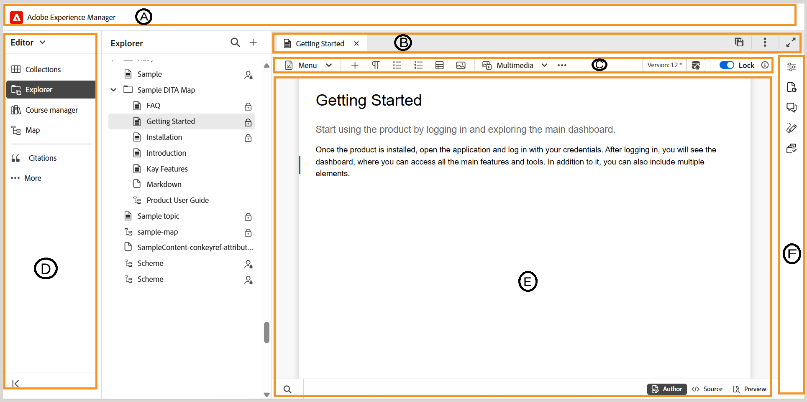

# 概要

ここでは、エディターインターフェイスの概要と、Experience Manager Guides エディターで使用できるさまざまな機能について説明します。

>[!BEGINTABS]

>[!TAB 新しいエディター]

このビューでは、コンテンツが新規エディターでどのようにレンダリングされるかを表示します

>[!TAB 古いエディター]

このビューでは、古いエディターでのコンテンツのレンダリング方法が表示されます

>[!ENDTABS]

エディターインターフェイスは、次のセクションまたは領域に分かれています。

- **（A）** [ ヘッダーバー](./web-editor-header-bar.md)
- **（B）** [ タブバー](./web-editor-tab-bar.md)
- **\（C\）** [ ツールバー](./web-editor-toolbar.md)
- **（D）** [左パネル ](./web-editor-left-panel.md)
- **（E）** [ コンテンツ編集領域](./web-editor-content-editing-area.md)
- **（F）** [右パネル ](./web-editor-right-panel.md)
