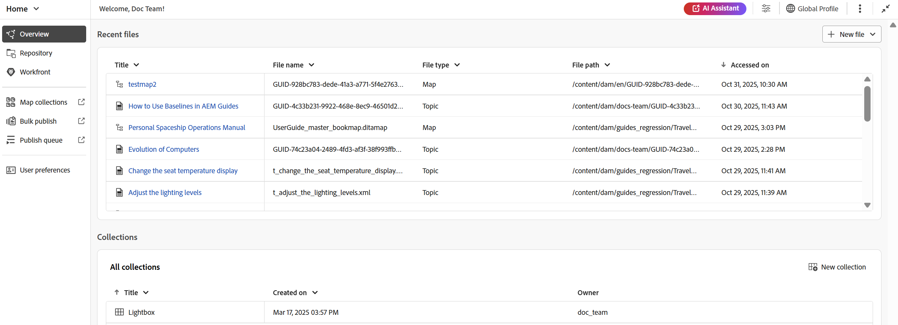
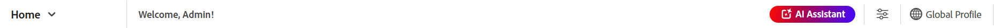
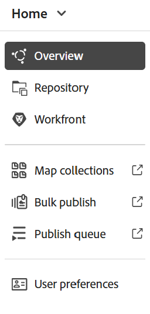
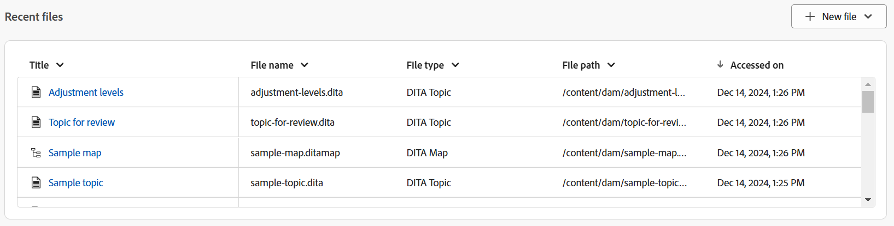
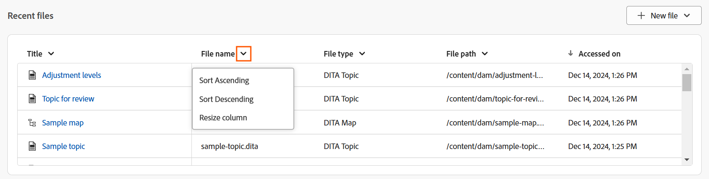
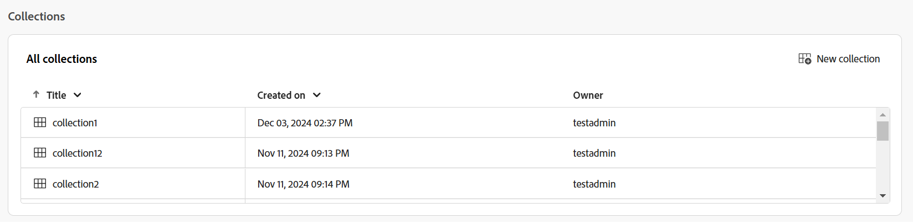
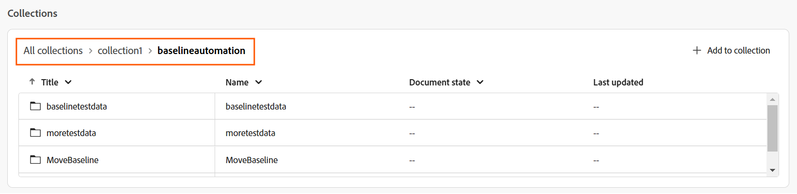
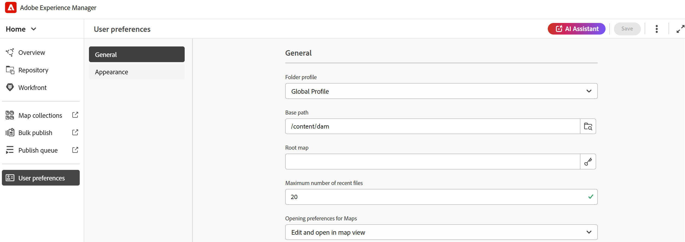
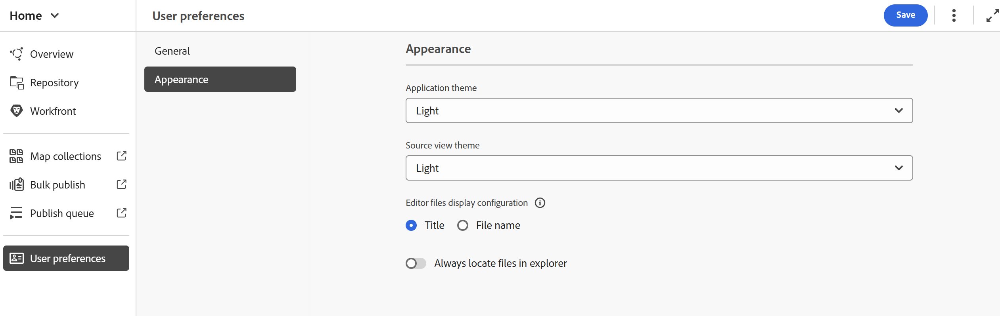

# Experience Manager Guidesのホームページのエクスペリエンス

ホームページは、Experience Manager Guidesにログインしたときに最初に表示される画面です。 最近アクセスしたファイルやコレクションなどを簡単に確認できるため、統一された直観的なウェルカムスクリーン体験を提供します。

Experience Manager Guidesのホームページは、次のセクションに分かれています。

- ヘッダーバー
- ナビゲーションバー
- 左パネル

## ヘッダーバー

ヘッダーバーは、ホームページの上部バーで、Adobe Experience Manager ロゴ（または統合シェルをExperience Manager Guides UIとして使用している場合は、統合シェル）が表示されます。 ロゴを選択すると、Experience Manager ナビゲーションページに移動します。

## ナビゲーションバー

ナビゲーションバーには、ナビゲーションの切り替え、概要レイアウトのカスタマイズ、ページビューの調整を行うためのツールが表示されます。 また、使用中の現在のフォルダープロファイルも表示されます。

>[!NOTE]
>
> Adobe Experience Manager Guides as a Cloud Serviceを使用している場合、**AI Assistant**&#x200B;というラベルが付いた追加機能がナビゲーションバーに表示されます。

ナビゲーションバーで使用できる機能は、次のように説明されます。

- **ナビゲーションスイッチャー**：他のページへのシームレスなナビゲーションを許可します：
   - **ホーム**: Experience Manager Guidesへのログイン時に表示されるデフォルトページ。
   - **Editor**:Experience Manager Guidesで構造化ドキュメントを作成および管理できる、使いやすいweb ベースのエディター。 [&#x200B; エディターのインターフェイス &#x200B;](./web-editor.md)について知る。
   - **マップコンソール**：マップの管理と公開のすべての側面を処理するための専用のワークスペースを提供します。 [&#x200B; マップコンソールのインターフェイス &#x200B;](./map-console-overview.md)について説明します。
- **AI アシスタント**：スマートヘルプ機能を通じて生産性を向上させるように設計された、AIを活用した強力なツールです。 さらに、エディターのインターフェイスで作業する際には、AI アシスタントのスマートオーサリング機能を活用できます。これにより、コンテンツの再利用と最適化に関するインテリジェントな提案を通じて、オーサリングプロセスをよりスマートかつ迅速におこなうことができます。

  [AI アシスタント &#x200B;](./ai-assistant.md)機能は現在、Adobe Experience Manager as Cloud Serviceでのみ使用できます。
- **概要セクションのカスタマイズ**: ウィジェットをウィジェットセクションで非表示または表示できます。
- **使用中のフォルダープロファイル**：現在使用されているフォルダープロファイルを表示します。
- **その他のアクション**：追加のオプションへのアクセスを提供します。 このボタンを選択すると、次のオプションを含むメニューが開きます。

   - **Assets**：設定に基づいて宛先に移動します。
      - **Cloud Services**: Cloud Servicesを使用している場合、**Assets** オプションを選択すると、AEM ナビゲーション ページに移動します。

      - **オンプレミスソフトウェア**: Adobe Experience Manager Guides（4.2.1以降）を使用している場合、**Assets** オプションを選択すると、Assets UIの現在のファイルパスに移動します。
   - **Workspace settings**: **Workspace settings** ダイアログに移動します。 詳しくは、[Workspace設定の設定](../cs-install-guide/workspace-settings.md)を参照してください。

     >[!NOTE]
     >
     > ホームページでは、Workspace設定のオプションは、Cloud Services設定でのみ使用できます。 オンプレミス設定では、「その他のアクション」オプションはホームページで使用できません。 ただし、エディターインターフェイスとマップコンソールから、その他のオプション/設定に移動して、関連する設定にアクセスできます。

- **ビューを展開**: **展開** アイコンを使用してページビューを展開できます。 このビューでは、ヘッダーバーは非表示になり、コンテンツ領域が最大化されます。 標準ビューに戻るには、**拡張ビュー**&#x200B;を終了アイコンを使用します。

## 左パネル

>[!NOTE]
>
> リポジトリは、2025.11.0 リリース以降のCloud Service セットアップでのみ、左側のパネルで使用できます。 オンプレミス設定の場合、リポジトリには引き続きエディターインターフェイスからアクセスできます。

左側のパネルでは、概要、リポジトリ、マップコレクション、一括公開、公開キュー、ユーザー環境設定機能にすばやくアクセスできます。 パネルを展開するには、インターフェイスの左下隅にある「**展開**」アイコンを選択します。 展開したら、**折りたたみ** アイコンを使用してパネルを折りたたみます。

{width="300"}

このパネルに表示される内容は、ユーザーの役割によって異なります。 次の表に、左側のパネルに表示される役割とそれぞれのセクションを示します。

- **管理者と発行者**: パネル内のすべてのセクションを表示する機能。
- **作成者**：公開以外のすべてのセクションを表示できます。 作成者は、マップコレクション、公開キュー、一括公開セクションにアクセスできません。
- **Reviewer**：概要セクションのみを表示する機能。 「概要」セクションを選択すると、Adobe Workfrontが設定されているかどうかに応じて、デフォルトの空の状態メッセージまたはWorkfront タスクウィジェットが表示されます。

左側のパネルで使用できる機能は、次のように説明されます。

- [概要](#overview)
- [リポジトリ](#repository)
- [&#x200B; マップコレクション &#x200B;](#map-collections)
- [一括公開](#bulk-publish)
- [キューを公開](#publish-queue)
- [&#x200B; ユーザー設定](#user-preferences)

>[!NOTE]
>
> さらに、管理者がシステムでAdobe Workfront統合を設定している場合は、左側のパネルにも&#x200B;**Workfront** オプションが表示されます。 Experience Manager Guidesでの[Adobe Workfront統合](./workfront-integration.md)について説明します。

### 概要

**概要**&#x200B;は、生産性を高めるために設計された、パーソナライズされたダッシュボードのように動作します。 整理され、集中力を維持するのに役立つさまざまなウィジェットが特徴です。

ウィジェットには、列を並べ替えたり、サイズを変更したりするオプションも用意されています。 これらのオプションを表示するには、列ヘッダーを選択すると、オプションがリストに表示されます。

ウィジェット セクションには、次のウィジェットがあります。

- **最近のファイル**：このウィジェットは、最近開いたファイル（エディターでアクセスしたファイルのリスト）のスナップショットと、タイトル、ファイル名、ファイルタイプ、ファイルパス、日付にアクセス済みなどの主要なファイルの詳細を提供します。

  

  列ドロップダウンメニューからオプションを選択して、列を並べ替えたり、サイズを変更したりできます。 デフォルトでは、データは最後にアクセスした日時に基づいてソートされます。

  

  [&#x200B; ユーザー設定](#user-preferences)から、このウィジェットに表示できるファイルの最大数を設定できます。 デフォルトでは、この制限は&#x200B;**20**&#x200B;に設定されています。

  ファイルにカーソルを合わせると、次のオプションを使用できます。

   - **エディターで開く**: エディターでファイルを開くことができます。 ファイルを選択するだけで開くこともできます。
   - **ピン留め/ピン留め解除**:1つ以上のファイルを最近使用したファイル ウィジェットにピン留めできます。 ピン留めされたファイルは、ウィジェットリストの上部に表示されます。 ファイルのピン留めを解除するには、**ピン留めを解除** オプションを使用します。
   - **削除**：最近使用したファイル ウィジェットからファイルを削除できます。

  **新しいファイルの作成ドロップダウンメニュー**

  **新規ファイル** ドロップダウンメニューを使用すると、**最近のファイル** ウィジェットから直接トピックまたはDITA マップを作成できます。 ファイルを正常に作成すると、エディターのインターフェイスにリダイレクトされ、ファイルを操作できるようになります。

- **コレクション**：一連のファイルまたはフォルダーで作業している場合は、このウィジェットに追加すると、すばやくアクセスできます。 追加すると、所有者や作成日など、その他の重要な詳細と共に、タイトル別にファイルを表示できます。 列ドロップダウンを選択すると、列の並べ替えとサイズ変更のオプションを表示できます。

  

  選択したコレクションのパンくずリストは、コレクションウィジェットの上部に表示されます。 これを選択すると、階層内の特定のフォルダーに戻すことができます。

  

  コレクションにカーソルを合わせて「その他」アイコン を選択すると、次のオプションを使用できます。

   - **名前変更**: コレクションの名前を変更できます。
   - **削除**: コレクションを削除できます。
   - **Assets UIでの表示**: Assets UIでコレクションを開くことができます。

  コレクションのタイトルを選択して、コレクションを開くことができます。 コレクション ファイルにカーソルを合わせて、その他アイコン を選択すると、次のオプションを使用できます。

   - **エディターで開く**: エディターでファイルを開くことができます。 または、ファイルタイトルを選択してファイルを開くこともできます。
   - **マップコンソールで開く**: マップコンソールでマップファイルを開くことができます。 （DITA マップファイルでのみ使用可能）。
   - **コレクションに追加**：新規または既存のコレクションにファイルを追加できます。
   - **コレクションから削除**: コレクションリストからファイルを削除できます。
   - **Assets UIでの表示**: Assets UIでファイルを検索できます。

  **新しいコレクションを新しいコレクション ドロップダウンメニューから作成**

  **新しいコレクション** ドロップダウンメニューを使用すると、新しいコレクションを作成し、**コレクション** ウィジェットに追加できます。

>[!NOTE]
>
> さらに、管理者がAdobe Workfrontとの連携を設定している場合は、「**あなたのタスク**」ウィジェットも「ウィジェット」セクションに表示されます。 Experience Manager Guidesでの[Adobe Workfront統合](./workfront-integration.md#working-with-the-your-tasks-widget)の詳細をご覧ください。

### リポジトリ

リポジトリは、フォルダとファイルを簡単に検出するための一元化されたハブとして機能します。 すべてのファイルとフォルダーの包括的な表形式のリストと、そのコンテキストの詳細が表示されます。 この統合されたインターフェイスを通じて、堅牢なフィルタリングオプションを使用してファイルをシームレスに参照し、検索を実行できるので、効率性を確保し、エクスペリエンスを強化できます。 [&#x200B; リポジトリ &#x200B;](./home-page-repository-view.md)の詳細をご覧ください。

### マップコレクション

Experience Manager Guidesでは、**マップコレクション**&#x200B;というダッシュボードを使用して、公開用にコンテンツを整理できます。 この機能を使用するには、左側のパネルから「**コレクションをマップ**」を選択します。 **Assets UI**&#x200B;のマップコレクションページに移動します。このページでは、[出力生成にマップコレクションを使用できます。](./generate-output-use-map-collection-output-generation.md)

### 一括公開

一括アクティベーション機能を使用すると、オーサリングからパブリッシングインスタンスまで、コンテンツをすばやく簡単にアクティベートできます。 この機能を使用するには、左側のパネルから「**一括公開**」を選択します。 Assets UIの一括アクティベーションコレクション ページに移動し、公開されたコンテンツの[一括アクティベーションを作成および管理できます](./conf-bulk-activation.md)。

### キューを公開

システム上で多数の公開タスクを実行している場合、各DITA マップを個別にチェックして公開タスクを監視することは事実上不可能になります。 Experience Manager Guidesを使用すると、管理者とパブリッシャーは、システムで実行されているすべての公開タスクの統合ビューを取得できます。

この機能を使用するには、左側のパネルから「**キューを公開**」を選択します。 Assets UIの公開ダッシュボードページに移動します。公開ダッシュボードを使用して公開タスクを[管理できます](./generate-output-publish-dashboard.md)。

### ユーザー環境設定

ユーザーの環境設定は、すべての作成者が使用できます。 環境設定を使用して、次の設定を行うことができます。

- **一般**: 「一般」タブでは、次の設定を行うことができます。

  

   - **フォルダープロファイル**: フォルダープロファイルは、条件付き属性、オーサリングテンプレート、出力プリセット、エディター設定に関連するさまざまな設定を制御します。 デフォルトでは、グローバルプロファイルが表示されます。 さらに、管理者がシステムでフォルダープロファイルを設定している場合、それらのフォルダープロファイルもフォルダープロファイルリストに表示されます。
   - **ベースパス**：デフォルトでは、EditorからExperience Manager Guides リポジトリにアクセスすると、/content/damの場所からアセットが表示されます。 作業フォルダーは、/content/dam/ フォルダー内の数個のフォルダーである可能性が高くなります。 作業フォルダーへのベースパスを設定すると、リポジトリビューにその場所のコンテンツが表示されます。 これにより、作業フォルダーにアクセスする時間が短縮されます。 また、トピックに参照ファイルまたはメディアファイルを挿入する場合、ファイルの参照場所は、ベースパスで設定されたフォルダーから始まります。
   - **ルートマップを選択**: キー参照または用語集エントリを解決するDITA マップファイルを選択します。 選択したルートマップは、キー参照を解決する際に最も優先されます。 詳細については、[&#x200B; キー参照の解決](./map-editor-other-features.md)を参照してください。
   - **最近使用したファイルの最大数**：このフィールドを使用して、最近使用したファイル ウィジェットに表示されるファイルの最大数を設定します。
   - **マップの環境設定を開く**：ここでは、DITA マップファイルを開く際にシステムが従うデフォルトの動作を選択できます。

- **アピアランス**:「アピアランス」タブには、アプリケーションのテーマとコンテンツ編集領域のソースビューを選択するオプションが表示されます。 このタブを使用して、次の設定を行います。

  

   - **アプリケーションテーマとSource ビュー**：アプリケーションとソースビューのライトテーマまたはダークテーマから選択できます。 ライトテーマの場合、ツールバーとパネルは明るいグレーの背景を使用します。 ダークテーマの場合、ツールバーとパネルは黒い背景を使用します。 「**デバイス** テーマを使用」を選択すると、Experience Manager Guidesがデバイスのテーマに基づいて明るいテーマと暗いテーマを選択できるようになります。

     すべてのテーマで、コンテンツ編集領域が作成者ビューに白い背景色で表示されます。

   - **エディターファイルの表示設定**: エディターでファイルを表示するデフォルトの方法を選択します。 作成者ビューの様々なパネルから、タイトルまたはファイル名でファイルのリストを表示できます。 デフォルトでは、ファイルはエディターにタイトルで表示されます。

   - **常にエクスプローラーでファイルを検索する**：このオプションを選択すると、エディターで編集する際にリポジトリ内のファイルの場所が表示されます。

  >[!NOTE]
  >
  >2025.11.0 リリースから、設定&#x200B;**常にリポジトリ内のファイルを検索**&#x200B;は、**常にエクスプローラー内のファイルを検索**&#x200B;という名前に変更されました。 オンプレミス設定の場合は、Experience Manager Guidesの5.1 リリースまで、「常にリポジトリ内のファイルを探す」として引き続き使用できます。
