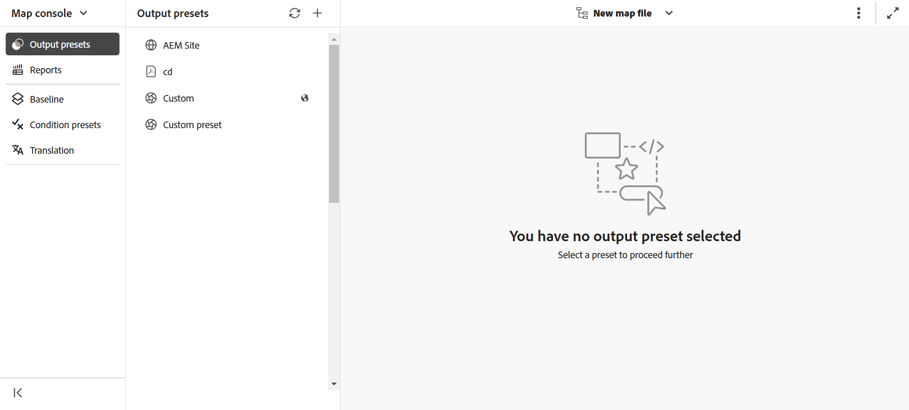
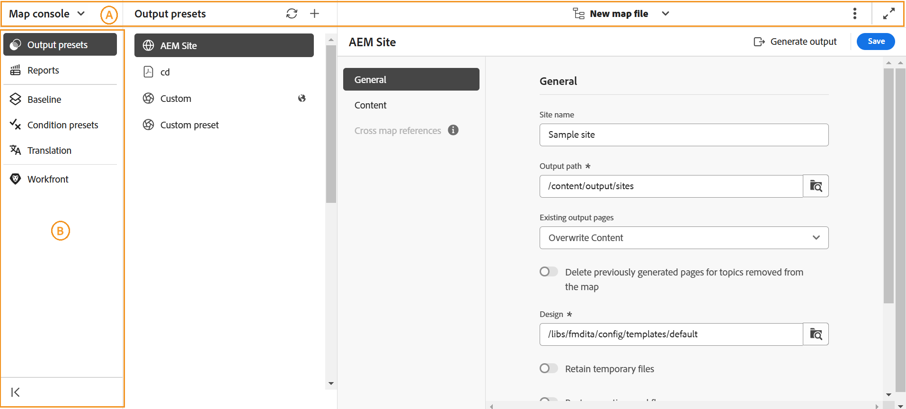

# マップコンソールの概要

Adobe Experience Manager Guidesでは、**マップコンソール**&#x200B;と呼ばれる専用コンソールを使用して、すべてのマップ管理タスクと公開タスクを効率化できます。 この一元化されたインターフェイスは、出力の生成、コンテンツの翻訳、レポートへのアクセスなどのオプションを一元的に提供することで、マップ関連のアクティビティの生産性と精度を向上させます。

マップコンソールインターフェイスは、主に&#x200B;**ナビゲーションバー**&#x200B;と&#x200B;**左パネル**&#x200B;の2つのセクションに分かれています。

- （**A**） **ナビゲーションバー**: ナビゲーションバーは、ナビゲーションを切り替え、ページビューを調整し、選択したマップファイルの名前を表示するツールを表示します。

  ナビゲーションバーで使用できる機能は、次のように説明されます。

   - **ナビゲーションスイッチャー**：他のページ – エディターまたはホームページへのシームレスなナビゲーションを可能にします。
   - **選択したマップファイル**：現在選択しているマップファイルの名前を表示します。 エディターで開くか、マップコンソール用に別のマップファイルを選択します。
   - **その他のアクション**: **Assets UI**&#x200B;および&#x200B;**Workspace設定**&#x200B;に移動するためのオプションを提供します。 詳しくは、[&#x200B; タブバー](./web-editor-tab-bar.md)を参照してください。

  >[!NOTE]
  >
  > バージョン 5.2より前のオンプレミス設定でAdobe Experience Manager Guidesを使用している場合、Workspace設定オプションは、その他のアクション メニューの下に&#x200B;**Settings**&#x200B;として引き続き表示されます。

   - **ビューを展開**: **展開** アイコンを使用してページビューを展開できます。 このビューでは、ヘッダーバーは非表示になり、コンテンツ領域が最大化されます。 標準ビューに戻るには、**拡張ビュー**&#x200B;を終了アイコンを使用します。

  >[!NOTE]
  >
  > Adobe Experience Manager Guides as a Cloud Serviceを使用している場合は、ナビゲーションバーに追加機能[AI アシスタント &#x200B;](./ai-assistant.md)が表示されます。

- （**B**） **左パネル**：左パネルでは、出力生成、レポート作成と管理、ベースライン、条件プリセット、コンテンツ翻訳、Workfront（設定されている場合のみ）機能にすばやくアクセスできます。

  詳しくは、以下の「[&#x200B; マップコンソール機能](#map-console-features)」セクションを参照してください。

## マップコンソール機能

次の機能は、[&#x200B; マップコンソールでDITA マップファイルを開いたときに、左パネルで利用できます](./open-files-map-console.md)。

**出力生成**

マップコンソールを使用すると、AEM Sites、PDF、HTML5、EPUB、JSON、DITA-OT、Native PDF パブリッシング、FMPSを通じたカスタム出力など、様々なフォーマットで効率的に出力を生成できます。 DITA マップ全体の出力を生成することも、更新した少数のトピックのみを選択して公開することもできます。 ベースライン公開機能を使用して、特定のバージョンのDITA マップまたはトピックを選択的に公開することもできます。

詳細については、[出力生成](./generate-output.md)を参照してください。

**レポートの作成と管理**

組織的な設定では、テクニカルドキュメントの作業を開始したり、ドキュメントを公開したりする前に、テクニカルドキュメントの全体的な完全性を確認する必要があります。 このようなニーズは、マルチユーザー環境や大規模環境では、さらに重要になります。 マップコンソールを使用すると、リポジトリ内のコンテンツの全体的な健全性と、ドキュメントプロセスでのコンテンツの使用方法に関する有益なinsightを提供するExperience Manager Guides レポートにアクセスできます。

詳しくは、[Experience Manager Guidesのレポート &#x200B;](./reports-intro.md)を参照してください。

**ベースライン**

Experience Manager Guidesには、トピックとアセットのバージョンを作成し、公開または翻訳に使用できるベースライン機能が用意されています。 同じDITA マップの複数の出力プリセットを並行して公開することもできます。

Experience Manager Guides[&#128279;](./web-editor-baseline.md)でベースラインを作成および管理する方法について説明します。

**条件プリセット**

Experience Manager Guidesを使用すると、DITA トピックで属性を定義し、条件プリセットを使用して、最終的な出力で属性に何が起こるかを指定できます。 例えば、コンテンツにバージョン 1.0とバージョン 2.0として属性を追加し、条件プリセットを使用してリリース 1.0のバージョン 1.0を含め、バージョン 2.0を除外できます。 同様に、OS WindowsおよびOS Linuxの属性をコンテンツに追加し、オペレーティングシステムに応じて最終的な出力に関連するコンテンツを含めたり除外したりできます。

[条件プリセット &#x200B;](./generate-output-use-condition-presets.md)の詳細をご覧ください。

**コンテンツの翻訳**

Experience Manager Guidesには、コンテンツを複数の言語に翻訳できる強力な機能が備わっています。 Experience Manager Guidesは、人による翻訳と機械翻訳の両方のワークフローをサポートしています。

マップコンソールでは、翻訳ワークフローを開始するために必要なすべてのオプションにアクセスできます。 詳細については、[&#x200B; コンテンツの翻訳](./translation.md)を参照してください。

**Workfront**

Workfront機能は、マップコンソールにも存在し、Experience Manager Guidesから直接Adobe Workfront タスクを操作できます。

Experience Manager Guides[&#128279;](./workfront-integration.md)でのAdobe Workfrontとの連携について説明します。

この機能にアクセスできるのは、管理者がExperience Manager Guides インスタンスで&#x200B;**Adobe Workfront**&#x200B;統合を設定している場合のみです。
