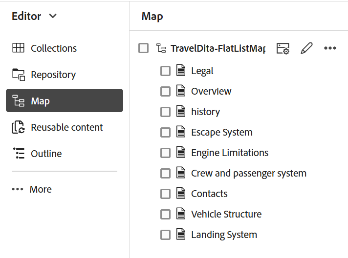

# 高度なマップエディターの操作 {#id1942D0S0IHS}

高度なマップ エディタは直感的なユーザ インタフェースを備えており、Web エディタに似ています。 Web エディタでマップ ファイルを開くと、高度なマップ エディタ インタフェースを使用してマップ ファイルを編集するオプションが表示されます。 高度なマップエディターを使用すると、トピック参照、キー参照を追加し、コンテンツを構造化できます。

Web エディタから直接マップ ファイルを編集する以外に、マップでトピック ファイルを開いて Web エディタを編集することもできます。 このトピックでは、高度なマップエディタの機能と、Web エディタで DITA マップのファイルを開いて編集する方法について説明します。

## マップ ファイルにトピックを追加する

高度なマップエディタを使用してマップファイルを構築するには、次の手順を実行します。

1. Assets UI で、編集するマップファイルに移動します。

   >[!NOTE]
   >
   > アセット選択モードが有効になっていないことを確認してください。

1. マップ ファイルに対して排他的ロックを取得するには、マップ ファイルを選択し、 **チェックアウト**.

   >[!NOTE]
   >
   > マップ ファイルに排他ロックを設定すると、他のユーザはマップを編集できなくなります。 ただし、マップ ファイル内のトピックは作業できます。 管理者が編集前にファイルをチェックアウトするように web エディターを設定している場合、チェックアウトするまでファイルを編集できません。 同様に、設定すると、ファイルを閉じる前に、チェックアウト済みのファイルをチェックインするように求められます

1. マップ ファイルを選択した状態で、 **トピックの編集**.

   {width="800" align="left"}

   または、を選択することもできます **トピックの編集** マップ ファイルのアクション メニューのオプション：

   {width="800" align="left"}

   マップ ファイルが開き、Web エディタでで編集できます。

1. **編集**&#x200B;アイコンをクリックします。

   {width="550" align="left"}

   高度なマップエディターインターフェイスでマップが開きます。 新しいマップ ファイルを開いた場合は、マップのタイトルのみがエディタに表示されます。

   {width="800" align="left"}

   - **A** - \（*メインツールバー*\）：これは Web エディタのメイン ツールバーに似ています。 参照： [メインツールバー](web-editor-features.md#id2051EA0G05Z) 詳細は、web エディターを参照してください。

   - **B** - \（*セカンダリツールバー*\）これは、マップ ファイルを操作するためのセカンダリツールバーです。 セカンダリツールバーから使用できる機能について詳しくは、以下を参照してください。 [高度なマップ エディタのツールバーで使用できる機能](#id205DEC0005Z).

   - **C** - \（*マップ ビュー*\）: マップ エディタをレイアウト、オーサー、ソース、プレビューの間で切り替えることができます。 この **レイアウト**&#x200B;ビューを使用すると、DITA マップ内のトピックを整理できます。 これにより、マップのツリー表示または階層表示が行われます。 この **作成者** [ 表示 ] を使用すると、マップ エディタでトピックを編集できます。 これにより、マップファイルの WYSIWYG ビューも作成されます。 この **ソース** ビューを使用すると、マップファイルの基になる XML を操作できます。 プレビューでは、マップ ファイル内のすべてのトピックとサブマップの統合ビューが表示されます。 この **閉じる** リンクはマップ ファイルを閉じます。

   - **日** - \（*左パネル*\）：左側のパネルにアクセスできます。このパネルから、お気に入り、リポジトリ、マップ、アウトライン、およびその他の機能にアクセスできます。 サイドバーを展開アイコン \（）をクリックして展開または折りたたむことができます\）に設定します。 左側のパネルで使用できる機能について詳しくは、 [左パネル](web-editor-features.md#id2051EA0M0HS) Web エディターで以下を行います。

   - **E** - \（*中央領域*\）: コンテンツ編集領域をマップします。

   - **金** - \（*右パネル*\）: プロパティ パネルにアクセスできるようにします。 選択したトピックまたはマップのコンテンツ プロパティおよびマップ プロパティを表示できます。 このパネルで使用できる機能について詳しくは、 [右側のパネル](web-editor-features.md#id2051EB003YK) Web エディターで以下を行います。

1. 左パネルで、に切り替えます。 **リポジトリ表示**.

1. AEM リポジトリで、追加するトピックまたはサブマップを含むフォルダーに移動します。

1. でトピックまたはマップ ファイルを選択します。 **リポジトリ表示** をドラッグして、\（middle\） マップコンテンツ編集領域にドロップします。

   トピックがマップに追加されます。

   {width="800" align="left"}

1. 後続のトピックまたはサブマップを追加するには、トピックまたはサブマップをマップ内の必要な場所にドラッグ アンド ドロップします。

   マップ ファイルを作成する際は、次の点を考慮してください。

   - ファイルは、マップ編集領域で水平バーが表示される場所に追加されます。 次のスクリーンショットでは、 *概要* トピックは、 *概要* および *ローンチサイトとランディングサイト* トピック。

     {width="350" align="left"}

   - トピックを置き換えるには、置き換えるトピックの上、左、または右にトピックを置きます。 トピックの左または右にある縦棒は、トピックがドロップされて置き換えられることを示します。

     {width="550" align="left"}

     ただし、トピックを置換する前に、確認プロンプトが表示されます。 トピックは、確認を行った後にのみ置き換えられます。

     {width="300" align="left"}

   - サブマップを DITA マップに追加すると、そのサブマップは DITA マップ内のリンクとして表示されます。 サブマップのすべてのトピックを表示するには、サブマップリンクを Ctrl キーを押しながらクリックします。 サブマップのコンテンツが新しいタブに表示されます。 同様に、DITA マップからトピックを開くには、トピックリンクを Ctrl キーを押しながらクリックすると、新しいタブでトピックが開きます。

   - ショートカット キーの Ctrl+Z と Ctrl+Y、またはツールバーの各アイコンを使用して、マップの変更を取り消したり、やり直すことができます。

   - トピックの位置を変更するには、トピック \（トピック アイコン\をクリック）を選択し、マップ ファイル内の目的の場所にドラッグ アンド ドロップします。 トピックを配置する場所に水平バーが表示されていることを確認します。 次のスクリーンショットでは、トピックです *ローンチサイトとランディングサイト* は、の後に移動されています *概要* トピック。

     {width="350" align="left"}

   - マップ ファイルのプロパティを確認するには、マップ編集領域の任意の場所を右クリックし、 **プロパティ** コンテキストメニューから。 AEMのバージョンに応じて、メタデータ、\（de\）アクティベーションのスケジュール、参照、ドキュメントの状態などのプロパティが表示されます。

1. 「**保存**」をクリックします。

## 高度なマップ エディタのツールバーで使用できる機能 {#id205DEC0005Z}

高度なマップ エディタのツールバーは、トピック Web エディタに似ています。 左側のパネルの切り替え、マップの保存、新しいバージョンのマップの作成、最後の操作の取り消しとやり直し、選択した要素の削除などの基本的な操作は、両方のエディターで共通です。 これらの操作の仕組みについて詳しくは、を参照してください [Web エディターの機能の理解](web-editor-features.md#) セクション。

次のマップ固有の操作は、レイアウト ビューとオーサービューのツールバーでも使用できます。

## レイアウトビュー {#id205DEC0005Z_layout_view}

編集のためにマップを開くと、マップ エディタのレイアウト ビューが開きます。レイアウト ビューでは、マップ階層がツリービューに表示され、マップ内のトピックを整理できます。

>[!NOTE]
>
> レイアウト ビューには、マップ内に存在する参照のみが表示されます。 参照が壊れている場合は、参照の左側に小さな十字記号が表示されます

レイアウト ビューでは、次のタスクを実行できます。

**トピック参照の挿入** - 

トピック検索ダイアログを表示します。 挿入するトピック/マップ ファイルに移動し、[ 選択 ] をクリックしてマップに追加します。
{width="800" align="left"}

**トピック グループの挿入** - 

を挿入する `topicgroup` 要素。 トピックのグループ化の詳細については、 [topicgroup](https://docs.oasis-open.org/dita/v1.0/langspec/topicgroup.html) oasis DITA 言語仕様のドキュメント。

**キー定義の挿入** - 

[ キー定義を挿入 ] ダイアログ ボックスを表示します。 このダイアログを使用して、マップで使用するキー定義を定義します。

{width="300" align="left"}

**前に挿入/後に挿入** -  / 

[ 要素を挿入 ] ダイアログ ボックスが表示されます。 マップに挿入する要素を選択します。 操作に応じて、新しい要素がマップ内の現在の要素の前または後に挿入されます。

**前面の問題を挿入** - 

このアイコンは、編集用にブックマップを開いたときに表示されます。 目次、索引、表リストなど、ブックの先頭にコンポーネントを挿入できます。

**バックマターを挿入** - 

このアイコンは、編集用にブックマップを開いたときに表示されます。 索引、用語集、図表一覧など、ブックの末尾のコンポーネントを挿入できます。

**選択した項目を左右に移動** -  / 

左矢印をクリックして、トピックを階層の左側に移動します。 これにより、基本的に階層内の各トピックが 1 つ上のレベルに昇格します。 例えば、子トピックが選択されているときに左矢印をクリックすると、その子トピックがその上にあるトピックの兄弟になります。 同様に、右矢印をクリックすると、トピックが右側に押され、その上にあるトピックの子になります。

**選択した項目を上下に移動** - / 

階層内でトピックを上下に移動するには、上下の矢印アイコンをクリックします。

>[!NOTE]
>
> 参照をドラッグ&amp;ドロップして、マップ内で移動することもできます。

**ロック/ロック解除** -  / 

マップ ファイルのロックを取得し、ロックを解除します。 マップ ファイルに未保存の変更がある場合、ロックを解除すると、マップ ファイルを保存するよう求められます。 変更内容は、マップ ファイルの現在のバージョンに保存されます。

**結合** - 

同じファイルまたは別のファイルの別のバージョンからのコンテンツの結合について詳しくは、を参照してください。 [結合](web-editor-features.md#id205DF04E0HS) Web エディターで以下を行います。

**バージョン履歴** - 

アクティブなトピックで使用可能なバージョンとラベルを確認し、エディター自体から任意のバージョンに戻します。

**バージョンラベル** - 

バージョン ラベル管理ダイアログを表示します。 ドロップダウンリストからバージョンを選択します。 選択したバージョンに適用するラベルを選択し、 **ラベルを追加** を追加します。

**表示オプション** - 

行番号の表示、チェック ボックスの表示、およびファイル名の表示を選択できるドロップダウンを表示します。

- **行番号を表示**

各トピックの行番号を表示または非表示にします。 行番号は、階層のレベルに応じて表示されます。

- **チェックボックスを表示**

各トピックのチェックボックスの表示/非表示を切り替えます。 チェックボックスを使用してトピック\（s\）を選択し、オプション メニューを使用して様々なタスクを実行できます。 詳しくは、 [オプション](#id228ID8006H8) メニュー。

- **ファイル名を表示**

トピックのタイトルのファイル名を表示します。

>[!NOTE]
>
> トピックのタイトルの上にポインタを合わせると、ファイルパスが表示されます。

**条件付きフィルターに基づくトピックの表示**&#x200B;トピックに条件を適用した場合は、トピックの右側にフィルターアイコンが表示されます。 フィルターアイコンの上にポインターを置くと、適用された条件と属性値が表示されます。

**レイアウトビューのオプションメニュー**

マップ ファイル内のトピックを整理する以外に、レイアウト ビューで要素に使用できるオプション メニューを使用して、次の操作を実行することもできます。

{width="650" align="left"}

- **追加**：マップエディターから新しいトピックまたは空の参照を追加するよう選択できます。
   - **空の参照**：このオプションを使用すると、DITA マップに空の参照を追加できます。 挿入した空の参照を後でダブルクリックして、トピックの詳細を追加できます。 詳しくは、 [トピックの作成](web-editor-features.md#id228ICI0105U) Web エディターで以下を行います。
   - **新規トピック**：メニューから新しいトピックを作成することを選択すると、「新しいトピックの作成」ダイアログが表示されます。 新規トピックを作成ダイアログで、必要な詳細を入力して「作成」をクリックします。 詳しくは、 [トピックの作成](web-editor-features.md#id228ICI0105U) Web エディターで以下を行います。
- **移動**：階層内でトピックを上下/左右に移動できます。また、トピックまたはマップを、リポジトリ・パネルからマップ・エディタで開いたマップにドラッグ・アンド・ドロップすることもできます。
- **取り消し**：レイアウトビューでの最後の操作を取り消します。
- **やり直し**：レイアウトビューでの最後の操作をやり直します。
- **コピー**：選択した参照をマップファイルからコピーします。

  >[!NOTE]
  >
  > チェックボックスを表示して選択し、複数の参照をコピーできます。

- **ペースト**：コピーした参照を階層内の現在の場所に貼り付けます。
- **削除**：選択した参照をマップファイルから削除します。

  >[!NOTE]
  >
  > チェックボックスを表示して選択すると、複数の参照を削除できます。

## マップエディタの右パネル

右側のパネルには、マップ エディタのレイアウト ビューにコンテンツ プロパティとマップ プロパティが表示されます。

**コンテンツのプロパティ**

コンテンツのプロパティパネルには、マップ内で現在選択されているトピックのタイプ、リンク URL およびその属性に関する情報が含まれています。 詳しくは、 [コンテンツのプロパティ](web-editor-features.md#id228IDB00HMM) Web エディターで以下を行います。

- **その他の属性** 管理者が属性用のプロファイルを作成している場合は、これらの属性と設定済みの値が取得されます。 コンテンツのプロパティパネルを使用して、これらの属性を選択し、トピック内の関連するコンテンツに割り当てることができます。 管理者が設定した属性を **表示属性** エディター設定の「」タブ。 要素に定義されている属性は、レイアウトビューとアウトラインビューに表示されます。 これにより、特定の属性が定義されているマップ内のすべてのトピックをすばやく確認できます。 例えば、platform 属性が「Android」として定義されているすべてのトピックです。

  {width="650" align="left"}

  詳しくは、 *表示属性* 内 *エディター設定* での機能の説明 [左パネル](web-editor-features.md#id2051EA0M0HS) セクション。

- **メタデータ** メタデータを使用すると、メタデータ情報を設定できます。 ナビゲーションタイトル、リンクテキスト、短い説明およびキーワードを定義できます。

標準のトピック属性とメタデータの詳細については、を参照してください [topicref](https://docs.oasis-open.org/dita/v1.2/os/spec/langref/topicref.html) oasis DITA 言語仕様のドキュメント。

**マップのプロパティ**

[ マップ プロパティ ] ダイアログ ボックスが表示され、マップの属性とメタデータ情報を設定できます。

## 作成者ビュー {#id205DEC0005Z_author_view}

この **作成者** 「表示」を使用すると、Web エディタで DITA マップを編集できます。 これにより、マップエディタの WYSIWYG ビューが表示され、オーサービューに表示されるアイコンの一部はレイアウトビューと同じになります。 詳しくは、 [レイアウトビュー](#id205DEC0005Z_layout_view). また、以下のアイコンを参照し、オーサービューで関連タスクを実行することができます。

**前に挿入/後に挿入** -  / 

[ 要素を挿入 ] ダイアログ ボックスが表示されます。 マップに挿入する要素を選択します。 操作に応じて、新しい要素がマップ内の現在の要素の前または後に挿入されます。

**要素を挿入** - 

[ 要素を挿入 ] ダイアログ ボックスが表示されます。 挿入する要素を選択します。 キーボードを使用して要素のリストをスクロールし、Enter キーを押して必要な要素を挿入できます。 または、要素を直接クリックして、マップに挿入することもできます。

**関係テーブルの挿入** - 

マップに関係テーブルを挿入します。 関係テーブルの操作の概念は、基本マップエディタの節で説明したものと同じなので、を参照してください。 [基本マップエディタでの関係テーブルの操作](map-editor-basic-map-editor.md#id1944B0I0COB) を参照してください。

**再利用可能なコンテンツを挿入** - 

[ コンテンツを再利用 ] ダイアログが表示されます。 このダイアログを使用して、マップで再利用するコンテンツを挿入します。

**ナビゲーションタイトル属性を更新** - 

を同期します `title` マップ内の参照ファイルの要素で、値が指定されている `@navtitle` 属性。 トピック、参照、タスク、\（sub\） マップなど、マップには異なるタイプの参照ファイルを追加できます。 これらのファイルのほとんどは、 `@navtitle` 属性。 ファイルにが含まれる場合 `@navtitle` 属性、次に `@navtitle` マップ内の同じファイルの属性が更新されます。 この場合、 `@navtitle` 属性が存在しない場合は、 `@navtitle` 参照ファイルに属性が追加され、 `title` も更新され、 `@navtitle`.

>[!NOTE]
>
> 管理者が自動追加を設定できます `@navtitle` マップに追加するすべての参照ファイルの属性。 自動追加の設定の詳細 `@navtitle` 属性、を参照してください。 *デフォルト@navtitle 属性を含める* を使用して、Adobe Experience Manager Guides のインストールと設定をas a Cloud Serviceで行います。

ナビゲーションタイトル属性を更新アイコンをクリックして、 `title` 要素のおよび `@navtitle` 属性の値。

**タグ表示を切り替え** - 

XML タグの表示/非表示を切り替えます。 タグは、要素の境界を示す視覚的なキューとして機能します。 このモードでトピック/マップ参照を挿入する場合は、タグの前後に目的のファイルをドラッグ&amp;ドロップします。 水平バーは、タグビューモードでは表示されません。

**変更の追跡を有効/無効にします** - 

[ 変更を追跡 ] モードを有効にすると、マップ ファイルに加えられたすべての更新を追跡できます。 トラックの変更を有効にすると、すべての挿入と削除がドキュメントに取り込まれます。 詳しくは、 [変更の追跡を有効/無効にします](web-editor-features.md#id205DF0203Y4) Web エディターで以下を行います。

**レビュータスクを作成** - 

Web エディタから直接、現在のトピックまたはマップ ファイルのレビュータスクを作成できます。 レビュータスクを作成するファイルを開き、「レビュータスクを作成」をクリックしてレビュー作成プロセスを開始します。 に記載されている手順に従います [トピックまたはマップのレビュー](review.md#) を参照してください。

## DITA マップによるトピックの編集 {#id17ACJ0F0FHS}

個々のトピックを編集しても、作成者に完全なコンテキストは提供されません。 作成者は、トピックが DITA マップ内のどこにあるかに関する情報を持ちません。 このコンテキスト情報がないと、作成者がコンテンツを作成するのが少し難しくなります。

AEM Guides を使用すると、作成者は Web エディタで DITA マップを開き、マップ内のトピックの配置を確認できます。 これにより、作成者は、トピックがマップ内のどこに配置されているかを把握し、より関連性の高いコンテンツを作成できます。 また、1 つのプロジェクトで複数の作成者が作業している場合、すべてのトピックがマップで使用可能であるかを把握し、必要に応じてコンテンツを再利用できます。

DITA マップを使用してトピックを編集するには、次の手順を実行します。

1. Assets UI で、編集するトピックを含む DITA マップに移動します。
1. DITA マップをクリックして、DITA マップコンソールで開きます。
1. 「」を選択します **トピック** tab キーを押すと、DITA マップで使用可能なトピックのリストが表示されます。

   >[!TIP]
   >
   > [ トピック ] タブでは、マップ ファイルとその従属ファイルをダウンロードするオプションが表示されます。 詳しくは、 [DITA マップファイルのエクスポート](authoring-download-assets.md#id218UBA00IXA).

1. メインツールバーで、 **トピックの編集**.

   Web エディタで DITA マップが開きます。

   >[!NOTE]
   >
   > Assets UI で DITA マップファイルを選択し、をクリックすることもできます **トピックの編集** メインツールバーで web エディターを起動します。

   {width="350" align="left"}

1. \（*オプション*\）編集する前に、マップからトピックを選択してファイルをチェックアウトすることもできます。 ファイル\（s\）をチェックアウトするには、左側のペインから 1 つ以上のファイルを選択し、 **チェックアウト**. チェックアウトしたファイルを選択し、「」をクリックして、ファイルのロックを解除することもできます **チェックアウトのキャンセルとロックの解除** アイコンをクリックします。

   >[!IMPORTANT]
   >
   > 管理者がを設定している場合 **チェックアウトなしで編集を無効にする** オプションを選択した場合は、編集前にファイルをチェックアウトする必要があります。 ファイルをチェックアウトしない場合、ドキュメントはエディターで読み取り専用モードで開きます。

   次のスクリーンショットは、チェックアウトとロック \（A\）、チェックアウトのキャンセルとロック解除\（B\）、新規バージョンとして保存とロック解除\（C\）、編集\（D\）、プレビュー\（E\）、異なる DITA ファイルタイプを示す異なるアイコン \（F\）、チェックアウトされたファイル \（G\）を示しています。

   {width="550" align="left"}

1. 任意のトピックリンクをクリックして、web エディターで開いて編集します。

   エディターで複数のトピックを開くことができ、各トピックはエディターの新しいタブで開きます。 DITA マップにサブマップが含まれている場合でも、サブマップのトピックは新しいタブで開いて編集できます。 サブマップの下のトピックを表示する場合は、サブマップをクリックして展開します。

   {width="800" align="left"}

   マップ ファイルをクリックすると、マップは Web ブラウザの新しいタブで開きます。

1. トピックの編集が完了したら、次の操作を実行できます。

   - 個別に保存できます。 クリックした場合 **保存せずに閉じる** トピックに、保存していないトピックを保存するよう求めるダイアログが表示されます。

     {width="550" align="left"}

     選択したすべてのトピックを保存するか、保存しないトピックの選択を解除するかを選択できます。

   - トピックをチェックインするには、 **新しいバージョンとして保存してロックを解除** ボタン。 トピックのバージョンを保存すると、新しいバージョンが作成され、ロックも解除されます。

     ファイルをチェックインする前に、変更を保存することをお勧めします。  変更を保存すると、XML ファイルが検証されます。

   - を使用して、複数のトピックを選択してチェックインすることもできます。 **新しいバージョンとして保存してロックを解除** ボタン。 トピックのバージョンを保存すると、トピックごとに新しいバージョンが作成され、ロックも解除されます。 トピックのチェックインの進行状況は、からも確認できます **新しいバージョンとして保存してロックを解除** ダイアログが表示されます。 ファイルがチェックインされると、成功メッセージが表示されます。

   - 管理者がファイルを閉じるときにチェックインするオプションを有効にしている場合、チェックアウトしたファイルを閉じるたびに、ファイルを保存するかどうかを確認するメッセージが表示されます。 このオプションを有効にすると、変更したファイルでエディタを閉じるときに、保存する必要のあるチェックアウト済みファイルの一覧が表示されます。 チェックアウトされたファイルには、鍵のアイコンが付きます。

     {width="550" align="left"}

      - クリック数 **保存せずに閉じる** ボタンをクリックすると、変更を保存せずにファイルが閉じます。

      - 「」をクリック **保存** ボタンをクリックすると変更は保存されますが、ファイルはチェックインされません。

      - の選択 **ファイルの確認** オプションを選択してから、 **保存** ボタンをクリックすると、ファイルがチェックインされ（別のバージョンが作成されます）、ファイルも保存されます。

## マップをプレビューする

マップ内の各トピック ファイルの位置を確認できることに加えて、マップ コンテンツを 1 つの連続したフローで確認することをお勧めします。 マップのプレビュー機能を使用すると、マップ ファイルのコンテンツ全体をワンクリックで表示できます。 マップ ファイルの出力を生成して、パブリッシュ後にマップ全体がどのように表示されるかを確認する必要はありません。 マップのプレビューにアクセスするだけで、すべてのトピックとサブマップがブックの形式でレンダリングされます。

マップのプレビューには、次の場所からアクセスできます。

- **Assets UI**:Assets UI でマップの場所に移動し、マップファイルを選択して、を選択します。 **マップをプレビュー** ツールバーの マップのプレビューが新しいタブに表示されます。 すべてのトピックのコンテンツは、プレビューモードで表示できます。 このビューでは、トピックを編集できません。

  >[!NOTE]
  >
  > 次の場合 *マップをプレビュー* オプションは、の下に移動した可能性があるため、メインツールバーには表示されません **詳細** ツールバーメニュー。

- **高度なマップエディター**：詳細マップエディターで、プレビューアイコンをクリックして、現在のマップのプレビューを表示します。

  {width="350" align="left"}

  プレビューモードでは、次の追加タスクを実行できます。

   - トピックを右クリックし、 **編集** をクリックして、新しいタブでトピックを編集用に開きます。

     >[!NOTE]
     >
     > 編集権限がない場合、トピックは読み取り専用モードで開きます。

   - マップ ツリーのトピック タイトル \（左のパネル\）をクリックして、目的のトピックにジャンプします。

   - マップのプレビューの現在のトピックは、マップ ツリーでもハイライト表示されます。

**親トピック：**[&#x200B;マップ エディタを使用する](map-editor.md)
