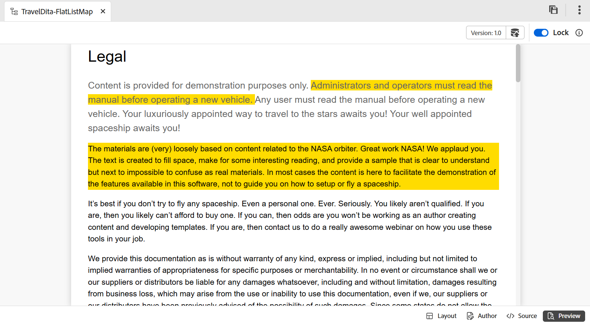
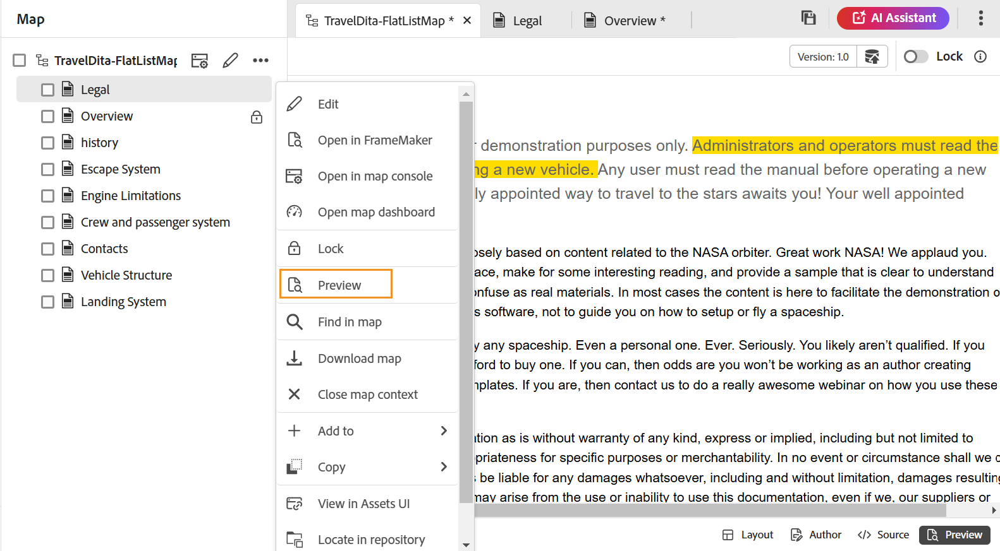

# マップ エディタの機能 {#id1942D0S0IHS}

マップ エディタのツールバーは、トピック エディタに似ています。 左側のパネルの切り替え、マップの保存、新しいバージョンのマップの作成、最後の操作の取り消しとやり直し、選択した要素の削除などの基本的な操作は、両方のエディターで共通です。 これらの操作の仕組みについて詳しくは、[ エディターの機能について ](web-editor-features.md#) を参照してください。

エディタ ツールバーに表示されるオプションは、マップ エディタ ビューに基づいています。 マップ エディタでは、次の 4 つのビューを使用できます。

- [レイアウト](#layout-view)
- [作成者](#author-view)
- [ソース](#source-view)
- [プレビュー](#preview)

以下のセクションでは、マップ エディタの各種ビューで使用できるツールバーのオプションについて説明します。

## レイアウトビュー

編集用にマップを開くと、マップ エディタのレイアウト ビューが開きます。 レイアウト ビューでは、マップ階層がツリービューで表示され、マップ内のトピックを整理できます。

>[!NOTE]
>
> レイアウト ビューには、マップ内に存在する参照のみが表示されます。 参照が壊れている場合は、参照の左側に小さな十字記号が表示されます

レイアウト表示のツールバーでは、次のオプションを使用できます。

**トピック参照** - 

トピック検索ダイアログを表示します。 挿入するトピック/マップ ファイルに移動し、[**選択**] を選択してマップに追加します。

{align="left"}

**トピック グループ** - 

`topicgroup` 要素を挿入します。 トピックのグループ化の詳細については、OASIS DITA Language Specification の [topicgroup](https://docs.oasis-open.org/dita/v1.0/langspec/topicgroup.html) ドキュメントを参照してください。

**キーの定義** - 

[ キー定義を挿入 ] ダイアログ ボックスを表示します。 このダイアログを使用して、マップで使用するキー定義を定義します。

{width="300" align="left"}

**前に挿入/後に挿入** -  / 

[ 要素を挿入 ] ダイアログ ボックスが表示されます。 マップに挿入する要素を選択します。 操作に応じて、新しい要素がマップ内の現在の要素の前または後に挿入されます。

**前面の問題を挿入** - 

このアイコンは、編集用にブックマップを開いたときに表示されます。 目次、索引、表リストなど、ブックの先頭にコンポーネントを挿入できます。

**背面物質の挿入** - 

このアイコンは、編集用にブックマップを開いたときに表示されます。 索引、用語集、図表一覧などのコンポーネントをブックの最後に挿入できます。

**選択した項目を左/右に移動** - /

左矢印を選択して、トピックを階層内の左側に移動します。 これにより、基本的に階層内の各トピックが 1 つ上のレベルに昇格します。 例えば、子トピックが選択されている状態で左矢印を選択した場合は、その子トピックをその上にあるトピックの兄弟にします。 同様に、右矢印を選択すると、トピックが右側に押され、その上にあるトピックの子になります。

**選択した項目を上下に移動**  - / 

階層内でトピックを上下に移動するには、上下の矢印アイコンを選択します。

>[!NOTE]
>
> 参照をドラッグ&amp;ドロップして、マップ内で移動することもできます。

**ロック/ロック解除**

マップ ファイルのロックを取得し、ロックを解除します。 マップ ファイルに未保存の変更がある場合、ロックを解除すると、マップ ファイルを保存するよう求められます。 変更内容は、マップ ファイルの現在のバージョンに保存されます。

**結合** - 

同じファイルまたは別のファイルの別のバージョンからのコンテンツの結合について詳しくは、エディターで [ 結合 ](web-editor-features.md#menu-dropdown) を参照してください。

**バージョン履歴** - 

アクティブなトピックで使用可能なバージョンとラベルを確認し、エディター自体から任意のバージョンに戻します。

**バージョンラベル** - 

バージョン ラベル管理ダイアログを表示します。 ドロップダウンリストからバージョンを選択します。 選択したバージョンに適用するラベルを選択し、「**ラベルを追加**」を選択して追加します。

**ファイル名を表示**

トピックのタイトルのファイル名を表示します。

>[!NOTE]
>
> トピックのタイトルの上にポインタを合わせると、ファイルパスが表示されます。

**行番号を表示**

各トピックの行番号を表示または非表示にします。 行番号は、階層のレベルに応じて表示されます。

**チェックボックスを表示**

各トピックのチェックボックスの表示/非表示を切り替えます。 チェックボックスを使用してトピック\（s\）を選択し、オプション メニューを使用して様々なタスクを実行できます。

**レイアウトビューのオプションメニュー**

マップ ファイル内のトピックを整理する以外に、ファイルにカーソルを合わせたときに表示される [ オプション ] メニューを使用するか、レイアウト ビューでエディタ内を右クリックしても、次の操作を実行できます。

{width="650" align="left"}

- **追加**：マップエディタから新しいトピックまたは空の参照を追加するように選択できます。
   - **空の参照**：このオプションを使用すると、DITA マップに空の参照を追加できます。 挿入した空の参照を後でダブルクリックして、トピックの詳細を追加できます。
   - **新規トピック**: メニューから新しいトピックを作成することを選択すると、「**新規トピック**」ダイアログボックスが表示されます。 **新規トピック** ダイアログボックスで、必要な詳細を入力して **作成** を選択します。
- **移動**：階層内でトピックを上下/左右に移動することを選択できます。 また、トピックまたはマップを、リポジトリ・パネルからマップ・エディタで開いたマップにドラッグ・アンド・ドロップすることもできます。
- **取り消し**：レイアウトビューの最後の操作を取り消します。
- **やり直し**：レイアウトビューの最後の操作をやり直します。
- **コピー**：選択した参照をマップファイルからコピーします。

  >[!NOTE]
  >
  > チェックボックスを表示して選択し、複数の参照をコピーできます。

- **貼り付け**：コピーした参照を、階層内の現在の場所に貼り付けます。
- **削除**：選択した参照をマップファイルから削除します。

  >[!NOTE]
  >
  > チェックボックスを表示して選択すると、複数の参照を削除できます。

**条件付きフィルターに基づいたトピックの表示**

トピックに条件を適用した場合は、トピックの右側にフィルターアイコンが表示されます。 フィルターアイコンの上にポインターを置くと、適用された条件と属性値が表示されます。

## 作成者ビュー

**オーサー** ビューを使用すると、エディタで DITA マップを編集できます。 これにより、マップエディタのWYSIWYG ビューが表示され、オーサービューに表示されるアイコンの一部がレイアウトビューと同じになります。

{align="left"}

さらに、以下のアイコンを表示し、オーサービューで関連タスクを実行することができます。

**前に挿入/後に挿入** -  / 

[**前に要素を挿入 ] または [**後に要素を挿入 ] ダイアログ ボックスを表示します。 マップに挿入する要素を選択します。 操作に応じて、新しい要素がマップ内の現在の要素の前または後に挿入されます。

**要素** - 

**要素を挿入** ダイアログボックスを表示します。 挿入する要素を選択します。 キーボードを使用して要素のリストをスクロールし、Enter キーを押して必要な要素を挿入できます。 または、要素を選択してマップに挿入することもできます。

<!-----------------------------------------------------------

**Relationship table** - 

Inserts a relationship table in the map.

Perform the following steps to work with relationship tables in the Basic Map Editor:

1.  In the Assets UI, navigate to the DITA map in which you want to create the relationship table.

1.  Select the DITA map to open it in DITA map console.

1.  Select the **Topics** tab to view a list of topics available in the DITA map.

    >[!TIP]
    >
    > The Topics tab gives you an option to download the map file with its dependents. For more details, view [Export a DITA map file](authoring-download-assets.md#id218UBA00IXA).

1.  In the main toolbar, select **Edit**.

    The map file is opened in the Advanced Map Editor.

1.  Select **Reltable** from the toolbar.

    {width="650" align="left"}

1.  Drag-and-drop topics from the topic list to the Reltable editor.

    >[!NOTE]
    >
    > You can add topics from any folder in the References rail.

    {width="550" align="left"}

1.  To add a header to your relationship table, click **Add Relheader**.

1.  To add a column to your relationship table, click **Add a Column**.

    {width="550" align="left"}

1.  Click **Save**.

You can also perform the following actions from the relationship table editor:

**Delete rows or columns**

If you want to delete a column from your table, select the checkbox in the column header and click Delete. If you want to remove a row from table, select the checkbox in the first column of the respective row and click Delete.

**Delete a topic**

If you want to delete a topic from your table, click the cross icon next to the topic.

**Delete the relationship table**

If you want to delete the relationship table, click anywhere outside the relationship table and click Delete. For details, view [Work with relationship tables in the Map Editor](map-editor-basic-map-editor.md).
----->

**再利用可能なコンテンツ** - 

**コンテンツを再利用** ダイアログボックスを表示します。 このダイアログを使用して、マップで再利用するコンテンツを挿入します。

**ナビゲーションタイトル属性を更新** - 

`@navtitle` 属性と参照先ファイルの `title` 要素を同期させることができます。 トピック、タスク、参照、サブマップなど、さまざまなタイプのファイルをマップに追加できます。 これらのほとんどは、マップまたは目次にファイル名を表示する方法を制御する `@navtitle` 属性をサポートしています。 ファイルに `@navtitle` 属性が含まれている場合、マップ内の同じファイルの `@navtitle` 属性が更新されます。 `@navtitle` 属性が存在しない場合は、`@navtitle` 属性がその参照ファイルに追加され、その `title` も更新されて `@navtitle` が表示されます。

>[!NOTE]
>
> 管理者は、設定プロパティを使用して、マップエディターツールバーでこのボタンの表示/非表示を選択できます。 また、ファイルがマップに追加されたときに、`@navtitle` 属性の自動追加を有効にすることもできます。 詳しくは、Adobe Experience Manager Guides as a Cloud Serviceのインストール@navtitle 設定の [ デフォルトで属性を含める ](../cs-install-guide/auto-add-navtitle.md)*を参照してください。

**タグ**

XML タグの表示/非表示を切り替えます。 タグは、要素の境界を示す視覚的なキューとして機能します。 このモードでトピック/マップ参照を挿入する場合は、タグの前後に目的のファイルをドラッグ&amp;ドロップします。 水平バーは、タグビューモードでは表示されません。

**変更の追跡** - 

[ 変更を追跡 ] モードを有効にすると、マップ ファイルに加えられたすべての更新を追跡できます。 トラックの変更を有効にすると、すべての挿入と削除がドキュメントに取り込まれます。 詳しくは、エディターで [ 変更をトラック ](web-editor-features.md#track-changes) を参照してください。

**レビュータスクを作成** - 

エディタから直接、現在のトピックまたはマップ ファイルのレビュータスクを作成できます。 レビュータスクを作成するファイルを開き、「**レビュータスクを作成**」を選択して、レビュー作成プロセスを開始します。 [ レビューの概要 ](review.md#) に記載されている手順に従ってください。

## Sourceビュー

このビューを使用すると、コンテンツを生の形式で編集して、構造と書式設定を完全に制御できます。

{align="left"}

この表示では、ツールバーには、**メニュー** ドロップダウンで使用できる、基本的なコンテンツ編集および挿入オプションが用意されています（切り取り、コピー、取り消し、やり直し、削除、検索と置換、バージョンラベル、結合、新しいバージョンとして保存、ロックとロック解除など）。

## プレビュー

プレビューモードでは、最終的な出力に表示されるとおりにコンテンツをレンダリングするので、コンテンツを公開する前にレイアウトと書式を確認できます。

マップ内の各トピック ファイルの位置を表示できることに加えて、マップ コンテンツを 1 つの連続したフローで表示することが望ましいです。 マップのプレビュー機能を使用すると、1 回のクリックでマップ ファイルのコンテンツ全体を表示できます。 マップ ファイルの出力を生成して、パブリッシュ後のマップ全体の表示を確認する必要はありません。 マップのプレビューにアクセスするだけで、すべてのトピックとサブマップがブックの形式でレンダリングされます。

{align="left"}

>[!NOTE]
>
> プレビューモードのツールバーでは、コンテンツの編集オプションや挿入オプションは使用できません。 このビューのコンテンツを編集することはできません。 ただし、「**新しいバージョンとして保存** 機能、「ロック **** または **ロック解除** 機能を使用できます。

プレビューモードでは、次の追加タスクを実行できます。

- トピックを右クリックし、「**編集**」を選択して新しいタブで編集用のトピックを開きます。

  >[!NOTE]
  >
  > 編集権限がない場合、トピックは読み取り専用モードで開きます。

- マップ ツリー\（左パネル\）でトピック タイトルを選択して、目的のトピックにジャンプします。

- マップのプレビューの現在のトピックは、マップ ツリーでもハイライト表示されます。

**マップファイルをプレビューするその他の方法**

マップのプレビューには、次の場所からアクセスできます。

- **Assets UI**: Assets UI で、マップの場所に移動して、マップ ファイルを選択し、ツールバーの **マップをプレビュー** を選択します。 マップのプレビューが新しいタブに表示されます。 すべてのトピックのコンテンツは、プレビューモードで表示できます。 このビューでは、トピックを編集できません。

  >[!NOTE]
  >
  > 「*マップをプレビュー*」オプションがメインツールバーに表示されない場合は、「その他 **ツールバーメニューの下に移動してい** 可能性があります。

- **マップ エディタ**: [ マップ エディタ ] で、[ オプション ] メニューから **プレビュー** を選択し、現在のマップのプレビューを表示します。

  {width="650" align="left"}

  マップのプレビューがポップアップ ボックスに表示されます。

  {width="500" align="left"}

**マップのプロパティ**

[ マップ プロパティ ] ダイアログ ボックスが表示され、マップの属性とメタデータ情報を設定できます。

## DITA マップによるトピックの編集 {#id17ACJ0F0FHS}

個々のトピックを編集しても、作成者に完全なコンテキストは提供されません。 作成者は、トピックが DITA マップ内のどこにあるかに関する情報を持ちません。 このコンテキスト情報がないと、作成者がコンテンツを作成するのが少し難しくなります。

Experience Manager Guidesを使用すると、作成者はエディタで DITA マップを開き、マップ内のトピックの配置を確認できます。 これにより、作成者は、トピックがマップ内のどこにあるかを正確に把握し、より関連性の高いコンテンツを作成できます。 また、1 つのプロジェクトで複数の作成者が作業している場合、すべてのトピックがマップで使用可能であるかを把握し、必要に応じてコンテンツを再利用できます。

DITA マップを使用してトピックを編集するには、次の手順を実行します。

1. リポジトリパネルで、編集する DITA マップファイルを開きます。

   マップ ファイルがマップ ビューで開きます。

>[!NOTE]
>
> Assets UI を使用して DITA マップファイルを開くこともできます。 編集するトピックを含む DITA マップファイルに移動し、メインツールバーで「**トピックを編集**」を選択してエディタを起動します。

1. 任意のトピックリンクを選択して、編集用にエディターで開きます。

   エディターで複数のトピックを開くことができ、各トピックはエディターの新しいタブで開きます。 DITA マップにサブマップが含まれている場合でも、サブマップのトピックは新しいタブで開いて編集できます。 サブマップの下のトピックを表示する場合は、サブマップを選択して展開できます。

   {align="left"}

   マップ ファイルを選択すると、マップはエディタの新しいタブで開きます。

1. トピックの編集が完了したら、次の操作を実行できます。

   - 個別に保存できます。 トピックを保存せずに閉じると、未保存のトピックを保存するように求めるダイアログボックスが表示されます。

     {width="300" align="left"}

     選択したすべてのトピックを保存するか、保存しないトピックの選択を解除するかを選択できます。

   - トピックのロックは、「**新しいバージョンとして保存** オプションを使用して解除できます。 トピックのバージョンを保存すると、新しいバージョンが作成され、ロックも解除されます。

     ファイルをロック解除する前に、変更を保存することをお勧めします。  変更を保存すると、XML ファイルが検証されます。

   - トピックの進行状況は、「新しいバージョンとして保存 **ダイアログボックスからも確認** きます。 ファイルのロックが解除されると、成功メッセージが表示されます。

   - 管理者が閉じるときにファイルをロック解除するオプションを有効にしている場合、ロックされたファイルを閉じるたびにファイルを保存するように求めるプロンプトが表示されます。 このオプションを有効にすると、変更したファイルでエディタを閉じるときに、保存する必要があるロックされたファイルのリストが表示されます。 ロックされたファイルには鍵のアイコンが付きます。

     {width="350" align="left"}

## マップエディターの右パネル

右側のパネルには、マップ エディタのレイアウト ビューにコンテンツ プロパティとマップ プロパティが表示されます。

**コンテンツのプロパティ**

コンテンツのプロパティパネルには、マップ内で現在選択されているトピックのタイプ、リンク URL およびその属性に関する情報が含まれています。 詳しくは、エディターで [ コンテンツのプロパティ ](web-editor-features.md#right-panel) を参照してください。

- **その他の属性** 管理者が属性用のプロファイルを作成している場合は、これらの属性と、設定済みの値が取得されます。 コンテンツのプロパティパネルを使用して、これらの属性を選択し、トピック内の関連するコンテンツに割り当てることができます。 管理者が設定した属性を **表示属性** の下に割り当てることもできます。 要素に定義されている属性は、レイアウトビューとアウトラインビューに表示されます。 これにより、特定の属性が定義されているマップ内のすべてのトピックをすばやく確認できます。 例えば、`audience` 属性を持つすべてのトピックは、`US` として定義されます。

  {width="650" align="left"}

  詳しくは、[ 表示属性 ](../cs-install-guide/workspace-settings.md#display-attributes) を参照してください。

- **メタデータ** メタデータを使用すると、メタデータ情報を設定できます。 ナビゲーションタイトル、リンクテキスト、短い説明およびキーワードを定義できます。

標準トピック属性とメタデータの詳細は、OASIS DITA 言語仕様の [topicref](https://docs.oasis-open.org/dita/v1.2/os/spec/langref/topicref.html) のマニュアルを参照してください。

**親トピック：**[ マップエディタの概要 ](map-editor.md)
