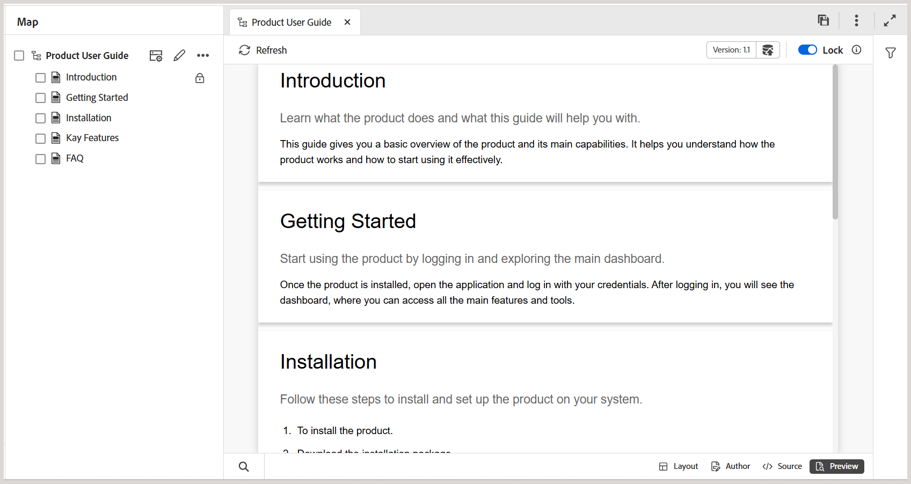
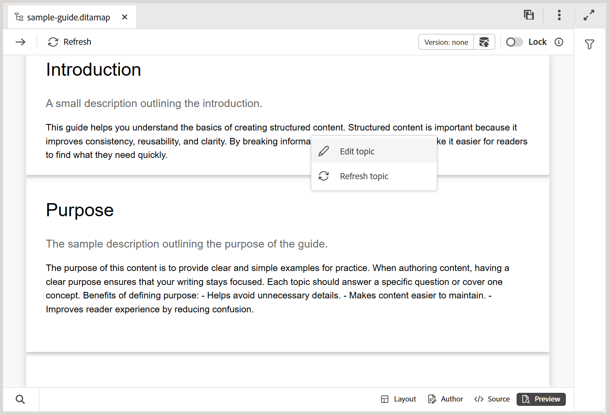
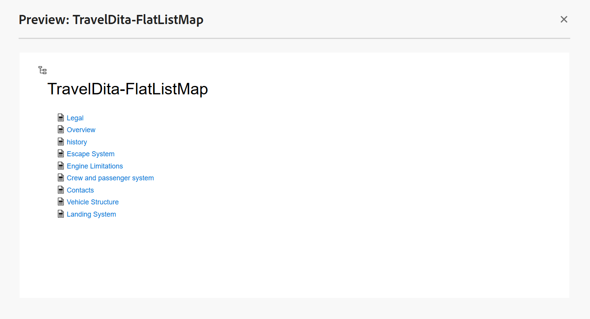
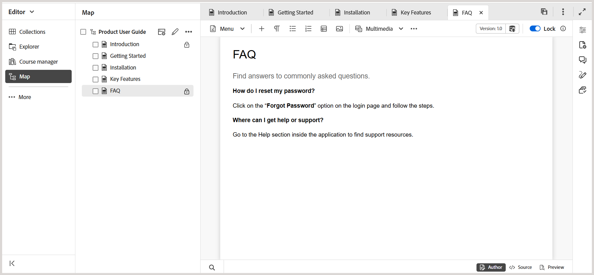
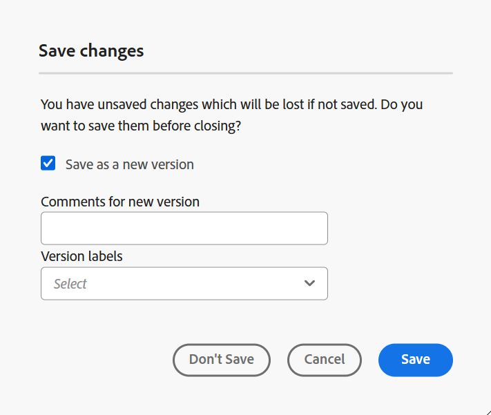

# マップエディターの機能 {#id1942D0S0IHS}

マップエディターのツールバーは、トピックエディターに似ています。 左パネルの切り替え、マップの保存、新しいバージョンのマップの作成、最後の操作の取り消しややり直し、選択した要素の削除などの基本的な操作は、両方のエディターで共通しています。 これらの操作の仕組みについて詳しくは、「[ エディター」セクションの](web-editor-toolbar.md#) ツールバーを参照してください。

エディターツールバーに表示されるオプションは、マップエディタービューに基づいています。 マップエディターでは、次の4つのビューを使用できます。

- [レイアウト](#layout-view)
- [作成者](#author-view)
- [ソース](#source-view)
- [プレビュー](#preview)

次の節では、マップエディターの様々なビューで使用できるツールバーオプションについて説明します。

## レイアウトビュー

編集のためにマップを開くと、マップエディターのレイアウトビューが開きます。 レイアウトビューでは、マップ階層がツリービューで表示され、マップ内のトピックを整理できます。

>[!NOTE]
>
> レイアウトビューには、マップに存在する参照のみが表示されます。 参照が破損している場合は、参照の左側に小さな十字の記号が表示されます

レイアウトビューのツールバーでは、次のオプションを使用できます。

**トピック参照** - 

ファイルを選択ダイアログを表示します。 挿入するトピック/マップファイルに移動し、**選択**&#x200B;を選択してマップに追加します。

{align="left"}

**トピックグループ** - 

`topicgroup`要素を挿入します。 トピックのグループ化について詳しくは、OASIS DITA言語仕様の[topicgroup](https://docs.oasis-open.org/dita/v1.0/langspec/topicgroup.html) ドキュメントを参照してください。

**キー定義** - 

キーデフを挿入ダイアログを表示します。 このダイアログを使用して、マップで使用するキー定義を定義します。

{width="300" align="left"}

**挿入前/挿入後** -  / 

エレメントを挿入ダイアログを表示します。 マップに挿入するエレメントを選択します。 操作に応じて、新しいエレメントはマップ内の現在のエレメントの前または後に挿入されます。

**前面事項を挿入** - 

このアイコンは、ブックマップを開いて編集する際に表示されます。 目次、索引、表のリストなど、ブックの先頭にコンポーネントを挿入できます。

**後付けを挿入** - 

このアイコンは、ブックマップを開いて編集する際に表示されます。 索引、用語集、図のリストなど、ブックの最後にのコンポーネントを挿入できます。

**選択した項目を左/右に移動** -  / 

左向き矢印を選択して、階層の左側にトピックを移動します。 これは基本的に、それぞれのトピックを階層の1 レベル上に昇格させます。 例えば、子トピックが選択されている間に左矢印を選択し、その上のトピックの兄弟にします。 同様に、右矢印を選択すると、トピックは右側に向かって押され、その上のトピックの子になります。

**選択した項目を上/下に移動**  - / 

上向き矢印または下向き矢印アイコンを選択して、階層内のトピックを上下に移動します。

>[!NOTE]
>
> 参照をドラッグ&amp;ドロップして、マップ内に移動することもできます。

**ロック/ロック解除**

マップファイルのロックを取得し、ロックを解除します。 マップファイルに保存されていない変更がある場合、ロックを解除する際に、マップファイルを保存するように求められます。 変更内容は、現在のバージョンのマップファイルに保存されます。

**結合** - 

同じファイルまたは別のファイルの別のバージョンからコンテンツを結合する方法の詳細については、エディターで[結合](web-editor-features.md#menu-dropdown)を参照してください。

**バージョン履歴** - 

アクティブなトピックで使用可能なバージョンとラベルを確認し、エディター自体から任意のバージョンに戻します。

**バージョンラベル** - 

バージョンラベル管理ダイアログを表示します。 ドロップダウンリストからバージョンを選択します。 選択したバージョンに適用するラベルを選択し、**ラベルを追加**&#x200B;を選択して追加します。

**ファイル名を表示**

トピックのタイトルのファイル名を表示します。

>[!NOTE]
>
> トピックのタイトルにポインターを合わせると、ファイルパスが表示されます。

**行番号を表示**

各トピックの行番号を表示または非表示にします。 行番号は、階層内のレベルに応じて表示されます。

**チェックボックスを表示**

各トピックのチェックボックスを表示または非表示にします。 チェックボックスを使用してトピック\（s\）を選択し、オプションメニューを使用して様々なタスクを実行できます。

レイアウト ビューの&#x200B;**オプション メニュー**

マップファイル内のトピックを整理するだけでなく、ファイルにカーソルを合わせるか、レイアウトビューでエディター内を右クリックすると表示されるオプションメニューを使用して、次のアクションを実行することもできます。

{width="650" align="left"}

- **追加**: マップエディターから新しいトピックまたは空の参照を追加できます。
   - **空の参照**：このオプションを使用すると、DITA マップに空の参照を追加できます。 後で挿入された空の参照をダブルクリックして、トピックの詳細を追加できます。
   - **新しいトピック**: メニューから新しいトピックを作成することを選択すると、**新しいトピック** ダイアログボックスが表示されます。 **新しいトピック** ダイアログボックスで、必要な詳細を入力し、**作成**&#x200B;を選択します。
- **移動**：階層内のトピックを上下/左右に移動できます。 リポジトリーパネルから、マップエディターで開いたマップにトピックまたはマップをドラッグ&amp;ドロップすることもできます。
- **取り消し**: レイアウトビューで最後の操作を取り消します。
- **やり直し**: レイアウトビューで最後の操作をやり直します。
- **コピー**：選択した参照をマップファイルからコピーします。

  >[!NOTE]
  >
  > 複数の参照をコピーするには、チェックボックスを表示して選択します。

- **ペースト**: コピーした参照を階層内の現在の場所にペーストします。
- **削除**：選択した参照をマップファイルから削除します。

  >[!NOTE]
  >
  > 複数の参照を削除するには、チェックボックスを表示して選択します。

**条件付きフィルターに基づいてトピックを表示**

トピックに条件を適用した場合、トピックの右側にフィルターアイコンが表示されます。 フィルターアイコンにポインターを置くと、適用された条件とその属性値が表示されます。

## 作成者ビュー

**作成者** ビューでは、エディターでDITA マップを編集できます。 これは、マップエディターのWYSIWYG ビューと、オーサービューに表示される一部のアイコンがレイアウトビューと同じであることを示しています。

{align="left"}

さらに、次のアイコンを表示し、作成者ビューから関連するタスクを実行できます。

**挿入前/挿入後** -  / 

ダイアログボックスの前に**挿入エレメントを表示するか、後に**挿入エレメントを表示します。 マップに挿入するエレメントを選択します。 操作に応じて、新しいエレメントはマップ内の現在のエレメントの前または後に挿入されます。

**要素** - 

**エレメントを挿入** ダイアログボックスを表示します。 挿入するエレメントを選択します。 キーボードを使用してエレメントのリストをスクロールし、Enter キーを押して必要なエレメントを挿入できます。 または、エレメントを選択してマップに挿入することもできます。

<!--

**Relationship table** - 

Inserts a relationship table in the map.

Perform the following steps to work with relationship tables in the Basic Map Editor:

1.  In the Assets UI, navigate to the DITA map in which you want to create the relationship table.

1.  Select the DITA map to open it in DITA map console.

1.  Select the **Topics** tab to view a list of topics available in the DITA map.

    >[!TIP]
    >
    > The Topics tab gives you an option to download the map file with its dependents. For more details, view [Export a DITA map file](authoring-download-assets.md#id218UBA00IXA).

1.  In the main toolbar, select **Edit**.

    The map file is opened in the Advanced Map Editor.

1.  Select **Reltable** from the toolbar.

    {width="650" align="left"}

1.  Drag-and-drop topics from the topic list to the Reltable editor.

    >[!NOTE]
    >
    > You can add topics from any folder in the References rail.

    {width="550" align="left"}

1.  To add a header to your relationship table, click **Add Relheader**.

1.  To add a column to your relationship table, click **Add a Column**.

    {width="550" align="left"}

1.  Click **Save**.

You can also perform the following actions from the relationship table editor:

**Delete rows or columns**

If you want to delete a column from your table, select the checkbox in the column header and click Delete. If you want to remove a row from table, select the checkbox in the first column of the respective row and click Delete.

**Delete a topic**

If you want to delete a topic from your table, click the cross icon next to the topic.

**Delete the relationship table**

If you want to delete the relationship table, click anywhere outside the relationship table and click Delete. For details, view [Work with relationship tables in the Map Editor](map-editor-basic-map-editor.md).
-->

**再利用可能なコンテンツ** - 

**コンテンツを再利用** ダイアログボックスを表示します。 このダイアログを使用して、マップで再利用するコンテンツを挿入します。

**ナビゲーションタイトル属性を更新** - 

参照ファイルの`@navtitle`属性と`title`要素を同期させることができます。 トピック、タスク、参照、サブマップなど、様々なタイプのファイルをマップに追加できます。 これらのほとんどは`@navtitle`属性をサポートしており、ファイル名がマップまたは目次にどのように表示されるかを制御します。 ファイルに`@navtitle`属性が含まれている場合、マップ内の同じファイルの`@navtitle`属性が更新されます。 `@navtitle`属性が存在しない場合、`@navtitle`属性がその参照ファイルに追加され、その`title`も更新されて`@navtitle`が表示されます。

>[!NOTE]
>
> 管理者は、設定プロパティを使用して、マップエディターツールバーでこのボタンを表示または非表示にすることができます。 また、ファイルがマップに追加されたときに`@navtitle`属性を自動的に追加することもできます。 詳しくは、「[ Adobe Experience Manager Guides as a Cloud Serviceのインストールと設定」で「](../cs-install-guide/auto-add-navtitle.md)* デフォルトで@navtitle属性を含める」を参照してください。

**タグ**

XML タグを表示または非表示にします。 タグは、要素の境界を示す視覚的なキューとして機能します。 このモードでは、トピック/マップ参照を挿入する場合は、タグの前後に目的のファイルをドラッグ&amp;ドロップします。 横長バーは、タグ表示モードでは表示されません。

**変更を追跡** - 

変更をトラック モードを有効にすると、マップファイルで行われたすべての更新を追跡できます。 変更履歴を有効にすると、すべての挿入と削除がドキュメントに取り込まれます。 詳細については、エディターで「[変更を追跡](web-editor-features.md#track-changes)」を参照してください。

**レビュータスクの作成** - 

現在のトピックまたはマップファイルのレビュータスクは、エディターから直接作成できます。 レビュータスクを作成するファイルを開き、**レビュータスクを作成**&#x200B;を選択して、レビュー作成プロセスを開始します。 詳細については、[ レビューの概要](review.md#)に記載されている手順に従ってください。

## Source ビュー

このビューでは、コンテンツを生の形式で編集でき、構造と形式を完全に制御できます。

{align="left"}

このビューでは、ツールバーには、カット、コピー、取り消し、やり直し、削除、検索と置換、バージョンラベル、結合、新しいバージョンとして保存、ロックとロック解除など、**メニュー** ドロップダウンで利用できる基本的なコンテンツ編集と挿入オプションが用意されています。

## プレビュー

プレビューモードでは、最終出力に表示されるコンテンツがレンダリングされ、公開前にレイアウトとフォーマットを確認できます。

マップ内の各トピックファイルの位置を表示できることに加えて、マップコンテンツを1つの連続したフローで表示することが望ましい。 マップのプレビュー機能を使用すると、マップファイルのコンテンツ全体をワンクリックで表示できます。 マップ ファイルの出力を生成して、マップ全体が公開後にどのように表示されるかを確認する必要はありません。 マップのプレビューにアクセスするだけで、すべてのトピックとサブマップがブックの形式でレンダリングされます。

{align="left"}

>[!NOTE]
>
> プレビューモードのツールバーでは、コンテンツの編集や挿入オプションを使用できません。 このビューのコンテンツは編集できません。 ただし、**新しいバージョンとして保存**&#x200B;および&#x200B;**ロック**&#x200B;または&#x200B;**ロック解除**&#x200B;機能を使用できます。

プレビューモードでは、次の追加タスクを実行できます。

**編集用のトピックを開く**

- トピックを右クリックし、**編集**&#x200B;を選択して、新しいタブで編集するトピックを開きます。

  >[!NOTE]
  >
  > 編集権限がない場合、トピックは読み取り専用モードで開きます。

  {width="650" align="left"}

- マップツリー\（左パネル\）でトピックタイトルを選択して、目的のトピックにジャンプします。

- マッププレビューの現在のトピックもマップツリーでハイライト表示されます。

**トピックまたはマップを更新**

プレビューモードでマップを開き、エディターの別のタブからマップに切り替えると、プレビューが自動的に更新されません。 マップのプレビューを再読み込みするには、手動で更新する必要があります。

マップのプレビューモードで使用できる更新機能は、次の2つの方法で使用できます。

- **マップレベルの更新**:「**更新**」ボタンを選択すると、マップ全体（すべてのトピックを含む）のプレビューが更新され、最初のスクロール位置に移動して明確なビューが表示されます。
  {width="650" align="left"}

- **トピックレベルの更新**: コンテキストメニューから&#x200B;**トピックの更新**を選択すると、スクロール位置を変更せずに特定のトピックが更新されます。
  {width="650" align="left"}

**その他のマップファイルのプレビュー方法**

マップのプレビューには、次の場所からアクセスできます。

- **Assets UI**: Assets UIで、マップの場所に移動し、マップファイルを選択して、ツールバーの「**マップをプレビュー**」を選択します。 マップのプレビューが新しいタブに表示されます。 プレビューモードでは、すべてのトピックのコンテンツを表示できます。 このビューでは、トピックを編集することはできません。

  >[!NOTE]
  >
  > *マップのプレビュー* オプションがメインツールバーに表示されない場合は、**詳細** ツールバーメニューの下に移動した可能性があります。

- **マップエディター**: マップエディターで、オプションメニューから「**プレビュー**」を選択して、現在のマップのプレビューを表示します。

  {width="650" align="left"}

  マップのプレビューがポップアップボックスに表示されます。

  {width="500" align="left"}

**マップのプロパティ**

マップのプロパティ ダイアログが表示され、マップの属性とメタデータ情報を設定できます。

## DITA マップによるトピックの編集 {#id17ACJ0F0FHS}

個別のトピックを編集しても、作成者に完全なコンテキストが提供されるわけではありません。 作成者は、DITA マップ内のどこにトピックが配置されているかについての情報を持っていません。 このコンテキスト情報がなければ、作成者がコンテンツを作成することは少し困難になります。

Experience Manager Guidesを使用すると、作成者はエディターでDITA マップを開き、マップ内のトピックの配置を表示できます。 これにより、マップ内のトピックの位置を正確に把握し、より適切なコンテンツを制作できます。 また、複数の作成者がプロジェクトに取り組んでいる場合は、マップ内のすべてのトピックを把握して、必要に応じてコンテンツを再利用できます。

DITA マップを使用してトピックを編集するには、次の手順を実行します。

1. リポジトリパネルで、編集するDITA マップファイルに移動して開きます。

   マップファイルがマップビューで開きます。

>[!NOTE]
>
> Assets UIを使用して、DITA マップファイルを開くこともできます。 編集するトピックを含むDITA マップファイルに移動し、メインツールバーの「**トピックを編集**」を選択してエディターを起動します。

1. 任意のトピックリンクを選択して、編集のためにエディターで開きます。

   複数のトピックをエディターで開くことができ、各トピックはエディターの新しいタブで開かれます。 DITA マップにサブマップが含まれている場合でも、サブマップのトピックも新しいタブで開いて編集できます。 サブマップの下のトピックを表示する場合は、サブマップを選択して展開できます。

   {align="left"}

   マップファイルを選択すると、マップがエディターの新しいタブで開きます。

1. トピックの編集が完了したら、次の操作を実行できます。

   - 個別に保存することもできます。 トピックを保存せずに閉じると、保存されていないトピックの保存を求めるダイアログボックスが表示されます。

     {width="300" align="left"}

     選択したすべてのトピックを保存するか、保存しないトピックの選択を解除するかを選択できます。

   - 「**新しいバージョンとして保存**」オプションを使用して、トピックのロックを解除できます。 トピックのバージョンを保存すると、新しいバージョンが作成され、ロックも解除されます。

     ファイルのロックを解除する前に、変更内容を保存することをお勧めします。  変更を保存すると、XML ファイルが検証されます。

   - また、**新しいバージョンとして保存** ダイアログボックスから、トピックの進行状況を表示することもできます。 ファイルのロックが解除されると、成功メッセージが表示されます。

   - 管理者が「閉じる」でファイルのロックを解除するオプションを有効にしている場合は、ロックされたファイルを閉じるたびにファイルを保存するように求めるプロンプトが表示されます。 このオプションを有効にすると、変更されたファイルを含むエディターを閉じると、保存する必要があるロックされたファイルのリストが表示されます。 ロックされたファイルには、ロックアイコンが表示されます。

     {width="350" align="left"}

## マップエディターの右パネル

右側のパネルには、マップエディターのレイアウトビューにコンテンツプロパティとマッププロパティが表示されます。

**コンテンツのプロパティ**

コンテンツプロパティパネルには、マップ内で現在選択されているトピックのタイプ、リンク URL、および属性に関する情報が表示されます。 詳細については、エディターで[ コンテンツのプロパティ ](web-editor-features.md#right-panel)を参照してください。

- **その他の属性**&#x200B;管理者が属性のプロファイルを作成した場合、これらの属性と設定値が表示されます。 コンテンツプロパティパネルを使用して、これらの属性を選択し、トピック内の関連コンテンツに割り当てることができます。 管理者が設定した属性を&#x200B;**表示属性**&#x200B;に割り当てることもできます。 エレメントに対して定義された属性は、レイアウトおよびアウトライン表示に表示されます。 これにより、特定の属性が定義されているマップ内のすべてのトピックを簡単に確認できます。 例えば、`audience`属性を持つすべてのトピックは`US`として定義されます。

  {width="650" align="left"}

  詳細については、[表示属性](../cs-install-guide/workspace-settings.md#display-attributes)を参照してください。

- **メタデータ** メタデータを使用すると、メタデータ情報を設定できます。 ナビゲーションタイトル、リンクテキスト、短い説明、キーワードを定義できます。

標準トピック属性とメタデータについて詳しくは、OASIS DITA言語仕様の[topicref](https://docs.oasis-open.org/dita/v1.2/os/spec/langref/topicref.html) ドキュメントを参照してください。

**親トピック：** [ マップエディターの概要](map-editor.md)
