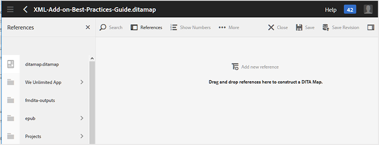
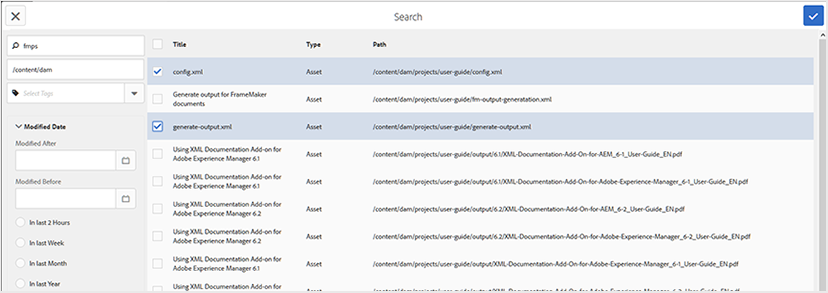
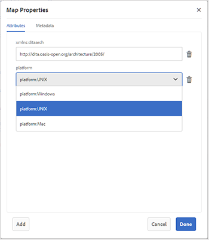
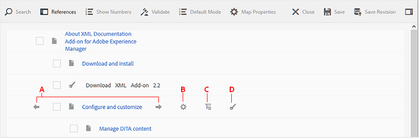

# 基本マップエディターの操作 {#id1942CM005Y4}

>[!NOTE]
>
> 以前はExperience Manager Guidesで使用されていた基本マップエディターは、バージョン 4.3および2307以降で非推奨（廃止予定）になりました。 基本マップエディターにアクセスして、DITA マップを作成および管理することはできません。
>詳細マップエディターを使用することをお勧めします。 高度なマップエディターには、高度な機能と優れたカスタマイズオプションが用意されています。 [高度なマップエディター](../user-guide/map-editor-advanced-map-editor.md)の操作方法について詳しく説明します。

基本マップエディターには、AEM リポジトリからトピックを追加してDITA マップまたはブックマップを作成するための、簡単なドラッグ&amp;ドロップ機能が用意されています。 ネストされたトピック、関係テーブル \（reltable\）、属性およびメタデータ情報を追加し、マップを正しく検証することもできます。

>[!NOTE]
>
> 管理者が「詳細マップエディター」オプションを有効にしている場合は、基本マップエディターにアクセスできません。 すべてのマップファイルは、デフォルトで高度なマップエディターで開きます。

次の節では、基本マップエディターで使用できる様々な関数について説明します。

## マップファイルへのトピックの追加 {#id193CBL0505Z}

マップファイルを作成したら、マップファイルにトピックを追加する必要があります。 基本マップエディターを使用すると、トピック、関係テーブル、またはその他のマップファイルを追加できます。

マップファイルを作成するには、次の手順を実行します。

1. Assets UIで、編集するマップファイルに移動します。

1. マップファイルの排他的ロックを取得するには、マップファイルを選択し、**チェックアウト**&#x200B;をクリックします。

   >[!NOTE]
   >
   > マップファイルに排他的ロックを設定すると、他のユーザーはマップを編集できなくなります。 ただし、マップファイル内のトピックに関する作業は可能です。

1. マップファイルを選択した状態で、**編集**&#x200B;をクリックします。

   マップファイルは、マップエディターで編集するために開きます。 マップエディターを使用して、参照パネルに表示されている現在使用可能なトピックを使用してマップを作成します。

   

1. **参照** レールを使用して、追加するトピックまたはサブマップを含むフォルダーに移動します。

   >[!NOTE]
   >
   > 参照パネルの任意のフォルダーからトピックまたはサブマップを追加できます。

1. 最初のトピックをマップに追加するには、トピックを基本マップエディターにドラッグ&amp;ドロップします。

   >[!NOTE]
   >
   > 最初のリンクを追加した後、マップ内の既存のトピックにマウスを合わせると、「新規参照を追加」リンクを使用できます。

1. 後続のトピックまたはサブマップを追加するには、トピックまたはサブマップをマップ内の必要な場所にドラッグ&amp;ドロップします。

   サブマップをDITA マップに追加すると、サブマップはDITA マップ内のリンクとして表示されます。 サブマップのすべてのトピックを表示するには、サブマップリンクをクリックします。 サブマップの内容が新しいタブに表示されます。

   >[!NOTE]
   >
   > マップ内の既存のトピックに新しいトピックをドロップすると、トピックの置き換えに関するメッセージが表示されます。 トピックを置換する場合は「はい」をクリックし、トピックを置換しない場合は「いいえ」をクリックします。 CTRL+ZおよびCTRL+Yを使用して、マップ内の変更を元に戻したり、やり直したりできます。

1. 「**保存**」をクリックします。

## 基本マップエディターのツールバーで使用できる機能

基本マップエディターのメインツールバーでは、次のタスクを実行できます。

**A：検索**

DAMから必要なトピックを検索して含めることができます。 このアイコンをクリックすると、検索ダイアログが表示されます。

検索するキーワードを入力します。これらのキーワードは、トピックのファイル名、コンテンツ、さらには属性値で一致します。 検索結果が表示されたら、目的のトピックを選択し、「チェック」ボタンをクリックして、選択したファイルをマップ構造の最後に追加します。 「日付を変更」パラメーターを指定して、検索結果をフィルタリングできます。

**B: グループ**

トピックの左側にあるチェックボックスをクリックし、ツールバーの「グループ」をクリックして、選択したトピックをグループ化します。 トピックのグループ化について詳しくは、OASIS DITA言語仕様の[topicgroup](https://docs.oasis-open.org/dita/v1.0/langspec/topicgroup.html) ドキュメントを参照してください。

**C: Delete**

トピックの左側にあるチェックボックスをクリックし、ツールバーの「削除」をクリックして、選択したトピックをマップから削除します。

**D：数値を表示/数値を非表示**

マップ内のトピックの\（またはhide\）番号を表示します。

**E: Validate**

マップが有効かどうか、またはエラーがあるかどうかを確認します。

**F: デフォルトモード/XML モード**

**デフォルトモード**&#x200B;で、トピックリンクをクリックすると、トピックのプレビューが新しいタブに表示されます。 **デフォルトモード** アイコンをクリックすると、モードが&#x200B;**XML モード**&#x200B;に変更されます。 **XML モード**&#x200B;では、トピック行の任意の場所をクリックすると、トピック内のトピック参照の基になるXMLが表示されます。 ソース XML ビューには、**自動インデント** オプションがあり、プレゼンテーション可能で読みやすい形式でXML コードを再編成できます。 マップを手動で編集する場合、ソースビューでも検証チェックが実行されます。 XMLにエラーが含まれている場合、**XML モード**&#x200B;で同じことが強調表示され、DITA マップファイルを保存できません。 マップ全体のXMLを表示する場合は、トピック境界の外側の任意の場所をクリックします。

**メモ：** デフォルト モードでは、キーボード ショートカットを使用して、最後のアクションを\（`Ctrl+z`\）または\（`Ctrl+y`\）やり直すことができます。

{width="650"}

**G: プロパティのマッピング**

マップのプロパティ ダイアログを表示し、マップの属性とメタデータ情報を設定できます。 属性を追加するには、ダイアログの左下隅にある&#x200B;**追加** ボタンをクリックして、**属性** ドロップダウンリストを取得します。 リストから、追加する属性を選択します。 選択した属性にDTDで事前定義された値が指定されている場合、それらの値は新しいドロップダウンリストに表示されます。 ドロップダウンリストから目的の値を選択できます。 値が事前に定義されていない場合は、選択した属性の値を入力するためのテキストボックスが表示されます。

{width="300"}

## 基本マップエディターのトピックレベルで使用できる機能

基本マップエディターでトピックまたはサブマップファイルにマウスポインターを置くと、次のタスクを実行できます。

{width="650"}

**A：左へ移動または右へ移動**

左向き矢印または右向き矢印アイコンをクリックして、トピックを左右に移動します。 このような方法でトピックを移動すると、その上のトピックに関して子\（nest\）または兄弟\（ネストを削除\）になります。

**B: プロパティ**

プロパティ アイコンをクリックして、Topicref プロパティ ダイアログを開きます。 このダイアログを使用すると、トピック属性とメタデータ情報を設定できます。 標準トピック属性とメタデータについて詳しくは、OASIS DITA言語仕様の[topicref](https://docs.oasis-open.org/dita/v1.2/os/spec/langref/topicref.html) ドキュメントを参照してください。

{width="350"}

**C：新しい参照を追加**

「新しい参照を追加」アイコンをクリックして、現在のトピックの兄弟として新しい参照を追加します。

**D：新しいキー定義を追加**

キーアイコンをクリックして、新しいキー定義を追加します。 上書きされたキーまたはマップで既に定義されているキーは、赤色で表示されます。 キー定義のプロパティアイコンをクリックすると、キー定義のプロパティダイアログが表示されます。

## 基本マップエディターでの関係テーブルの操作 {#id1944B0I0COB}

AEM Guidesのマップエディターには、DITA マップ内のリレーションシップテーブルを作成および編集できる強力な機能が付属しています。

基本マップエディターでリレーションシップテーブルを操作するには、次の手順を実行します。

1. Assets UIで、リレーションシップテーブルを作成するDITA マップに移動します。

1. DITA マップをクリックして、DITA マップコンソールで開きます。

1. 「**トピック**」タブを選択して、DITA マップで使用可能なトピックのリストを表示します。

   >[!TIP]
   >
   > 「トピック」タブには、依存ファイルを含むマップファイルをダウンロードするオプションが表示されます。 詳しくは、[DITA マップファイルの書き出し](authoring-download-assets.md#id218UBA00IXA)を参照してください。

1. メインツールバーで、**編集**&#x200B;をクリックします。

   マップファイルが基本マップエディターで開きます。

1. ツールバーから「**Reltable**」を選択します。

   {width="650"}

1. トピックをトピックリストから関連可能なエディターにドラッグ&amp;ドロップします。

   >[!NOTE]
   >
   > 参照パネルの任意のフォルダーからトピックを追加できます。

   {width="550"}

1. リレーションシップ テーブルにヘッダーを追加するには、**リヘッダーを追加**&#x200B;をクリックします。

1. 関係テーブルに列を追加するには、**列を追加**&#x200B;をクリックします。

   {width="550"}

1. 「**保存**」をクリックします。

関係テーブルエディターから次のアクションを実行することもできます。

**行または列を削除**

表から列を削除する場合は、列ヘッダーのチェックボックスを選択し、「削除」をクリックします。 表から行を削除する場合は、それぞれの行の最初の列のチェックボックスを選択し、「削除」をクリックします。

**トピックを削除**

テーブルからトピックを削除する場合は、トピックの横にある十字アイコンをクリックします。

**関係テーブルを削除**

関係テーブルを削除する場合は、関係テーブルの外側をクリックし、「削除」をクリックします。

**親トピック：**[ マップエディターの操作](map-editor.md)
