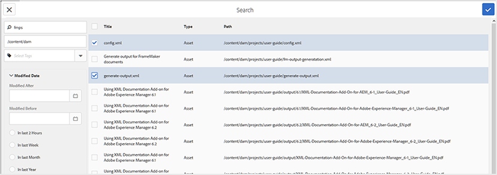

# 基本マップエディタの操作 {#id1942CM005Y4}

>[!NOTE]
>
> 以前はExperience Manager Guidesで使用できた基本マップエディターは、バージョン 4.3 および 2307 から非推奨（廃止予定）になりました。 基本マップ エディタにアクセスして DITA マップを作成および管理することはできません。
>高度なマップエディタを使用することをお勧めします。 高度なマップ エディタでは、機能が強化され、カスタマイズ オプションが改善されています。 詳細は、[&#x200B; 高度なマップエディター &#x200B;](../user-guide/map-editor-advanced-map-editor.md) の操作方法を参照してください。

基本マップエディタには、AEM リポジトリからトピックを追加して DITA マップまたはブックマップを作成するための簡単なドラッグ&amp;ドロップ機能があります。 ネストされたトピック、関係テーブル \（reltable\）、属性およびメタデータ情報を追加し、マップが正しいかどうかを検証することもできます。

>[!NOTE]
>
> 管理者が詳細マップ エディタ オプションを有効にしている場合、基本マップ エディタにはアクセスできません。 既定では、すべてのマップ ファイルが高度なマップ エディタで開きます。

次のセクションでは、基本マップエディタで使用できる様々な機能について説明します。

## マップ ファイルにトピックを追加する {#id193CBL0505Z}

マップ ファイルを作成したら、マップ ファイルにトピックを追加する必要があります。 基本マップ エディタを使用して、トピック、関係テーブル、またはその他のマップ ファイルを追加できます。

次の手順を実行してマップファイルを構築します。

1. Assets UI で、編集するマップファイルに移動します。

1. マップ ファイルに対して排他的なロックを取得するには、マップ ファイルを選択し、[**チェックアウト**] をクリックします。

   >[!NOTE]
   >
   > マップ ファイルに排他ロックを設定すると、他のユーザはマップを編集できなくなります。 ただし、マップ ファイル内のトピックは作業できます。

1. マップ ファイルを選択した状態で、[**編集**] をクリックします。

   マップ ファイルがマップ エディタで編集用に開かれます。 マップエディタを使用して、参照パネルに表示されている現在使用可能なトピックを使用してマップを作成します。

   {align="left"}

1. **参照** パネルを使用して、追加するトピックまたはサブマップを含むフォルダーに移動します。

   >[!NOTE]
   >
   > 参照パネルの任意のフォルダからトピックまたはサブマップを追加できます。

1. 最初のトピックをマップに追加するには、トピックを基本マップ エディタにドラッグ アンド ドロップします。

   >[!NOTE]
   >
   > 最初のリンクを追加した後、マップ内の既存のトピックにマウスを置くと、「新規参照を追加」リンクが使用できます。

1. 後続のトピックまたはサブマップを追加するには、トピックまたはサブマップをマップ内の必要な場所にドラッグ アンド ドロップします。

   サブマップを DITA マップに追加すると、そのサブマップは DITA マップ内のリンクとして表示されます。 サブマップのすべてのトピックを表示するには、サブマップ リンクをクリックします。 サブマップのコンテンツが新しいタブに表示されます。

   >[!NOTE]
   >
   > マップ内の既存のトピックに新しいトピックをドロップすると、トピックの置換に関するメッセージが表示されます。 トピックを置き換える場合は [ はい ] をクリックし、置き換えない場合は [ いいえ ] をクリックします。 Ctrl+Z と Ctrl+Y を使用して、マップ内の変更を取り消したり、やり直すことができます。

1. 「**保存**」をクリックします。

## 基本マップ エディタのツールバーで使用できる機能

基本マップ・エディタのメイン・ツールバーを使用すると、次のタスクを実行できます。

{align="left"}

**A：検索**

DAM から必要なトピックを検索して含めることができます。 このアイコンをクリックすると、検索ダイアログが表示されます。

{align="left"}

検索するキーワードを入力すると、これらのキーワードはトピックのファイル名、コンテンツ、さらには属性値で一致します。 検索結果を使用できるようになったら、目的のトピック\（s\）を選択し、[ チェック ] ボタンをクリックして、選択したファイルをマップ構造の最後に追加します。 「変更日」パラメーターを指定すると、検索結果をフィルタリングできます。

**B: グループ**

トピックの左側にあるチェックボックスをクリックし、ツールバーのグループ化をクリックして、選択したトピックをグループ化します。 トピックのグループ化の詳細については、OASIS DITA Language Specification の [topicgroup](https://docs.oasis-open.org/dita/v1.0/langspec/topicgroup.html) ドキュメントを参照してください。

**C：削除**

トピックの左側にあるチェックボックスをクリックし、ツールバーの「削除」をクリックして、選択したトピックをマップから削除します。

**D：数値の表示/数値の非表示**

マップ内のトピックの\（または非表示\）番号を表示します。

**E：検証**

マップが有効か、エラーがあるかどうかを確認します。

**F: デフォルトモード/XML モード**

**デフォルトモード** では、トピックリンクをクリックすると、トピックのプレビューが新しいタブに表示されます。 **デフォルトモード** アイコンをクリックすると、モードが **XML モード** に変更されます。 **XML モード** では、トピック行の任意の場所をクリックすると、トピック内のトピック参照の基になる XML が表示されます。 ソース XML ビューには、XML コードを提示可能で読みやすい形式に再編成する **自動インデント** オプションがあります。 マップを手動で編集する場合、ソースビューも検証チェックを実行します。 XML にエラーが含まれている場合、同じことが **XML モードでハイライト表示され** DITA マップファイルを保存できません。 マップ全体の XML を表示する場合は、トピック境界の外側の任意の場所をクリックします。

**注意：** デフォルトモードでは、キーボードショートカットを使用して、最後のアクションの\（`Ctrl+z`\）の取り消しまたはやり直しを\（`Ctrl+y`\）できます。

{width="650" align="left"}

**G：マップのプロパティ**

[ マップ プロパティ ] ダイアログ ボックスが表示され、マップの属性とメタデータ情報を設定できます。 属性を追加するには、ダイアログの左下にある「**追加**」ボタンをクリックして、「**属性**」ドロップダウンリストを取得します。 リストから、追加する属性を選択します。 選択した属性に DTD で指定された事前定義済みの値がある場合、それらの値は新しいドロップダウンリストに表示されます。 ドロップダウンリストから目的の値を選択できます。 事前定義済みの値がない場合は、選択した属性の値を入力するテキストボックスが表示されます。

{width="300" align="left"}

## 基本マップ エディタのトピック レベルで使用できる機能

基本マップ エディタのトピックまたはサブマップ ファイルの上にマウス ポインタを置くと、次のタスクを実行できます。

{width="650" align="left"}

**A：左に移動または右に移動**

トピックを左右に移動するには、左矢印アイコンまたは右矢印アイコンをクリックします。 このような方法でトピックを移動すると、そのトピックの上にあるトピックに対して子\（ネスト\）または兄弟\（ネストを削除\）になります。

**B: プロパティ**

[ プロパティ ] アイコンをクリックして、[Topicref プロパティ ] ダイアログを開きます。 このダイアログを使用して、トピックの属性とメタデータ情報を設定できます。 標準トピックの属性とメタデータの詳細は、OASIS DITA 言語仕様の [topicref](https://docs.oasis-open.org/dita/v1.2/os/spec/langref/topicref.html) のマニュアルを参照してください。

{width="350" align="left"}

**C：新しい参照を追加**

新しい参照を現在のトピックの兄弟として追加するには、「新しい参照を追加」アイコンをクリックします。

**D：新しいキー定義を追加**

キーアイコンをクリックして、新しいキー定義を追加します。 上書きされたキーまたはマップに既に定義されているキーは、赤で表示されます。 キー定義の [ プロパティ ] アイコンをクリックすると、[ キー定義プロパティ ] ダイアログ ボックスが表示されます。

## 基本マップエディタでの関係テーブルの操作 {#id1944B0I0COB}

AEM Guidesのマップエディタには、DITA マップ内で関連表を作成および編集できる強力な機能が備わっています。

基本マップ・エディタで関係テーブルを操作するには、次の手順を実行します。

1. Assets UI で、関連表を作成する DITA マップに移動します。

1. DITA マップをクリックして、DITA マップコンソールで開きます。

1. 「**トピック**」タブを選択して、DITA マップで使用可能なトピックのリストを表示します。

   >[!TIP]
   >
   > [ トピック ] タブでは、マップ ファイルとその従属ファイルをダウンロードするオプションが表示されます。 詳細については、「[DITA マップファイルのエクスポート &#x200B;](authoring-download-assets.md#id218UBA00IXA)」を参照してください。

1. メインツールバーで、「**編集**」をクリックします。

   基本マップ エディタでマップ ファイルが開きます。

1. ツールバーの **関連可能** を選択します。

   {width="650" align="left"}

1. トピックリストから関連可能なエディターにトピックをドラッグ&amp;ドロップします。

   >[!NOTE]
   >
   > 参照パネルの任意のフォルダーからトピックを追加できます。

   {width="550" align="left"}

1. 関係テーブルにヘッダーを追加するには、「**Relheader を追加**」をクリックします。

1. リレーションシップ テーブルに列を追加するには、[**列の追加**] をクリックします。

   {width="550" align="left"}

1. 「**保存**」をクリックします。

関連テーブルエディターでは、以下のアクションも実行できます。

**行または列の削除**

テーブルから列を削除する場合は、列見出しのチェックボックスを選択し、「削除」をクリックします。 テーブルから行を削除する場合は、各行の最初の列にあるチェックボックスを選択し、「削除」をクリックします。

**トピックを削除**

テーブルからトピックを削除する場合は、トピックの横にあるクロスアイコンをクリックします。

**関係テーブルの削除**

リレーションシップ テーブルを削除する場合は、リレーションシップ テーブルの外側の任意の場所をクリックし、[ 削除 ] をクリックします。

**親トピック：**&#x200B;[&#x200B; マップ エディタの操作 &#x200B;](map-editor.md)
