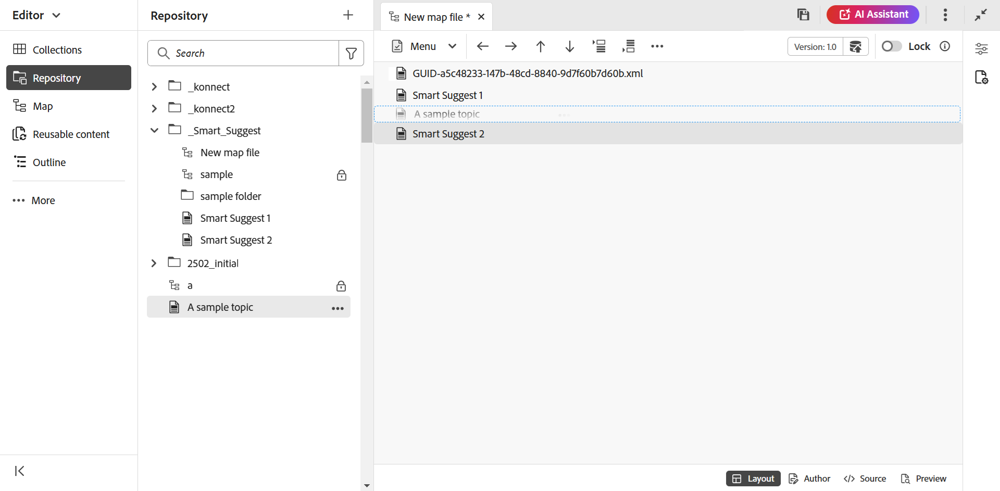

# マップの作成 {#id176FEN0D05Z}

Adobe Experience Manager Guidesには、2 つの標準提供マップテンプレート （DITA マップとブックマップ）があります。 また、独自のマップ テンプレートを作成し、それを作成者と共有してマップ ファイルを作成することもできます。

マップを作成するには、次の手順を実行します。

1. リポジトリパネルで「**新規ファイル**」アイコンを選択し、ドロップダウンメニューから「**DITA Map**」を選択します。

   {align="left"}

   このオプションには、[Experience Manager Guidesのホームページ ](./intro-home-page.md) およびリポジトリビューのフォルダーのオプションメニューからもアクセスできます。

2. **新規マップ** ダイアログボックスが表示されます。

3. **新しいマップ** ダイアログボックスで、次の詳細を指定します。
   - マップのタイトル。
   - \（オプション\）* マップのファイル名。 ファイル名は、トピックのタイトルに基づいて自動的に提示されます。 管理者が UUID 設定に基づく自動ファイル名を有効にしている場合、「名前」フィールドは表示されません。
   - トピックの基になるテンプレート。 マップファイルの場合、使用可能なオプションは **Bookmap**、**Map**、および **Subject scheme** です。
   - マップ ファイルを保存するパス。 デフォルトでは、リポジトリで現在選択されているフォルダーのパスが「パス」フィールドに表示されます。

   {width="300" align="left"}

4. 「**作成**」を選択します。

指定したパスにマップが作成されます。 また、マップはマップ エディタで開いて編集できます。

{align="left"}

## マップ ファイルにトピックを追加する

エディタから直接マップ ファイルを編集する以外にも、マップでトピック ファイルを開いてエディタを編集することもできます。 マップ ファイルにトピックを追加できます。

マップ コンソールからマップ ファイルにトピックを追加するには、次の手順を実行します。

1. リポジトリ表示で、編集するマップファイルに移動して開きます。
1. **編集** アイコンを選択します。

   {width="450" align="left"}

1. マップ エディタにマップ ファイルが表示されます。 新しいマップ ファイルを開いた場合は、マップのタイトルのみがエディタに表示されます。

   {align="left"}

   - **A** - \（*タブバー*\）：これはエディターのタブバーに似ています。 詳しくは、エディターの [ タブバー ](./web-editor-features.md#tab-bar) を参照してください。

   - **B** - \（*Toolbar*\）マップファイルを操作するためのツールバーです。 ツールバーで使用できる機能の詳細については、[ マップ エディタのツールバーで使用できる機能 ](#features-available-in-the-map-editors-toolbar) を参照してください。

   - **C** - \（*Map views*\）: マップ エディタをレイアウト、オーサー、Source、プレビューの間で切り替えることができます。 **レイアウト** ビューを使用すると、DITA マップ内のトピックを整理できます。 これにより、マップのツリー表示または階層表示が行われます。 **オーサー** ビューを使用すると、マップ エディタでトピックを編集できます。 これにより、マップファイルのWYSIWYGビューも表示されます。 **Source** ビューを使用すると、マップファイルの基になる XML を操作できます。 プレビューでは、マップ ファイル内のすべてのトピックとサブマップの統合ビューが表示されます。

   - **D** - \（*Left Panel*\）：左側のパネルにアクセスできます。このパネルでは、コレクション、リポジトリ、マップ、アウトラインなどの機能にアクセスできます。 展開/折りたたみアイコンを選択して、展開または折りたたむことができます。 左側のパネルで使用できる機能について詳しくは、エディターで [ 左側のパネル ](./web-editor-features.md#left-panel) を参照してください。

   - **E** - \（*中央領域*\）: コンテンツ編集領域をマップします。

   - **F** - \（*Right Panel*\）: プロパティ パネルへのアクセス権を付与します。 選択したトピックまたはマップのコンテンツ・プロパティおよびマップ・プロパティを表示できます。 このパネルで使用できる機能について詳しくは、エディターの [ 右のパネル ](web-editor-features.md#right-panel) を参照してください。

1. 左側のパネルで、**リポジトリ** ビューに切り替えます。

1. Adobe Experience Manager リポジトリで、追加するトピックまたはサブマップを含むフォルダーに移動します。

1. **リポジトリ** ビューでトピックまたはマップファイルを選択して、\（中央\） マップコンテンツ編集領域にドラッグ&amp;ドロップします。

   トピックがマップに追加されます。

   {align="left"}

1. 後続のトピックまたはサブマップを追加するには、トピックまたはサブマップをマップ内の必要な場所にドラッグ アンド ドロップします。

   マップ ファイルを作成する際は、次の点を考慮してください。

   - ファイルは、マップ編集領域で破線の長方形バーが表示される場所に追加されます。 次のスクリーンショットでは、*Smart Suggest 1* トピックと *Smart Suggest 2* トピックの間に *サンプルトピック* トピックが追加されています。

     {align="left"}

   - トピックを置き換えるには、置き換えるトピックの上に新しいトピックをドラッグ&amp;ドロップします。 そしてそれをドロップすると、その上にドロップされているトピックに置き換えられることを示します。

   - サブマップを DITA マップに追加すると、そのサブマップは DITA マップ内のリンクとして表示されます。 サブマップのすべてのトピックを表示するには、[Ctrl] を押しながらサブマップ リンクをクリックします。 サブマップのコンテンツが新しいタブに表示されます。 同様に、DITA マップからトピックを開くには、Ctrl キーを押しながらトピックリンクをクリックすると、新しいタブでトピックが開きます。

   - ショートカット キーの Ctrl+Z と Ctrl+Y、またはツールバーの各アイコンを使用して、マップの変更を取り消したり、やり直すことができます。

   - トピックの位置を変更するには、トピック \（トピック アイコン\を選択して）を選択し、マップ ファイル内の目的の場所にドラッグ アンド ドロップします。 次のスクリーンショットでは、トピック *Smart Suggest 1* を *A サンプルトピック* の後に移動しています。

     {align="left"}

   - マップ ファイルのプロパティを確認するには、マップ編集領域の任意の場所を右クリックし、コンテキスト メニューから **プロパティ** を選択します。 Adobe Experience Managerのバージョンに応じて、メタデータ、\（de\）アクティベーションのスケジュール、参照、ドキュメントの状態などのプロパティを表示できます。

1. 「**保存**」を選択します。

## Assets UI からマップを作成する

また、Assets UI からマップ ファイルを作成し、マップ エディタで開いて編集することもできます。

Assets UI からマップを作成するには、次の手順を実行します。

1. Assets UI で、マップファイルを作成する場所に移動します。

1. **作成** \> **DITA マップ** を選択します。

1. ブループリントページで、使用するマップテンプレートのタイプを選択し、「**次へ**」を選択します。

   >[!NOTE]
   >
   > マップ ファイル内でのトピックの参照方法は、マップ テンプレートによって異なります。 たとえば、マップ テンプレートを選択した場合、トピック参照\（`topicref`\）はトピックを参照するために使用されます。 ブックマップの場合、トピック参照は DITA の `chapter` 要素を使用して作成されます。

   {align="left"}

1. プロパティページで、マップ **タイトル** を指定します。

1. \（オプション\） ファイル **名前** を指定します。

   管理者が UUID 設定に基づいて自動的にファイル名を設定している場合、ファイル名を指定するオプションは表示されません。 UUID ベースのファイル名がファイルに自動的に割り当てられます。

   ファイル命名オプションが使用可能な場合は、マップのタイトルに基づいて名前が自動的に提案されます。 マップ ファイル名を手動で指定する場合は、ファイル名にスペース、アポストロフィ、または中括弧が含まれず、`.ditamap` で終わっていることを確認してください。

1. 「**作成**」を選択します。

   マップが作成されましたメッセージが表示されます。

   Assets UI またはエディターから作成するすべての新しいマップファイルには、一意のマップ ID が割り当てられます。 また、新しいマップは最新の作業コピーとして DAM に保存されます。 新しく作成したマップのリビジョンを保存するまで、[ バージョン履歴 ] にはバージョン番号は表示されません。 編集用にマップを開くと、マップ ファイルのタブの右上隅にバージョン情報が表示されます。

   {align="left"}

   新しく作成されたマップのバージョン情報は *none* と表示されます。 新しいバージョンを保存すると、そのバージョンには 1.0 というバージョン番号が割り当てられます。新しいバージョンの保存の詳細については、「[ 新しいバージョンとして保存 ](web-editor-features.md#save-as-new-version)」を参照してください。

   マップを編集用に設定済みのマップエディタで開くか、マップファイルをAdobe Experience Manager リポジトリに保存するかを選択できます。

   >[!NOTE]
   >
   > 高度なマップ エディタを使用するには、エディタでマップ ファイルにアクセスします。 管理者がマップ ファイルの既定のエディタとして高度なマップ エディタを設定している場合、マップ ファイルは高度なマップ エディタで直接開いて編集できます。 Adobe Experience Manager Guides as a Cloud Serviceのインストールと設定の「*詳細マップエディターをデフォルトとして設定*」セクションを表示します。

### Assets UI からマップファイルにトピックを追加する

次の手順を実行して、Assets UI からトピックをマップファイルに追加します。

1. Assets UI で、編集するマップファイルに移動します。

   >[!NOTE]
   >
   > アセット選択モードが有効になっていないことを確認してください。

1. マップファイルに排他的なロックを取得するには、マップファイルを選択してから、上部の **チェックアウト** オプションを選択します。

   >[!NOTE]
   >
   > マップ ファイルに排他ロックを設定すると、他のユーザはマップを編集できなくなります。 ただし、マップ ファイル内のトピックは作業できます。 編集前にファイルをロックするように管理者が設定している場合、ファイルをロックするまで、ファイルを編集できません。

1. マップ ファイルを選択した状態で、[**トピックを編集**] を選択します。

   {align="left"}

   または、マップ ファイルのアクション メニューから [**トピックを編集**] オプションを選択することもできます。

   {align="left"}

   マップ ファイルがエディタで編集用に開かれます。 マップ ファイルにトピックを追加するには、[ マップ ファイルにトピックを追加する ](#add-topics-to-a-map-file) の手順（4-8）に従います。

**親トピック：[ マップエディターの概要 ](map-editor.md)
