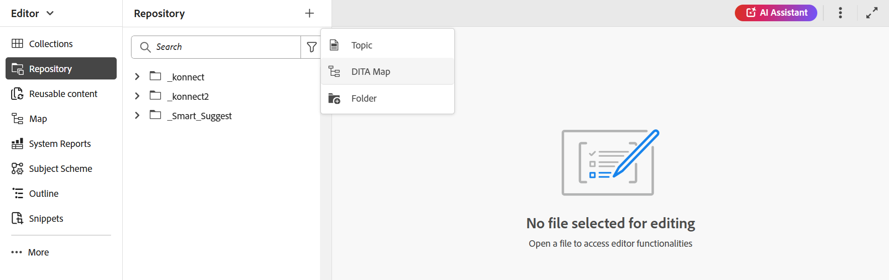
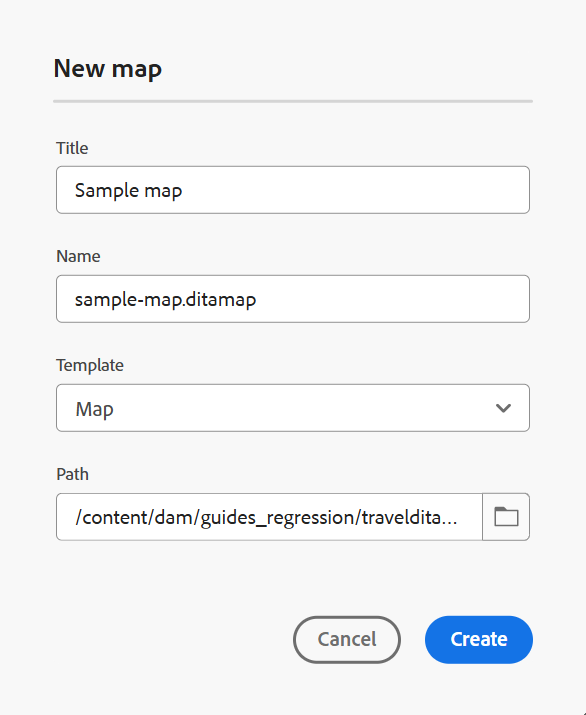
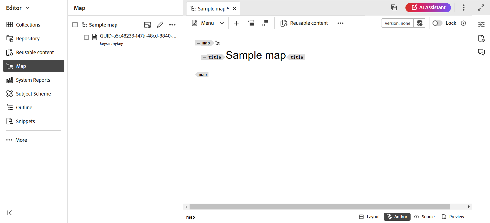
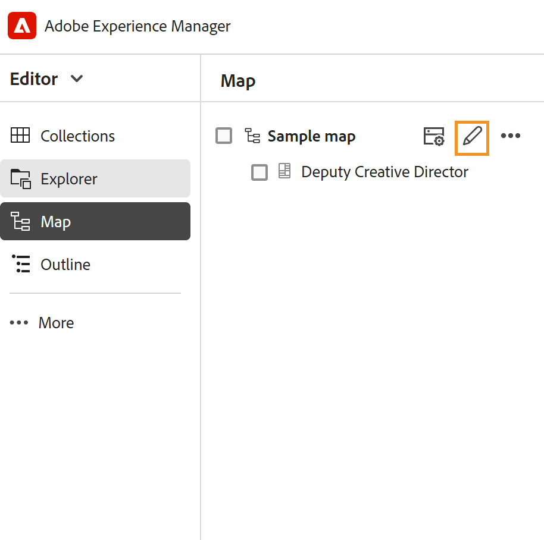
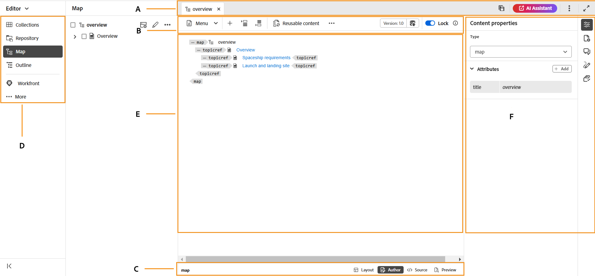
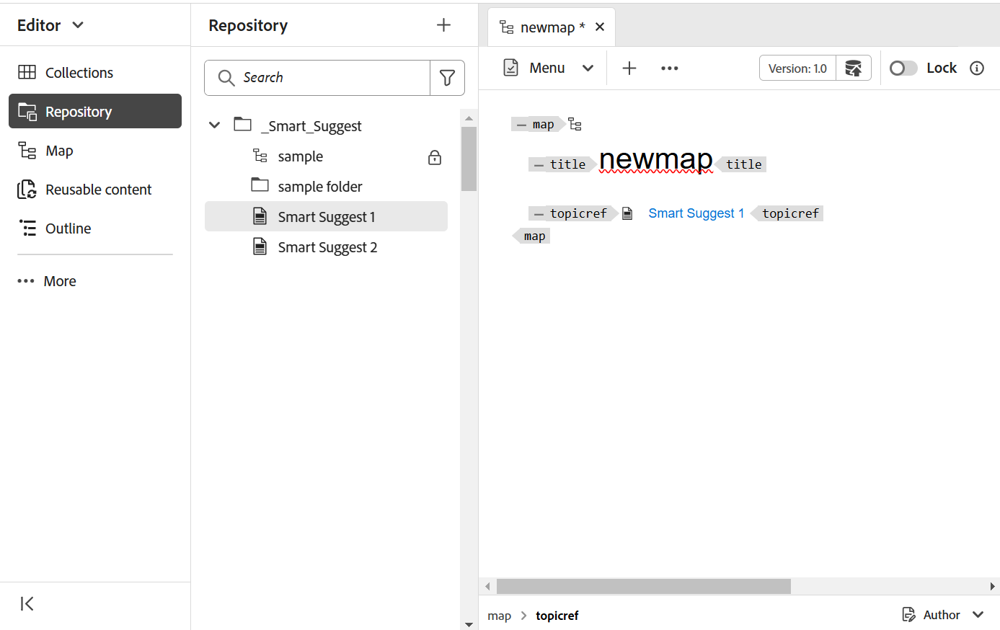
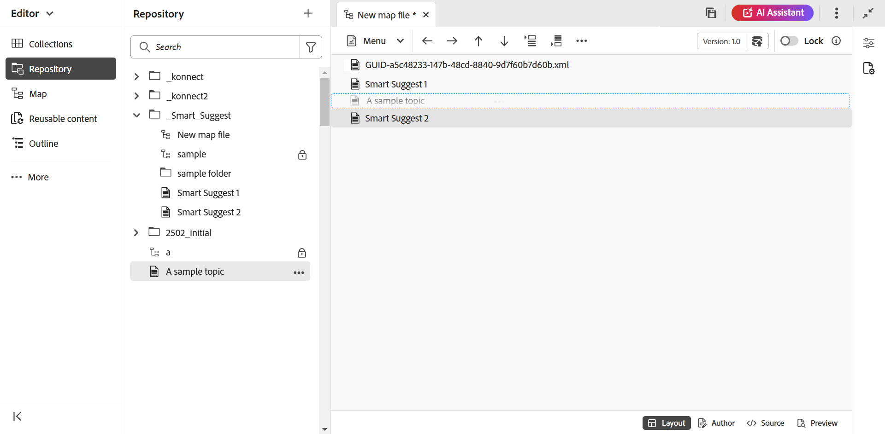
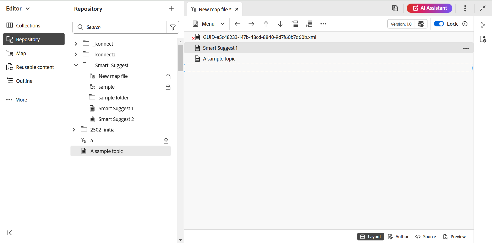
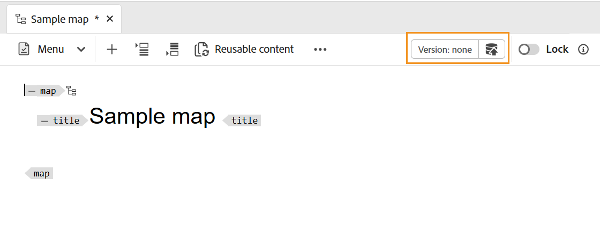

# マップの作成 {#id176FEN0D05Z}

>[!INFO]
>
>2025.11.0 リリースから、**リポジトリ**&#x200B;の名前が&#x200B;**エクスプローラー**&#x200B;に変更されました。 オンプレミス設定の場合は、Experience Manager Guidesの5.1 リリースまで引き続きリポジトリとして使用できます。

Adobe Experience Manager Guidesには、DITA マップとBookmapの2つのマップテンプレートが用意されています。 独自のマップテンプレートを作成し、作成者と共有してマップファイルを作成することもできます。

マップを作成するには、次の手順を実行します。

1. エクスプローラーパネルで、**新規ファイル** アイコンを選択し、ドロップダウンメニューから&#x200B;**DITA マップ**&#x200B;を選択します。

   

   このオプションには、[Experience Manager Guidesのホームページ &#x200B;](./intro-home-page.md)と、エクスプローラービューのフォルダーのオプションメニューからアクセスすることもできます。

2. **新しいマップ** ダイアログボックスが表示されます。

3. **新しいマップ** ダイアログボックスで、次の詳細を入力します。
   - マップのタイトル。
   - \（Optional\）* マップのファイル名。 ファイル名は、トピックタイトルに基づいて自動的に提案されます。 管理者がUUID設定に基づいて自動ファイル名を有効にしている場合、「名前」フィールドは表示されません。
   - トピックのベースとなるテンプレート。 マップファイルの場合、使用可能なオプションは&#x200B;**Bookmap**、**Map**、**件名スキーム**&#x200B;です。
   - マップファイルを保存するパス。 デフォルトでは、エクスプローラーで現在選択されているフォルダーのパスが「パス」フィールドに表示されます。

   {width="300"}

4. 「**作成**」を選択します。

マップは、指定したパスで作成されます。 また、マップは編集のためにマップエディターで開かれます。

## マップファイルへのトピックの追加

エディターからマップファイルを直接編集するだけでなく、エディターを編集するためにマップ内のトピックファイルを開くこともできます。 マップファイルにトピックを追加できます。

マップコンソールからマップファイルにトピックを追加するには、次の手順を実行します。

1. エクスプローラービューで、編集するマップファイルに移動して開きます。
1. 「**編集**」アイコンを選択します。

   {width="450"}

1. マップファイルがマップエディターで開きます。 新しいマップファイルを開いた場合、マップのタイトルのみがエディターに表示されます。

   

   - **A** - \（*タブ バー*\）：これはエディターのタブ バーと似ています。 詳細については、エディターで[&#x200B; タブバー](./web-editor-tab-bar.md)を表示してください。

   - **B** - \（*ツールバー*\）これは、マップファイルを操作できるツールバーです。 ツールバーで使用できる機能について詳しくは、[&#x200B; マップエディターのツールバーで使用できる機能](./map-editor-advanced-map-editor.md)を参照してください。

   - **C** - \（*マップビュー*\）: マップエディターをレイアウト、作成者、Source、プレビューの間で切り替えることができます。 **レイアウト** ビューを使用すると、DITA マップ内のトピックを整理できます。 これにより、マップのツリーまたは階層ビューが表示されます。 **作成者** ビューでは、マップエディターでトピックを編集できます。 これにより、マップファイルのWYSIWYG ビューも表示されます。 **Source** ビューでは、マップファイルの基になるXMLを操作できます。 プレビューでは、マップファイル内のすべてのトピックとサブマップの統合ビューが表示されます。

   - **D** - \（*左パネル*\）：左パネルにアクセスし、コレクション、エクスプローラー、マップ、アウトラインおよびその他の機能にアクセスできます。 展開/折りたたみアイコンを選択して、展開または折りたたむことができます。 左側のパネルで使用できる機能について詳しくは、エディターの[左側のパネル &#x200B;](./web-editor-left-panel.md)を参照してください。

   - **E** - \（*中間領域*\）: コンテンツ編集領域をマップ化します。

   - **F** - \（*右パネル*\）: プロパティ パネルへのアクセス権を付与します。 選択したトピックまたはマップのコンテンツプロパティとマッププロパティを表示できます。 このパネルで使用できる機能の詳細については、エディターの[右側のパネル &#x200B;](web-editor-right-panel.md)を参照してください。

1. 左側のパネルで、**Explorer** ビューに切り替えます。

1. Adobe Experience Manager エクスプローラーで、追加するトピックまたはサブマップが含まれているフォルダーに移動します。

1. **Explorer** ビューでトピックまたはマップファイルを選択し、\（middle\） マップコンテンツ編集領域にドラッグ&amp;ドロップします。

   トピックがマップに追加されます。

   

1. 後続のトピックまたはサブマップを追加するには、トピックまたはサブマップをマップ内の必要な場所にドラッグ&amp;ドロップします。

   マップファイルを作成する際には、次の点を考慮してください。

   - ファイルは、マップ編集領域に点線の長方形バーが表示される場所に追加されます。 次のスクリーンショットでは、*A サンプルトピック* トピックが&#x200B;*スマートサジェスト 1*&#x200B;と&#x200B;*スマートサジェスト 2* トピックの間に追加されます。

     

   - トピックを置き換えるには、置き換えるトピックの上に新しいトピックをドラッグ&amp;ドロップします。 ドロップオーバーは、ドロップされているトピックに置き換えられることを示します。

   - サブマップをDITA マップに追加すると、サブマップはDITA マップ内のリンクとして表示されます。 サブマップのすべてのトピックを表示するには、Ctrl+サブマップリンクをクリックします。 サブマップの内容が新しいタブに表示されます。 同様に、DITA マップからトピックを開くには、Ctrl+クリックしてトピックリンクをクリックすると、新しいタブが開きます。

   - ショートカットキーCTRL+ZおよびCTRL+Yまたはツールバーのそれぞれのアイコンを使用して、マップ内の変更を元に戻したり、やり直したりできます。

   - トピックの位置を変更するには、トピック \（トピックアイコン\）を選択し、マップファイル内の目的の場所にドラッグ&amp;ドロップします。 次のスクリーンショットでは、トピック *スマート提案1*&#x200B;が&#x200B;*サンプルトピック*&#x200B;の後に移動されています。

     

   - マップファイルのプロパティを確認するには、マップ編集領域の任意の場所を右クリックし、コンテキストメニューから「**プロパティ**」を選択します。 Adobe Experience Managerのバージョンにもとづいて、メタデータ、スケジュール \（de\）アクティベーション、参照、ドキュメントの状態などのプロパティを表示できます。

1. 「**保存**」を選択します。

## Assets UIからマップを作成する

Assets UIからマップファイルを作成し、マップエディターで開いて編集することもできます。

Assets UIからマップを作成するには、次の手順を実行します。

1. Assets UIで、マップファイルを作成する場所に移動します。

1. **Create** \> **DITA マップ**&#x200B;を選択します。

1. ブループリントページで、使用するマップテンプレートのタイプを選択し、**次へ**&#x200B;を選択します。

   >[!NOTE]
   >
   > マップファイルでトピックを参照する方法は、マップテンプレートによって異なります。 例えば、マップテンプレートを選択すると、トピック参照\（`topicref`\）がトピックを参照するために使用されます。 ブックマップの場合、トピック参照はDITAの`chapter`要素を使用して作成されます。

   

1. プロパティ ページで、マップ **タイトル**&#x200B;を指定します。

1. \（Optional\） ファイル **Name**&#x200B;を指定します。

   管理者がUUID設定に基づいて自動ファイル名を設定している場合、ファイル名を指定するオプションは表示されません。 UUID ベースのファイル名が自動的にファイルに割り当てられます。

   ファイル名オプションが使用可能な場合は、マップのタイトルに基づいて名前も自動的に提案されます。 マップファイル名を手動で指定する場合は、ファイル名にスペース、アポストロフィ、または中括弧が含まれておらず、`.ditamap`で終わることを確認します。

1. 「**作成**」を選択します。

   マップ作成メッセージが表示されます。

   Assets UIまたはエディターから作成する新しいマップファイルには、一意のマップ IDが割り当てられます。 また、新しいマップは、最新の作業用コピーとしてDAMに保存されます。 新しく作成したマップのリビジョンを保存するまで、バージョン履歴にバージョン番号は表示されません。 編集のためにマップを開くと、バージョン情報がマップファイルのタブの右上隅に表示されます。

   

   新しく作成されたマップのバージョン情報は&#x200B;*none*&#x200B;として表示されます。 新しいバージョンを保存すると、バージョン番号が1.0として割り当てられます。 新しいバージョンの保存について詳しくは、[新しいバージョンとして保存](web-editor-features.md#save-as-new-version)を参照してください。

   設定済みのマップエディターで編集するためにマップを開くか、エクスプローラーにマップファイルを保存するかを選択できます。

   >[!NOTE]
   >
   > 詳細マップエディターを使用するには、エディターでマップファイルにアクセスします。 管理者が詳細マップエディターをマップファイルのデフォルトのエディターとして設定している場合、マップファイルは詳細マップエディターで直接開いて編集できます。 表示&#x200B;*Adobe Experience Manager Guides as a Cloud Serviceのインストールと設定の詳細マップエディターをデフォルトとして* セクションに設定します。

### Assets UIからマップファイルにトピックを追加する

Assets UIからマップファイルにトピックを追加するには、次の手順を実行します。

1. Assets UIで、編集するマップファイルに移動します。

   >[!NOTE]
   >
   > アセットの選択モードが有効になっていないことを確認します。

1. マップファイルの排他的ロックを取得するには、マップファイルを選択し、上部の「**チェックアウト**」オプションを選択します。

   >[!NOTE]
   >
   > マップファイルに排他的ロックを設定すると、他のユーザーはマップを編集できなくなります。 ただし、マップファイル内のトピックに関する作業は可能です。 管理者が編集前にファイルをロックするようにエディターを設定している場合、ファイルをロックするまで編集できません。

1. マップファイルを選択した状態で、「**トピックを編集**」を選択します。

   

   または、マップファイルのアクションメニューから「**トピックを編集**」オプションを選択することもできます。

   

   マップファイルがエディターで編集用に開きます。 マップファイルにトピックを追加するには、[&#x200B; マップファイルにトピックを追加](#add-topics-to-a-map-file)の手順（4～8）に従います。

** 親トピック：[&#x200B; マップエディターの概要](map-editor.md)
