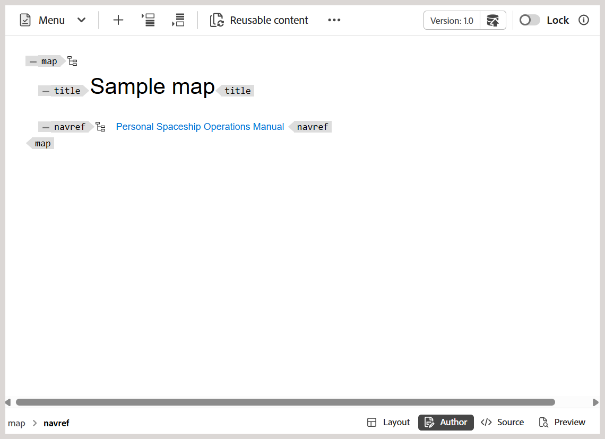
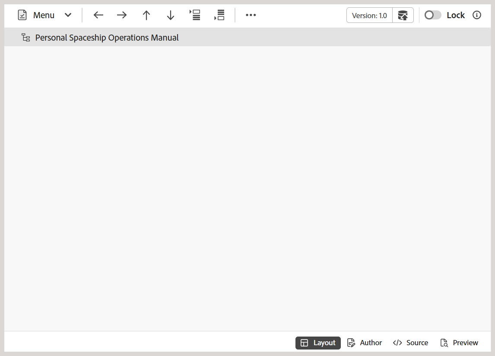

# マップエディターの追加機能 {#id1942D0T0HUI}

マップエディターの一般的な機能には、次のようなものがあります。

## キー参照の解決 {#id176GD01H05Z}

DITA コンテンツキー参照、または`conkeyref`は、あるトピックのコンテンツの一部を別のトピックに挿入するためのメカニズムです。 このメカニズムは、直接コンテンツ参照メカニズムではなく、再利用するコンテンツを見つけるためにキーを使用します。 DITAでの直接および間接参照について詳しくは、「*DITA アドレス* in OASIS DITA Language Specification」を参照してください。

DITA トピックに関連するキー参照がある場合は、トピックのプレビュー、編集、レビューの前に解決する必要があります。

キー参照は、次の優先順に設定されたルートマップに基づいて解決されます。

1. ユーザーの環境設定
1. マップビューパネル
1. フォルダープロファイル

ユーザー環境設定で選択したルートマップは、キー参照を解決するために最も優先され、その後にマップビューパネルとフォルダープロファイルのルートマップが続きます。 そのため、ユーザー環境設定でマップが設定されていない場合は、マップビューパネルで開いたマップが使用されます。 マップビューパネルでマップが開かれていない場合は、フォルダープロファイルで設定されたマップを使用して、キー参照を解決します。

キー参照は、DITA マップファイルまたは別のDITA ファイル内に保存できます。 Experience Manager Guidesでは、プロジェクトレベルまたはセッションレベルでキー参照を指定できます。 ルートマップがユーザーセッション用に既に定義されている場合は、キーの解決に使用されます。 それ以外の場合は、そのフォルダーのデフォルトのルートマップが使用されます。 デフォルトのルートマップが設定されていない場合、欠落しているキー参照がユーザーにハイライト表示されます。

DITA トピック内の重要な参照を解決するには、次の場所で使用するDITA マップを定義する方法がいくつかあります。

**プロジェクトのプロパティ** - 「プロジェクトのプロパティ」セクションで、プロジェクトの作成時にキー参照を解決するためのルートマップを定義できます。

このルートマップは、そのプロジェクトに関連付けられたすべてのアセット \（フォルダーおよびサブフォルダー\）に適用されます。 複数のプロジェクトで参照されるコンテンツの場合、プロジェクトのアルファベット順のリストが維持され、最初のプロジェクトに関連付けられたデフォルトのルートマップが使用されます。 また、キー参照を解決するためにリストから使用するDITA マップを選択することもできます。

**トピックプレビュー** - トピックプレビューモードで、ツールバーのキー解決アイコンを選択し、キー参照に使用するDITA ファイルを選択します。

**トピック編集ビュー** - DITA トピックの編集中にキー解決アイコンを選択し、キー参照の解決に使用するDITA ファイルを選択します。

## ナビゲーション参照の追加

`navref`要素は、別のDITA マップからのナビゲーション参照を含めるためにDITA マップ内で使用されます。 これにより、作成者は、参照マップの実際のコンテンツを出力に結合することなく、共有メニューやリンクなどのナビゲーション構造を再利用できます。

>[!NOTE]
>
> `navref`要素は、マップ構造内でのナビゲーションのみを目的としています。 生成されたDITA マップ出力には適用されず、マップビュー、レポート、ベースライン、翻訳、プレビューの処理や表示から除外されます。

マップにナビゲーション参照を追加するには、次の手順を実行します。

1. ナビゲーション参照を追加するDITA マップファイルを開きます。

   マップファイルがマップエディターで開きます。
1. 作成者ビューに切り替え、ナビゲーション参照の有効な場所にカーソルを置きます。
1. ツールバーから「**要素**」オプションを選択します。
1. **エレメントを挿入** ダイアログで、**navref**&#x200B;を選択します。

   
1. **パスを選択** ダイアログが表示されます。 マップにナビゲーション参照として含めるマップファイルを選択し、**選択**&#x200B;を選択します。

選択したマップファイルのナビゲーション参照が、指定した場所に追加されます。 また、参照マップのタイトルは、作成者ビューとレイアウトビューの両方に表示されます。

*作成者ビュー*

*レイアウトビュー*

**親トピック：**[ マップエディターの概要](map-editor.md)
