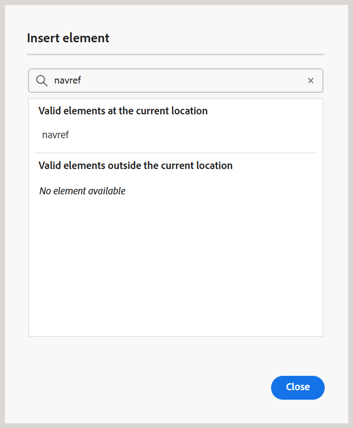
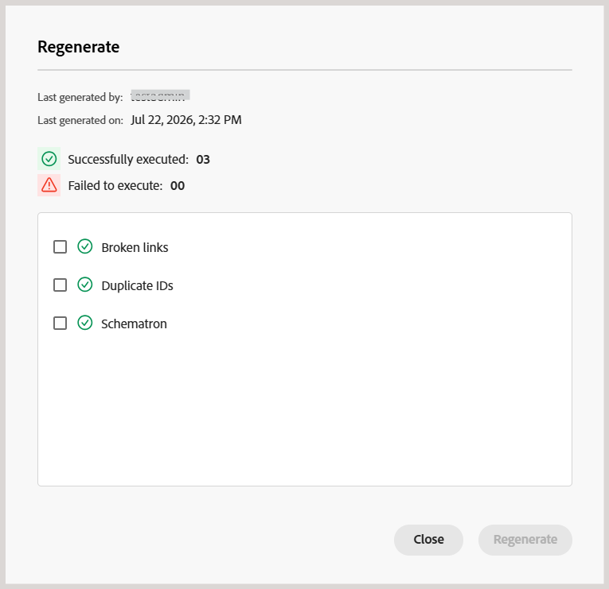

# マップエディターの追加機能 {#id1942D0T0HUI}

マップエディターの一般的な機能には、次のようなものがあります。

## キー参照の解決 {#id176GD01H05Z}

DITA コンテンツキー参照、または`conkeyref`は、あるトピックのコンテンツの一部を別のトピックに挿入するためのメカニズムです。 このメカニズムは、直接コンテンツ参照メカニズムではなく、再利用するコンテンツを見つけるためにキーを使用します。 DITAでの直接および間接参照について詳しくは、「*DITA アドレス* in OASIS DITA Language Specification」を参照してください。

DITA トピックに関連するキー参照がある場合は、トピックのプレビュー、編集、レビューの前に解決する必要があります。

キー参照は、次の優先順に設定されたルートマップに基づいて解決されます。

1. ユーザーの環境設定
1. マップビューパネル
1. フォルダープロファイル

ユーザー環境設定で選択したルートマップは、キー参照を解決するために最も優先され、その後にマップビューパネルとフォルダープロファイルのルートマップが続きます。 そのため、ユーザー環境設定でマップが設定されていない場合は、マップビューパネルで開いたマップが使用されます。 マップビューパネルでマップが開かれていない場合は、フォルダープロファイルで設定されたマップを使用して、キー参照を解決します。

キー参照は、DITA マップファイルまたは別のDITA ファイル内に保存できます。 Experience Manager Guidesでは、プロジェクトレベルまたはセッションレベルでキー参照を指定できます。 ルートマップがユーザーセッション用に既に定義されている場合は、キーの解決に使用されます。 それ以外の場合は、そのフォルダーのデフォルトのルートマップが使用されます。 デフォルトのルートマップが設定されていない場合、欠落しているキー参照がユーザーにハイライト表示されます。

DITA トピック内の重要な参照を解決するには、次の場所で使用するDITA マップを定義する方法がいくつかあります。

**プロジェクトのプロパティ** - 「プロジェクトのプロパティ」セクションで、プロジェクトの作成時にキー参照を解決するためのルートマップを定義できます。

このルートマップは、そのプロジェクトに関連付けられたすべてのアセット \（フォルダーおよびサブフォルダー\）に適用されます。 複数のプロジェクトで参照されるコンテンツの場合、プロジェクトのアルファベット順のリストが維持され、最初のプロジェクトに関連付けられたデフォルトのルートマップが使用されます。 また、キー参照を解決するためにリストから使用するDITA マップを選択することもできます。

**トピックプレビュー** - トピックプレビューモードで、ツールバーのキー解決アイコンを選択し、キー参照に使用するDITA ファイルを選択します。

**トピック編集ビュー** - DITA トピックの編集中にキー解決アイコンを選択し、キー参照の解決に使用するDITA ファイルを選択します。

## ナビゲーション参照の追加

`navref`要素は、別のDITA マップからのナビゲーション参照を含めるためにDITA マップ内で使用されます。 これにより、作成者は、参照マップの実際のコンテンツを出力に結合することなく、共有メニューやリンクなどのナビゲーション構造を再利用できます。

>[!NOTE]
>
> `navref`要素は、マップ構造内でのナビゲーションのみを目的としています。 生成されたDITA マップ出力には適用されず、マップビュー、レポート、ベースライン、翻訳、プレビューの処理や表示から除外されます。

マップにナビゲーション参照を追加するには、次の手順を実行します。

1. ナビゲーション参照を追加するDITA マップファイルを開きます。

   マップファイルがマップエディターで開きます。
1. 作成者ビューに切り替え、ナビゲーション参照の有効な場所にカーソルを置きます。
1. ツールバーから「**要素**」オプションを選択します。
1. **エレメントを挿入** ダイアログで、**navref**&#x200B;を選択します。

   
1. **パスを選択** ダイアログが表示されます。 マップにナビゲーション参照として含めるマップファイルを選択し、**選択**&#x200B;を選択します。

選択したマップファイルのナビゲーション参照が、指定した場所に追加されます。 また、参照マップのタイトルは、作成者ビューとレイアウトビューの両方に表示されます。

*作成者ビュー*

*レイアウトビュー*

## マップ上でヘルスチェックを実行

コンテキストメニューの「ヘルスチェックを実行」オプションを使用すると、選択したマップでヘルスチェックを実行して、公開前にリンク切れ、重複ID、Schematron検証エラーなどの問題を検出できます。

>[!NOTE]
>
> この機能はデフォルトで有効になっています。 お客様の環境でこの機能を使用しない場合は、カスタマーサクセス部門にお問い合わせください。

どのチェックを実行できるかは、ヘルスチェックプリセットによって定義され、フォルダープロファイルレベルで管理者が作成および管理します。 詳細については、[ ヘルスチェックプリセットの作成と管理](../install-conf-guide/conf-health-check-preset.md)を参照してください。

マップ上でヘルスチェックを実行するには、次の手順を実行します。

1. エディターでマップを開きます。
1. オプションメニューで、**ヘルスチェックの実行** オプションを選択します。
   
1. ヘルスチェックを実行ダイアログが表示されます。 実行するヘルスチェックプリセットを選択します。 フォルダープロファイルに設定されたプリセットのみが選択できます。

   プリセットを選択すると、定義されたチェックがダイアログに読み込まれます。

   
1. *オプション* ベースラインを選択します。 ベースラインを使用しない場合は、**なし**&#x200B;を選択します。
1. **実行**&#x200B;を選択します。

マップのヘルスチェックは、**ヘルスチェックレポート** パネルから実行することもできます。 このために、マップ ビューでマップを開き、**ヘルスチェック レポート** アイコンを選択します。

>[!NOTE]
>
>このオプションは、ヘルスチェックがまだ実行されていないマップに対してのみ表示されます。 マップ上でヘルスチェックが既に実行されている場合、**ヘルスチェックレポート** アイコンを選択すると、代わりに既存のレポートが開きます。

パネルで、**ヘルスチェックの実行**&#x200B;を選択します。

これにより、同じ&#x200B;**ヘルスチェックを実行** ダイアログが開きます。このダイアログでは、ヘルスチェックプリセットとベースラインを選択して、上記の手順で説明したように、マップ上でヘルスチェックを実行できます。

## エディターでのヘルスチェックレポートの使用

マップのヘルスチェックを実行すると、次に示すように、**ヘルスチェックレポート** パネルにレポートが開きます。

### ヘルスチェックのレポートパネルオプション

ヘルスチェックレポートパネルでは、次のオプションを使用できます。

- **マップ名**: レポートが生成されたマップの名前。
- **情報アイコン**: レポートの生成に使用したプリセット名、マップバージョン、ベースライン（ある場合）を表示する場合に選択します。
- **フィルター**: レポートを特定のルールに絞り込みます。例えば、壊れているリンクの結果のみを表示します。 フィルターには、現在のレポートで結果を生成したルールタイプのみが一覧表示されます。
- **レポートをダウンロード**: レポートをダウンロードします。
- **再生成**：ヘルスチェックを再度実行します。

### ヘルスチェックの結果

選択したチェックによって生成された各結果には、次の詳細が表示されます。
- **重大度**：結果の重大度（エラー、警告、情報、致命的など）。
- **ヘルスチェックプリセット名**: レポートの生成に使用するヘルスチェックプリセットの名前
- **ルール名**：結果を生成したルール（壊れたリンクや重複IDなど）。
- **行番号**：問題が発生するファイル内の行。
- **Asset**：問題が見つかったファイル。

結果を選択して、問題が解決しない正確な行で対応するファイルを開きます。

>[!NOTE]
>
>リンク切れの結果は、ファイルを作成者モードで開きます。 IDとSchematronの検証結果が重複し、Source モードでファイルが開きます。

### レポートを再生成

問題を修正した後、ツールバーの「**再生成**」を選択して、ヘルスチェックをもう一度実行し、問題が解決されたことを確認します。 表示された&#x200B;**再生成** ダイアログで、再生成されたレポートに含めるチェックを選択します。

>[!NOTE]
>
> ヘルスチェックレポートは、作成したユーザーに固有のものです。 複数のユーザーが同じマップのレポートを生成する場合、各ユーザーは自分の結果を表示します。 ただし、管理者は常にマップ用に生成された最新のレポートにアクセスできます。

### レポートを読む

**レポートをダウンロード**&#x200B;を選択して、結果ごとに詳細な情報を含むXLS形式でレポートをダウンロードします。

**親トピック：**[ マップエディターの概要](map-editor.md)
