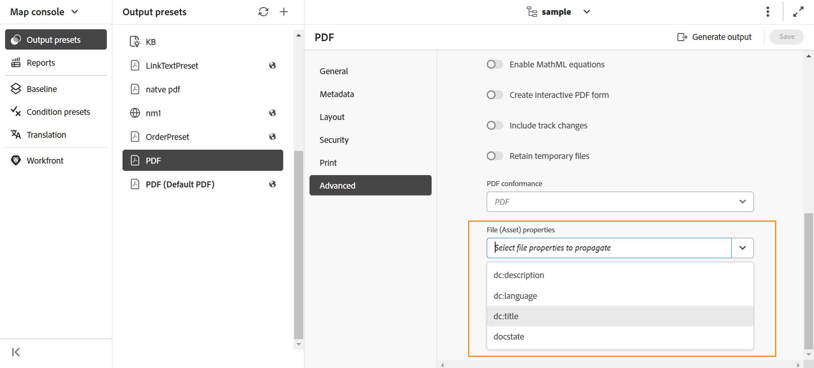
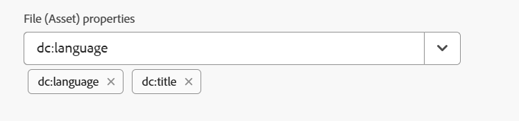
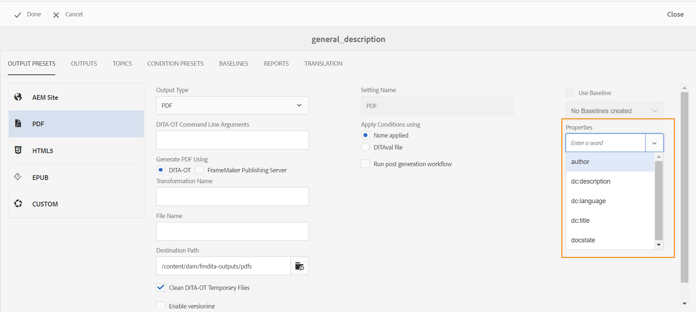
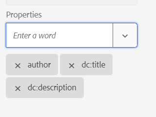

# DITA-OTを使用してメタデータを出力に渡します {#id21BJ00QD0XA}

メタデータは、出力に関する追加情報です。 Adobe Experience Manager Guidesでは、既存のメタデータを渡したり、カスタムメタデータタグを作成したりできます。 DITA-OT パブリッシングを使用して、メタデータをAEM、PDF、HTML5、EPUB、カスタム形式の出力に渡すことができます。

DITA-OTを使用してメタデータをOutputに渡すには、次の2つの方法があります。

- [マップコンソールの使用](#using-map-console)
- [マップダッシュボードの使用](#using-map-dashboard)

## マップコンソールの使用

DITA-OT パブリッシングを使用してメタデータを出力に渡すには、次の手順を実行します。

1. [ メタデータをDITA-OTに渡すDITA マップファイルをマップコンソール ](./open-files-map-console.md)で開きます。
1. メタデータフィールドを渡す出力プリセットを選択して開きます。 例えば、「PDF出力プリセット」を選択します。 **DITA-OT** オプションを使用して作成されていることを確認します。
1. **ファイルプロパティ** ドロップダウンから、DITA-OT パブリッシングに渡すメタデータを選択します。

   

   プロパティ ドロップダウンには、カスタムプロパティとデフォルトのプロパティの両方が一覧表示されます。 例えば、上記のスクリーンショットでは、`dc:description`、`dc:language`、`dc:title`、`docstate`がデフォルトのプロパティです。

   >[!NOTE]
   >
   > これらのプロパティは、次の場所にあるmetadataList ファイルから選択されます：`/libs/fmdita/config/metadataList`。 デフォルトでは、このファイルには4つのプロパティ（`dc:description`、`dc:language`、`dc:title`、および`docstate`）が一覧表示されます。

   このファイルは`/apps/fmdita/config/metadataList`でオーバーレイできます。

   既に値を定義したカスタムプロパティを渡すには、[DITA-OT PDF出力でのAEM メタデータの使用](https://experienceleaguecommunities.adobe.com/t5/xml-documentation-discussions/use-aem-metadata-in-dita-ot-pdf-output/td-p/411880)を参照してください。

1. 選択したプロパティは、ドロップダウンの下に表示されます。

   {width="300"}

1. 右上の&#x200B;**保存**&#x200B;を選択して、変更を保存します。
1. 「**出力を生成**」を選択します。

選択したメタデータプロパティは、DITA-OTを使用して生成された出力に渡されます。

>[!NOTE]
>
> Experience Manager Guidesの2502 リリース以降、DITA-OT コマンドラインを通じてルートマップのメタデータ引数を渡す機能は廃止されました。 ただし、中断を避けるために、機能を有効または無効にするための新しいプロパティが`Config.Manager`に追加されました。  詳細については、[出力生成設定の設定](../cs-install-guide/conf-output-generation.md#configure-the-dita-ot-command-line-arguement-field-on-the-dita-map-dashboard)を参照してください。

## マップダッシュボードの使用

**Assets UI**&#x200B;で作業している場合は、次の手順を実行して、DITA-OT パブリッシングを使用してメタデータを出力に渡します。

1. **Assets UI**&#x200B;で、メタデータをDITA-OTに渡すDITA マップファイルに移動して選択します。
1. メタデータフィールドを渡す出力プリセットを選択して編集します。 例えば、「PDF出力プリセット」を選択します。
1. 選択した出力プリセットで「**DITA-OT**」オプションを選択します。

   

1. 「プロパティ」ドロップダウンから、DITA-OT パブリッシングに渡すメタデータを選択します。

   プロパティ ドロップダウンには、カスタムプロパティとデフォルトのプロパティの両方が一覧表示されます。 例えば、上記のスクリーンショットでは、作成者はカスタムプロパティですが、`dc:description`、`dc:language`、`dc:title`、`docstate`はデフォルトのプロパティです。

   >[!NOTE]
   >
   > これらのプロパティは、次の場所にあるmetadataList ファイルから選択されます：`/libs/fmdita/config/metadataList`。 デフォルトでは、このファイルには4つのプロパティ（`dc:description`、`dc:language`、`dc:title`、および`docstate`）が一覧表示されます。

   このファイルは`/apps/fmdita/config/metadataList`でオーバーレイできます。

   既に値を定義したカスタムプロパティを渡すには、[DITA-OT PDF出力でのAEM メタデータの使用](https://experienceleaguecommunities.adobe.com/t5/xml-documentation-discussions/use-aem-metadata-in-dita-ot-pdf-output/td-p/411880)を参照してください。

1. **プロパティ** ドロップダウンから、必要なカスタムプロパティとデフォルトプロパティを選択します。 例えば、`author`、`dc:title`、`dc:description`を選択します。 これらは、ファイルを作成すると作成される標準の`metadata/properties`です。 選択したプロパティはドロップボックスの下に表示されます。

   {width="300"}

1. 左上の「**完了**」を選択して、変更を保存します。
1. 出力を生成します。

選択したメタデータプロパティは、DITA-OTを使用して生成された出力に渡されます。

**親トピック：**[&#x200B;出力生成](generate-output.md)
