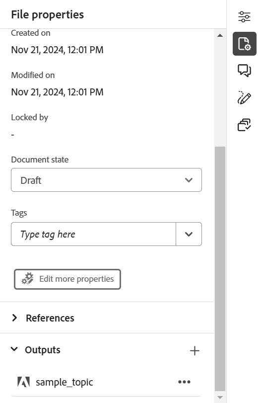

# Adobe Experience Manager Sites ページの公開

Experience Manager Sites ページとは、Adobe Experience Managerのweb サイトで公開されるコンテンツを指します。 Experience Manager Guidesを使用すると、スタンドアロンのトピックをSites ページに公開できます。

この機能を使用すると、DITA マップと出力プリセットを作成せずに、トピックとその要素を公開できます。 トピックを簡単に更新し、サイトページを再公開し、様々なweb ページで再利用できます。 この機能を使用すると、独立した記事やマーケティングコンテンツを簡単に公開できます。

Sites ページを生成するには、次の手順を実行します。

1. エディターでトピックを開き、右側のパネルから「**ファイルプロパティ**」を選択します。
1. **出力** セクションから&#x200B;**新規出力** アイコン を選択します。
1. **サイトページ**&#x200B;を選択します。
1. **サイトを生成ページ** ダイアログボックスで、次の詳細を入力します。
   {width="500"}

   * **パス**: サイトページを公開するフォルダーのパスを参照して選択します。
   * **タイトル**: サイトページのタイトルを入力します。 デフォルトでは、タイトルにはトピックのタイトルが入力されます。 編集することもできます。 このタイトルは、サイトページの名前を生成するために使用されます。
   * **名前**: サイトページの名前を入力します。 デフォルトでは、名前にはトピックタイトルが入力され、スペースや特殊文字などの許可されていない文字は「_」に置き換えられます。 例：*sample_sites_page*。 編集することもできます。 この名前は、サイトページのURLを生成するために使用されます。
   * **ページテンプレート**: サイトページテンプレートを選択して、サイトページを作成します。 選択したパスのフォルダー内のテンプレートを表示できます。 管理者はカスタムテンプレートをアップロードすることもできます。

   * また、コンテンツを公開する様々な条件を選択することもできます。 次のいずれかのオプションを選択します。

      * **なし**：公開された出力に条件を適用しない場合は、このオプションを選択します。
      * **DITAVALの使用**: パーソナライズされたコンテンツを生成するDITAVAL ファイルを選択します。 DITAVAL ファイルは、参照ダイアログまたはファイルパスを入力して選択できます。
      * **属性の使用**: DITA トピックで条件属性を定義できます。 次に、関連するコンテンツを公開する条件属性を選択します。

     >[!NOTE]
     > 
     >条件は、トピックで条件属性が定義されている場合にのみ有効になります。

1. 「**生成**」を選択して、サイトページを公開します。
1. **ファイルプロパティ**&#x200B;の&#x200B;**出力** セクションで、トピックのサイトページを表示できます。 サイトページは、公開日時に応じて表示され、最新のページが最初に表示されます。

   {width=300}

   *トピックに存在するサイトページを表示して、再公開します。*

サイトページを公開したら、任意のAdobe Experience Manager サイトでも使用できます。

## Experience Manager Sitesのオプションメニュー

**Options** メニューから、Experience Manager Sitesに対して次の操作を実行することもできます。

* **生成**: サイトページを再公開して、DITA トピックの最新コンテンツで更新します。 パス、名前、タイトル、テンプレート、条件を変更せずに出力を再生成すると、サイトページが最新のコンテンツで更新されます。

* **複製**: サイトページを複製します。 パス、名前、タイトル、テンプレートを変更できます。 また、サイトページを複製する際に、異なる条件を選択することもできます。

* **削除**：出力リストからサイトページを削除します。 確認プロンプトが表示されます。 確認すると、サイトページが&#x200B;**出力** リストから削除されます。 しかし、サイトページは完全には削除されません。

* **表示**: サイトページエディターを表示します。 また、変更を加えて保存することもできます。
