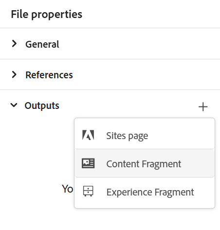
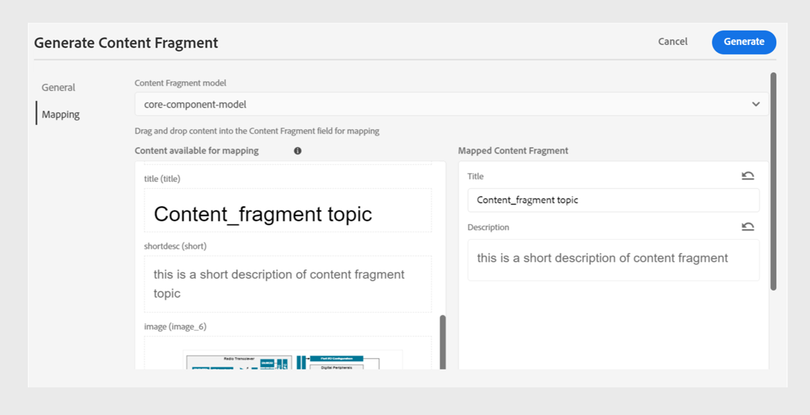
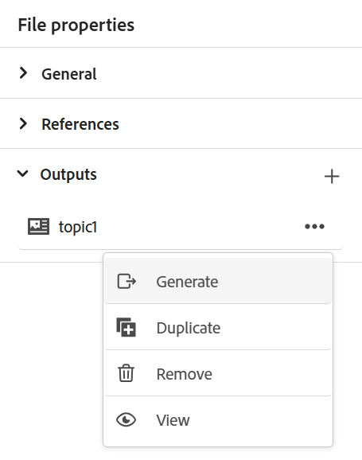

# コンテンツフラグメントの公開

コンテンツフラグメントは、Adobe Experience Managerの個別のコンテンツです。 コンテンツモデルにもとづいた構造化コンテンツです。 コンテンツフラグメントは、デザインやレイアウトに関する情報を含まない純粋なコンテンツです。 Adobe Experience Managerがサポートするチャネルに依存せずに作成および管理できます。 コンテンツフラグメントはモジュール式で、コンテンツをより小さなコンポーネントに分割します。

Experience Manager Guidesでは、トピックまたはそのエレメントをコンテンツフラグメントに公開できます。

>[!NOTE]
>
>ID属性が定義されたトピック内の要素のみを選択できます。

コンテンツフラグメントを作成するには、次の手順を実行します。

1. Adobe Experience Manager Assetsで[ コンテンツフラグメントモデル ](https://experienceleague.adobe.com/docs/experience-manager-65/assets/content-fragments/content-fragments-models.html?lang=ja)を作成します。
1. コンテンツフラグメントモデルに基づいて作成したコンテンツフラグメントを保存するフォルダーを作成します。 例えば、「stock-content-fragments」のように指定します。
1. フォルダーのプロパティ（「stock-content-fragments」など）を編集し、クラウド設定でコンテンツフラグメントモデルを含むフォルダーのパスを追加します。
例えば、クラウド設定に`/conf/we-retail`を追加します。 この設定では、すべてのコンテンツフラグメントモデルをフォルダーに接続します。\
   {width="650"}
   *フォルダープロパティにクラウド設定を追加して、フラグメントモデルに接続します。*

1. コンテンツフラグメントを生成するには、トピックの&#x200B;**ファイルプロパティ**&#x200B;の&#x200B;**出力** セクションから&#x200B;**新規出力** を選択します。
1. **コンテンツフラグメント**&#x200B;を選択します。\
    {width="300"}

   *トピック*&#x200B;のファイル プロパティから新しいコンテンツ フラグメントを追加します。

1. **コンテンツフラグメントを生成** ダイアログボックスで、**一般** タブと&#x200B;**マッピング** タブに次の詳細を入力します。

   **一般** タブ
   
   *トピックまたはその要素をコンテンツフラグメントとして公開するために、パス、名前、タイトル、条件フィルターを追加します。*

   * **パス**: コンテンツフラグメントを公開するフォルダーのパスを参照して選択します。 既存のコンテンツフラグメントを選択すると、マッピングされたフィールドのコンテンツが上書きされます。
   * **タイトル**: コンテンツフラグメントのタイトルを入力します。 デフォルトでは、タイトルにはトピックのタイトルが入力されます。 編集することもできます。 このタイトルは、コンテンツフラグメントの名前を生成するために使用されます。
   * **名前**: コンテンツフラグメントの名前を入力します。 デフォルトでは、名前にはトピックのタイトルが入力され、スペースは「_」に置き換えられます。 例：*sample_content_fragment*。 編集することもできます。  この名前は、コンテンツフラグメントのURLを生成するために使用されます。

   * 様々な条件を選択して、コンテンツフラグメントのバリエーションを作成できます。 次のいずれかのオプションを選択します。
     >[!NOTE]
     > 
     > 条件は、トピックで条件属性が定義されている場合にのみ有効になります。

      * **なし**：公開された出力に条件を適用しない場合は、このオプションを選択します。
      * **DITAVALの使用**：生成された出力に特定のコンテンツを含めるか除外するDITAVAL ファイルを選択します。 DITAVAL ファイルは、参照ダイアログまたはファイルパスを入力して選択できます。
      * **属性の使用**: DITA トピックで条件属性を定義できます。 次に、関連するコンテンツを公開する条件属性を選択します。

   **マッピング** タブ

   

   *コンテンツフラグメントモデルを選択し、マッピングの詳細を追加して、トピックまたはその要素をコンテンツフラグメントとして公開します。*

   * **モデル**: コンテンツフラグメントの作成に使用するコンテンツフラグメントモデルを選択します。 モデルは、Experience Manager Guides サーバーで設定したフォルダーから選択されます。
   * **マッピング**: ID属性が適用されたトピック要素を表示できます。 トピック要素を、コンテンツフラグメントモデルに存在するフィールドにドラッグします。
既存のコンテンツフラグメントの場合、右側には、公開されたコンテンツフラグメントのコンテンツが入力されます。 必要に応じて、トピックの内容でこれらを上書きできます。 **取り消し**&#x200B;を選択して、マッピングの変更を元に戻すこともできます。

     >[!NOTE]
     >
     > 4.4以前のバージョンを使用している場合は、ドロップダウンからマッピングを選択します。 *contentFragmentMapping.json* ファイルからマッピングを選択します。  管理者は、*contentFragmentMapping.json* ファイルにマッピングを追加できます。 トピックとコンテンツフラグメントのマッピングを[作成する方法については、『インストールおよび設定ガイド』を参照してください。](../cs-install-guide/conf-content-fragment-mapping-cs.md)

1. 「**生成**」を選択して、コンテンツフラグメントを公開します。

1. トピックのコンテンツフラグメントは、**ファイルプロパティ**&#x200B;の&#x200B;**出力** セクションで表示できます。

   {width="300"}

   *トピックに存在するコンテンツフラグメントを表示し、再公開します。*

コンテンツフラグメントを公開したら、任意のAdobe Experience Manager サイトでも使用できます。

## コンテンツフラグメントのオプションメニュー

**オプション** メニューから、コンテンツフラグメントに対して次のアクションを実行することもできます。

* **生成**: コンテンツフラグメントを再公開して、DITA トピックの最新のコンテンツで更新します。 出力を再生成する場合は、コンテンツフラグメントのパス、名前、タイトル、モデル、マッピングを変更できます。 出力を再生成する際に、異なる条件を選択することもできます。

* **重複**: コンテンツフラグメントを複製します。 パス、名前、タイトル、モデル、およびマッピングを変更できます。 コンテンツフラグメントを複製してコンテンツフラグメントのバリエーションを作成する際に、異なる条件を選択することもできます。

* **削除**：出力リストからコンテンツフラグメントを削除します。 確認プロンプトが表示されます。 確認すると、コンテンツフラグメントが&#x200B;**出力** リストから削除されます。

  >[!NOTE]
  >
  > このアクションにより、コンテンツフラグメントからコンテンツは削除されません。

* **表示**: コンテンツフラグメントエディターを表示します。 また、変更を加えて保存することもできます。