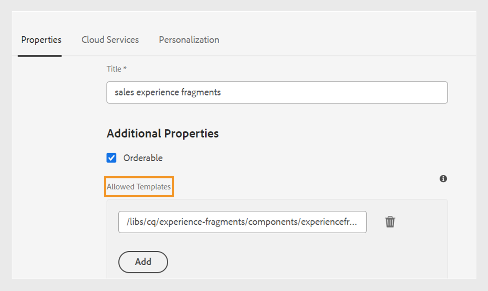
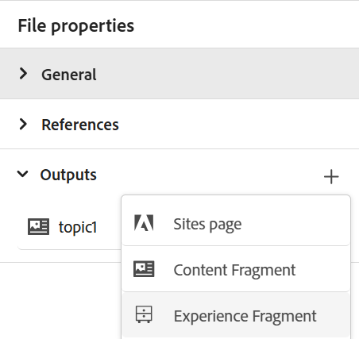
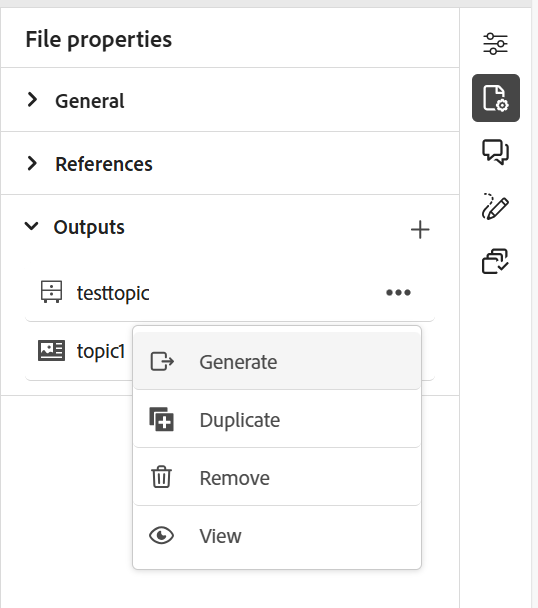

# エクスペリエンスフラグメントを公開

エクスペリエンスフラグメントは、Adobe Experience Managerのモジュラーコンテンツの一部です。 これらのコンテンツブロックはテンプレートにもとづいており、コンテンツとそのレイアウトの両方をカプセル化します。 こうした再利用可能なコンテンツにより、コンテンツ制作者は、Experience Managerがサポートする複数のチャネルをまたいで、一貫性のあるスケーラブルなエクスペリエンスを組み立てて提供することができます。 ニュースレター、プロモーションバナー、顧客の声など、一貫したマーケティング体験を効率的に容易に構築できます。

Experience Manager Guidesを使用すると、トピックまたはそのエレメントをエクスペリエンスフラグメントに公開できます。 エクスペリエンスフラグメント内のトピックとその要素の間に、JSON ベースのマッピングを作成できます。 次に、マッピングを使用して、トピックまたはその要素をエクスペリエンスフラグメントに公開します。 その後、任意のExperience Manager サイトでエクスペリエンスフラグメントを使用するか、エクスペリエンスフラグメントでサポートされているAPIを介して詳細を抽出できます。

エクスペリエンスフラグメントを生成するには、次の手順を実行します。

1. エクスペリエンスフラグメントでフォルダーを作成します。 このフォルダーを使用して、エクスペリエンスフラグメントテンプレートに基づいて作成したエクスペリエンスフラグメントを保存します。 例：*sales-experience-fragments*。
1. フォルダーを選択し、上部から「**プロパティ**」アイコンを選択します。
1. フォルダーのプロパティを編集します（例：*sales-experience-fragments*）。

   * **タイトル**: フォルダーのタイトルを表示または編集します。

   * **許可されたテンプレート**: エクスペリエンスフラグメントの子ページとして追加できるテンプレートのリストが含まれます。 許可されたテンプレートを追加するには、**許可されたテンプレート** フィールドで必要なテンプレートを取得するための正規表現を指定します。
例：
     `/libs/cq/experience-fragments/components/experiencefragment/template`

     フォルダーに許可されるテンプレートを定義しない場合、テンプレートはデフォルトで親フォルダーまたはテンプレートフォルダーから選択されます。
   * **順序可能**: フォルダー内のアセットの順序を変更できます。
     {width="650"}
     *フォルダープロパティにクラウド設定を追加して、フラグメントテンプレートに接続します。*
1. エクスペリエンスフラグメントを生成するには、トピックの&#x200B;**ファイルプロパティ**&#x200B;の&#x200B;**出力** セクションから&#x200B;**新規出力** を選択します。
1. 「**エクスペリエンスフラグメント**」を選択します。\
   {width="300"}

   *トピック*&#x200B;のファイル プロパティから新しいエクスペリエンスフラグメントを追加します。

   >[!NOTE]
   >
   > **リポジトリビュー**&#x200B;からエクスペリエンスフラグメントを公開することもできます。 エクスペリエンスフラグメントとして公開するトピックを選択します。 次に、**オプション** メニューから、**別名で公開** > **エクスペリエンスフラグメント**&#x200B;を選択します。

1. **エクスペリエンスフラグメントを生成** ダイアログボックスで、次の詳細を入力します。
   {width="500"}

   *パス、テンプレート、およびマッピングの詳細を追加して、トピックまたはその要素をエクスペリエンスフラグメントとして公開します。 既存のエクスペリエンスフラグメントを上書きできます。*

   * **パス**: エクスペリエンスフラグメントを公開するフォルダーのパスを参照して選択します。 既存のエクスペリエンスフラグメントを選択して再公開することもできます。
   * **タイトル**: エクスペリエンスフラグメントのタイトルを入力します。 デフォルトでは、タイトルにはトピックのタイトルが入力されます。 編集することもできます。 このタイトルは、エクスペリエンスフラグメントの名前を生成するために使用されます。
   * **名前**: エクスペリエンスフラグメントの名前を入力します。 デフォルトでは、名前にはトピックのタイトルが入力され、スペースは「_」に置き換えられます。 例：*sample_experience_fragment*。 編集することもできます。 この名前は、エクスペリエンスフラグメントのURLを生成するために使用されます。
   * **テンプレート**: エクスペリエンスフラグメントの作成に使用するエクスペリエンスフラグメントテンプレートを選択します。 テンプレートは、プロパティで設定したフォルダーから選択されます。
   * **マッピング**: *experienceFragmentMapping.json* ファイルからマッピングを選択して表示します。

     管理者は、*experienceFragmentMapping.json* ファイルにマッピングを追加できます。  トピックとエクスペリエンスフラグメント ](../cs-install-guide/conf-experience-fragment-mapping-cs.md)の間のマッピングを[作成する方法については、インストールおよび設定ガイドを参照してください。

   * また、コンテンツを公開する様々な条件を選択することもできます。  次のいずれかのオプションを選択します。

      * **なし**：公開された出力に条件を適用しない場合は、このオプションを選択します。
      * **DITAVALの使用**: パーソナライズされたコンテンツを生成するDITAVAL ファイルを選択します。 DITAVAL ファイルは、参照ダイアログまたはファイルパスを入力して選択できます。
      * **属性の使用**: DITA トピックで条件属性を定義できます。 次に、関連するコンテンツを公開する条件属性を選択します。

     >[!NOTE]
     > 
     >条件は、トピックで条件属性が定義されている場合にのみ有効になります。

   * エクスペリエンスフラグメントが既に存在し、それを上書きする場合は、「**既存のコンテンツを上書き**」チェックボックスを選択します。 チェックボックスを選択しておらず、エクスペリエンスフラグメントが既に存在する場合は、Experience Manager Guidesにエラーが表示されます。
1. 「**生成**」を選択して、エクスペリエンスフラグメントを公開します。
1. トピックのエクスペリエンスフラグメントは、**ファイルプロパティ**&#x200B;の&#x200B;**出力** セクションで表示できます。 エクスペリエンスフラグメントは、公開日時に応じて表示され、最新のものが最初に表示されます。

   {width=300}

   *トピックに存在するエクスペリエンスフラグメントを表示し、再公開します。*

エクスペリエンスフラグメントを公開したら、任意のAdobe Experience Manager サイトでも使用できます。

## エクスペリエンスフラグメントのオプションメニュー

**オプション** メニューから、エクスペリエンスフラグメントに対して次のアクションを実行することもできます。

* **生成**: エクスペリエンスフラグメントを再公開して、DITA トピックの最新のコンテンツで更新します。 出力を再生成する場合、エクスペリエンスフラグメントのパス、名前、タイトル、テンプレートを変更することはできません。 ただし、出力を再生成する際に、異なる条件を選択できます。

* **重複**: エクスペリエンスフラグメントを複製します。 パス、名前、タイトル、テンプレートを変更できます。 また、エクスペリエンスフラグメントを複製する際に、異なる条件を選択することもできます。

* **削除**：出力リストからエクスペリエンスフラグメントを削除します。 確認プロンプトが表示されます。 確認すると、エクスペリエンスフラグメントが&#x200B;**出力** リストから削除されます。 ただし、エクスペリエンスフラグメントはフォルダーから削除されません。

* **表示**: エクスペリエンスフラグメントエディターを表示します。 また、変更を加えて保存することもできます。
