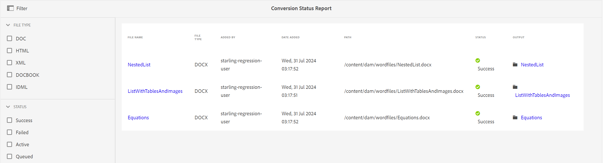

# コンバージョンステータスレポート {#id205BBA00WZZ}

Adobe Experience Manager Guidesには、様々なフォーマットの文書を DITA に変換する堅牢な変換機能が用意されています。 コンバージョンステータスレポートは、Experience Manager Guidesで実行されるすべてのコンバージョンタスクの統合ビューを提供します。

コンバージョンステータスレポートを表示するには、次の手順を実行します。

1. 上部の「Adobe Experience Manager」ロゴを選択し、「**ツール**」を選択します。

1. ツールのリストから **ガイド** を選択します。

1. **コンバージョンステータスレポート** タイルを選択します。

   コンバージョンステータスレポートは、システムで実行されるすべてのコンバージョンタスクに対して表示されます。

   {align="left"}

1. レポートページは次の 2 つの部分に分かれています。

   - **フィルター：**

     ファイルタイプとコンバージョンステータスに基づいて、レポートデータをフィルタリングできます。 [ ファイルの種類 ] では、Word 文書、構造化HTML、XML、DocBook、および IDML 形式の文書のレポート データを表示できます。 ステータスでは、正常、失敗、アクティブ、キューに入れられたタスクのレポートデータを表示するように選択できます。

     次のスクリーンショットは、成功ステータスを持つコンバージョンタスクのレポートデータを示しています。

     {align="left"}

   - **レポートデータ：**

     レポートデータには、次の列が含まれます。

      - **ファイル名**：変換プロセスが実行されたソースファイルの名前 ファイル名リンクを選択すると、ソースドキュメントの場所に移動します。

      - **ファイル形式**：ソース文書の種類。Word、構造化HTML、XML、IDML、DocBook などがあります。

      - **追加者**：コンバージョンタスクを実行したユーザーの名前

      - **追加日**：タスクが実行された日付。 「追加日」リンクを選択すると、ログファイルがダウンロードされます。

      - **パス**：ソースドキュメントの完全なパス。

      - **ステータス**：コンバージョンタスクのステータス（成功、失敗、アクティブ、待機中）。

      - **出力**：正常に変換されたドキュメントのパス。 出力リンクを選択すると、出力が保存されている場所に移動します。

**親トピック：**&#x200B;[ レポートの概要 ](reports-intro.md)
