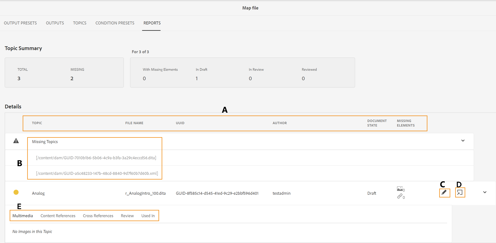
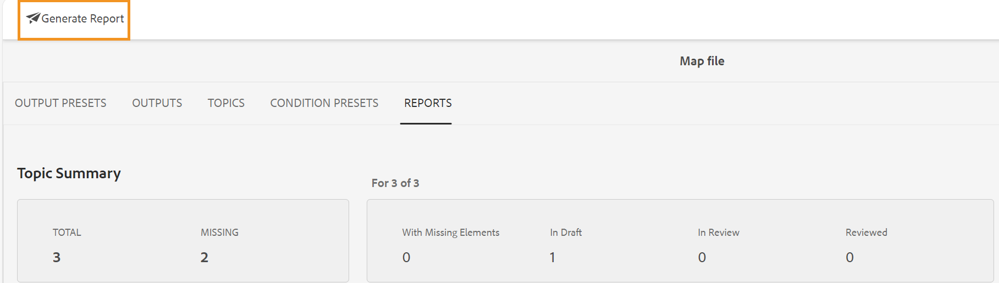

# マップダッシュボードのDITA マップレポート {#id205BB800EEN}

Adobe Experience Manager Guidesでは、ドキュメントが公開される前やエンドユーザーが利用できる前に、ドキュメントの全体的な整合性を確認するためのレポート機能を管理者に提供します。 Experience Manager GuidesのマップダッシュボードのDITA マップレポートには、欠けているトピック、欠けている要素があるトピック、参照トピックとメディアファイルのUUID、各トピックのレビューステータスなどの貴重な情報が提供されます。 また、個々のトピックレベルの詳細なレポートでは、コンテンツ参照や画像の欠落や相互参照など、DITA コンテンツに関連する情報も提供されます。

>[!NOTE]
>
>Experience Manager Guidesは、マップファイルの変更につながるすべてのイベント、またはトピックファイル内の参照が更新されるたびに、このレポートを更新します。

DITA マップレポートを表示するには、次の手順を実行します。

1. Assets UIで、レポートを表示するDITA マップファイルに移動して選択します。

1. 「**レポート**」を選択します。

   

   レポートページは、次の2つの部分に分かれています。

   - **トピックの概要：**

     選択したマップファイルの全体的な概要を一覧表示します。 概要を見ると、マップ内のトピックの総数、欠けているトピックの数、欠けている要素があるトピックの数、トピックの状態（ドラフト、レビュー中、レビュー中）をすばやく確認できます。

   - **詳細：**

     トピックを選択すると、選択したトピックの詳細レポートが表示されます。

     

     **A**、**B**、**C**&#x200B;および&#x200B;**D**&#x200B;でハイライト表示されている項目について次に説明します。

      - **トピック**: DITA マップで指定されたトピックのタイトル。 トピックのタイトルの上にマウスポインターを置くと、トピックの完全なパスが表示されます。 参照の欠落や画像など、トピックに問題がある場合は、トピックのタイトルの前に赤いドットが表示されます。

      - **ファイル名**: ファイル名。

      - **UUID**: ファイルのユニバーサル一意の識別子\（UUID\）。

      - **作成者**：このトピックで最後に作業したユーザー。

      - **ドキュメントの状態**：ドキュメントの現在の状態 – ドラフト、レビュー中またはレビュー済み。

      - **不足している要素**：不足している画像または壊れている相互参照がある場合は、その数を一覧表示します。

      - **見つからないトピック \（B\）**：参照が壊れているトピックがある場合、それらのトピックは「見つからないトピック」リストの下にリストされます。

      - **Framemaker \（C\）**&#x200B;で開く：見つからない画像または壊れた相互参照がある場合は、その数を一覧表示します。

      - **エディターで開く\（D\）**：このアイコンを選択すると、エディターでトピックが開きます。

   **E**&#x200B;で強調表示されている項目は次のとおりです。

   - **マルチメディア**: トピックで使用される画像のパスが、そのUUIDと共に表示されます。 画像パスを選択すると、対応する画像がポップアップウィンドウで開きます。 壊れた画像リンクは赤色で表示されます。

   - **コンテンツ参照**: トピックで参照されているコンテンツのパスが、そのUUIDと共に表示されます。 参照されたコンテンツのタイトルを選択すると、対応するトピックがプレビューモードで開きます。

   - **相互参照**：相互参照されたコンテンツのパスが、そのUUIDと共に表示されます。 参照されたコンテンツのタイトルを選択すると、対応するトピックがプレビューモードで開きます。 壊れた相互参照は赤色で表示されます。

   - **レビュー**: トピックのレビュータスクのステータスを表示します。 レビュー中のトピックのステータス \（開封日またはクローズ日）、期日、担当者を表示できます。 トピックリンクを選択すると、レビューモードでトピックが開きます。

   - **使用済み**: トピックが使用されている他のトピックまたはマップのリストを表示します。 このようなトピックとマップのUUIDも一覧表示されます。

管理者は、個々のトピックのレポートだけでなく、DITA マップの公開履歴などの情報にもアクセスできます。 生成された出力の履歴について詳しくは、[出力生成タスクのステータスの表示](generate-output-for-a-dita-map.md#viewing_output_history) セクションを参照してください。

## DITA マップレポートのCSVを生成

DITA マップレポートのCSVをダウンロードしてエクスポートできます。 CSVには、詳細なDITA マップレポートが含まれます。

DITA マップレポートのCSVを生成するには、次の手順を実行します。

1. 左上の「**レポートを生成**」を選択して、DITA マップレポートを生成します。

   

1. レポートをダウンロードする準備ができたら、通知が届きます。 生成されたレポートのCSVをダウンロードするには、**ダウンロード**&#x200B;を選択します。

   {width="550"}

   生成されたレポートのCSVは、後でExperience Manager通知インボックスからダウンロードすることもできます。

   インボックスで生成されたレポートを選択して、レポートをダウンロードします。

   {width="300"}

レポートがインボックスにダウンロードされたら、レポートを選択し、上部の「開く」アイコンを使用して、選択したレポートを開くこともできます。

**親トピック：**&#x200B;[&#x200B; レポートの概要](reports-intro.md)
