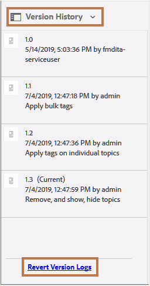

# 復帰ファイルのバージョン履歴レポート {#id205BBC00PRK}

複数の作成者と同時に複数のリリースを扱う場合、コンテンツには複数のバージョンが割り当てられます。 複数のリリースに共通の情報があり、作成者がプロジェクトで使用する場合があります。 このような作業の割り当てを処理するために、作成者はファイルの複数のバージョンで終わる可能性があります。 そのようなバージョンは、単に新しいバージョンのファイルにすることも、以前のバージョンに戻すこともできます。 ファイルがいつ取り消されたのか、その理由を特定するのは複雑な作業です。

Adobe Experience Manager Guidesでは、個々のファイルまたはフォルダー内のすべてのファイルのバージョン履歴レポートを生成できます。 このバージョン履歴を使用すると、元に戻されたファイルのすべてのバージョンと、それらのバージョンを作成したユーザー、およびそれらのバージョンを作成した理由を統合ビューで確認できます。

このレポートには、次の場所からアクセスできます。

- **Assets UI**：ファイルを選択し、左側のパネルから&#x200B;**バージョン履歴**&#x200B;を開きます。 **バージョン履歴** ビューには、パネルの下部にある「**バージョンログを元に戻す**」リンクが含まれています。 このリンクを選択すると、選択したファイルの元に戻されたバージョンの履歴が表示されます。

  {width="300"}

- **トピックのプレビュー**：トピックをプレビューする際に、左側のパネルから&#x200B;**バージョン履歴** パネルを表示することもできます。 Assets UIに似たパネルが表示されます。このパネルから「**バージョンログを復元**」リンクを選択して、アクティブなドキュメントの元に戻されたバージョン履歴にアクセスできます。

- **Adobe Experience Manager ツール セクション**：このレポートには、Experience Manager ツール セクションからもアクセスできます。 次の手順では、Experience Manager ツール セクションからバージョン履歴を復元する方法について説明します。

「履歴を戻す」レポートにアクセスするには、次の手順を実行します。

1. 上部の「Adobe Experience Manager」ロゴを選択し、「**ツール**」を選択します。

1. ツールのリストから「**ガイド**」を選択します。

1. 「**バージョン復元履歴**」タイルを選択します。

   空白の「バージョン履歴を戻す」ページが表示され、レポートを生成するファイルまたはフォルダーを参照して選択する必要があります。

1. **ログを表示**&#x200B;を選択して、選択したファイルまたはフォルダーのレポートを生成します。

   

   このレポートには、次の詳細が含まれています。

   - **ファイル名**: トピックのタイトル。 トピックのタイトルリンクを選択すると、トピックのプレビューが開きます。

   - **タイムスタンプ**: トピックが以前のバージョンに戻された日時。

   - **ユーザー**：以前のバージョンに戻したユーザーの名前。

   - **復元元**：復元元ファイルの元のバージョン番号。

   - **復元先**: ファイルが復元先のバージョン。

   - **コメント**: ファイルを元に戻したユーザーが行ったコメントです。

**親トピック：**[ レポートの概要](reports-intro.md)
