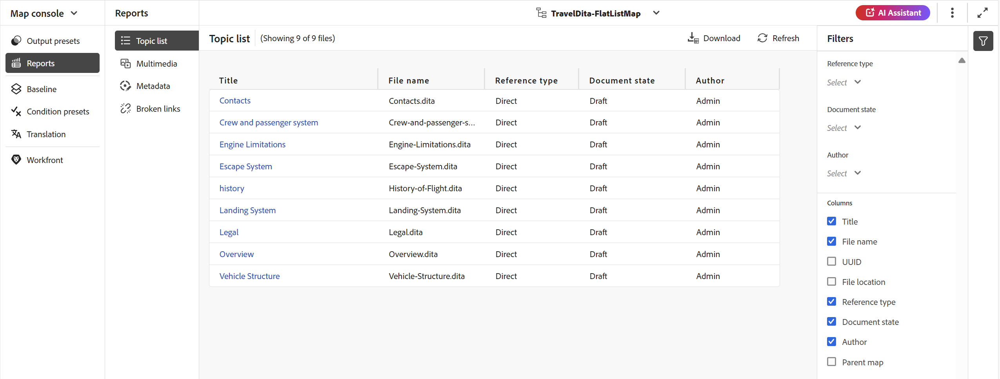
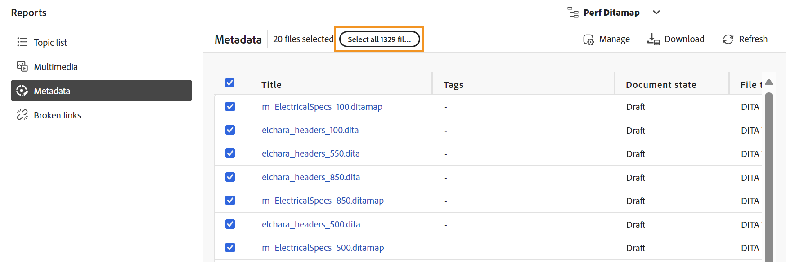
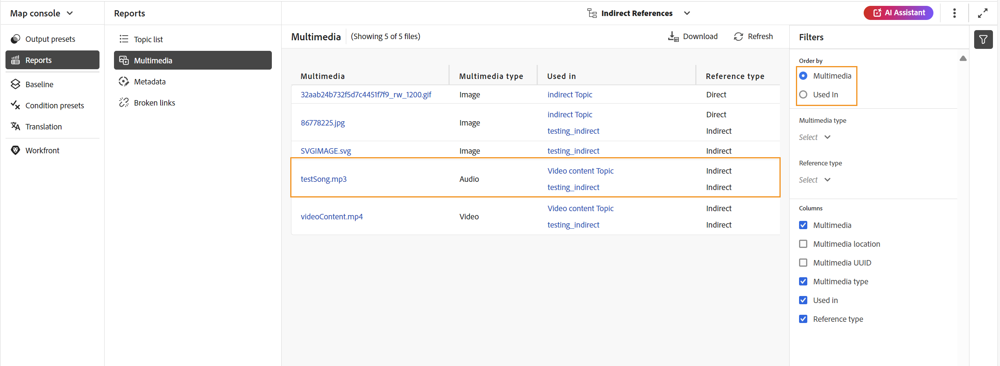

# マップコンソールからの DITA マップレポート {#id231HF0Z0NXA}

Adobe Experience Manager Guidesにはマップ コンソールの機能が付属しており、マップの全体的な整合性を確認し、レポートを生成できます。

トピック リストを表示したり、すべての参照のメタデータを管理したり、マルチメディア リストを表示したり、現在のマップのすべての壊れたリンクをマップ コンソールの [**レポート**] タブから修正することができます。このタブには次のようにアクセスできます。

1. **リポジトリ** パネルで、DITA マップファイルをマップビューで開きます。

   >[!NOTE]
   >
   > ホームページの左上にあるドロップダウンから、「**マップコンソール**」タブで直接 DITA マップを開くこともできます。

1. **マップ コンソールで開く** アイコンを選択します。

   {width="600" align="left"}

1. 左パネルから **レポート** を選択します。

**レポート** パネルから 4 つのレポートをすべて見つけることができます。 要件に基づいて、次に示すように任意のレポートを選択できます。

{align="left"}

レポートパネルでは、4 種類のレポートにアクセスできます。 各レポートとそのアクセシビリティおよび機能については、以下で詳しく説明します。

## トピックリストレポート

**トピックリスト** レポートは、参照タイプ、ドキュメントの状態、作成者など、トピックに関する詳細情報を提供します。

マップのトピックリストレポートを表示するには、次の手順に従います。

1. レポートパネルから **トピックリスト** を選択します。 DITA マップに存在するトピックのリストが表示されます。

   {align="left"}

1. **フィルター** パネルでは、トピックを **参照タイプ** \（直接または間接\）、**ドキュメントの状態** \（トピックが編集中、レビュー中またはレビュー済みの状態の場合は、リスト\）または **作成者** に基づいてフィルタリングできます。

   >[!NOTE]
   >
   > すべてのフィルターは、システムに存在するオプションの完全なリストを提供します。

1. また、次のトピックのフィルタリングオプションを使用して、リストに次の列を表示するように選択することもできます。

   - **タイトル** トピックのタイトルは DITA マップで指定されます。 トピックを選択して編集できます。
   - **ファイル名** ファイルの名前。
   - **UUID** ファイルのユニバーサル固有識別子\（UUID\）。
   - **ファイルの場所** トピックの完全パス。
   - **参照タイプ** 参照のタイプ（直接または間接）。
   - **ドキュメントの状態** トピックの状態。
   - **作成者** トピックに対して最後に作業したユーザー。 リストはページ分割され、非同期で読み込まれ、一度に限られたユーザーセットが表示され、スクロールしたり移動したりすると、さらに多くのユーザーが取得されます。 これにより、特に多数のユーザーを扱う場合に、読み込み速度と全体的なパフォーマンスが向上します。
   - **親マップ** トピックが直接参照されているすべてのマップのリスト。
   >[!NOTE]
   >
   > [**更新**] を選択すると、トピックのリストが更新され、マップ ファイル内の変更や、トピック ファイル内の参照が更新された場合に表示されます。

1. 「**ダウンロード**」を選択して、DITA マップ内のすべてのトピックのスナップショットをダウンロードします。 Excel シートには、選択した列と、**トピック リスト** ビューでフィルタされたトピックが含まれています。

## メタデータレポート

**メタデータレポート** は、参照タイプ、文書状態、タグ、ファイルの場所など、現在の DITA マップ内の参照の詳細レポートを提供します。

マップのメタデータレポートを表示するには、次の手順を実行します。

1. レポートパネルから **メタデータ** を選択します。 マップのすべての参照のリストが、そのメタデータ（タグ、ドキュメントの状態、カスタムメタデータなど）と共に表示されます。 新しいカスタムメタデータ列を追加するには、[ カスタムメタデータ列の追加 ](#add-custom-metadata-columns) の節を参照してください。

   {align="left"}

1. **フィルター** パネルでは、**ドキュメントの状態** \（例えば、トピックが編集、レビュー中またはレビュー済みの状態の場合、これらはリスト\）、**参照** \（直接または間接\）、**ファイルタイプ** \（Map, Topic, Document, Image, Video and Others\）に基づいてトピックをフィルタリングできます。

   >[!NOTE]
   >
   > すべてのフィルターは、システムに存在するオプションの完全なリストを提供します。

1. また、**タグのないファイル** のみを表示するように選択したり、**タグ** フィルターから特定のタグを選択して関連付けられたファイルを表示したりすることもできます。
1. また、次のトピックのフィルタリングオプションを使用して、メタデータリストに次の列を表示するように選択することもできます。
   - **タイトル** \（デフォルトで選択\）参照ファイルのタイトルは DITA マップで指定されます。 編集するファイルを選択できます。

     >[!NOTE]
     >
     > チェックアウト済みファイルのタイトルの近くに、チェックアウト済みアイコンも表示されます。 アイコンの上にマウスポインターを置くと、ユーザーの名前が表示されます。

   - **ファイル名** ファイルの名前。
   - **ファイルの場所** ファイルの完全パス。
   - **UUID** ファイルのユニバーサル固有識別子\（UUID\）。
   - **タグ**\（デフォルトで選択\）ファイルに適用されるタグ。

     >[!NOTE]
     >
     > デフォルトでは、1 つのファイルに対して 2 つのタグを表示できます。 さらにタグを表示するには、「**さらに表示**」を選択します。 **表示を減らす** を選択して、リストを再度縮小します。

   - **ドキュメントの状態** \（デフォルトで選択\）参照ファイルの現在の状態。
   - **参照タイプ** 参照のタイプ（直接または間接）。
   - **ファイルタイプ** \（デフォルトで選択\）ソースファイルのタイプ。 使用できるオプションは、マップ、トピック、画像です。
   - **ロック元** ファイルをロックしたユーザー。

1. 「**ダウンロード**」を選択して、DITA マップ内のすべての参照のスナップショットをダウンロードします。 Excel シートには、選択した列と、**メタデータ** ビューでフィルタリングされた参照が含まれています。

### メタデータレポートからのメタデータの一括管理

個々のトピックにタグを適用したり、一括タグ付け機能を使用して、複数のトピック、DITA マップ、またはサブマップに複数のタグを適用できます。 選択したすべてのトピックのドキュメント状態を、次に使用可能な共通ドキュメント状態に変更することもできます。

### メタデータを更新

メタデータを更新するには、次の手順を実行します。

1. メタデータを更新するには、更新するファイルを選択します。 メタデータパネルに表示されるファイルを選択するには、**タイトル** の横に表示されるチェックボックスをオンにします。 すべてのレコードを選択する場合は、以下に示すように、タイトルバーの上にある **すべてを選択** タブを使用します。

   >[!NOTE]
   >
   > チェックアウトしたファイルは選択できません。 チェックアウト済みファイルのタイトルの近くに、チェックアウト済みアイコンも表示されます。 アイコンの上にマウスポインターを置くと、ユーザーの名前が表示されます。

   {align="left"}

1. 上部の「**管理**」を選択します。

   {width="350" align="left"}

1. 新しいタグを追加する場合は、ドロップダウンリストから「新しいタグ」を選択し、選択したすべてのトピックに適用します。 タグの近くにある十字アイコンを選択して、タグを削除することもできます。

   >[!NOTE]
   >
   > 選択したすべてのトピックに適用されている共通のタグが一覧表示されます。

1. 選択したすべての参照のドキュメント状態を変更する場合は、新しいドキュメント状態を選択します。 ドロップダウンには、選択したすべてのトピックに共通する可能な状態が表示されます。 例えば、トピックの現在の状態がレビュー中の場合は、ドラフト、承認済み、またはレビュー済みの状態を表示できます。
1. 「**更新**」を選択して、メタデータを更新します。 正常に更新されたか、更新に失敗したかに関わらず、メタデータに対する確認メッセージが表示されます。 また、**レポートをダウンロード** を選択して、レポートのスナップショットをダウンロードすることもできます。 このスナップショットには、選択した参照の更新ステータスの詳細が含まれます。

### カスタムメタデータ列の追加

この機能を使用すると、要件に応じてカスタムメタデータ列を追加し、それをメタデータレポートに表示できます。 また、メタデータレポートの柔軟性が向上します。 新しいカスタムメタデータ列を追加するには、次の手順を実行します。

1. カスタムメタデータ列を追加するには、メタデータページの右上隅にある 3 つのドットから「**Workspace設定**」（**オンプレミス** の場合は **設定** として表示）を選択します。

   {width="600" align="left"}

1. 表示されるポップアップの左側のパネルで「**メタデータ**」を選択します。
1. 「**追加** タブを使用して、要件に応じて新しいカスタムメタデータフィールドを追加します。

   {width="600" align="left"}

1. メタデータレポートの列に追加する特定のメタデータパスと、そのパスに適したタイトルを指定します。 例えば、タイトル言語と特定のパスを含むカスタムメタデータが追加されるとします。

   >[!NOTE]
   >
   > 特定のメタデータ列を削除する場合は、表示されるリストから削除できます。 さらに、**ラベル** を編集して、列の表示タイトルを変更できます。

   {width="600" align="left"}

1. メタデータ表示の **保存** と **更新** を選択します。 フィルターパネルの列のリストに新しいカスタム列 **言語** が追加されます。

   >[!NOTE]
   >
   > 新しいメタデータ列の追加は、エディターの **バージョン履歴** パネルにも反映されます。 詳しくは、**[メタデータ](web-editor-features.md)** を参照してください。

   {width="600" align="left"}

同様に、前述の手順に従って、メタデータレポートで必要な要件に基づいて、新しいカスタムメタデータフィールドを追加できます。

## マルチメディアレポート

**マルチメディア** レポートには、タイトル、タイプ \（audio, video, and images\）、マルチメディアが使用されているファイル、およびマルチメディアが使用されているファイルの参照タイプなど、マップで使用されているマルチメディアに関する詳細情報が表示されます。 また、リポジトリー内の UUID とマルチメディアの場所を表示することもできます。 次の手順を実行して、マルチメディアのレポートを表示できます。

1. レポートパネルから **マルチメディア** を選択します。 DITA マップに存在するマルチメディアのリストが表示されます。
1. **フィルター** パネルから、マルチメディア別または参照で使用されるの名前別にリストを並べ替えることができます。

   - **マルチメディア** で並べ替えると、最初の列にマルチメディアの名前が表示され、そのマルチメディアを使用したすべての参照の名前が同じ行の別の列に表示されます。 例えば、次のスクリーンショットは、最初の列にマルチメディア testSong.mp3 を示しており、それを使用する 2 つの参照が同じ行の 3 番目の列に表示されています。

     {width="650" align="left"}

   - **Used In** 列で並べ替えると、転置ビューが表示されます。このビューでは、マルチメディアが使用された参照の名前が最初の列に表示され、マルチメディアの名前が別の行の別の列に表示されます。 例えば、次のスクリーンショットは、2 つの参照\（testing_indirect と Video content Topic\）の名前を最初の列で示し、マルチメディアの testSong.mp3 は 2 つの異なる行の 3 番目の列で表示しています。

     {width="650" align="left"}

1. **マルチメディアタイプ** と **参照タイプ** に基づいてマルチメディアをフィルタリングできます。 ドロップダウンでの選択に基づいて、マルチメディアファイルのリストが表示されます。 たとえば、DITA マップ内のオーディオ参照のみを表示するように選択したり、ファイルに使用されているオーディオ参照のみを表示することができます。

1. また、次のフィルタリングオプションを使用して、リストに次の列を表示するように選択することもできます。

   - **マルチメディア**\（デフォルトで選択\）マルチメディアのタイトルは DITA マップで指定されます。 マルチメディアを選択して編集できます。
   - **マルチメディアの場所** マルチメディアの完全なパス。
   - **マルチメディア UUID** ファイルのユニバーサル固有識別子\（UUID\）。
   - **マルチメディアの種類** \（デフォルトで選択\）マルチメディアの種類。 使用できるオプションは、オーディオ、ビデオまたは画像です。
   - **使用**\（デフォルトで選択\）マルチメディアが使用された参照。 参照を選択して編集できます。
   - **参照タイプ**\（デフォルトで選択\）参照のタイプ（直接または間接）。
   >[!NOTE]
   >
   > **更新** を選択して、マルチメディアの新しいリストを取得し、マップファイル内の変更を表示するか、DITA マップ内のマルチメディアが更新された場合に表示します。

1. 「**ダウンロード**」を選択して、DITA マップ内のすべてのマルチメディアのスナップショットをダウンロードします。 Excel シートには、選択した列と、**マルチメディア** ビューでフィルタ処理されたマルチメディアが含まれています。

## 壊れたリンクのレポート

**リンク切れ** は、現在のマップに存在するリンク切れの詳細を示す便利なレポートです。 DITA トピック、マルチメディアファイル参照、コンテンツキー参照などのリンク切れを表示できます。 また、ここでそれらを修正する機能もあります。
このレポートには、壊れたリンク、リンクの種類、参照が使用されているファイル、使用されているファイルの種類などの詳細情報が表示されます。
次の手順を実行すると、壊れたリンクのレポートを表示できます。

1. レポートパネルから **壊れたリンク** を選択します。 DITA マップに存在するリンク切れまたは参照のリストが表示されます。
1. **フィルター** パネルでは、リンク別または参照で使用されるの名前別にリストを並べ替えることができます。

   - **壊れたリンク** で並べ替えると、壊れたリンクのパスが最初の列に表示され、それらが使用されているすべての参照の名前が別の行の別の列に表示されます。 同じ壊れたリンクが複数のファイルで使用されている場合は、1 行に表示され、グループ化またはサブ行として表示されます。 例えば、次のスクリーンショットは、最初の列と `m_ElectricalSpecs_900.ditamap` れらが使用される参照で 2 つの壊れたリンクを示しており、3 番目の列で 2 つの異なる行に表示されています。

   {align="left"}

   - **Used in** 列で並べ替えると、リンク切れを使用した参照の名前が最初の列にリストされ、リンク切れが同じ行の別の列にリストされる転置ビューが表示されます。 例えば、次のスクリーンショットは、（壊れたリンクが使用されている）参照 `m_ElectricalSpecs_900.ditamap` 最初の列に表示され、壊れたリンクは同じ行の 3 番目の列に表示されます。

   {align="left"}

1. **ファイルタイプ** と **リンクタイプ** に基づいて、壊れたリンクをフィルタリングできます。 ドロップダウンでの選択に基づいて、壊れたリンクのリストが表示されます。 たとえば、DITA マップ内のコンテンツ参照のみを表示するように選択できます。また、ファイルには、そのファイルで使用されている壊れたコンテンツ参照のみが表示されます。

   「リンクタイプ」ドロップダウンには「DITA トピック」、「DITA Map」、「ファイル参照」、「キー参照」、「コンテンツ参照」、「コンテンツキー参照」、「画像参照」、「マルチメディアファイル参照」、「マルチメディアキー参照」の値が使用可能で、「**ファイルタイプ** **」ドロップダウンには「DITA トピック」、「DITA Map」、「文書」、「画像」、「ビデオ」、「オーディオ」、「その他」の値が使用可能** す。
1. また、次のフィルタリングオプションを使用して、リストに次の列を表示するように選択することもできます。

   - **リンク切れ** （デフォルトで選択） リンク切れのパスは DITA マップで指定されます。

   - **リンクタイプ** （デフォルトで選択）リンクのタイプ。 使用可能なオプションは、「DITA トピック」、「DITA マップ」、「ファイル参照」、「キー参照」、「コンテンツ参照」、「コンテンツキー参照」、「イメージ参照」、「マルチメディアファイル参照」、「マルチメディアキー参照」です。

   - **使用** （デフォルトで選択）切断リンクが使用された参照。 参照を選択すると、オーサーモードで表示できます。

   - **ファイルタイプ** （デフォルトで選択）参照のタイプ - DITA Topic、DITA Map、Document、Image、Video、Audio、Others。

   **更新** を選択すると、壊れたリンクの新しいリストが表示され、マップ ファイル内の変更や DITA マップ内の壊れたリンクが更新された場合に表示されます。
1. **リンクを修正** アイコン（）を選択して、壊れたリンクを修正できます。

   >[!NOTE]
   >
   > 「リンク切れ」列の下のリンク切れパスにポインタを合わせると、「リンクを修正（）」アイコンが表示されます。

   **壊れたリンク** または **使用されている場所** で注文した場合、両方のビューでリンクを修正できます。

   >[!NOTE]
   >
   > 壊れたリンクで注文している間に壊れたリンクを修正すると、そのリンクが使用されているすべてのファイル（1 行にグループ化されているファイル）でリンクが修正されます。

1. **リンクを更新** ダイアログで、必要な参照の詳細を更新する必要があります。 **リンクを更新** ダイアログで必要な詳細は、参照のタイプによって異なります。\
   リンクを修正すると、壊れたリンクのリストの下に表示されなくなります。 代わりに、トピックリストまたはメタデータで表示できます。

1. 「**ダウンロード**」を選択して、DITA マップ内のすべての壊れたリンクのスナップショットをダウンロードします。 Excel ファイルには、選択した列と、[ リンク切れ ] ビューでフィルタ処理されたリンク切れが含まれています。

**親トピック：**[ レポートの概要 ](reports-intro.md)
