# マップコンソールからのDITA マップレポート {#id231HF0Z0NXA}

Adobe Experience Manager Guidesには、マップコンソールの機能が備わっており、マップの全体的な整合性を確認し、レポートを生成できます。

トピックリストの表示、すべての参照のメタデータの管理、マルチメディアリストの表示、現在のマップの壊れたリンクの修正は、マップコンソールの「**レポート**」タブから行うことができます。このタブには、次のようにアクセスできます。

1. **リポジトリ** パネルで、マップビューでDITA マップファイルを開きます。

   >[!NOTE]
   >
   > DITA マップは、ホームページの左上にあるドロップダウンから&#x200B;**マップコンソール** タブで直接開くこともできます。

1. 「**マップコンソールで開く**」アイコンを選択します。

   {width="600"}

1. 左側のパネルから「**レポート**」を選択します。

4つのレポートはすべて、**レポート** パネルから検索できます。 必要に応じて、次に示すように、任意のレポートを選択できます。

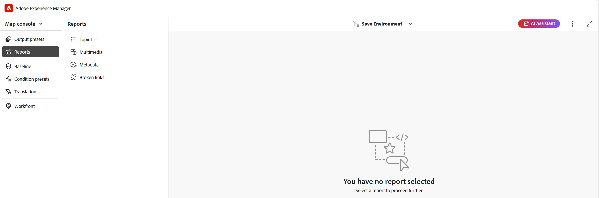

レポートパネルでは、4種類の異なるタイプのレポートにアクセスできます。 各レポートについて、アクセシビリティと機能に加えて、以下で詳しく説明します。

## トピックリストレポート

**トピックリスト** レポートには、参照タイプ、ドキュメントの状態、作成者など、トピックに関する詳細な情報が表示されます。

マップのトピックリストレポートを表示するには、次の手順を実行します。

1. レポートパネルから「**トピックリスト**」を選択します。 DITA マップに存在するトピックのリストが表示されます。

   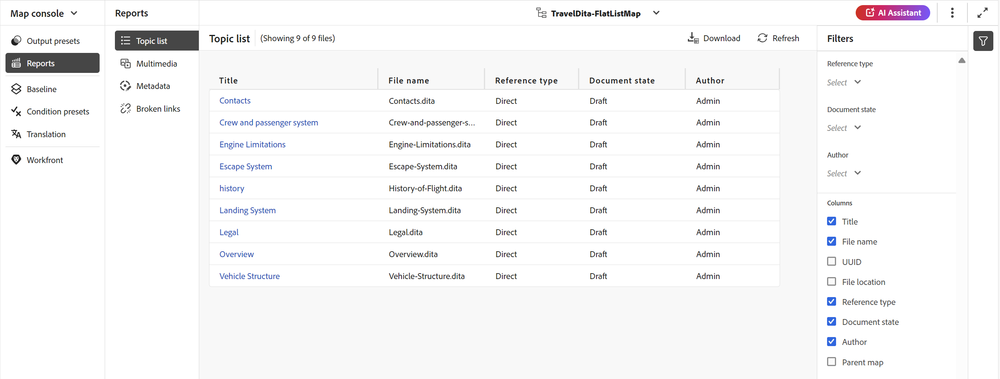

1. **フィルター** パネルから、**参照タイプ** \（直接または間接\）、**ドキュメントの状態** \（例えば、トピックが編集、レビュー中、またはレビュー済みの状態の場合は、トピックの&#x200B;**作成者**）に基づいてトピックをフィルタリングできます。

   >[!NOTE]
   >
   > すべてのフィルターには、システムに存在するオプションの包括的なリストが表示されます。

1. 次のトピックフィルタリングオプションを使用して、リストに次の列を表示することもできます。

   - **タイトル** トピックのタイトルは、DITA マップで指定されます。 トピックを選択して編集できます。
   - **ファイル名** ファイル名。
   - **UUID** ファイルのユニバーサル一意の識別子\（UUID\）。
   - **ファイルの場所** トピックの完全パス。
   - **参照タイプ**&#x200B;参照のタイプ（直接または間接）。
   - **ドキュメントの状態** トピックの状態。
   - **作成者** トピックで最後に作業したユーザー。 リストはページ分割され、非同期で読み込まれます。一度に限られたユーザーのセットが表示され、スクロールまたは移動するたびに多くのユーザーが取得されます。 これにより、特に多数のユーザーを使用する場合は、読み込み速度と全体的なパフォーマンスが向上します。
   - **親マップ** トピックが直接参照されているすべてのマップのリスト。
   >[!NOTE]
   >
   > 「**更新**」を選択して、トピックの最新のリストを取得し、マップファイルの変更を表示するか、トピックファイル内の参照が更新されたかどうかを確認します。

1. 「**ダウンロード**」を選択して、DITA マップ内のすべてのトピックのスナップショットをダウンロードします。 Excel シートには、選択した列と&#x200B;**トピックリスト** ビューでフィルタリングされたトピックが含まれています。

## メタデータレポート

**メタデータレポート**&#x200B;には、参照タイプ、ドキュメントの状態、タグ、ファイルの場所など、現在のDITA マップ内の参照に関する詳細なレポートが表示されます。

マップのメタデータレポートを表示するには、次の手順を実行します。

1. レポートパネルから「**メタデータ**」を選択します。 マップのすべての参照のリストが、タグ、ドキュメントの状態、カスタムメタデータなどのメタデータとともに表示されます。 新しいカスタムメタデータ列を追加するには、「[ カスタムメタデータ列を追加](#add-custom-metadata-columns)」セクションを参照してください。

   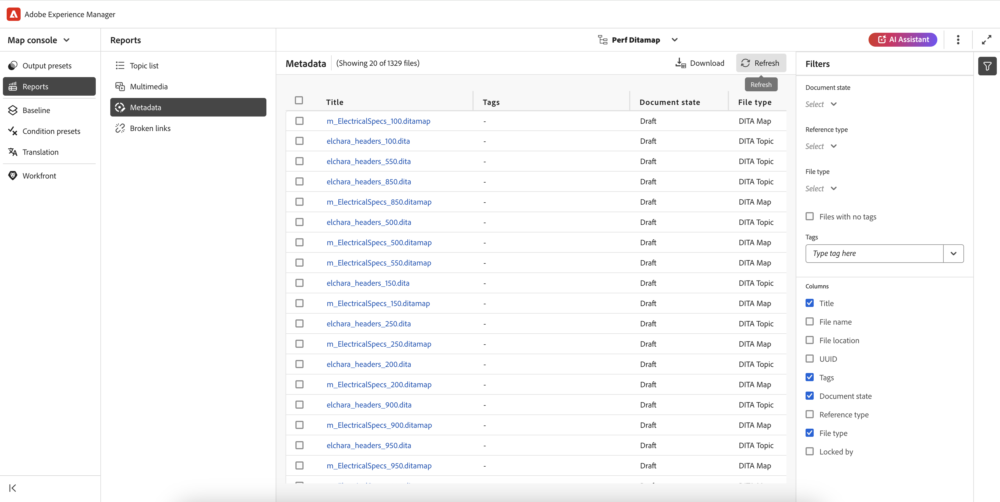

1. **フィルター** パネルから、参照の&#x200B;**ドキュメントの状態** \（例えば、トピックが編集、レビュー中、またはレビュー済みの状態の場合、これらはリスト\）、**参照** \（直接または間接\）、**ファイルタイプ** \（マップ、トピック、ドキュメント、画像、ビデオなど\）に基づいてトピックをフィルタリングできます。

   >[!NOTE]
   >
   > すべてのフィルターには、システムに存在するオプションの包括的なリストが表示されます。

1. タグのない&#x200B;**ファイルのみを表示するか、** タグ **フィルターから特定のタグを選択して、関連するファイルを表示することもできます。**
1. 次のトピックフィルタリングオプションを使用して、メタデータリストに次の列を表示することもできます。
   - **タイトル** \（デフォルトで選択\）参照ファイルのタイトルは、DITA マップで指定されます。 ファイルを選択して編集できます。

     >[!NOTE]
     >
     > チェックアウト済みファイルのタイトルの近くには、チェックアウト済みアイコンも表示されます。 アイコンにカーソルを合わせると、ユーザーの名前を表示できます。

   - **ファイル名** ファイルの名前。
   - **ファイルの場所** ファイルの完全なパス。
   - **UUID** ファイルのユニバーサル一意の識別子\（UUID\）。
   - **タグ** \（デフォルトで選択\） タグがファイルに適用されました。

     >[!NOTE]
     >
     > デフォルトでは、1つのファイルに対して2つのタグを表示できます。 その他のタグを表示するには、**さらに表示**&#x200B;を選択します。 「**表示なし**」を選択して、リストを再度契約します。

   - **ドキュメントの状態** \（デフォルトで選択\）参照ファイルの現在の状態。
   - **参照タイプ**&#x200B;参照のタイプ – 直接または間接
   - **ファイルの種類** \（デフォルトで選択\）ソースファイルの種類。 使用可能なオプションは、マップ、トピック、画像です。
   - **によってロックされています** ファイルをロックしたユーザー。

1. 「**ダウンロード**」を選択して、DITA マップ内のすべての参照のスナップショットをダウンロードします。 Excel シートには、選択した列と、**メタデータ** ビューでフィルタリングされた参照が含まれています。

### メタデータレポートからのメタデータの一括管理

個々のトピックにタグを適用することも、一括タグ付け機能を使用して、複数のトピック、DITA マップ、またはサブマップに複数のタグを適用することもできます。 選択したすべてのトピックのドキュメント状態を、次に考えられる一般的なドキュメント状態に変更することもできます。

### メタデータを更新

メタデータを更新するには、次の手順を実行します。

1. メタデータを更新するには、更新するファイルを選択します。 メタデータパネルに表示されるファイルを選択するには、**タイトル**&#x200B;の横に表示されるチェックボックスをオンにします。

   すべてのレコードを選択する場合は、タイトルバーの上にある「**すべて選択**」タブを使用します。 レコードはスクロール中にプログレッシブに読み込まれるので、**すべてを選択**&#x200B;する前に、リストの最後までスクロールしてください。 これにより、現在表示されているレコードだけでなく、すべてのファイルに対して編集権限とロック状態が評価されます。

   >[!NOTE]
   >
   > ファイルが別のユーザーによってロックされている場合、メタデータの更新用に選択することはできません。 ロックアイコンは、ロックされたファイルのタイトルの近くにも表示されます。 アイコンにカーソルを合わせると、ユーザーの名前を表示できます。 選択したファイルが読み取り専用モードになっているときに、**管理** ボタンを無効にするように設定できます。 詳しくは、メタデータパネル ](../guides-ui-extensions/examples.md)の「[管理」ボタンを参照してください。
   >
   >  この制限は、DITA ファイルとMarkdown ファイルにのみ適用されます。 DITA以外のアセット（画像やマルチメディアなど）の場合、メタデータプロパティは読み取り専用モードでも編集可能です。

   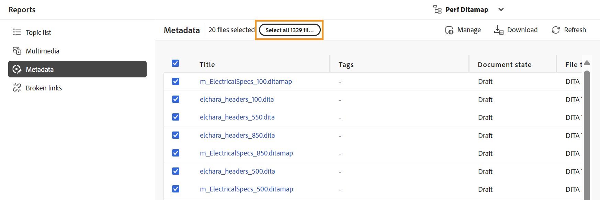

1. 上部から「**管理**」を選択します。

   {width="350"}

1. 新しいタグを追加する場合は、ドロップダウンリストから新しいタグを選択して、選択したすべてのトピックに適用します。 タグの近くにある十字アイコンを選択して、任意のタグを削除することもできます。

1. 選択したすべての参照のドキュメント状態を変更する場合は、新しいドキュメント状態を選択します。 ドロップダウンには、選択したすべてのトピックの共通の可能な状態が表示されます。 例えば、トピックの現在の状態が「レビュー中」の場合、「ドラフト」、「承認済み」または「レビュー済み」の状態を表示できます。
1. メタデータを更新するには、**更新**&#x200B;を選択します。 メタデータが正常に更新されたか、更新に失敗したかを確認するメッセージが表示されます。 また、**レポートをダウンロード**&#x200B;を選択して、レポートのスナップショットをダウンロードします。 このスナップショットには、選択した参照の更新されたステータスの詳細が含まれます。

### カスタムメタデータ列の追加

この機能を使用すると、必要に応じてカスタムメタデータ列を追加し、メタデータレポートに表示できます。 また、メタデータレポートの柔軟性も向上しています。 新しいカスタムメタデータ列を追加するには、次の手順を実行します。

1. カスタムメタデータ列を追加するには、メタデータページの右上隅にある3つのドットから「**Workspace settings**」（**オンプレミス設定の場合は** Settings **）と表示）を選択します。**

   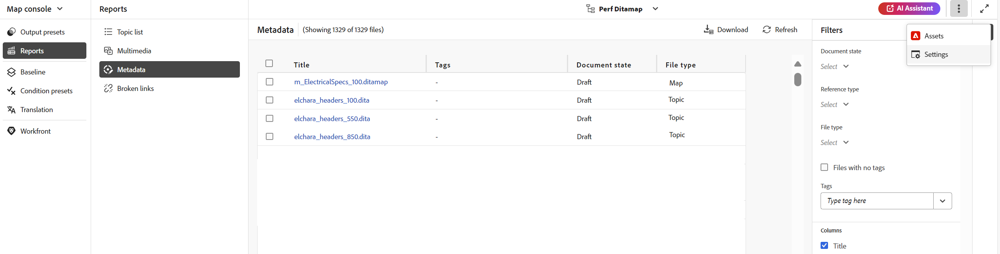{width="600"}

1. 表示されるポップアップの左側のパネルで「**メタデータ**」を選択します。
1. 「**追加**」タブを使用して、要件に従って新しいカスタムメタデータフィールドを追加します。

   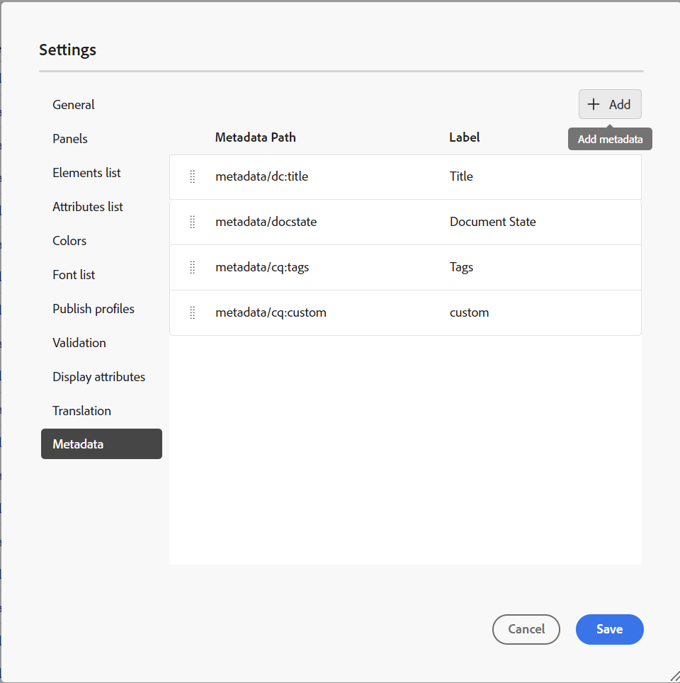{width="600"}

1. メタデータレポートの列に追加する特定のメタデータパスと適切なタイトルを指定します。 例えば、タイトル言語と特定のパスを含むカスタムメタデータが追加されます。

   >[!NOTE]
   >
   > 特定のメタデータ列を削除する場合は、表示されたリストから削除できます。 さらに、**ラベル**&#x200B;を編集して、列の表示タイトルを変更することもできます。

   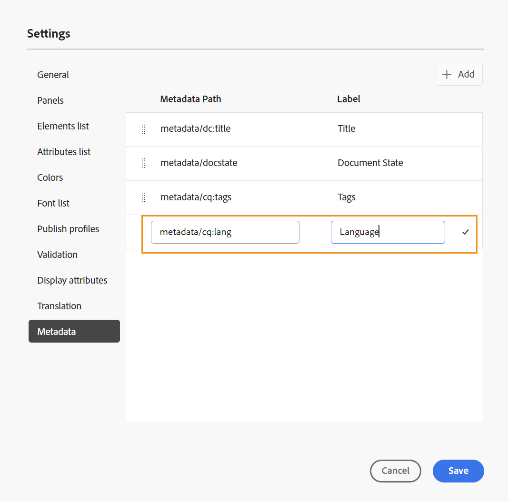{width="600"}

1. メタデータビューで「**保存**」と「**更新**」を選択します。 新しいカスタム列&#x200B;**言語**&#x200B;がフィルターパネルの列リストに追加されます。

   >[!NOTE]
   >
   > 新しいメタデータ列を追加すると、エディターの&#x200B;**バージョン履歴** パネルにも反映されます。 詳しくは、**[メタデータ](web-editor-features.md)**&#x200B;を参照してください。

   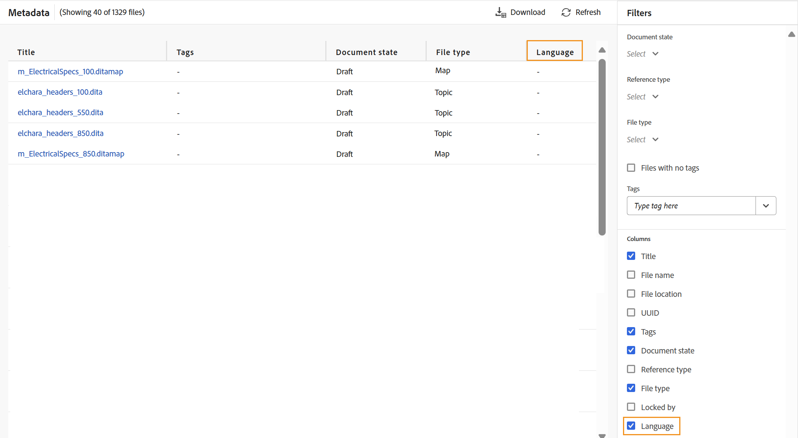{width="600"}

同様に、前述の手順に従って、メタデータレポートで必要とされる要件に基づいて、新しいカスタムメタデータフィールドを追加できます。

## マルチメディアレポート

**マルチメディア** レポートには、マップで使用されるマルチメディアに関する詳細な情報（タイトル、種類\（オーディオ、ビデオ、画像\）、マルチメディアが使用されるファイル、使用されたファイルの参照タイプなど）が表示されます。 リポジトリ内のUUIDとマルチメディアの場所を表示することもできます。 マルチメディアのレポートを表示するには、次の手順を実行します。

1. レポートパネルから「**マルチメディア**」を選択します。 DITA マップに存在するマルチメディアのリストが表示されます。
1. **フィルター** パネルから、マルチメディアまたは参照で使用される名前でリストを並べ替えることができます。

   - **マルチメディア**&#x200B;で注文すると、マルチメディアの名前が最初の列に表示され、その後、それらが使用されているすべての参照の名前が同じ行の別の列に表示されます。 例えば、次のスクリーンショットは、マルチメディア testSong.mp3が最初の列に表示され、それが使用される2つの参照が同じ行の3番目の列に表示されることを示しています。

     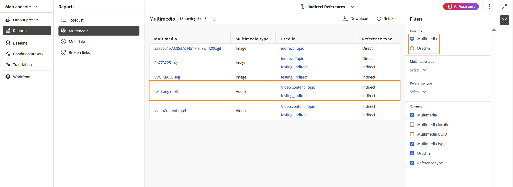{width="650"}

   - **使用済み**&#x200B;列で注文すると、転置ビューが表示されます。このビューでは、マルチメディアが使用された参照の名前が最初の列に一覧表示され、マルチメディア名が別の列に一覧表示されます。 例えば、次のスクリーンショットは、最初の列に2つの参照\（testing_indirectおよびビデオコンテンツトピック\）の名前を示し、マルチメディア testSong.mp3は2つの別々の行に3番目の列に表示されます。

     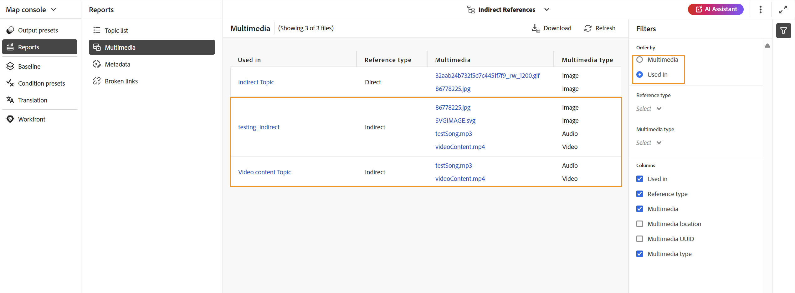{width="650"}

1. マルチメディアは、**マルチメディアタイプ**&#x200B;および&#x200B;**参照タイプ**&#x200B;に基づいてフィルタリングできます。 マルチメディアファイルのリストは、ドロップダウンで選択した内容に基づいて表示されます。 例えば、DITA マップのオーディオ参照のみを表示するように選択できます。ファイルには、そのマップで使用されているオーディオ参照のみが表示されます。

1. 次のフィルターオプションを使用して、リストに次の列を表示することもできます。

   - **マルチメディア** \（デフォルトで選択\） マルチメディアのタイトルは、DITA マップで指定されます。 マルチメディアを選択して編集できます。
   - **マルチメディアの場所** マルチメディアの完全パス。
   - **マルチメディア UUID** ファイルのユニバーサル一意の識別子\（UUID\）。
   - **マルチメディアタイプ** \（デフォルトで選択\） マルチメディアのタイプ。 使用できるオプションは、オーディオ、ビデオ、画像です。
   - **使用中** \（デフォルトで選択\） マルチメディアが使用された参照。 参照を選択して編集できます。
   - **参照タイプ** \（デフォルトで選択\）参照タイプ – 直接または間接。
   >[!NOTE]
   >
   > 「**更新**」を選択して、マルチメディアの最新のリストを取得し、マップファイルの変更を表示するか、DITA マップ内のマルチメディアが更新されたかどうかを確認します。

1. 「**ダウンロード**」を選択して、DITA マップ内のすべてのマルチメディアのスナップショットをダウンロードします。 Excel シートには、選択した列と、**マルチメディア** ビューでフィルタリングされたマルチメディアが含まれています。

## 壊れたリンクのレポート

**壊れたリンク**は、現在のマップに存在する壊れたリンクの詳細を提供する便利なレポートです。破損したリンクは、DITA トピック、マルチメディアファイル参照、コンテンツキー参照などで表示できます。また、それらをここに修正する機能もあります。
このレポートには、壊れたリンク、リンクの種類、参照が使用されるファイル、使用されたファイルの種類などの詳細な情報が記載されています。
次の手順を実行すると、壊れているリンクのレポートを表示できます。

1. レポートパネルから「**壊れたリンク**」を選択します。 DITA マップに存在するリンク切れまたは参照のリストが表示されます。
1. **フィルター** パネルから、リンクまたは参照で使用される名前でリストを並べ替えることができます。

   - **壊れたリンク**&#x200B;で注文すると、壊れたリンクのパスが最初の列に表示され、次に、それらが使用されているすべての参照の名前が別の列に表示されます。 同じ壊れたリンクが複数のファイルで使用されている場合、1つの行に表示され、グループ化された行またはサブ行として表示されます。 例えば、次のスクリーンショットは、最初の列に2つの壊れたリンクと、それらが使用される参照を示しています。`m_ElectricalSpecs_900.ditamap`は、2つの別々の行の3番目の列に表示されます。

   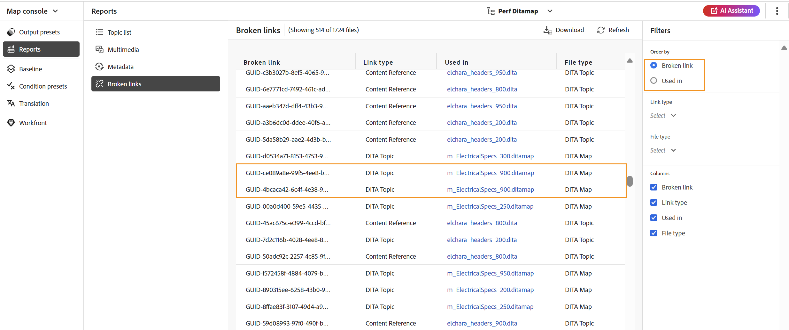

   - **で注文した場合、**&#x200B;列で使用した場合、転置ビューが表示され、壊れたリンクが使用された参照の名前が最初の列に一覧表示され、壊れたリンクが同じ行の別の列に一覧表示されます。 例えば、次のスクリーンショットは、最初の列の参照（壊れたリンクが使用される） `m_ElectricalSpecs_900.ditamap`を示しており、壊れたリンクは同じ行の3番目の列に表示されています。

   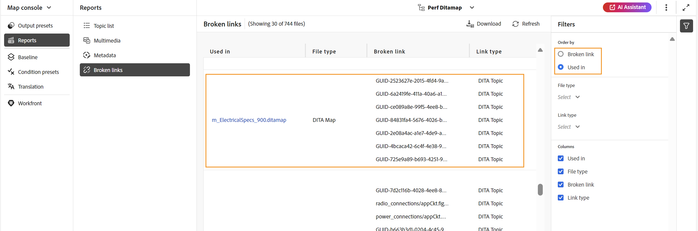

1. **ファイルタイプ**&#x200B;と&#x200B;**リンクタイプ**&#x200B;に基づいて、壊れたリンクをフィルタリングできます。 リンク切れのリストは、ドロップダウンで選択した内容に基づいて表示されます。 例えば、DITA マップのコンテンツ参照のみを表示するように選択できます。ファイルには、そのマップで使用されている壊れたコンテンツ参照のみが表示されます。

   DITA トピック、DITA マップ、ファイル参照、キー参照、コンテンツ参照、コンテンツキー参照、画像参照、マルチメディアファイル参照、およびマルチメディアキー参照は、**リンクタイプ** ドロップダウンで使用できる値であり、トピック、マップ、ドキュメント、画像、ビデオ、オーディオなどの値は、**ファイルタイプ** ドロップダウンで使用できます。
1. 次のフィルターオプションを使用して、リストに次の列を表示することもできます。

   - **壊れたリンク** （デフォルトで選択）壊れたリンクのパスはDITA マップで指定されます。

   - **リンクの種類** （デフォルトで選択） リンクの種類。 使用可能なオプションは、トピック、マップ、ファイル参照、キー参照、コンテンツ参照、コンテンツ鍵参照、画像参照、マルチメディアファイル参照、マルチメディアキー参照です。

   - **使用済み** （デフォルトで選択）壊れたリンクが使用された参照。 参照を選択して、作成者モードで表示できます。

   - **ファイルの種類** （デフォルトで選択）参照の種類 – トピック、マップ、ドキュメント、画像、ビデオ、オーディオなど。

   「**更新**」を選択して、壊れたリンクの新しいリストを取得し、マップファイルの変更を表示するか、DITA マップ内の壊れたリンクが更新されたかどうかを確認します。
1. 「**リンクを修正**」アイコン（）を選択して、壊れたリンクを修正できます。

   >[!NOTE]
   >
   > リンク切れ列の下にあるリンク切れパスにカーソルを合わせると、リンクの修正（） アイコンが表示されます。

   **リンク切れ**&#x200B;または&#x200B;**使用**&#x200B;で注文した場合は、両方のビューでリンクを修正できます。

   >[!NOTE]
   >
   > 壊れたリンクで注文した際に壊れたリンクを修正すると、リンクが使用されているすべてのファイル（1行にグループ化されている）でリンクが修正されます。

1. **リンクを更新** ダイアログで、必要な参照の詳細を更新する必要があります。 **リンクを更新** ダイアログで必要な詳細は、参照のタイプによって異なります。\
   リンクを修正すると、壊れたリンクのリストの下に表示されません。 代わりに、トピックリストまたはメタデータの下に表示できます。

1. 「**ダウンロード**」を選択して、DITA マップ内のすべての壊れたリンクのスナップショットをダウンロードします。 Excel ファイルには、選択した列と、壊れたリンク ビューでフィルタリングされた壊れたリンクが含まれています。

**親トピック：**[ レポートの概要](reports-intro.md)
