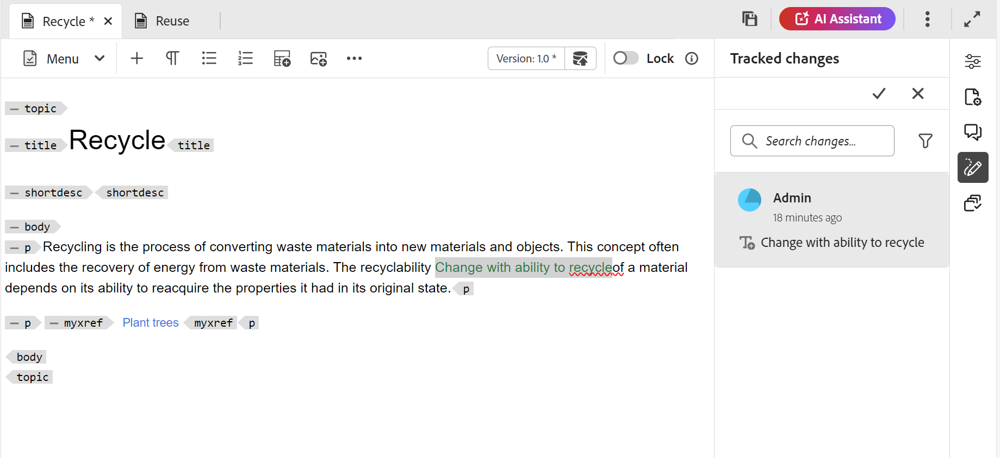
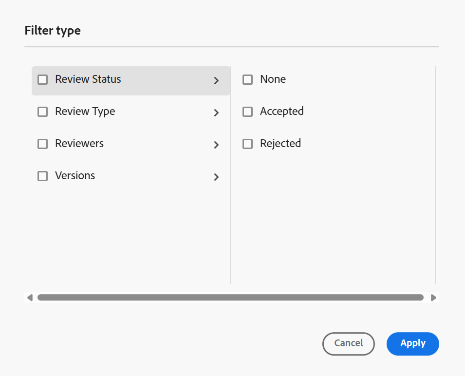
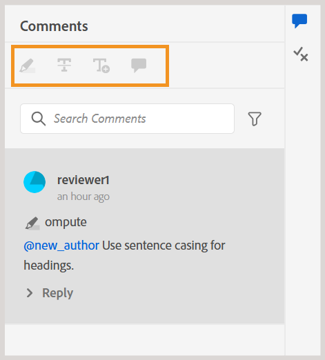

# アドレス確認コメント {#id2056B0X0KBI}

作成者は、エディターを使用してトピック内のコメントに対応できます。 コメントは、レビューパネルで選択したレビュータスクに基づいて読み込まれます。 詳細については、[左パネル &#x200B;](../user-guide/web-editor-left-panel.md) セクションの&#x200B;**レビュー** パネル 機能の説明を参照してください。

次の節では、エディターでコメントに対応する方法について説明します。

作成者は、エディターからドキュメント内のコメントに対応できます。 挿入されたコメント \（text\）、削除または強調表示されたコメントを示す視覚的なインジケーターが表示されます。 また、コメントの種類は、すべてのコメントエントリの上部に記載されています。

>[!NOTE]
>
> レビューコメント\（アクティブなレビュードキュメント\）に対応する際は、フルタグビューが有効になっている複数のタブでレビュー中のトピックを開かないように注意してください。作成者モードとSource ビューモードを切り替えないでください。

エディターでは、右側のパネルに「レビュー」アイコンと「変更をトラック」アイコンが表示されます。 レビューパネルには、レビュー担当者がドキュメントで行ったすべてのコメントが表示されます。 **変更履歴** パネルには、ドキュメント内のすべての挿入および削除されたコメントのステータスが表示されます。

- **A**: レビューコメントを表示するには、レビュータスクを選択します。 トピックが複数のレビュータスクでレビュー用に共有されている場合は、このドロップダウンにリストされているタスクを表示します。

  リストからレビュータスクを選択すると、そのタスクでレビュー担当者が行ったコメントを表示できます。 レビューコメントはタスク内で個別に対処できます。つまり、コメントに関する更新は、それぞれのタスクのレビュー担当者にのみ表示されます。

- **B:** **コメント** パネルの&#x200B;**レビューの詳細** を選択して、レビュータスクに関する詳細情報を表示します。

   - **名前**: レビュータスクの名前。
   - **レビューバージョン**：選択したレビュータスクに関連付けられているバージョンを表示します。 これにより、レビュー用に共有したバージョンを追跡できます
   - **ステータス**：レビュータスクの現在のステータス。

  >[!NOTE]
  >
  > レビュータスクのルートマップがオーサリングルートマップと異なる場合は、オーサリングルートマップとレビュールートマップが一致しないことを示す情報が表示されます。

- **C**：レビュー開始後にトピックを更新した場合、「**トピックをレビュー用に戻す**」アイコンを選択すると、作業コピーがレビュー用に共有されたバージョンに戻ります。 これにより、レビュー用に共有されたバージョンにレビューフィードバックを直接簡単に組み込むことができます。 フィードバックを組み込んだ後、元に戻したバージョンの変更を保存したり、トピックの新しいリビジョンを作成したりできます。 トピックの新しいリビジョンを作成する場合は、レビュー用に共有されたトピックバージョンから新しいブランチが作成されます。 例えば、現在のオーサリングバージョンが`1.3`である間に、レビュー用にトピックのバージョン `1.2`を共有した場合、このアイコンを使用して、レビューコメントを組み込むためにバージョン `1.2`に戻すことができます。 バージョン `1.2`への変更を組み込んだ後に新しいリビジョンを作成することを選択した場合、バージョン `1.2.0`の新しいブランチがトピック用に作成されます。

  通常、レビューのフィードバックを取り込んだ後、最新バージョンのトピックからの変更をマージします。 これを行うには、[結合](web-editor-features.md#id205DF04E0HS)機能を使用して、トピックをレビュー用に共有した後に行われたすべての更新を取得します。

- **D**：並べて表示するビューを開いて、トピックのコメント付きバージョンを表示します。 上記のスクリーンショットに見られるように、一番左のセクションは、変更を加えることができるトピックの最新バージョンです。 次のセクションは、トピックのコメント付きバージョンです。 トピック内のコメント間を移動すると、サイドビューが変更され、コメントが行われたトピックのバージョンが表示されます。 コメントパネルの各コメントは、このセクションの対応するテキストにリンクされています。 コメント付きテキストを識別するのに役立ちます。 注釈は、文書内の注釈テキストの順序で表示されます。

  バージョン番号はサイドビューの上部に表示されます。 このアイコンを再度選択すると、トピックのコメント付きバージョンが非表示になります。

- E：挿入および削除された\（または取り消し\）コメントをトピックに直接読み込みます。 読み込みアイコンを選択すると、すべてのテキストの挿入と削除がトピックの作業コピーに表示されます。 コメントを受け付ける方法と拒否する方法は2つあります。

  提案された変更\（挿入または削除\）を1つずつ組み込む場合は、コンテンツ内のコメントを右クリックし、「変更を承認」または「変更を拒否」を選択します。 選択に応じて、コメントが承認または拒否されます。 承認されたコメントの場合は、コンテンツにコンテンツが追加され、拒否の場合はコンテンツから削除されます。 また、レビューパネルでコメントのステータスが変更されます。

  

  また、「変更をトラック」パネルを使用して、コメントを承認または却下することもできます。 注釈を選択すると、文書内の注釈がハイライト表示されます。

  

  >[!IMPORTANT]
  >
  > コメントの読み込み機能は、レビュー用に共有されてから変更されていないドキュメントでのみ機能します。 文書をレビュー用に送信した後に変更を加えた場合は、**文書に強制的に読み込む**&#x200B;件のコメントを通知します。 ただし、そうすると、ドキュメントで行ったすべての更新が失われます。 ドキュメントが外部で作成され、レビュー用に共有されている場合は、**インポートの強制** アラートも表示されます。 コメントをインポートします。

  コメントを承認または却下すると、コメントは「変更履歴」リストから削除されます。 これは、文書内で対処する必要があるコメントの数を示す指標としても機能します。

- **F**：詳細オプションメニューから、レビュートピックで利用可能なすべての添付ファイルをダウンロードします。
- **G**: コメント内のテキストを検索します。
- **H**: コメントを承認または却下します。

- **I**: コメントにフィルターを適用します。 レビュータイプ \（all、強調表示、削除済み、挿入、付箋\）、レビューステータス \（all、accepted、rejected、none\）、レビューアー\（allまたはspecific reviewer\（s\）\）、またはトピックのバージョンに基づいてコメントを表示するようにフィルターできます。 デフォルトでは、どのフィルターも選択されていません。

  {width="350"}
  **他のユーザーをタグ付けしてコメントに返信**

レビュータスクの作成者および開始者は、コメントに返信してレビューを行い、同じレビュータスクに関与する他のユーザーをタグ付けして、注意を引いたり、フォローアップを割り当てたりすることができます。 この機能は、アクティブなレビュータスクでのみ使用できます。

>[!NOTE]
>
> レビュータスクに割り当てられたユーザーのリストを表示し、コメントでタグ付けするには、`/home/users and /home/groups` ノードで&#x200B;*読み取り* アクセス権が必要です。 詳しくは、[&#x200B; ユーザー管理とセキュリティ &#x200B;](../cs-install-guide/user-admin-sec.md#additional-notes-on-user-groups)を参照してください。  アクセスを確認した後もタグ付けが利用できない場合は、管理者がこの機能を有効にするために`user-admin` ライセンスを割り当てる必要がある場合があります。

{width="350"}
*キャプション :Tag名のユーザーがイニシエータ/作成者*&#x200B;です

タグ付けされたオーディエンスには、電子メールとAEM通知の両方が配信され、迅速な情報を提供できます。 レビュー通知のトリガー方法について詳しくは、[&#x200B; レビュー通知について](./review-understanding-review-notifications.md)を参照してください。

**レビューUI**&#x200B;を使用してレビューコメントにアクセスする

レビュータスクの開始者または作成者が&#x200B;**プロジェクトコンソール**&#x200B;からレビュータスクを開くと、レビューUIでトピックが起動します。 このタスクは自分に割り当てられていないので、コメントを表示して返信することはできますが、レビューアクションを実行することはできません。 タスクに割り当てられていないユーザーのコメントツールバーは無効のままです。

{width="350"}

**親トピック：**&#x200B;[&#x200B; レビューの概要](review.md)
