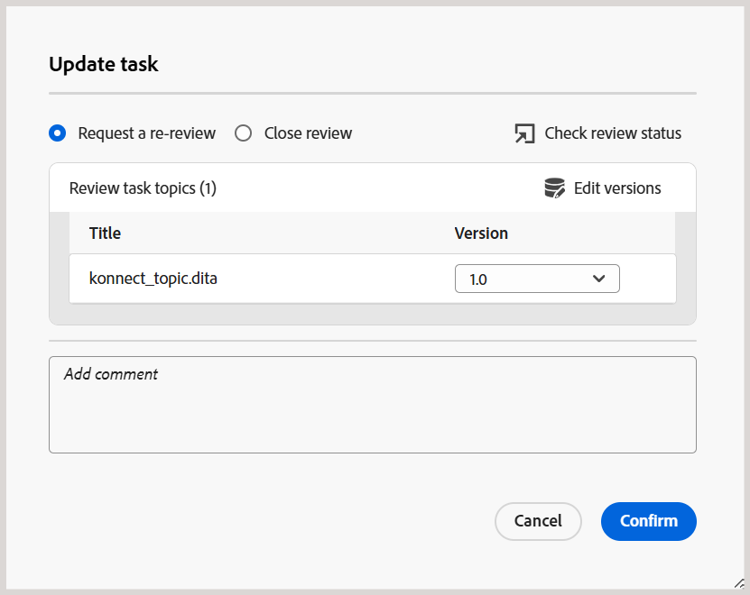
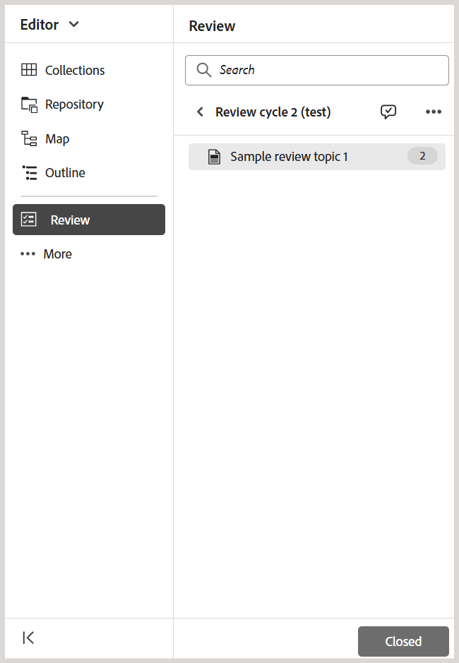

# レビューを依頼するか、作成者としてレビュータスクを閉じます

>[!IMPORTANT]
>
> この記事で説明する新機能は、Experience Manager Guides as a Cloud Serviceの2508 リリースでデフォルトで有効になっています。 移行前に作成されたレビューは影響を受けず、以前のワークフローを引き続き使用します。 これらのアップデートなしで既存の機能を引き続き使用したい場合は、カスタマーサクセス部門に連絡して、新しい機能を無効にしてもらってください。

レビューアーがレビュータスクを「完了」とマークすると、タスク開始者に通知がトリガーされ、タスクと関連するタスクレベルのコメントにアクセスしてレビューできるようになります。

レビュータスクの開始者は、フィードバックに基づいて進め方を決定できます。 使用できるオプションは以下のとおりです。

- 再審査を申請
- レビュータスクを閉じる

## 再審査をリクエストするか、レビュータスクを閉じます

次の手順を実行して、再審査をリクエストするか、レビュータスクを閉じます。

1. エディターの左側のパネルから&#x200B;**レビューパネル**&#x200B;を開きます。
2. 閉じたいレビュータスクまたはレビュー用に再送信したいレビュータスクを&#x200B;**アクティブタスク** リストから選択します。

   >[!NOTE]
   >
   > **タスクの詳細** ページにアクセスして、レビュータスクを管理できます。 これを行うには、アクティブなレビュータスクのオプションメニューから「**タスクの詳細を開く**」を選択します。 プロジェクトコンソールでタスクの詳細が開きます。

   
3. **タスクコメント** アイコンを選択して、レビュー担当者が追加したタスクレベルのコメントにアクセスしてレビューします。

   。

   右側に「**タスクコメント**」ダイアログが表示されます。

   {width="350"}。
4. 選択したレビュータスクに対してさらにアクションを実行するには、**タスクを更新**&#x200B;を選択します。
5. **タスクを更新** ダイアログで、次のいずれかのアクションを選択します。

   - **再審査を依頼**：再審査を開始します。 レビュー用に別のバージョンのトピックを選択できます。 デフォルトでは、レビュー用に送信されたトピックまたはマップファイルの最新（または最後に編集された）バージョンが選択されます。 必要に応じて、**バージョンを編集** オプションを使用して、選択したトピックのバージョンを&#x200B;**最新バージョン**&#x200B;または&#x200B;**ベースライン**&#x200B;に設定することもできます。  前回のレビューを完了したレビュー担当者には、更新されたバージョンに関するフィードバックを提供する通知が届きます。 レビュータスクを「完了」とマークしていない他のレビューアーには、トピックの更新が通知されます。

   - **レビューを閉じる**：レビュータスクを閉じます。 レビューパネルの下部にある「**タスクを更新**」ボタンが&#x200B;**クローズ**&#x200B;に変更され、レビュータスクに関与するすべてのユーザーに、そのクローズを示す通知が送信されます。

   レビュー通知のトリガー方法について詳しくは、[ レビュー通知について](./review-understanding-review-notifications.md)を参照してください。

   {width="350"}

   タスクを更新ダイアログに表示される「**レビューステータスを確認**」オプションを使用して、レビュータスクのステータスを[確認することもできます](./review-manage-tasks-review-dashboard.md#check-the-status-of-a-review-task)。 このオプションを選択すると、レビュータスクのステータスレポートが表示されるレビューダッシュボードに移動します。

   {width="650"}

6. 「**確認**」を選択します。

レビュータスクの作成者または開始者として、タスクを閉じると、レビューパネルの下部にある「**タスクを更新**」ボタンが&#x200B;**終了**&#x200B;に変更され、タスクがアクティブでなくなったことを示します。

{width="350"}

また、レビューパネルに表示されている&#x200B;**タスクを更新** ボタンは、レビュータスクの他のユーザーに対して無効のままです。 例えば、レビュータスクのレビュー担当者の1人として、エディターでタスクを開くと、「タスクを更新」ボタンが無効になり、「**このタスクに対するアクションの権限がありません**」というメッセージが表示されます。 レビュータスクの開始者のみが、エディターからタスクを更新する権限を持ちます。

{width="350"}

