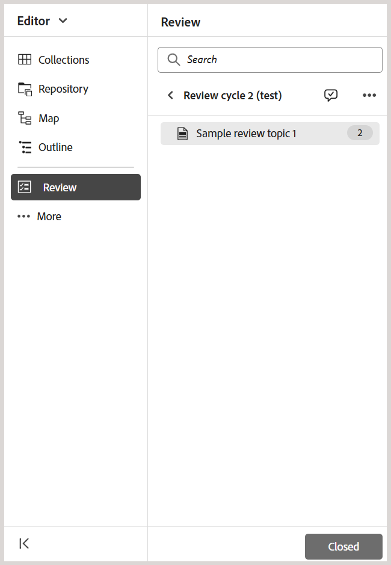

# 作成者としてレビュータスクを再レビューをリクエストまたは閉じる

>[!IMPORTANT]
>
> この記事で説明される新機能は、Experience Manager Guides as a Cloud Services 2508 リリースではデフォルトで有効になっています。 移行前に作成されたレビューは影響を受けず、以前のワークフローを引き続き使用します。 これらの更新を行わずに既存の機能を引き続き使用する場合は、カスタマーサクセスチームに連絡して、新機能を無効にしてもらってください。

レビュータスクがレビュー担当者によって完了とマークされると、タスク開始者に通知がトリガーされ、レビュー担当者はタスクおよび関連するタスクレベルのコメントにアクセスして確認できるようになります。

レビュータスクの開始者は、フィードバックに基づいて進め方を決定できます。 使用できるオプションは以下のとおりです。

- 再レビューをリクエスト
- レビュータスクを閉じる

## 再レビューのリクエストまたはレビュータスクのクローズ

レビュー・タスクのレビューを要求またはクローズするには、次の手順を実行します。

1. エディターでレビュータスクを開きます。
2. レビューパネルの **アクティブなタスク** リストでレビュータスクを選択します。

   >[!NOTE]
   >
   > また、タスクダッシュボードでタスクを開いて、より包括的な表示を行うこともできます。 レビューを行うには、アクティブなレビュータスクのオプションメニューから **タスクダッシュボードで開く** を選択します。 これにより、プロジェクトコンソールでタスクの詳細が開きます。

   
3. **タスクコメント** ダイアログを選択して、レビュー担当者が追加したタスクレベルのコメントにアクセスして確認します。

   。

   **タスクコメント** ダイアログが右側に表示されます。

   {width="350" align="left"}。
4. **タスクを更新** を選択して、選択したレビュータスクに対してさらにアクションを実行します。
5. **タスクを更新** ダイアログで、次のいずれかのアクションを選択します。

   - **レビューの再リクエスト**：レビューの別のラウンドを開始します。 レビュー用に別のバージョンのトピックを選択できます。 既定では、レビュー用に送信されたトピックまたはマップ ファイルの最新バージョン（または最後に編集されたバージョン）が選択されます。 また、「**バージョンを編集**」オプションを使用して、選択したトピックのバージョンを必要に応じて **最新バージョン**、**次のバージョン** および **ベースライン** に設定することもできます。  前のレビューを完了したレビュー担当者には、更新されたバージョンに関するフィードバックを提供する通知が届きます。 レビュータスクを完了としてマークしていない他のレビュー担当者には、トピックの更新が通知されます。

   - **レビューを閉じる**：レビュータスクを閉じます。 レビューパネルの下部にある「**タスクを更新**」ボタンが **閉じられた** に変わり、レビュータスクに関係するすべてのユーザーに、完了を示す通知が送信されます。

   通知トリガーのレビュー方法について詳しくは、[ レビュー通知について ](./review-understanding-review-notifications.md) を参照してください。

   {width="350" align="left"}

   >[!NOTE]
   >
   > **タスクを更新** ダイアログには、Experience Manager Guides as a Cloud Services を使用している場合にリストされているレビュートピックの現在のステータスを示す **ドキュメントのステータス** 列も含まれます。

6. 「**確認**」を選択します。

レビュータスクの作成者または開始者は、タスクを閉じると、レビューパネルの下部にある **タスクを更新** ボタンが **閉じた** に変わり、タスクがアクティブでなくなったことを示します。

{width="350" align="left"}

また、レビューパネルに表示される **タスクを更新** ボタンは、レビュータスクの他のユーザーに対しては無効のままになります。 例えば、レビュータスクのレビュー担当者の 1 人が、そのタスクをエディターで開くと、「タスクを更新」ボタンが無効になり、**このタスクに対する権限がありません** というメッセージが表示されます。 レビュータスクのイニシエーターのみが、エディターからタスクを更新する権限を持っています。

{width="350" align="left"}
