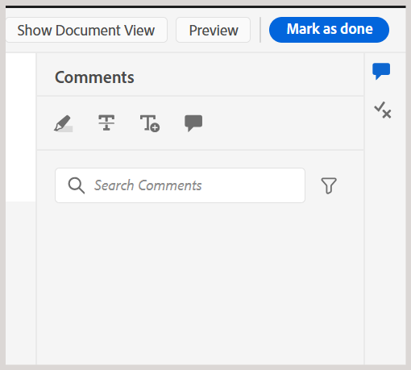
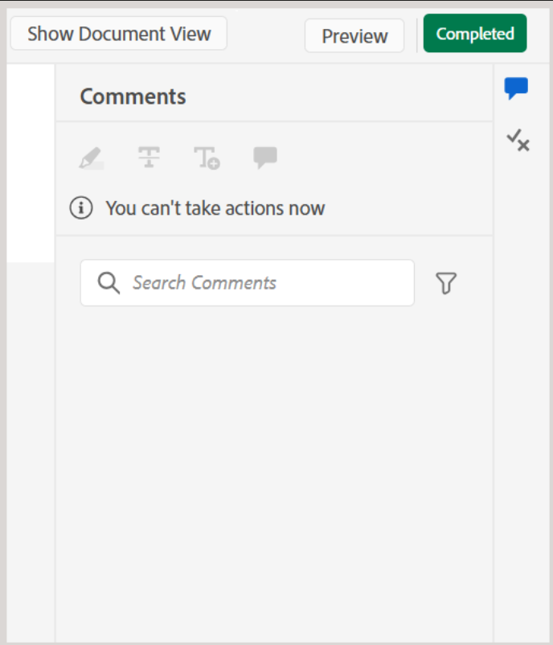

# レビューアーとしてのレビュータスクの完了

>[!IMPORTANT]
>
> この記事で説明する新機能は、Experience Manager Guides as a Cloud Serviceの2508 リリースでデフォルトで有効になっています。 移行前に作成されたレビューは影響を受けず、以前のワークフローを引き続き使用します。 これらのアップデートなしで既存の機能を引き続き使用したい場合は、カスタマーサクセス部門に連絡して、新しい機能を無効にしてもらってください。

レビュー担当者は、すべてのコンテンツをレビューし、作成者に通知する必要がある場合、レビュータスクを「完了」としてマークできます。 この段階で最終的なコメントを残すこともできます。

レビュータスクを完了するには、次の手順を実行します。

1. 割り当てられたレビュータスクを開きます。
2. 次に示すように、上部から「**完了としてマーク**」を選択します。

   {width="350"}

   **完了タスク** ダイアログが表示されます。
3. **完了タスク** ダイアログで、作成者の最終コメントを追加し、**完了**&#x200B;を選択します。

   >[!NOTE]
   >
   > タスクレベルのコメントは、要約または最終コメントとして機能し、トピックレビュー中に追加されたテキストレベルのコメントとは異なります。 このダイアログでは、作成者に特定のコメントへの対応やレビュー用のタスクの再送信をリクエストするなど、フォローアップアクションを概説したり、レビューが完了したことを示したりできます。

   例えば、レビュー担当者は、作成者のフォローアップアクションとしてコメントを追加できます。

   {width="350"}

   または、次に示すように、タスクの完了を示すコメントを追加します。

   {width="350"}

タスクが完了としてマークされ、ステータスが&#x200B;**完了**&#x200B;に設定されました。 タスクが完了とマークされると、それ以上のアクションは許可されません。 レビュータスクの作成者または開始者に通知が送信され、すぐに注目が集まります。 レビュー通知のトリガー方法について詳しくは、[ レビュー通知について](./review-understanding-review-notifications.md)を参照してください。

{width="350"}

フィードバックに基づいて、タスクの作成者または開始者がレビュータスクを[閉じることを決定した場合](./review-close-review-task.md)、レビューUIのタスクステータスは&#x200B;**閉じた**&#x200B;に変更されます。

{width="350"}

>[!NOTE]
>
>デフォルトでは、レビュー担当者がレビュータスクを&#x200B;**完了**&#x200B;とマークすると、作成者またはタスク開始者がフィードバックをレビューしてレビュータスクを閉じるまで、タスクはレビューアーのAEM インボックスに残ります。
>
>ただし、レビューUIとAEM インボックスの間でタスクの同期を有効にすることができます。 この機能が有効になっている場合、レビューUIでレビュータスクを&#x200B;**完了**&#x200B;とマークすると、対応するタスクが自動的に完了し、レビューアーのAEM インボックスから削除されます。 同様に、AEM インボックスからタスクを完了すると、レビューUIでタスクが完了として自動的にマークされます。
>
>オーサーまたはタスク開始者は、引き続きフィードバックを確認し、追加のレビューが必要な場合はタスクを再割り当てできます。 タスクが再割り当てされると、レビュー担当者に対して新しいAEM インボックス通知が生成され、タスクを再度確認できるようになります。
>
>お客様の環境でこの機能を有効にするには、カスタマーサクセス部門にお問い合わせください。

## タスクレベルのコメントの表示

すべてのタスクレベルのコメントは、読み取り専用モードで使用できる&#x200B;**タスクコメント** ダイアログに表示されます。 最終コメントを含むレビュータスクを完了すると、入力がこのダイアログに記録され、後で参照できるようになります。

レビューUIからタスクレベルのコメントにアクセスするには、左側のパネルに移動し、**タスクコメント** アイコンを選択します。

{width="350"}

右側に「**タスクコメント**」ダイアログが表示されます。

{width="350"}

ダイアログ内のコメントは時系列で表示され、最近のコメントが最初に表示され、最も古いコメントが最後に表示されます。 この順序は、時間の経過とともに会話が進行するのを追跡するのに役立ちます。

**タスクコメント** ダイアログには、レビュータスクの作成者または開始者、およびその他のレビューアーを含む、レビュータスクに関わるすべてのユーザーがアクセスできます。 したがって、他のレビュー担当者（関与している場合）からのコメントもタスクコメントダイアログに表示される場合があります。 これにより、レビュープロセス全体を通じて、明確かつ追跡可能なコミュニケーションを実現できます。

タスクレベルのフィードバックを確認した後、作成者は再レビューをリクエストするか、レビュータスクを閉じることができます。 いずれの場合も、レビュープロセス中にキャプチャされたすべてのコメントは、参照用に&#x200B;**タスクコメント** ダイアログで引き続き利用できます。
