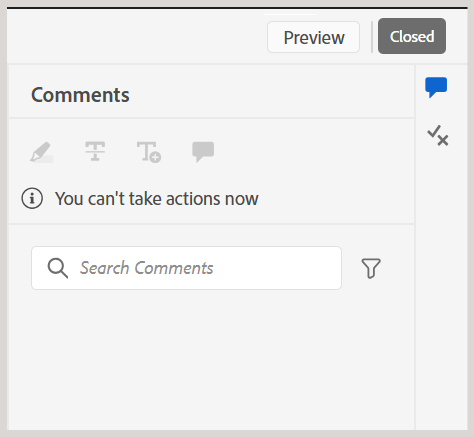

# レビュアーとしてレビュータスクを完了する

>[!IMPORTANT]
>
> この記事で説明される新機能は、Experience Manager Guides as a Cloud Services 2508 リリースではデフォルトで有効になっています。 移行前に作成されたレビューは影響を受けず、以前のワークフローを引き続き使用します。 これらの更新を行わずに既存の機能を引き続き使用する場合は、カスタマーサクセスチームに連絡して、新機能を無効にしてもらってください。

レビュー担当者は、すべてのコンテンツをレビューした後で作成者に通知するレビュータスクを完了としてマークできます。 この段階で最終コメントを残すこともできます。

レビュータスクを完了するには、次の手順を実行します。

1. 割り当てられたレビュータスクを開きます。
2. 次に示すように、上部の「**完了としてマーク**」を選択します。

   {width="350" align="left"}

   **タスクを完了** ダイアログが表示されます。
3. **タスクを完了** ダイアログで、作成者の最終コメントを追加して **完了** を選択します。

   >[!NOTE]
   >
   > タスクレベルのコメントは概要または最終コメントとして機能し、トピックのレビュー中に追加されたテキストレベルのコメントとは異なります。 このダイアログでは、作成者に特定のコメントに対処し、レビュー用にタスクを再送信するよう依頼したり、レビューが完了したことを示すなど、フォローアップアクションの概要を説明できます。

   例えば、レビュー担当者は、作成者のフォローアップアクションとしてコメントを追加できます。

   {width="350" align="left"}

   または、タスクの完了を示すコメントを追加します（下図を参照）。

   {width="350" align="left"}

タスクを完了として正常にマークし、その状態が **完了** に設定されました。 タスクが完了とマークされると、以降のアクションは許可されません。 レビュータスクの作成者または開始者に、すぐに注意を引くための通知が送信されます。 通知のレビュートリガーの方法について詳しくは、[ レビュー通知について ](./review-understanding-review-notifications.md) を参照してください。

{width="350" align="left"}

フィードバックに基づいて、タスクの作成者または開始者が [ レビュータスクを閉じる ](./review-close-review-task.md) を決定した場合、レビュー UI のタスクのステータスは **閉じる** に変更されます。

{width="350" align="left"}

## タスクレベルのコメントの表示

タスクレベルのすべてのコメントは、読み取り専用モードで使用できる **タスクコメント** ダイアログに表示されます。 最終コメントを入力してレビュータスクを完了すると、今後の参照用にこのダイアログに入力内容が記録されます。

レビュー UI からタスクレベルのコメントにアクセスするには、左側のパネルに移動して「**タスクコメント**」アイコンを選択します。

{width="350" align="left"}

**タスクコメント** ダイアログが右側に表示されます。

{width="350" align="left"}

ダイアログ内のコメントは時系列で表示され、最近のコメントが最初に表示され、最も古いコメントが最後に表示されます。 この順序は、時間の経過と共に進行する会話を追跡するのに役立ちます。

**タスクコメント** ダイアログは、レビュータスクの作成者や開始者、他のレビュー担当者など、レビュータスクに関与するすべてのユーザーがアクセスできます。 したがって、他のレビュー担当者からのコメント（含まれている場合）がタスクコメントダイアログに表示される場合もあります。 これにより、レビュープロセス全体を通して、明確でトレーサブルなコミュニケーションを確保できます。

タスクレベルのフィードバックを確認した後、作成者は再レビューをリクエストするか、レビュータスクを閉じることができます。 どちらの場合も、レビュープロセス中に取り込まれたすべてのコメントは、**タスクコメント** ダイアログで引き続き参照できます。

