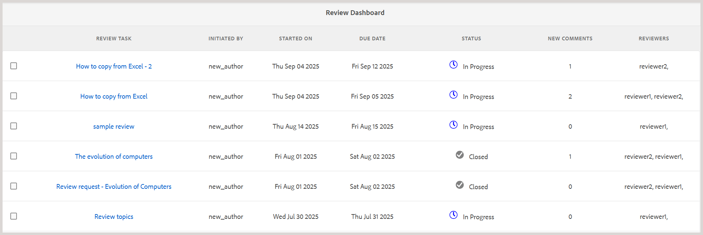
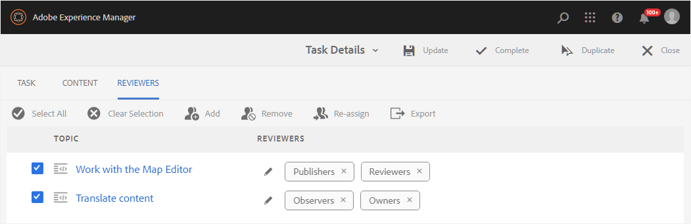
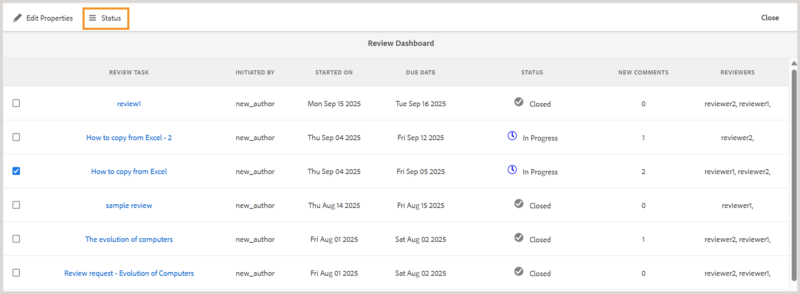
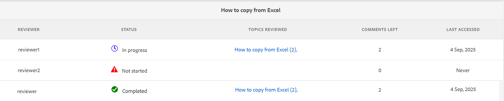

# レビューダッシュボードを使用したレビュータスクの管理 {#id2056B0Y70X4}

レビュー管理のワークフローには、様々なタスクを含めることができます。 例えば、特定のトピックのレビュー担当者を追加したり、レビューの期限を延長したりできます。 また、すべての関係者がフィードバックを提供したと思われる場合は、レビュータスクを完了としてマークすることもできます。 これらのタスクは、レビューダッシュボードを使用して管理できます。

レビューダッシュボードにアクセスして使用するには、以下の手順を実行します。

>[!NOTE]
>
> 自分が作成者\（またはイニシエーター\）であるプロジェクトのレビュータスクのみを管理できます。 レビュアーまたはパブリッシャー\（ユーザー\）であっても、どのプロジェクトタスクにもアクセスできません。

1. **プロジェクト** コンソールで、管理するレビュープロジェクトを選択します。

   タスクタイルを含むプロジェクトパネルが表示されます。

   {align="left"}

   >[!NOTE]
   >
   > または、エディターの左側のパネルからプロジェクトダッシュボードに直接アクセスすることもできます。 [&#x200B; レビューパネル &#x200B;](./web-editor-left-panel.md#review) を開き、レビューパネルにリストされている各レビュープロジェクトに配置されている **プロジェクトダッシュボードを開く** アイコンを使用します。

1. **レビュー** タイルの 3 ドットを選択します。

   レビューダッシュボードが表示されます。 ダッシュボードには、作成したすべてのレビュータスクが一覧表示されます。

   {align="left"}

   レビューダッシュボードには、タスク名、レビューを開始したユーザー、レビューが開始された日付、期限、ステータス、作成者が承認または却下していない新しいコメントの数、レビュー担当者の名前など、レビュータスクに関する詳細が表示されます。 タスクは、古いタスクに対して新しく作成されたタスクの順序で一覧表示されます。

   レビューダッシュボードの「**ステータス**」フィールドには、次のいずれかの値が表示されます。
   - **処理中**：レビューがまだ進行中であることを示します。
   - **終了**：レビュータスクが完了したことを示します。

   >[!NOTE]
   >
   > レビュータスク リンクを選択すると、レビュー用に送信されたトピックまたはマップ ファイルが開きます。

1. レビュータスクを選択します。

   ツールバーに「プロパティを編集」および [&#x200B; ステータス &#x200B;](#check-review-status-id199RF0A0UHS) オプションが表示されます。

1. **プロパティを編集** を選択すると、タスクの詳細ページが表示されます。

   タスクの詳細ページには、タスク、コンテンツ、レビュー担当者の 3 つのタブがあります。 次のセクションでは、各タブで使用できる様々な機能について説明します。

## 「タスク」タブ

{align="left"}

「**タスク**」タブで、次のアクションを実行できます。

- 「**タイトル**」フィールドでタスクのタイトルを変更します。
- **割り当て先** ドロップダウンリストにデフォルトの担当者を追加します。 ここから追加したレビュー担当者には、このレビュータスクの一部であるすべてのトピックをレビューするためのアクセス権が付与されます。 [&#x200B; 「レビュー担当者」タブ &#x200B;](#Reviewer-tab-id199RF0N0MUI) から、特定のトピックに対するレビュー担当者の削除や、追加のレビュー担当者の選択を行うことができます。
- タスクの説明を「**説明**」フィールドで更新します。
- **期限** を変更します。 タスクの完了の期限を先送りまたは先送りすることができます。
- ユーザーが自分に割り当てられているトピックのみをレビューするように制限するには、このオプションを選択します。
- 「**更新**」を選択して、変更された詳細を更新します。

  更新が成功したかどうかを確認するトーストメッセージが表示されます。
- 「**完了**」を選択すると、レビュータスクの期限が切れる前に完了とマークされます。 個々のトピックのタスクが完了とマークされると、選択したトピックのレビューは終了します。 ただし、DITA マップを使用してレビュー用に共有されたトピックの場合、DITA マップタスクを「完了」とマークすると、レビュー用に共有されたマップ内のすべてのトピックのレビューが終了します。
- レビュータスクのコピーを作成するには、「**複製**」を選択します。 レビュータスクの複製を作成するプロセスは、新しいレビュータスクを作成するプロセスと似ています。 複製タスクワークフローを起動すると、レビュータスクを作成ページが表示されます。 [&#x200B; レビュー用にトピックを送信 &#x200B;](review-send-topics-for-review.md#) で説明されているように、新しいタスクの詳細を指定する必要があります。

  DITA マップから作成したレビュータスクを選択すると、マップの pert であるトピックが表示されます。 その後、新しいレビュータスクに含めるトピックを選択できます。

  1 つまたは複数のトピックのレビューからレビュータスクが複製された場合、それらのトピックのみがレビュータスクリストに表示されます。 これらのトピックを、異なるレビュアーのセットでレビュー用に共有できます。

- 「**閉じる**」を選択して、インボックスページに移動します。

## 「コンテンツ」タブ

{align="left"}

「**コンテンツ**」タブで、次のアクションを実行できます。

- レビュー用に送信されたトピックのバージョンを変更します。 トピックの最新バージョン、期日のバージョン、特定のラベルのバージョン、または特定のベースラインのバージョンを選択できます\（DITA マップの場合\）。

- 「**更新**」を選択して、トピックの更新バージョンをレビュー担当者と共有します。 レビュー担当者には、新しいバージョンのトピックがレビュー用に送信されたことを示すメール通知が届きます。 次にレビュー担当者がトピックを開くと、最新バージョンのトピックが表示されます。

  >[!NOTE]
  >
  > トピックの更新バージョンの場合、古いコメントも新しいバージョンで保持されます。 レビュー担当者は、2 つのバージョンの違いを確認することもできます。

- 「**完了**」を選択すると、レビュータスクの期限が切れる前に完了とマークされます。 個々のトピックのタスクが完了とマークされると、選択したトピックのレビューは終了します。 ただし、DITA マップを使用してレビュー用に共有されたトピックの場合、DITA マップタスクを「完了」とマークすると、レビュー用に共有されたマップ内のすべてのトピックのレビューが終了します。

- 「**複製**」を選択し、現在のタスクをベースとして使用して新しいレビュータスクを作成します。

## 「レビュー担当者」タブ {#Reviewer-tab-id199RF0N0MUI}

{align="left"}

「**レビュー担当者** タブでは、次の操作を実行できます。

- **すべてを選択**：トピックリストのすべてのトピックを選択します。 すべてのトピックを選択した後で、バッチ操作を簡単に実行できます。
- **選択をクリア**：トピックリストで選択されているトピックの選択を解除します。

  >[!NOTE]
  >
  > トピックの横にあるチェックボックスをオンにして、トピックを個別に選択または選択解除することもできます。

- **追加**: 「レビュー担当者の追加」ダイアログを表示します。 選択したトピックにレビュアーとして追加するレビュアーまたはユーザーロールの名前を入力できます。
- **削除**: レビュー担当者の削除ダイアログを表示します。 選択したトピックからレビュー担当者として削除するレビュー担当者またはユーザーロールの名前を入力できます。
- **再割り当て**: 「レビュー担当者の再割り当て」ダイアログを表示します。 レビュータスクの割り当て先となるレビュー担当者またはユーザーロール \（またはグループ\）の名前を入力できます。 選択したトピックから既存のレビュー担当者がすべて削除され、新しく選択したレビュー担当者がそのトピックに割り当てられます。
- **書き出し**：レビュータスクの詳細を CSV ファイルに書き出すことができます。 ファイルには、トピックのパスとタイトル、レビュー担当者の名前、レビュー用に送信されたトピックのバージョンなどの詳細が含まれています。
- **レビュー担当者の編集**：トピックリストで  アイコンを選択すると、「レビュー担当者の編集」ダイアログが表示されます。 このダイアログでは、選択したトピックのレビュー担当者を追加または削除できます。

## レビュータスクのステータスの確認 {#check-review-status-id199RF0A0UHS}

Experience Manager Guidesでは、各レビュータスクには、現在のステータスを反映したステータスがあります。 レビューダッシュボードからこの情報にアクセスするには、タスクを選択し、「**ステータス**」オプションを選択します。

{width="650" align="left"}

これにより、次に示すように、レビュータスクのステータスレポートが開きます。

{width="650" align="left"}

または、エディターの [&#x200B; レビューパネル &#x200B;](./web-editor-left-panel.md#review) から直接ステータスレポートにアクセスできます。 レビューパネルからアクティブなレビュータスクを開き、「**タスクを更新**」を選択し、「**レビューステータスを確認**」を選択します。

レビュータスクのステータスレポートには、次の詳細が含まれます。

- レビュータスクが割り当てられたレビュー担当者の名前。
- ステータス列は、レビューステータスを示します。 ステータスは次のいずれかになります。
   - **未開始**：レビュー担当者は、レビュータスクをまだ開いていません。
   - **処理中**：レビュー担当者はレビュータスクを開き、トピックのレビュー処理中です。
   - **完了**: レビュー担当者はレビューを完了し、レビュー UI でそのタスクを完了としてマークしました。 レビュータスクは、各レビュー担当者のAEM通知インボックスにあります。
- レビュー担当者がレビューリンクを開き、トピックが「レビュー済みトピック」リストに追加された特定のトピックに移動した場合。 これは、作成者が、レビュー担当者がそれぞれのセクションを開いているかどうかを判断するのに役立ちます。 コメントが付けられた場合、それらは角括弧で囲まれて表示されます。
- すべてのトピックに対して行われたコメントの合計数。 評価中のトピックが複数ある場合、各トピックのコメント数がトピック名に対して\（括弧で\）で示されます。
- レビュー担当者がトピックに最後にアクセスした日付。

**親トピック：**&#x200B;[&#x200B; レビューの概要 &#x200B;](review.md)
