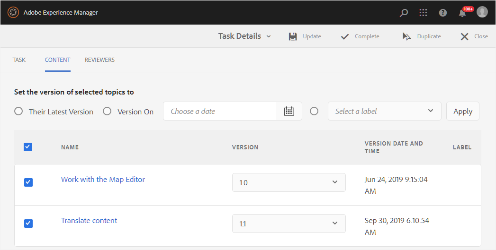
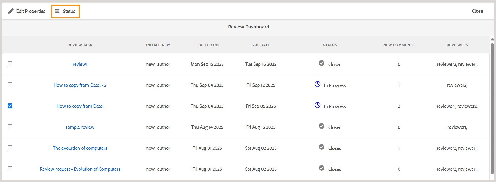
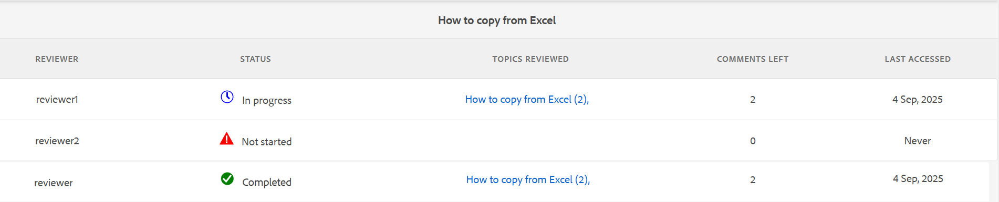

# レビューダッシュボードを使用したレビュータスクの管理 {#id2056B0Y70X4}

レビュー管理ワークフローには、様々なタスクを含めることができます。 例えば、特定のトピックにレビュー担当者を追加したり、レビューの期限を延長したりすることができます。 また、すべての関係者がフィードバックを行ったと思われる場合は、レビュータスクを「完了」としてマークすることもできます。 これらのタスクは、レビューダッシュボードで管理できます。

レビューダッシュボードにアクセスして使用するには、次の手順を実行します。

>[!NOTE]
>
> 作成者\（またはイニシエータ\）であるプロジェクトに対してのみ、レビュータスクを管理できます。 レビュー担当者または発行者\（ユーザー\）であっても、どのプロジェクト タスクにもアクセスできません。

1. **プロジェクト** コンソールで、管理するレビュープロジェクトを選択します。

   タスクタイルを含むプロジェクトパネルが表示されます。

   

   >[!NOTE]
   >
   > または、エディターの左側のパネルからプロジェクトダッシュボードに直接アクセスすることもできます。 [ レビューパネル ](./web-editor-left-panel.md#review)を開き、**レビューパネルに一覧表示されている各レビュープロジェクトに配置されている「**」アイコンを使用します。

1. **レビュー** タイルの3つのドットを選択します。

   レビューダッシュボードが表示されます。 ダッシュボードには、作成したすべてのレビュータスクが一覧表示されます。

   

   レビューダッシュボードには、タスク名、レビューを開始した人、レビューを開始した日付、期日、ステータス、作成者が承認または拒否した新しいコメントの数、レビュー担当者の名前など、レビュータスクに関する詳細が表示されます。 タスクは、新しく作成したタスクと古いタスクの順に表示されます。

   レビューダッシュボードの&#x200B;**ステータス** フィールドには、次のいずれかの値を表示できます。
   - **進行中**：これは、レビューがまだ進行中であることを示します。
   - **終了**：これは、レビュータスクが完了したことを示します。

   >[!NOTE]
   >
   > 「レビュータスク」リンクを選択すると、レビュー用に送信されたトピックまたはマップファイルが開きます。

1. レビュータスクを選択します。

   ツールバーに「プロパティを編集」オプションと「[ ステータス ](#check-review-status-id199RF0A0UHS)」オプションが表示されます。

1. 「**プロパティを編集**」を選択すると、「タスクの詳細」ページが表示されます。

   タスクの詳細ページには、「タスク」、「コンテンツ」、「レビュー担当者」の3つのタブがあります。 以下の節では、各タブで使用できるさまざまな機能について説明します。

## 「タスク」タブ

「**タスク**」タブでは、次のアクションを実行できます。

- 「**タイトル**」フィールドで、タスクのタイトルを変更します。
- **割り当て先** ドロップダウンリストにデフォルトの担当者を追加します。 ここで追加したレビュー担当者には、このレビュータスクに含まれるすべてのトピックをレビューするためのアクセス権が与えられます。 特定のトピックに追加するレビューアーを[ レビューアーのタブ ](#Reviewer-tab-id199RF0N0MUI)から削除するか、選択的に追加するかを選択できます。
- 「**説明**」フィールドでタスクの説明を更新します。
- **期日**&#x200B;を変更します。 タスクの完了期限を準備または延期できます。
- ユーザーが自分に割り当てられたトピックのみをレビューするようにユーザーを制限するには、このオプションを選択します。
- 変更された詳細を更新するには、**更新**&#x200B;を選択します。

  更新が成功したかどうかを確認するためのトーストメッセージが表示されます。
- 「**完了**」を選択して、レビュータスクを期日より前に完了としてマークします。 個々のトピックのタスクが「完了」とマークされると、選択したトピックのレビューは終了します。 ただし、DITA マップを通じてレビュー用に共有されたトピックの場合、DITA マップタスクを「完了」とマークすると、レビュー用に共有されたマップ内のすべてのトピックのレビューが閉じられます。
- 「**複製**」を選択して、レビュータスクのコピーを作成します。 重複レビュータスクの作成プロセスは、新しいレビュータスクの作成に似ています。 複製タスクのワークフローを起動すると、レビュータスクの作成ページが表示されます。 [ レビュー用のトピックを送信](review-send-topics-for-review.md#)で説明されているように、新しいタスクの詳細を指定する必要があります。

  DITA マップから作成されたレビュータスクを選択した場合、マップの一部であるトピックが表示されます。 次に、新しいレビュータスクに含めるトピックを選択できます。

  1つまたは複数のトピックのレビューからレビュータスクが複製された場合、レビュータスクリストにはそれらのトピックのみが表示されます。 これらのトピックをレビュー用に別のレビューアーのセットと共有することを選択できます。

- **閉じる**&#x200B;を選択して、受信トレイ ページに移動します。

## 「コンテンツ」タブ

「**コンテンツ**」タブでは、次のアクションを実行できます。

- レビュー用に送信したトピックのバージョンを変更します。 トピックの最新バージョン、日付ごとのバージョン、特定のラベルを含むバージョン、または特定のベースライン \（DITA マップの場合\）を含むバージョンを選択できます。

- **更新**&#x200B;を選択して、更新されたトピックのバージョンをレビュー担当者と共有します。 レビュー担当者には、新しいバージョンのトピックがレビュー用に送信されたことを知らせるメール通知が届きます。 レビュー担当者が次回トピックを開くと、更新されたトピックのバージョンが表示されます。

  >[!NOTE]
  >
  > トピックの更新バージョンの場合、古いコメントも新しいバージョンに保持されます。 レビューアーは、2つのバージョンの違いを確認することもできます。

- 「**完了**」を選択して、レビュータスクを期日より前に完了としてマークします。 個々のトピックのタスクが「完了」とマークされると、選択したトピックのレビューは終了します。 ただし、DITA マップを通じてレビュー用に共有されたトピックの場合、DITA マップタスクを「完了」とマークすると、レビュー用に共有されたマップ内のすべてのトピックのレビューが閉じられます。

- 「**複製**」を選択して、現在のタスクをベースとして使用して新しいレビュータスクを作成します。

## 「レビュー担当者」タブ {#Reviewer-tab-id199RF0N0MUI}

「**レビュー担当者**」タブでは、次の操作を実行できます。

- **すべてを選択**: トピックリストのすべてのトピックを選択します。 すべてのトピックを選択した後、バッチ操作を簡単に実行できます。
- **選択範囲をクリア**: トピック リストで選択したトピックの選択を解除します。

  >[!NOTE]
  >
  > トピックの横にあるチェックボックスを選択して、トピックを個別に選択または選択解除することもできます。

- **追加**：レビュー担当者を追加ダイアログを表示します。 選択したトピックにレビュー担当者として追加するレビュー担当者またはユーザーの役割\（またはグループ\）の名前を入力できます。
- **削除**：レビュー担当者を削除ダイアログを表示します。 選択したトピックからレビュアーとして削除するレビュアーまたはユーザーの役割\（またはグループ\）の名前を入力できます。
- **再割り当て**：レビュー担当者を再割り当てダイアログを表示します。 レビュータスクを割り当てるレビューアーまたはユーザーの役割\（またはグループ\）の名前を入力できます。 これにより、選択したトピックから既存のレビュー担当者がすべて削除され、新しく選択したレビュー担当者がそれらのトピックに割り当てられます。
- **書き出し**: レビュータスクの詳細をCSV ファイルに書き出すことができます。 このファイルには、トピックのパスとタイトル、レビュー担当者の名前、レビュー用に送信されたトピックのバージョンなどの詳細が含まれています。
- **レビュー担当者の編集**: トピックリストで アイコンを選択すると、レビュー担当者の編集ダイアログが表示されます。 選択したトピックのレビュー担当者を、このダイアログから追加または削除できます。

## レビュータスクのステータスの確認 {#check-review-status-id199RF0A0UHS}

Experience Manager Guidesでは、各レビュータスクに現在のステータスが反映されます。 レビューダッシュボードから、タスクを選択し、**ステータス** オプションを選択することで、この情報にアクセスできます。

{width="650"}

次に示すように、レビュータスクのステータスレポートが開きます。

{width="650"}

または、エディターの[ レビューパネル ](./web-editor-left-panel.md#review)からステータスレポートに直接アクセスできます。 レビューパネルからアクティブなレビュータスクを開き、**タスクを更新**&#x200B;を選択し、**レビューステータスを確認**&#x200B;を選択します。

レビュータスクのステータスレポートには、次の詳細が含まれます。

- レビュータスクが割り当てられているレビューアーの名前。
- 「ステータス」列には、レビューのステータスが表示されます。 ステータスは、次のいずれかになります。
   - **未開始**：レビュー担当者はまだレビュータスクを開いていません。
   - **進行中**：レビュー担当者はレビュータスクを開き、トピックをレビュー中です。
   - **完了**：レビュー担当者はレビューを完了し、レビューUIでタスクを「完了」とマークしました。 レビュータスクは、各レビューアーのAEM通知インボックスにあります。
- レビュー担当者がレビューリンクを開き、トピックのレビュー済みリストに追加された特定のトピックに移動すると、 これは、レビュー担当者がそれぞれのセクションを開いたかどうかを判断するのに役立ちます。 コメントが付いた場合は、角括弧で囲みます。
- すべてのトピックに対して行われたコメントの合計数。 レビュー中の複数のトピックの場合、各トピックのコメント数はトピック名に対して\（括弧で囲んで\）記載されます。
- レビュー担当者が最後にトピックにアクセスした日付。

**親トピック：**[ レビューの概要](review.md)
