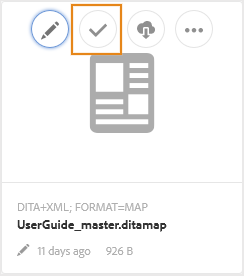

# レビュー用にトピックを送信 {#id199RD0S035Z}

レビューワークフローは、複数のレビュー担当者からなる環境を作成します。この環境において、開始者は、レビューの対象となるトピックのリストを指定し、複数のレビュー担当者を追加し、レビュータスクのタイムラインを割り当てます。 Adobe Experience Manager Guidesを使用すると、作成者および公開者グループに属するユーザーがレビューを開始できます。

レビューワークフローはプロジェクト固有なので、レビューの開始者はプロジェクトチームの一員であるか、プロジェクトを作成する権限を持っている必要があります。 プロジェクトの作成時に、プロジェクトのチームメンバーを定義し、様々な役割やグループを割り当てます。 プロジェクトの詳細については、[DITA プロジェクトの作成 ](authoring-create-dita-project.md#) を参照してください。

レビュータスクは、次の場所から作成できます。

- **Editor**：個々のトピックまたは DITA マップをレビュー用に送信できます。 レビュータスクを作成するワークフローは、エディターとAssets UI 全体で共通であることに注意してください。 レビューワークフローを起動する方法のみが異なります。 エディターからレビューワークフローを起動する方法については、エディターで [ レビュータスクを作成 ](web-editor-left-panel.md#review) 機能を参照してください。

- **Assets UI**: 1 つまたは複数のトピックと DITA マップをレビュー用に送信できます。 Assets UI ワークフローからのレビュー用ドキュメントの共有については、このトピックを参照してください。

Assets UI から、作成者または公開者がレビュータスクを作成する方法は 2 つあります。

- 1 つ以上のトピックをレビュー用に送信
- レビュー用に DITA マップから複数のトピックを送信

## 1 つ以上のトピックをレビュー用に送信 {#id1721E600FY4}

>[!IMPORTANT]
>
> レビュータスクを作成する前に、プロジェクトを作成し、レビュー担当者をそのプロジェクトに追加したことを確認してください。

レビュータスクを作成し、トピックをレビュー用に送信するには、次の手順を実行します。

>[!NOTE]
>
> レビュータスクを作成できるのは、DITA プロジェクトのオーサーまたはパブリッシャーの場合だけです。

1. Assets UI で対象のフォルダーに移動します。

1. クイックアクションで **選択** アイコンを選択し、レビュー用に送信するトピックを選択します。

   {width="300" align="left"}

1. ツールバーの「**レビュータスクを作成**」を選択します。 レビュータスク作成ページが表示されます。

   >[!NOTE]
   >
   > レビュータスクを作成できるのは、リビジョンが設定されているトピックのみです。 選択したトピックにリビジョンがない場合、プロンプトが表示されます。

   {width="650" align="left"}

1. タスクの **タイトル** を入力し、DITA プロジェクトを選択します。

1. 「**プロジェクト**」ドロップダウンフィールドで、このレビュータスクの DITA プロジェクトを選択します。 また、プロジェクト名を入力して、ドロップダウンリストですばやく見つけることもできます。

1. **割り当て先** ドロップダウンフィールドで、トピックをレビューのために送信するレビュー担当者を選択します。

   レビュータスクは、プロジェクトの個々のユーザーまたはユーザーグループに割り当てることができます。 なお、レビュータスクを個々のユーザーに割り当てることができるのは、プロジェクトの管理者グループに属する場合のみです。それ以外の場合は、ユーザーグループが「割り当て先」フィールドに表示されるだけです。

   >[!NOTE]
   >
   > レビューワークフローはプロジェクトに固有のものです。 プロジェクトを作成する場合は、チームメンバーをプロジェクトに追加して、グループに割り当てます。 したがって、ここでプロジェクトを選択すると、そのプロジェクトのメンバーを選択できます。 プロジェクトの詳細については、[DITA プロジェクトの作成 ](authoring-create-dita-project.md#) を参照してください。

1. タスクの **説明** を入力します。

   この説明は、レビュー担当者に送信される通知メールの本文として使用されます。

1. **期限** とレビューの期限をマークする時間を選択します。

   >[!NOTE]
   >
   > 期限に達すると、レビュータスクが完了したことを通知するメールがイニシエーターに送信されます。 イニシエーターは、[ レビューダッシュボード ](review-manage-tasks-review-dashboard.md#) からレビュータスクの期限を延長できます。

1. **ルートマップパス** からルートマップを選択します。 このルートマップは、レビューコンテンツで使用されるすべての主要な参照と用語集の用語を解決するために使用されます。 ルートマップを選択しない場合、DITA トピックに関連付けられた主要な参照または用語集の用語は、レビュー用にトピックを送信する前に解決されません。

   DITA マップのレビューを作成する場合、デフォルトでは **ルートマップパス** がそのマップのパスに設定されます。 1 つまたは複数のトピックのレビューを作成する場合、デフォルトでは、**ルートマップパス** はユーザーの環境設定で定義されたマップに設定されます。

   >[!NOTE]
   >
   > キー参照を解決する場合、選択したルートマップが最も優先されます。 詳しくは、[ キー参照の解決 ](map-editor-other-features.md#id176GD01H05Z) を参照してください。

1. 異なるレビュー担当者を異なるトピックに割り当てることができるように、「**担当者が任意のトピックをレビューすることを許可**」オプションは、レビュー担当者がレビュータスクのすべてのトピックをレビューできるか、レビュー担当者に割り当てられたトピックのみをレビューできるかを制御します。

   すべてのレビュー担当者がレビュータスクの任意のトピックをレビューできるようにする場合は、「**担当者がすべてのトピックをレビューできるようにする**」を選択します。

   このオプションを選択しない場合、「割り当て先 **フィールドに追加されたレビュー担当者は** 割り当てられたトピックのみをレビューするためのアクセス権を持ちます。

1. 「**次へ**」を選択します。

   「コンテンツ」ページが表示されます。

   {align="left"}

1. コンテンツ ページで、レビュー用に共有するトピックのバージョンを選択します。

   次のいずれかの方法でバージョンを選択できます。

   - *\（デフォルト\）* トピックの最後に保存されたリビジョンを選択するには、オプション **最新バージョン** を選択します。
   - 「**バージョン適用日**」オプションを選択し、指定した日時に従って、バージョンを選択する日時を指定します。 指定した日付に使用可能なトピックのバージョンがない場合は、指定した日時の直後に使用可能なバージョンが選択されます。
   - 「**ラベルを選択**」オプションを選択し、ドロップダウンリストからラベルを選択します。
1. バージョンの選択を選択した後、「**適用**」を選択します。

   選択したオプションに基づくバージョンが、トピックに対して選択されます。

   >[!NOTE]
   >
   > 各トピックの **バージョン** ドロップダウンリストから、目的のバージョンを手動で選択することもできます。

1. 「**次へ**」を選択します。

   レビュー担当者ページが表示され、レビュー担当者を追加または削除できます。 デフォルトでは、「割り当て先」フィールドに追加されたレビュー担当者は、レビュー用に選択された各トピックに自動的に追加されます。

   {width="650" align="left"}

1. 「レビュー担当者」ページで、レビュー担当者の追加または削除を行うことができます。 レビュー担当者ページでは、以下の操作を行うことができます。

   - **すべてを選択**：トピックリストのすべてのトピックを選択します。 すべてのトピックを選択した後で、バッチ操作を簡単に実行できます。
   - **選択をクリア**：トピックリストで選択されているトピックの選択を解除します。

     >[!NOTE]
     >
     > トピックの横にあるチェックボックスをオンにして、トピックを個別に選択または選択解除することもできます。

   - **追加**: 「レビュー担当者の追加」ダイアログを表示します。 選択したトピックにレビュー担当者として追加するレビュー担当者またはユーザーロールの名前を入力できます。
   - **削除**: レビュー担当者の削除ダイアログを表示します。 選択したトピックからレビュー担当者として削除するレビュー担当者またはユーザーロールの名前を入力できます。

     >[!NOTE]
     >
     > レビュー担当者のボックスでクロスサインを選択して、トピックからレビューを削除することもできます。

   - **再割り当て**: 「レビュー担当者の再割り当て」ダイアログを表示します。 レビュータスクの割り当て先となるレビュー担当者またはユーザーロールの名前を入力できます。 選択したトピックから既存のレビュー担当者がすべて削除され、新しく選択したレビュー担当者がそのトピックに割り当てられます。
   - **書き出し**：レビュータスクの詳細を CSV ファイルに書き出すことができます。 ファイルには、トピックのパスとタイトル、レビュー担当者の名前、レビュー用に送信されたトピックのバージョンなどの詳細が含まれています。
   - **レビュー担当者の編集**：トピックリストで  アイコンを選択すると、「レビュー担当者の編集」ダイアログが表示されます。 このダイアログでは、選択したトピックのレビュー担当者を追加または削除できます。
1. 「**作成**」を選択して、レビュータスクを作成します。

   レビュータスクが正常に作成されると、確認メッセージが表示されます。 レビュー用に送信されたトピックの [ ドキュメントの状態 ](web-editor-document-states.md#) は、レビュー中に設定されます。

   >[!NOTE]
   >
   > また、画面の右上にある通知ベルを選択し、レビュータスクが正常に作成されたことを確認することもできます。 通知パネルには、レビュータスクに含まれていたレビュー担当者ごとに 1 つの通知と、レビューの開始者に対して 1 つの通知が表示されます。

すべてのレビュー担当者に電子メールが送信され、1 つまたは複数のトピックがレビューのために割り当てられたことを通知します。 メールには、ブラウザーウィンドウでトピックにアクセスするために使用できる直接リンクが含まれています。

複数のトピックが割り当てられている場合、レビュー担当者は、web ブラウザーのトピックのドロップダウンリストでそれらを表示および選択できます。

## DITA マップからのレビュー用の複数のトピックの送信

DITA マップは、ブック内のトピックの論理的構成です。 レビュー用に個々のトピックを送信する場合、レビュー担当者は、ブック内のそのトピックの場所に関する情報を取得しません。 レビュー担当者は、レビュー対象のトピックの正確な場所に関する情報を持っている場合、レビュー対象のトピックのより詳細なコンテキストを取得できます。

Experience Manager Guidesを使用すると、DITA マップ内の 1 つ以上のトピックを同時にレビュー用に送信できます。 レビュー担当者は、レビュー用に共有されたトピックと共に、完全なマップ ファイルを表示します。 これにより、レビュー担当者はマップ ファイルまたはブック ファイル内のトピックのコンテキストを簡単に取得できます。

で同じ DITA マップを共有して、複数のレビュータスクでレビューできます。 たとえば、DITA マップにトピック A、B、C、D、E がある場合です。1 つのレビュータスクでは、レビュー用に A、B、C を共有でき、別のレビュータスクでは、レビュー用にトピック C、D、E を送信できます。 レビュープロセスでは、複数のレビュータスクで同じトピックとマップ ファイルを共有できます。 複数のレビュータスクの共通トピックでは、1 つのレビュータスクに入力されたコメントが、他のレビュータスクのコメントと上書きまたは結合されません。

>[!IMPORTANT]
>
> マップ ファイルのトピックが複数のレビュータスクで共有されている場合、すべてのレビュータスクが完了するまで、そのステータスは [ レビュー中 ] と表示されます。

1 つまたは複数のトピックをマップ ファイルとともに送信して確認するには、次の手順を実行します。

>[!IMPORTANT]
>
> マップ ファイルを使用してレビューを開始した後は、新しいトピックを追加したり、既存のトピックを削除したりして、マップ ファイルの構造を変更しないでください。

1. Assets UI で対象のフォルダーに移動します。

   >[!NOTE]
   >
   > コンソールの表示がカード表示またはリスト表示に設定されていることを確認します。

1. レビュー用にトピックを送信するマップを選択します。

1. ツールバーの「**レビュータスクを作成**」を選択します。 レビュータスク作成ページが表示されます。

1. タスクの **タイトル** を入力します。

1. 「**プロジェクト**」ドロップダウンフィールドで、このレビュータスクの DITA プロジェクトを選択します。 また、プロジェクト名を入力して、ドロップダウンリストですばやく見つけることもできます。

   >[!NOTE]
   >
   > レビュータスクを作成できるのは、リビジョンが設定されているトピックのみです。 リビジョンのないトピックがマップに含まれている場合は、そのようなファイルのリストを示すプロンプトが表示されます。 リビジョンのないファイルは、レビュータスクから除外されます。

1. **割り当て先** ドロップダウンフィールドで、トピックをレビューのために送信するレビュー担当者を選択します。

   レビュータスクは、プロジェクトの個々のユーザーまたはユーザーグループに割り当てることができます。 なお、レビュータスクを個々のユーザーに割り当てることができるのは、プロジェクトの管理者グループに属する場合のみです。それ以外の場合は、ユーザーグループが「割り当て先」フィールドに表示されるだけです。

   >[!NOTE]
   >
   > レビューワークフローはプロジェクトに固有のものです。 プロジェクトを作成する場合は、チームメンバーをプロジェクトに追加して、グループに割り当てます。 したがって、ここでプロジェクトを選択すると、そのプロジェクトのメンバーを選択できます。 プロジェクトの詳細については、[DITA プロジェクトの作成 ](authoring-create-dita-project.md#) を参照してください。

1. タスクの **説明** を入力します。

   この説明は、レビュー担当者に送信される通知メールの本文として使用されます。

1. **期限** とレビューの期限をマークする時間を選択します。

   >[!NOTE]
   >
   > 期限に達すると、レビュータスクが完了したことを通知するメールがイニシエーターに送信されます。 イニシエーターは、[ レビューダッシュボード ](review-manage-tasks-review-dashboard.md#) からレビュータスクの期限を延長できます。

1. 異なるレビュー担当者を異なるトピックに割り当てることができるように、「**担当者が任意のトピックをレビューすることを許可**」オプションは、レビュー担当者がレビュータスクのすべてのトピックをレビューできるか、レビュー担当者に割り当てられたトピックのみをレビューできるかを制御します。

   すべてのレビュー担当者がレビュータスクの任意のトピックをレビューできるようにする場合は、「**担当者がすべてのトピックをレビューできるようにする**」を選択します。

   このオプションを選択しない場合、「割り当て先 **フィールドに追加されたレビュー担当者は** 割り当てられたトピックのみをレビューするためのアクセス権を持ちます。

1. 「**次へ**」を選択します。

   コンテンツ ページが表示され、マップ ファイルから参照されるすべてのトピックが表示されます。 DITA マップにネストされたマップが含まれている場合、ネストされたマップのトピックもここに表示されます。

   {align="left"}

1. コンテンツ ページで、レビュー用に共有するトピックのバージョンを選択します。

   次のいずれかの方法でバージョンを選択できます。

   - *\（デフォルト\）* トピックの最後に保存されたリビジョンを選択するには、オプション **最新バージョン** を選択します。
   - 「**バージョン適用日**」オプションを選択し、日時を指定して、日時に従ってバージョンを選択します。 指定した日付に使用可能なトピックのバージョンがない場合は、指定した日時の直後に使用可能なバージョンが選択されます。
   - 「**ラベルを選択**」オプションを選択し、ドロップダウンリストからラベルを選択します。 選択したラベルを含むすべてのトピックが「**バージョン**」ドロップダウンリストで選択されます。
   - 「**ベースラインを選択**」オプションを選択し、ドロップダウンリストからベースラインを選択します。 選択したベースラインに含まれるすべてのトピックバージョンが **バージョン** ドロップダウンリストで選択されます。
1. バージョンの選択を選択した後、「**適用**」を選択します。

   選択したオプションに基づくバージョンが、トピックに対して選択されます。

   >[!NOTE]
   >
   > 各トピックの **バージョン** ドロップダウンリストから、目的のバージョンを手動で選択することもできます。

1. 「**次へ**」を選択します。

   レビュー担当者ページが表示され、レビュー担当者を追加または削除できます。 デフォルトでは、「割り当て先」フィールドに追加されたレビュー担当者は、レビュー用に選択された各トピックに自動的に追加されます。

1. 「レビュー担当者」ページで、レビュー担当者の追加または削除を行うことができます。 レビュー担当者ページでは、以下の操作を行うことができます。

   - **すべてを選択**：トピックリストのすべてのトピックを選択します。 すべてのトピックを選択した後で、バッチ操作を簡単に実行できます。
   - **選択をクリア**：トピックリストで選択されているトピックの選択を解除します。

     >[!NOTE]
     >
     > トピックの横にあるチェックボックスをオンにして、トピックを個別に選択または選択解除することもできます。

   - **追加**: 「レビュー担当者の追加」ダイアログを表示します。 選択したトピックにレビュー担当者として追加するレビュー担当者またはユーザーロールの名前を入力できます。
   - **削除**: レビュー担当者の削除ダイアログを表示します。 選択したトピックからレビュー担当者として削除するレビュー担当者またはユーザーロールの名前を入力できます。
   - **再割り当て**: 「レビュー担当者の再割り当て」ダイアログを表示します。 レビュータスクの割り当て先となるレビュー担当者またはユーザーロールの名前を入力できます。 選択したトピックから既存のレビュー担当者がすべて削除され、新しく選択したレビュー担当者がそのトピックに割り当てられます。
   - **書き出し**：レビュータスクの詳細を CSV ファイルに書き出すことができます。 ファイルには、トピックのパスとタイトル、レビュー担当者の名前、レビュー用に送信されたトピックのバージョンなどの詳細が含まれています。
   - **レビュー担当者の編集**：トピックリストで  アイコンを選択すると、「レビュー担当者の編集」ダイアログが表示されます。 このダイアログでは、選択したトピックのレビュー担当者を追加または削除できます。
   >[!IMPORTANT]
   >
   > レビュータスクを作成するには、少なくとも 1 人のレビュー担当者を割り当ててください。

1. 「**作成**」を選択して、レビュータスクを作成します。

   レビュータスクが正常に作成されると、確認メッセージが表示されます。 レビュー用に送信されたトピックの [ ドキュメントの状態 ](web-editor-document-states.md#) は、レビュー中に設定されます。

   >[!NOTE]
   >
   > また、インターフェイスの右上にある通知パネルを選択し、タスクが正常に作成されたことを確認することもできます。 通知パネルには、レビュータスクに含まれていたレビューごとに 1 つの通知と、レビューの開始者に対して 1 つの通知があります。

   >[!IMPORTANT]
   >
   > レビューを開始した後は、DITA マップまたはトピックを別の場所に移動または削除しないでください。 その場合は、レビュープロセスが中断されます。

レビュー用のトピックが割り当てられたことを通知するメールが、すべてのレビュー担当者に送信されます。 メールには、ブラウザーウィンドウでトピックにアクセスするために使用できる直接リンクが含まれています。 DITA マップとともにトピックがレビューモードで開きます。

## 進行中のレビュータスクへのトピックの追加または削除

レビュータスクの作成者または開始者は、レビューのワークフローに影響を与えずに、進行中のレビュータスクに新しいトピックを追加したり（まだレビュー用に送信されていない場合）、進行中のレビュータスクからトピックを削除したりできます。

進行中のレビュータスクにトピックを追加するには、以下の手順を実行します。

1. レビューパネルで、変更するレビュータスクに移動し、コンテキストメニューから **タスクの詳細を開く** を選択します。

   **タスクの詳細** ページが表示されます。

1. レビュータスクに現在含まれているトピックを表示するには、「**コンテンツ**」タブを選択します。
1. トピック リストを確認し、必要に応じて選択を変更します。

   - レビュー用に送信されていない新しいトピックを選択します。
   - レビュータスクから削除するトピックを選択解除します。

   >[!NOTE]
   >
   > 進行中のレビュータスクを更新するには、少なくとも 1 つのトピックが選択されたままになっている必要があります。

   

1. トピックリストを変更すると、対応する更新がタスクの詳細ページの **レビュー担当者** タブに自動的に反映されます。

   

   「レビュー担当者」タブで、更新したトピックリストをレビューします。 追加した新しいトピックについては、レビュータスクで「**担当者が任意のトピックをレビューすることを許可** 設定が有効になっていない限り、レビュー担当者を割り当てる必要があります。
1. 「**更新**」を選択します。

レビュータスクが更新されると、レビュー担当者は、レビューステータスに基づいて通知（AEMとメールの両方）を受け取ります。

- **処理中**：タスクに現在取り組んでいるレビュー担当者には、タスクが更新されたことを通知するメッセージが表示されます。
- **完了**：レビューを完了したレビュー担当者は、再レビューを要求する通知を受け取ります。

詳しくは、[ レビュー通知について ](./review-understanding-review-notifications.md) を参照してください。

**親トピック：**[ レビューの概要 ](review.md)
