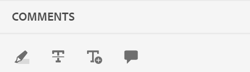

# トピックを確認 {#id2056B0W0FBI}

レビュー担当者には、レビュートピックへのリンクが記載されたレビューリクエストメールが届きます。 このリンクを使用して、共有トピックに関するフィードバックを追加できるレビューページにアクセスできます。

>[!NOTE]
>
> 通知からレビューリクエストにアクセスする際に、同じレビュープロジェクトに属する別のユーザーにレビューリクエストを再割り当てすることができます。 詳しくは、[ 通知を使用したレビュータスクの再割り当て ](./reassign-review-using-notification.md) を参照してください。

トピックをレビューするには、次の手順を実行します。

1. レビューリクエストのメールに記載されているダイレクトリンクを選択します。

   トピックまたはマップ リンクがブラウザで開きます。

   >[!NOTE]
   >
   > また、Adobe Experience Manager ユーザーインターフェイスのインボックス通知エリアから、トピックのレビューリンクにアクセスすることもできます。

1. トピックのレビューを開始する方法に応じて、次の 2 つの画面のいずれかを表示できます。

   >[!NOTE]
   >
   > でレビューを作成した場合、UI が異なる可能性があります。
   >
   > - Adobe Experience Manager Guides as a Cloud Service 2022 年 11 月リリース以前
   > - Adobe Experience Manager Guides バージョン 4.1 以前

   DITA マップを使用してレビューワークフローを開始すると、次の画面が表示されます。

   {align="left"}

   この画面では、次のオプションを使用できます。

   - **A**: レビュータスクの名前。
   - **B**: トピック ビューアイコンを選択して、トピック パネルの表示/非表示を切り替えます。

   - **C**：検索バーにタイトルまたはファイルパスのテキストの一部を入力することで、必要なトピックを検索できます。

     検索バーの近くにある  を選択して、すべてのトピックを表示するか、コメント付きのトピックを表示するかを選択します。 デフォルトでは、レビュータスクに存在するすべてのトピックを表示できます。

   - **D**：ここから目的のフィルターオプションを選択すると、***F*** でハイライト表示された数値をフィルターできます。 コメントは、タイプ、ステータス、レビュー担当者、バージョンでフィルタリングできます。 例えば、レビュー中の各トピックに作成された取り消し線コメントの数を表示するには、フィルターアイコンを選択して **レビュータイプ** \> **削除** を選択します。

     >[!NOTE]
     >
     > フィルターを適用すると、選択したフィルターに一致するコメントのみがコメントパネルに表示されます。 フィルターされたコメントの数は、トピックパネルの左側に表示されます。

   - **E**：現在のレビュー担当者にレビュー用に割り当てられているトピックが黒で表示され、選択できます。 レビュー担当者がトピックリンクを選択すると、そのトピックは画面の上部に移動します。
   - **F**：レビューできないトピックは灰色表示になっています。 トピックは読み取り専用モードで表示され、そのようなトピックに対するレビューコメントを追加することはできません。

   - **G**：トピックに対して受信したコメントの数。 この数値は、適用するフィルターに基づいて変わります。

   マップ内のすべてのトピックは、単一の複合ドキュメントとして表示されます。 レビュー担当者がレビューできるトピックは通常どおり表示されます。 レビューでレビューが許可されていないトピックは表示されません。

   {align="left"}

   上のスクリーンショットでは、一般的な説明のトピックが現在のレビュー担当者とレビュー用に共有されており、通常どおりに表示されています。 ただし、次のトピック「フライトコンテンツの履歴」は、レビュー用には共有されず、読み取り専用モードで表示されます。 現在フォーカスされているトピックは、目次でもハイライト表示されます。

   次の画面は、1 つまたは複数のトピックを選択し、レビュー用に共有すると表示されます。

   {align="left"}

   >[!NOTE]
   >
   > 複数のトピックがある場合、それらは 1 つの複合ドキュメントとしてドキュメントビューに表示されます。 上のスクリーンショットは、1 つのビューで順番に提示された 2 つの異なるトピックをハイライト表示しています。

1. ツールバーの右上隅にある **コメント** アイコンを選択して、コメントパネルを開きます。

   ツールバーから適切なコメントタイプを選択してレビューコメントを入力し、Enter キーを押してコメントを送信します。
コメントボックスでは複数行のエントリをサポートしており、ユーザーは必要に応じてコメントを展開して、詳細なフィードバックを提供できます。 コメントの作成中に次の行に移動するには、**Shift**+**Enter** を使用します。

   >[!NOTE]
   >
   > コメントパネルには、現在のトピックに対してのみ付与されたコメントが表示されます。 他のトピックにフォーカスを移動すると、他のトピックに付けられたコメントが表示されます。

1. トピックの確認が完了したら、「**閉じる**」ボタンを選択します。 「**閉じる**」ボタンを選択すると、レビュートピックにアクセスしたページにリダイレクトされます。

## レビュー画面で利用できるその他の機能

**ドキュメントビューとトピックビュー** - デフォルトでは、レビュー用に複数のトピックが共有されている場合、トピックの複合ドキュメントビューがレビュー担当者に表示されます。 DITA マップレビューの場合、マップ内のすべてのトピックが単一の文書の形式で表示され、ブックビューに似ています。 必要に応じて、特定のトピックを選択することもできます。選択したトピックのみがレビュー画面に表示されます。

1 つのトピックを表示すると、ドキュメントビューに戻す追加のオプションが表示されます。 次のスクリーンショットでは、マップ ファイルの特定のトピックがレビュー用に開かれています。 ハイライト表示されたオプション **ドキュメントビューを表示** を使用すると、マップファイルのドキュメントビューに戻すことができます。

>[!NOTE]
>
> 幅が 1,600 px を超える画面の解像度はすべて、デフォルトのパネル幅（左右）と互換性があり、水平スクロールバーが表示されず、ドキュメントビューでコンテンツが適切に配置されたままになることを保証します。 また、レビュー UI で適切なドキュメントビューを維持するために、常に画面のサイズを変更できます。

{align="left"}

**様々なタイプのコメントツールの操作** - テキストのハイライト表示、テキストの取り消し、テキストの挿入、コメントメモの追加を行うことで、インラインコメントを追加できます。 コメントツールバーには、様々なタイプのコメントツールが用意されています。以下にその例を示します。

{width="350" align="left"}

- **ハイライト表示** \（\）：ハイライト表示のコメントを追加するには、テキストを選択してハイライト表示アイコンを選択します。 または、最初にハイライトアイコンを選択してから、目的のテキストを選択できます。

  {width="650" align="left"}

  コメントパネルにポップアップが表示され、ハイライト表示されたコンテンツに対するコメントを追加できます。

- **取り消し線** \（\）: コンテンツの削除を提案する場合は、コンテンツを選択して取り消し線アイコンを選択します。 または、最初に目的のテキストを選択してから、削除キーを選択できます。

  コメントパネルにポップアップが表示され、削除したコンテンツに対するコメントを追加できます。

- **テキストを挿入** \（\）：テキストを挿入する場合は、「テキストを挿入」アイコンを選択し、テキストを挿入する位置にカーソルを置いて、情報を入力します。 または、テキストを挿入する位置にカーソルを置き、入力を開始します。 追加された情報は、緑色のフォントで表示されます。

- **コメントを追加**\（\）：付箋タイプのコメントを追加する場合は、「コメントを追加」アイコンを選択し、ポップアップにコメントを入力します。

**コンテキストツールバー**

また、コンテキストツールバーを使用して、テキストをすばやくハイライト表示したり、取り消し線を引いたりすることもできます。 コンテキストツールバーを使用してコメントを追加するには、次の手順を実行します。

1. ハイライト表示または取り消すテキストを選択します。 コンテキストツールバーが表示されます。

   {width="550" align="left"}

1. **ハイライト** または **取り消し線** アイコンを選択します。
1. コメントは、コメント パネルにハイライトまたは取り消し線のアクション用に追加できます。

**コメントパネルを使用したレビュー** - コメントパネルには、現在のトピックに付与されたコメントのリストが表示されます。 このパネルには、トピックが複数のレビュー担当者に送信された場合に、他のレビュー担当者からのコメントも一覧表示されます。 コメントパネル内の各コメントは、現在のトピック内の対応するテキストにリンクされています。 コメントされたテキストを識別するのに役立ちます。 各コメントには、コメントを追加したレビュー担当者の名前とタイムスタンプが表示されます。

コメントは、ドキュメント内のコメントされたテキストの順序で表示されます。 例えば、最初の段落の最初の文にハイライトコメントがあり、2 番目の文に最初の段落のテキストコメントが挿入されており、挿入されたテキストコメントの前にハイライトテキストコメントが表示されます。

コメントパネルを使用して実行できるタスクを以下に示します。

- コメントを選択すると、文書内の対応するコメントの場所が強調表示されます。
- コメントへの返信を追加できます。
- コメントパネルでコメントされたテキストを選択し、オプションメニューから **編集** を選択すると、独自のコメントを編集できます。
- コメントパネルでコメントを選択し、オプションメニューから「**削除**」オプションを選択すると、独自のコメントを削除できます。

  {width="300" align="left"}

  >[!NOTE]
  >
  > オプション メニューは、自分のコメントにカーソルを合わせた場合にのみ表示されます。 他のレビュー担当者によるコメントには表示されません。

- すべての参加ユーザーは、他のユーザーが送信したコメントに応答できます。 コメントで「**返信**」を選択し、Enter キーを押して応答を送信します。 返信ボックスは複数行で展開可能なので、ユーザーはコメントに対して詳細な返信を行うことができます。 返信を書いている間に次の行に移動するには、**Shift**+**Enter** を使用します。

**プレビューモード**

- プレビューモードでトピックを開くと、すべての変更を適用した後に作成者が表示したトピックの表示方法が表示されます。 例えば、挿入されたテキストはすべて通常のテキストとして表示され、\（deleted\） テキストから取り除かれたものはすべてコンテンツから削除されます。

- 次のスクリーンショットは、コンテンツを *レビュー* モードで示しています。

{width="550" align="left"}

次のスクリーンショットは、コンテンツを *プレビュー* モードで示しています。

{width="550" align="left"}

**コメントでタスクユーザーにタグを付ける**

複数のレビュー担当者とレビュータスクで共同作業する場合は、新しいコメントと返信の両方で特定のユーザーをタグ付けすることで、コミュニケーションを強化できます。 レビュー担当者は、同じレビュータスクに関与している他のユーザーをタグ付けしながら、コメントを開始したり、既存のコメントに返信して、注意を引いたり、フォローアップを割り当てたりできます。 この機能は、アクティブなレビュータスクでのみ使用できます。

>[!NOTE]
>
> レビュータスクに割り当てられたユーザーのリストを表示し、コメントにタグ付けするには、*ノードに対する* 読み取り `/home/users and /home/groups` アクセス権が必要です。 詳しくは、[ ユーザー管理とセキュリティ ](../cs-install-guide/user-admin-sec.md#additional-notes-on-user-groups) を参照してください。   アクセスを確認した後もタグ付けがそれでも使用できない場合は、この機能を有効にするために、管理者が `user-admin` ライセンスを割り当てる必要がある場合があります。

{width="350" align="left"}

タグ付けされたユーザーには、メールとAEM通知の両方が届き、迅速な通知が行われます。 通知のレビュートリガーの方法について詳しくは、[ レビュー通知について ](./review-understanding-review-notifications.md) を参照してください。

{width="350" align="left"}

**コメントへの添付ファイルの追加** -   他のファイルに含まれる追加情報を指定してコメントを補完する場合は、コメントを添付して補完できます。 レビュー担当者は、ローカルシステムから 1 つまたは複数のファイルを簡単にコメントに追加できます。 ファイルは、ハイライト、取り消し線、テキストの挿入、コメントなど、サポートされているすべての形式のコメントに追加できます。

任意のコメントを挿入すると、コメント用のポップアップが表示されます。 ポップアップに追加のコメントや情報を入力したら、Enter キーを押して送信します。 コメントを追加したら、そのコメントに添付ファイルを追加するオプションを使用できます。

{align="left"}

上のスクリーンショットでは、ドキュメントにハイライト表示のコメントのポップアップが含まれており、コメントはコメントパネルにも追加されています。 添付ファイルアイコン  は、両方の場所のコメントと共に使用できます。

次の手順を実行して、コメントに添付ファイルを追加します。

1. 添付ファイルを追加するコメントの *にある* 添付ファイルを追加  アイコンを選択します。

   ファイルを開くダイアログが表示されます。

1. 添付する 1 つまたは複数のファイルを選択します。

   コメントパネルに、選択したファイルがコメントと共に表示されます。

   コメントパネルでは、ファイル名とそのサイズを表示できます。 また、ファイル名に関連付けられている削除アイコン  を選択してファイルを削除するオプションもあります。

1. 「**送信**」を選択します。

   添付ファイルがアップロードされ、コメントに追加されます。

**添付ファイルの操作に関する追加の注意事項：**

- デフォルトでは、コメントが付いた 2 つのファイルのみが表示されます。 ファイルが多数ある場合、右側の **添付ファイルを表示** ボタンには、コメントに関連付けられているすべての添付ファイル\（2 つ以上）の数が表示されます。 この番号を選択すると、すべての添付ファイルを表示できます。 例えば、コメントを含む 4 つの添付ファイルがある場合、ボタンには+2 と表示されます。

{width="550" align="left"}

- 添付ファイルの上にマウスポインターを置くと、添付ファイルをダウンロードまたは削除するオプションが表示されます。 添付ファイルの削除は、次のスクリーンショットに示すように、現在のレビュー担当者がそのコメントを追加した場合にのみ使用できます。

{width="550" align="left"}

他のレビュー担当者または作成者には、添付ファイルのダウンロードオプションのみが表示されます。

{width="550" align="left"}

- **添付ファイルを表示** ダイアログから、コメントに関連付けられたすべての添付ファイルをダウンロードできます。 添付ファイルを選択し、コメントレベルで **ダウンロード** アイコンを選択します。

- **添付ファイルを表示** ダイアログから、コメントに関連付けられた添付ファイルを削除することもできます。 添付ファイルを選択し、「**削除** アイコンを選択します。

{width="550" align="left"}

**条件パネル** -   トピックに条件付きコンテンツがある場合は、右側に **条件** \（\） アイコンが表示されます。 **条件** アイコンを選択すると、条件パネルが開き、トピックで使用可能な条件に従ってコンテンツをハイライト表示できます。

:   デフォルトでは **すべての条件をハイライト表示** オプションが有効になっており、すべての条件が選択され、コンテンツ全体が表示され、条件付きコンテンツがレビューモードとプレビューモードの両方でハイライト表示されます。

:   「**すべての条件をハイライト**」オプションを無効にすると、トピックに存在するすべてのコンテンツがハイライト表示されずに通常のテキストで表示されます。

{width="350" align="left"}

特定の条件の表示/非表示を切り替えることができます。

- 条件を非表示にした場合、その条件を持つコンテンツはレビューモードでハイライト表示されません。
- 条件を表示すると、条件化されたコンテンツがレビューモードでハイライト表示されます。 例えば、次のスクリーンショットでは、コンテンツのみが 2 つの条件（`win` と `mac`）を使用しています。

{width="650" align="left"}

プレビューモードでは、表示される 2 つの条件（`win` と `mac`）を使用する、条件が設定されていないコンテンツと条件が設定されたコンテンツが表示されます。 条件が非表示になっている残りの条件付きコンテンツは表示されません。

**リアルタイムレビュー** -   コメントパネルは、コメントと、コメントに対する作成者のフィードバックまたはアクションを使用してリアルタイムで更新されます。

- 複数のレビュー担当者が、同じドキュメントにコメントを残したり、コメントに返信したりできます。 画面の右上隅にあるユーザーアイコンにマウスポインターを置くと、現在ドキュメントをレビューしているユーザーを確認できます。

- トピックが複数のレビュータスクの一部である場合、あるタスクで作成されたコメントは別のタスクでは表示されません。

- 期限切れのコメント アイコン \（\）を選択すると、ドキュメントの最新バージョンとコメントされたバージョンの違いが表示されます。 バージョン番号\（比較中のバージョンの\）がドキュメントの上部に表示されます。

  {align="left"}

  >[!NOTE]
  >
  > 期限切れのコメント アイコンの上にマウスポインターを置くと、コメントが追加されたトピックのバージョン番号が表示されます。 例えば、バージョン 1.0 にコメントが付けられた場合は、同じことが表示されます。

- 古いコメントを選択すると、左側のパネルにそのコメントのバージョンが開きます。 左側のパネルには以前のバージョンが、右側のパネルには現在のバージョンが表示されます。 古いバージョンに関するすべてのコメントが左側に読み込まれます。 以前のバージョンと現在のバージョンを比較できます。

**コメントをフィルター** -   必要に応じて、ドキュメント内のコメントをフィルタリングして、特定のコメントを表示することができます。 コメントをフィルタするには、コメントパネルの「コメントを検索」テキストボックスの右側のメニューに表示される **フィルタ** アイコン \（\）を選択します。

**フィルタータイプ** ダイアログで、次のフィルタリングオプションを 1 つ以上選択して **適用** を選択します。

- **レビュータイプ** - コメントタイプ（ハイライト、削除、挿入、コメント）に基づいてフィルタリングします。
- **レビューのステータス** - コメントのステータス（承認済み、却下、なし）に基づいてフィルタリングします。
- **レビュー担当者** - レビュー担当者の名前に基づいてフィルタリングします。

- **バージョン** - トピックの特定のバージョンに対して受信したコメントに基づいてフィルタリングします。

  フィルターを使用すると、右側のパネルのコメントが選択内容に応じてフィルターされ、それに応じて左側のパネルのコメント数が更新されます。

フィルターを削除してすべてのコメントを表示するには、「**フィルタータイプ**」ダイアログからすべてのフィルターを選択解除して、「**適用**」を選択します。

**親トピック：**[ レビューの概要 ](review.md)
