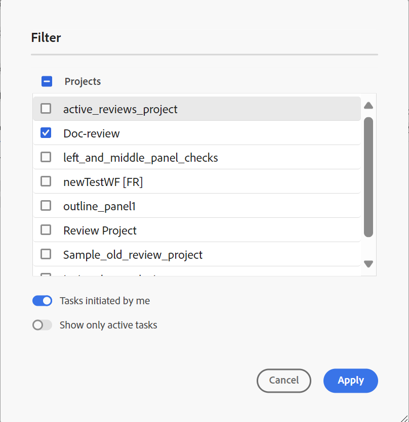
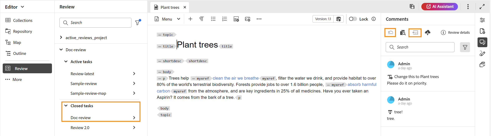

# 完了したレビュータスクの表示

作成者（またはイニシエータ）であるプロジェクトのレビュータスクを完了できます。 レビュータスクが完了すると、あなたとすべてのレビューアーは読み取り専用モードでレビュータスクにアクセスできます。

## レビュアーとして

レビュー担当者は、コメント パネルでインジケーターを表示して、レビューが終了したことを示すことができます。 コメントツールバーは表示されないので、ハイライト、取り消し、テキストの挿入、コメントの追加はできません。 コメントを読むことはできますが、コメントを編集したり削除したりすることはできません。 また、コメントに返信を追加することはできません。 コンテキストツールバーは表示できません（テキストのハイライト表示や取り消しに使用）。 古いコメントアイコンは、完了したレビュータスクにも表示されません。

ただし、コメントは検索またはフィルタリングできます。 条件の表示/非表示を選択し、それに応じて条件付きコンテンツを表示することもできます。 任意の添付ファイルをダウンロードできますが、コメントの添付ファイルをアップロードまたは削除することはできません。

## 作成者として

完了したレビュータスクは、**レビュー** パネルのプロジェクトレベルで、**クローズ済みタスク** セクションから表示できます（スクリーンショットを参照）。 プロジェクトに基づいてレビュータスクを検索またはフィルタリングできます。 例えば、**フィルター** ダイアログボックスで特定のプロジェクトを選択し、アクティブなレビューパネルに表示できます。 さらに、自分が開始した&#x200B;**タスク**&#x200B;および&#x200B;**アクティブなタスクのみを表示** オプションを使用して、結果をフィルタリングできます。

クローズ済みレビュータスクの場合、コメントを読むことはできますが、コメントを承認または却下することはできません。 コメントは編集または削除できません。 コメントに返信を追加することはできません。 完了したレビュータスクに対して、「古いコメント」アイコンと「作成者ビューにコメントを読み込む」アイコンは表示されません。 スクリーンショットに示すように、レビュータスクが完了すると、「トピックを元に戻す」アイコンと「読み込み」アイコンが無効になります。

レビューパネルに表示されているコメントを検索またはフィルタリングすることもできます。 任意の添付ファイルをダウンロードできますが、コメントの添付ファイルをアップロードまたは削除することはできません。

そのため、レビュー担当者または作成者は、レビュー済みのコンテンツをコメントとともに表示できますが、完了したレビュータスクに変更を加えることはできません。
