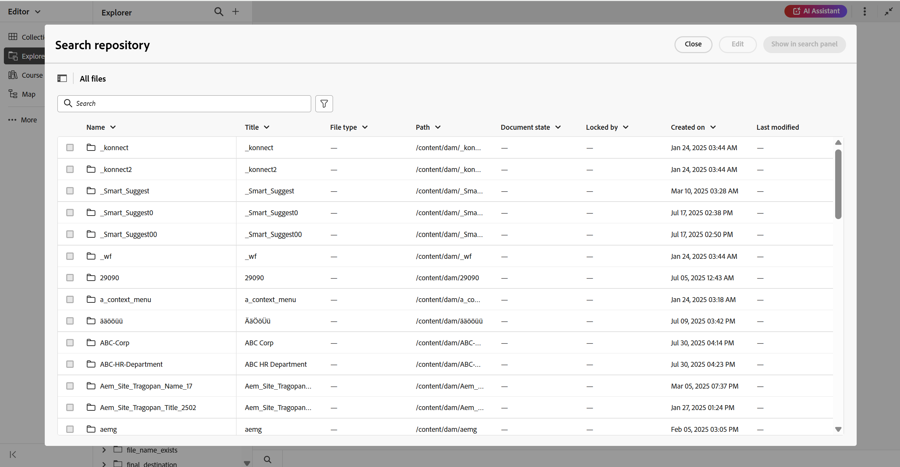
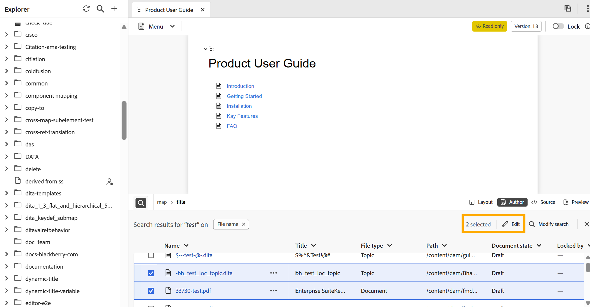

# 検索パネル

エディターの検索パネルでは、検索語に基づいて表示されるファイルのサブセットや、コンテンツの編集時に適用されるフィルターにすばやくアクセスできるため、生産性が向上します。 トピックやマップにドラッグ&amp;ドロップするだけで、1つまたは複数の検索されたファイルを簡単に開いたり、既存のファイル内で使用したりできます。 エディターの下部にある&#x200B;**検索パネル**&#x200B;を見つけることができます。

検索パネルには、次の場所からアクセスできます。

- **エディターインターフェイス**: **エクスプローラーパネル**&#x200B;から&#x200B;**検索アイコン**&#x200B;を選択するか、**コンテンツ編集領域**&#x200B;の左下隅にある&#x200B;**検索アイコン**&#x200B;を使用します。 詳しくは、「[ エクスプローラーパネルからの検索](#search-from-the-explorer-panel)」を参照してください。

  

- **ホームページ**: ホームページのリポジトリインターフェイスから移動する際に、**検索パネルで表示** オプションを使用する。 詳細ビューについては、[ リポジトリから検索](#search-from-the-repository-interface-on-the-home-page)してください。

  

## 主な特長

- あらゆる検索結果を一元管理し、容易に参照。
- ドラッグ&amp;ドロップ機能により、現在のトピックやマップに直接参照を挿入できます。
- エディターを離れることなく、検索を修正または調整するための柔軟なオプション。

## エクスプローラーパネルからの検索

エディターインターフェイスで作業する場合、必要な関連ファイルのサブセットを表示するために、一連のファイルをフィルタリングできます。 エクスプローラーからファイルを検索するには、次の手順を実行します。

1. **エクスプローラーパネル**&#x200B;の右上隅にある&#x200B;**検索** アイコンまたは&#x200B;**コンテンツ編集領域**&#x200B;の左下にある&#x200B;**検索** アイコンを選択します。 これにより、**リポジトリの検索** ダイアログが開き、ホームページのリポジトリインターフェイスと同じ検索とフィルタリングのエクスペリエンスが提供されます。

   >[!NOTE]
   >
   >現在のセッションから既に一部の検索結果が存在する場合は、エクスプローラーの&#x200B;**検索アイコン**&#x200B;またはコンテンツ編集領域の左下にあるアイコンを選択すると、以前の結果を表示するパネルが開きます。 検索を更新または調整するには、**検索を変更**&#x200B;を選択します。

   

2. 必要に応じて検索を実行し、フィルターを適用します。 検索とフィルターのオプションについて詳しくは、[検索とフィルターのエクスペリエンス ](./home-page-repository-view.md#search-and-filter-experience)を参照してください。

3. 検索が完了したら、**検索パネルに表示**&#x200B;を選択します。 その後、最近検索した内容がエディター下部の検索パネルに表示されます。

   

4. 検索結果を更新するには、検索パネルで「**検索を変更**」オプションを選択し、条件を更新して新しい結果を取得します。

   

検索結果が検索パネルに表示されたら、1つまたは複数のファイルをパネルから直接開いて編集するか、選択したファイルを既存のトピックまたはマップにドラッグ&amp;ドロップして参照を追加することで、検索結果を操作できます。

## ホームページのリポジトリインターフェイスから検索します

検索を実行し、ホームページのリポジトリインターフェイスでフィルターを適用すると、**検索パネルに表示**&#x200B;を選択すると、エディターインターフェイスにリダイレクトされます。 すべての検索結果は、エディターインターフェイスの下部にある検索パネルに反映されます。

検索パネルから、**現在のトピックに**&#x200B;個のファイルをドラッグ&amp;ドロップして、参照をシームレスに添付したり、複数のファイルを同時に編集したりできます。 さらに、検索パネルで使用できる「**検索を変更**」オプションを使用して、検索結果を絞り込むこともできます。

