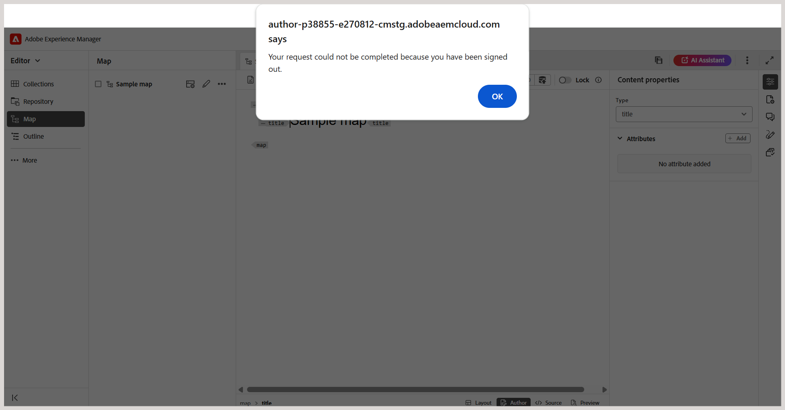

# Experience Manager Guidesが一定期間の経過後に私をログアウトさせるのはなぜですか？

Experience Manager Guidesは、無操作状態（アイドルタイムアウト）が定義された時間が経過すると、ユーザーセッションを終了します。 この自動ログアウト機能は、Adobe Experience Managerで設定されます。 セッションの有効期限が切れると、ポップアップアラートが表示され、期限切れのセッションについてユーザーに通知します。 このアラートは、ユーザーがそれ以上コンテンツに変更を加えることを制限します。

**セッションタイムアウトはどのように機能しますか？**

Experience Manager Guidesは、セッションを検証するため `token.json`30 秒ごとにバックグラウンドリクエストを送信します。 セッションがまだアクティブな場合は、有効なトークンが返されます。 非アクティブが原因でセッションの有効期限が切れた場合は、空のトークンが返され、セッションは非アクティブと見なされます。

**セッションの有効期限が切れるとどうなりますか？**

非アクティブなセッションが検出された場合：

- サインアウトされたことを通知するポップアップアラートが表示されます。

  

- アラートは、アプリケーションとのすべてのインタラクションを無効にします。

- **OK** を選択すると、ブラウザーが更新され、ログインページにリダイレクトされます。
- ログインすると、最後に開いたExperience Manager Guides ページにリダイレクトされます。

**次の手順**

セッションの有効期限アラートは、非アクティブなセッション中にアプリケーションに変更を加えることを制限することで、データの損失を防ぐのに役立ちます。 コンテンツが誤って失われるのを防ぐために、特に、システムから長時間離れる前に、作業をエディターで定期的に保存することをお勧めします。

