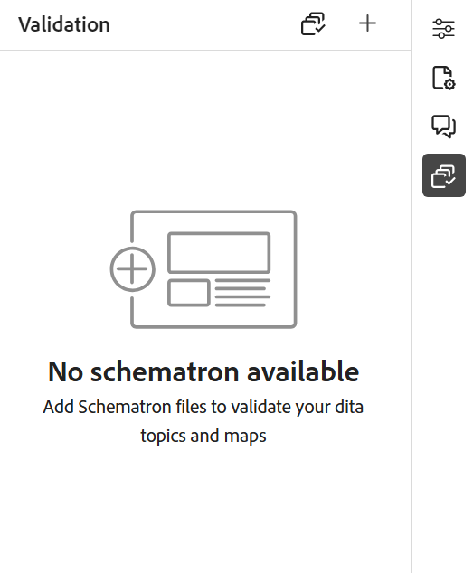
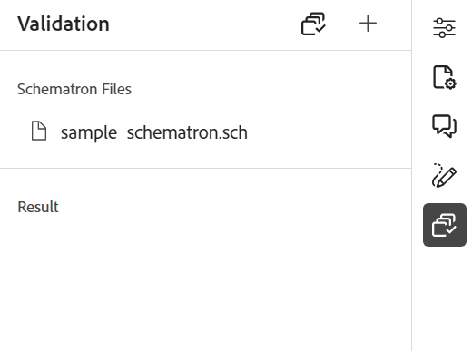

# Schematron ファイルのサポート

「スキーマトロン」は、XML ファイルのテストを定義するために使用される、ルールベースの検証言語を参照します。 エディターはスキーマトロンファイルをサポートします。 Schematron ファイルを読み込んで、エディターで編集することもできます。 Schematron ファイルを使用すると、特定の規則を定義し、DITA トピックまたはマップに対して検証できます。

>[!NOTE]
>
> エディターは、ISO スキーマをサポートします。


## Schematron ファイルの読み込み

次の手順を実行して、Schematron ファイルをインポートします。

{width="300" align="left"}

1. *リポジトリ* 内の必要なフォルダー（ファイルのアップロード先）に移動します。
1. **オプション** アイコンを選択してコンテキストメニューを開き、「**アセットをアップロード**」を選択します。
1. **アセットをアップロード** ダイアログの「**アセットフォルダーを選択**」フィールドで宛先フォルダーを変更できます。
1. **ファイルを選択** を選択し、スキーマトロンファイルを参照して選択します。 1 つ以上の Schematron ファイルを選択してから、**アップロード** を選択できます。

## DITA トピックまたはマップをスキーマトロンで検証

Schematron ファイルを読み込んだ後、エディターで編集できます。 Schematron ファイルを使用して、トピックまたは DITA マップを検証できます。 たとえば、DITA マップまたはトピックに次の規則を作成できます。

* DITA マップのタイトルを定義します。
* ある長さの短い説明が追加されました。
* マップには少なくとも 1 つの topicref が必要です。

エディターでトピックを開くと、右側にスキーマトロン検証パネルが表示されます。 次の手順を実行して、トピックを追加して検証するか、スキーマトロンファイルを使用してマップします。

{width="500" align="left"}

1. スケマトロンアイコン（）を選択して、スケマトロンパネルを開きます。
1. **Add Schematron File** を使用してスキーマトロンファイルを追加します。

   >[!NOTE]
   >
   > 無効なスキーマトロンファイルが追加されると、検証パネルにエラーメッセージが表示されます。

   {width="300" align="left"}

1. Schematron ファイルにエラーがない場合は、追加されて検証パネルに表示されます。 エラーを含む Schematron ファイルに対してエラーメッセージが表示されます。

   >[!NOTE]
   >
   >Schematron ファイル名の近くにあるクロスアイコンを使用して、削除できます。

1. 「**スキーマトロンで検証**」を選択して、トピックを検証します。

   * トピックが規則を破らない場合、ファイルの検証成功メッセージが表示されます。
   * 例えば、トピックにタイトルが含まれておらず、上記のスキーマトロンで検証されている場合など、トピックがルールに違反すると、検証エラーが表示されます。

1. エラーメッセージを選択して、開いているトピック/マップ内のエラーを含む要素をハイライト表示します。

エディターのスキーマトロンのサポートは、一連のルールに対してファイルを検証し、トピック全体で一貫性と正確性を維持するのに役立ちます。

## assert ステートメントと report ステートメントを使用してルールをチェックする{#schematron-assert-report}

Experience Manager Guidesは、スキーマトロンの assert 文と report 文もサポートしています。 これらの文は、DITA トピックの検証に役立ちます。

### アサート文

assert ステートメントは、test ステートメントが false と評価された場合にメッセージを生成します。 例えば、タイトルを太字にする場合は、そのアサート文を定義できます。

```XML
<sch:rule context="title"> 
    <sch:assert test = "b"> Title should be bold </sch:assert>
  </sch:rule>
```

Schematron を使用して DITA トピックを検証すると、タイトルが太字でないトピックに関するメッセージが表示されます。

### 報告書

テストステートメントが true と評価されると、report ステートメントがメッセージを生成します。 たとえば、簡単な説明を 150 文字以下にする場合、レポート ステートメントを定義して、簡単な説明が 150 文字を超えるトピックをチェックできます。
Schematron を使用して DITA トピックを検証すると、report 文が true と評価されるルールの完全なレポートが得られます。 そのため、短い説明が 150 文字を超えるトピックに対しては、メッセージが表示されます。


```XML
<sch:rule context="shortdesc"> 
        <sch:let name="characters" value="string-length(.)"/> 
        <sch:report test="$characters &gt; 150">  
        The short description has <sch:value-of select="$characters"/> characters. It should contain more than 150 characters.      
        </sch:report>   
    </sch:rule> 
```

>[!NOTE]
>
> Schematron ルールを記述する際は、Xpath 2.0 式のみを使用します。

## 正規表現式の使用{#schematron-regex-espressions}

正規表現を使用して、matches （）関数を含むルールを定義し、Schematron ファイルを使用して検証を実行することもできます。

例えば、タイトルに 1 つの単語しか含まれていない場合に、メッセージを表示するために使用できます。

```XML
<assert test="not(matches(.,'^\w+$'))"> 
No one word titles.
</assert>  
```


## 抽象パターンの定義{#schematron-abstract-patterns}

Experience Manager Guidesは Schematron の抽象パターンもサポートしています。 一般的な抽象パターンを定義すると、これらの抽象パターンを再利用できます。  実際のパターンを指定するプレースホルダーパラメーターを作成できます。


抽象パターンを使用すると、ルールの重複が減り、検証ロジックの管理と更新が容易になるので、スキーマトロンスキーマを簡略化できます。 また、複雑な検証ロジックを単一の抽象パターンで定義して、スキーマ全体で再利用できるので、スキーマが理解しやすくなります。


例えば、次の XML コードでは、抽象パターンが作成され、実際のパターンでは ID を使用して参照されます。

```XML
<sch:pattern abstract="true" id="LimitNoOfWords"> 

<sch:rule context="$parentElement"> 

<sch:let name="words" value="string-length(.)"/> 

<sch:assert test="$words &lt; $maxWords"> 

You have <sch:value-of select="$words"/> letters. This should be lesser than <sch:value-of select="$maxWords"/>. 

</sch:assert>  

<sch:assert test="$words &gt; $minWords"> 

You have <sch:value-of select="$words"/> letters. This should be greater than <sch:value-of select="$minWords"/>. 

</sch:assert>  

</sch:rule> 

</sch:pattern> 

<sch:pattern is-a="LimitNoOfWords" id="extend-LimitNoOfWords"> 

<sch:param name="parentElement" value="title"/> 

<param name="minWords" value="1"/> 

<param name="maxWords" value="8"/> 

</sch:pattern> 
```
