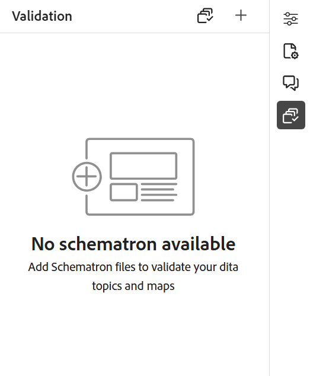

# Schematron ファイルのサポート

「Schematron」とは、XML ファイルのテストを定義するために使用されるルールベースの検証言語を指します。 エディターはSchematron ファイルをサポートしています。 スキーマトロンファイルを読み込み、エディターで編集することもできます。 Schematron ファイルを使用すると、特定のルールを定義し、DITA トピックまたはマップに対して検証できます。

>[!NOTE]
>
> エディターはISO Schematronをサポートしています。


## Schematron ファイルのインポート

Schematron ファイルを読み込むには、次の手順を実行します。

1. *リポジトリ*&#x200B;の必要なフォルダー（ファイルをアップロードする場所）に移動します。
1. **オプション** アイコンを選択してコンテキストメニューを開き、**アセットのアップロード**&#x200B;を選択します。
1. **アセットをアップロード** ダイアログで、**アセットフォルダーを選択** フィールドで宛先フォルダーを変更できます。
1. 「**ファイルを選択**」を選択し、参照してSchematron ファイルを選択します。 1つ以上のSchematron ファイルを選択し、**アップロード**&#x200B;を選択できます。

## SchematronでDITA トピックまたはマップを検証する

Schematron ファイルを読み込んだ後、エディターで編集できます。 スキーマトロンファイルを使用して、トピックまたはDITA マップを検証できます。 例えば、DITA マップまたはトピックに対して次のルールを作成できます。

* タイトルはDITA マップ用に定義されます。
* 特定の長さの短い説明が追加されました。
* マップには少なくとも1つのtopicrefが必要です。

エディターでトピックを開くと、右側にスキーマトロン検証パネルが表示されます。 Schematron ファイルを使用してトピックまたはマップを追加および検証するには、次の手順を実行します。

{width="350"}

1. Schematron アイコンを選択して、Schematron パネルを開きます。
1. **スキーマトロンファイルを追加**&#x200B;を使用してスキーマトロンファイルを追加します。

   >[!NOTE]
   >
   > 無効なSchematron ファイルが追加されると、検証パネルにエラーメッセージが表示されます。

   {width="350"}

1. Schematron ファイルにエラーがない場合は、追加され、検証パネルに一覧表示されます。 エラーを含むSchematron ファイルのエラーメッセージが表示されます。

   >[!NOTE]
   >
   >Schematron ファイル名の近くにあるクロスアイコンを使用して、削除できます。

1. 追加されたSchematron ファイルを使用してトピックを検証するには、**検証**&#x200B;を選択します。

   * トピックでルールが壊れていない場合は、ファイルの検証成功メッセージが表示されます。
   * 例えば、トピックがルールを壊し、タイトルが含まれておらず、上記のSchematronに対して検証されている場合、検証エラーが表示されます。

   >[!NOTE]
   >
   > 検証結果は、Schematron ファイルで定義されたロール属性に基づいて表示されます。 詳細については、[検証結果とサーバーリティレベルについて](#understanding-validation-results-and-serverity-levels)を参照してください。

1. エラーメッセージを選択して、開いたトピック/マップ内のエラーを含む要素を強調表示します。

エディターのSchematron サポートは、一連のルールに照らし合わせてファイルを検証し、トピック全体で一貫性と正確性を維持するのに役立ちます。

## 検証結果とサーバーリティレベルについて

検証結果は、Schematron ファイルで定義されたロール属性に基づいて表示されます。 問題は`Fatal`、`Error`、`Warn`または`Info`に分類され、検証パネルに各カテゴリの表示数が表示されます。

{width="350"}

問題の重大度を判断するには、対応するSchematron ファイルで定義されたロール属性の&#x200B;_case-senstive_&#x200B;値が評価されます。

次のスニペットは、Schematron ルールで定義されたサポートされるロール属性値を示しています。

* `<sch:assert role="error" test="@id">Element must have an ID.</sch:assert>`
* `<sch:report role="info" test="not(@alt)">Image should have an alt attribute.</sch:report>`
* `<sch:assert role= "fatal" test="b"> Bold must be there in <sch:name/> element</sch:assert>`
* `<sch:assert role= "warn" test="b"> Recommended formatting is missing in <sch:name/> element</sch:assert>`

役割の属性が指定されていない場合、またはサポートされていない値が使用されている場合は、検証パネルで問題が`Error`として分類されます。 この動作は、ロール属性を定義しない既存のSchematron ファイルにも適用されます。この場合、すべての問題は`Error`の下にグループ化されます。

**ファイルの保存シナリオ**

ファイルの保存は、[Workspace settings](../cs-install-guide/workspace-settings.md#validation)でファイル **設定を保存する前に**&#x200B;検証チェックを実行するかどうかによって異なります。

* 有効にすると、`Fatal`または`Error` レベルの問題が解決されるまで、ファイルを保存できません。
* 無効にすると、検証チェックは実行されず、`Fatal`または`Error` レベルの問題が存在する場合でも、ファイルを保存できます。

## ルールを確認するには、assert ステートメントとreport ステートメントを使用します{#schematron-assert-report}

Experience Manager Guidesは、Schematronのassert ステートメントとreport ステートメントもサポートしています。 これらのステートメントは、DITA トピックの検証に役立ちます。

### アサートステートメント

アサートステートメントは、テストステートメントがfalseと評価されたときにメッセージを生成します。 例えば、タイトルを太字にする場合は、アサートステートメントを定義します。

```XML
<sch:rule context="title"> 
    <sch:assert test = "b"> Title should be bold </sch:assert>
  </sch:rule>
```

Schematronを使用してDITA トピックを検証すると、タイトルが太字ではないトピックのメッセージが表示されます。

### Report statement

レポート文は、テスト文がtrueと評価されたときにメッセージを生成します。例えば、短い説明を150文字以下にする場合は、レポート文を定義して、短い説明が150文字以上のトピックを確認できます。
Schematronを使用してDITA トピックを検証すると、レポートステートメントがtrueと評価されるルールの完全なレポートが取得されます。そのため、短い説明が150文字を超えるトピックのメッセージが表示されます。


```XML
<sch:rule context="shortdesc"> 
        <sch:let name="characters" value="string-length(.)"/> 
        <sch:report test="$characters &gt; 150">  
        The short description has <sch:value-of select="$characters"/> characters. It should contain more than 150 characters.      
        </sch:report>   
    </sch:rule> 
```

>[!NOTE]
>
> Schematron ルールの書き込み中は、Xpath 2.0式のみを使用します。

## 正規表現の使用{#schematron-regex-espressions}

正規表現を使用してmatches （）関数でルールを定義し、Schematron ファイルを使用して検証を実行することもできます。

例えば、タイトルに1つの単語しか含まれていない場合は、メッセージを表示するのに使用できます。

```XML
<assert test="not(matches(.,'^\w+$'))"> 
No one word titles.
</assert>
```

## 抽象パターンを定義する{#schematron-abstract-patterns}

Experience Manager Guidesは、Schematronの抽象パターンもサポートしています。 一般的な抽象パターンを定義して、これらの抽象パターンを再利用できます。  実際のパターンを指定するプレースホルダーパラメーターを作成できます。


抽象パターンを使用すると、ルールの重複を減らし、検証ロジックの管理と更新を簡単にすることで、Schematron スキーマを簡素化できます。 また、スキーマ全体で再利用できる単一の抽象パターンで複雑な検証ロジックを定義できるため、スキーマを理解しやすくなります。


例えば、次のXML コードは抽象パターンを作成し、実際のパターンはIDを使用して抽象パターンを参照します。

```XML
<sch:pattern abstract="true" id="LimitNoOfWords"> 

<sch:rule context="$parentElement"> 

<sch:let name="words" value="string-length(.)"/> 

<sch:assert test="$words &lt; $maxWords"> 

You have <sch:value-of select="$words"/> letters. This should be lesser than <sch:value-of select="$maxWords"/>. 

</sch:assert>  

<sch:assert test="$words &gt; $minWords"> 

You have <sch:value-of select="$words"/> letters. This should be greater than <sch:value-of select="$minWords"/>. 

</sch:assert>  

</sch:rule> 

</sch:pattern> 

<sch:pattern is-a="LimitNoOfWords" id="extend-LimitNoOfWords"> 

<sch:param name="parentElement" value="title"/> 

<param name="minWords" value="1"/> 

<param name="maxWords" value="8"/> 

</sch:pattern> 
```
