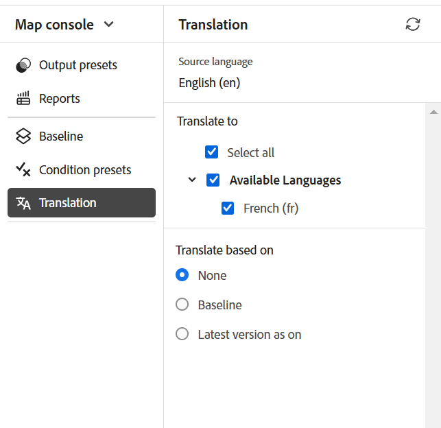
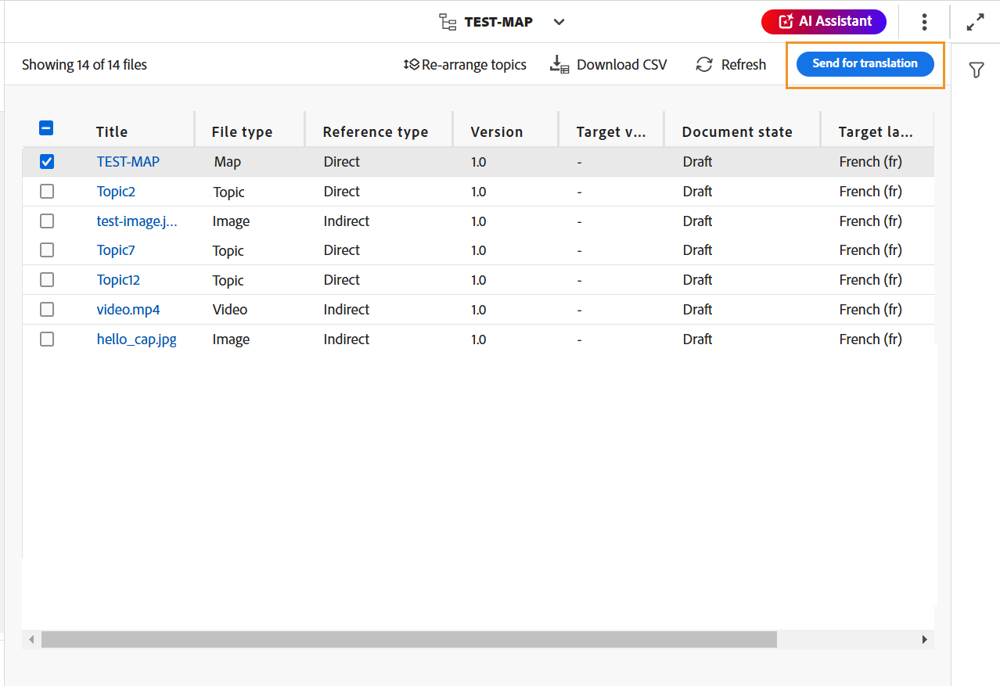
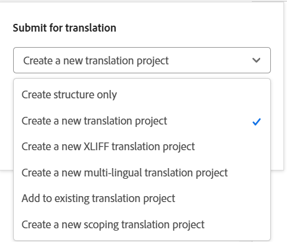
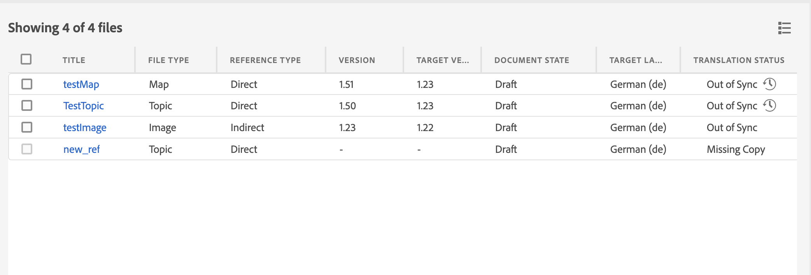

# マップコンソールからのドキュメントの翻訳 {#id21BKF0Z0YZF}

>[!TIP]
>
> Adobe Experience Manager Guides as a Cloud Service 2022年2月リリース以降にアップグレードした場合は、エディターからこの翻訳機能を使用することをお勧めします。

Experience Manager Guidesには、コンテンツを複数の言語に翻訳できる強力な機能がエディターに搭載されています。 新しい翻訳プロジェクトを作成し、後で翻訳ジョブを既存の翻訳プロジェクトに追加できます。 選択したすべての言語の翻訳ジョブを含む多言語翻訳プロジェクトを作成することもできます。

>[!NOTE]
>
> 管理者は、エディターで「管理」タブ \（翻訳に使用\）を設定できます。 詳しくは、「Adobe Experience Manager Guides as a Cloud Serviceのインストールと設定」の「*」セクションの「*&#x200B;翻訳機能の設定」を参照してください。

## 始める前に

この手順の手順を実行する前に、必要な言語ルートとターゲットフォルダーを作成していることを確認してください

1. ソースコンテンツを保存するルートフォルダーを作成します。 ルートフォルダーは、言語名\（英語など）または言語コード\（en\）で作成する必要があります。
1. コンテンツを翻訳する宛先フォルダーを作成します。 例えば、コンテンツをドイツ語またはフランス語に翻訳する場合は、-de \（ドイツ語\）または – fr \（フランス語\）という名前のフォルダーを作成する必要があります。

>[!NOTE]
>
> ルートフォルダーと宛先フォルダーは同じレベルで作成する必要があります。

## 翻訳プロジェクトを作成

1. **リポジトリ** パネルで、マップビューでDITA マップファイルを開きます。
1. 「**マップコンソールで開く**」アイコンを選択します。
1. マップコンソールページで、「**翻訳**」タブに移動します。 **翻訳パネル**&#x200B;には、使用可能な言語グループが表示されます。

1. ユーザーは、フォルダープロファイルに設定された言語グループを表示できます。 言語グループには、言語フォルダーとその言語コードが表示されます。 例えば、G1という言語グループには、イタリア語\（it\）、ドイツ語\（de\）、フランス語\（fr\）、英語\（en\）の言語フォルダーが含まれます。

   {width="300" align="left"}

   *ドキュメントを翻訳する言語グループまたは言語を選択します。*

   >[!IMPORTANT]
   >
   > ターゲットフォルダーを作成した言語は、ソース言語と並行して選択して翻訳することしかできません。 ソース言語フォルダーから1つ下のレベルなど、他のレベルで作成された言語フォルダーも表示されません。 すべてのターゲット言語フォルダーが、ソース言語フォルダーと同じレベルで作成されていることを確認します。

1. 翻訳のターゲットとして、任意の言語グループを選択できます。 **すべてを選択**&#x200B;すると、選択したファイルは、既存の言語グループ内のすべての使用可能な言語に翻訳されます。

   「言語フォルダー」オプションがグレー表示され、警告サインが表示されます。

   - 言語のターゲットフォルダーがない場合。
   - ターゲット言語がソースと同じ場合。

   >[!NOTE]
   >
   > 言語グループの作成後に言語のターゲットフォルダーを作成する場合は、ブラウザーを更新して、言語グループで言語を有効にします。

1. 特定の言語を選択すると、選択したすべての言語グループの下に選択済みとして表示されます。 そのため、どの言語にも翻訳すると、あらゆる言語グループに対して一括で翻訳されます。 例えば、G1とG2の両方の言語グループにドイツ語が存在する場合、両方に選択されます。

1. **その他の言語**&#x200B;から、ターゲットフォルダーを作成したが、どの言語グループにも含まれていない言語を選択できます。

1. 次のいずれかのオプションを選択して、プロジェクトを翻訳することもできます。

   **なし** ファイルのデフォルトバージョンを翻訳するには、このオプションを選択します。 このオプションはデフォルトで選択されています。

   **ベースラインを使用：** プロジェクトを翻訳するベースラインを選択できます。 「**ベースラインを使用**」を選択し、マップ上に作成されたベースラインを選択します。 選択したベースラインの一部であるすべてのファイルが翻訳ページに表示されます。 コンテンツが翻訳されたら、翻訳されたベースラインを書き出すことができます。 翻訳されたベースラインの書き出しについて詳しくは、[翻訳されたベースラインの書き出し](generate-output-use-baseline-for-publishing.md#id196SE600GHS)を参照してください。

   **最新バージョンを**&#x200B;として使用：作成日時に基づいてトピックのバージョンをフィルタリングすることを選択します。 日時を選択すると、選択した日時より前に作成されたファイルの最新バージョンのみが表示されます。

1. **適用**&#x200B;を選択します。 トピックと関連アセットの詳細を含むリストが表示されます。

   >[!NOTE]
   >
   > DITAVALおよびMarkdown ファイル参照を使用してマップを翻訳する場合、および翻訳が作業コピーに基づいている場合、画像やその他のリンクされたアセットなどの参照は、ソース言語フォルダーに存在する場合に含まれます。 これらの参照は、翻訳ダッシュボードの参照リストに表示され、翻訳用に明示的に選択できます。 翻訳時に、参照アセットはターゲット言語フォルダーにコピーされ、標準的な画像翻訳動作と一貫性を持って処理されます。

1. 翻訳用に送信するトピックを選択します。 次の列にトピックフィルタリングオプションを使用することもできます。

   - **タイトル**: ソースファイルのタイトル。  ソースファイルのタイトルにカーソルを合わせると、ターゲットファイルまたは翻訳済みファイルのタイトルが表示されます。
   - **ファイル名**：ソースファイルの名前
   - **ファイルの種類**: ソースファイルの種類。 使用可能なオプションは、マップ、トピック、画像です。
   - **参照タイプ**：直接参照または間接参照
   - **バージョン**：ソースファイルのバージョン番号。

     ファイルがまだバージョン付けされていない変更を保存している場合（つまり、マップ内に新しいバージョンとして保存されていない場合）、情報アイコンがファイルの横に表示され、バージョンなし変更が存在することを示します。

     {width="650" align="left"}

     >[!NOTE]
     >
     > バージョンのない変更を含むファイルのみを表示するには、フィルターパネルで「**バージョンのない変更を含むアセットのみを表示**」設定を有効にします。 さらに、バージョンなしインジケーターは、最新バージョンに基づいてファイルを翻訳する場合にのみ表示されます。

   - **バージョンラベル**：ソースファイルの選択したバージョンのラベル
   - **ターゲットバージョン**：ターゲットファイルのバージョン番号
   - **ドキュメントの状態**：ソースファイルの状態。 利用可能なオプションは、ドラフト、レビュー中、レビュー済みです。
   - **ターゲット言語**: ソースファイルを翻訳する言語
   - **翻訳ステータス**：使用可能なオプションは、同期なし、コピーが見つからない、処理中、同期中です。
   - **ターゲットラベル**：ターゲットファイルの選択したバージョンのラベル
1. 右上隅の「**翻訳用に送信**」を選択します。

   {align="left"}

1. ドロップダウンから、**新しい翻訳プロジェクトを作成**&#x200B;を選択します。

   {width="350" align="left"}

   新しい翻訳プロジェクトに加えて、次のオプションから選択することもできます。

   - 翻訳プロジェクトの構造を&#x200B;**作成のみ**&#x200B;を選択できます。
   - **新しいXLIFF翻訳プロジェクトを作成**&#x200B;して、XML コンテンツをXML Localization Interchange File Format （XLIFF）に変換できます。 XLIFFは、コンテンツ翻訳プロセスで使用される様々なツール間のデータ転送を標準化するために使用される、オープンなXML ベースの形式です。 Experience Manager GuidesはXLIFF バージョン 1.2をサポートしています。
XLIFF プロジェクトでは、コンテンツは業界標準のXLIFF形式に書き出され、翻訳ベンダーに提供できます。 XLIFF形式を使用すると、翻訳段階で既に翻訳したセグメントを再利用できます。\
     XLIFF コンテンツが翻訳されると、Experience Manager Guidesに読み込まれ、元のDITA プロジェクトの翻訳版を作成できます。

   >[!NOTE]
   >
   > XLIFF書き出しは、人間による翻訳設定でのみ機能します。

   - **翻訳用に選択したすべての言語の翻訳ジョブを含む、新しい多言語翻訳プロジェクト**&#x200B;を作成できます。 例えば、フランス語、ドイツ語、スペイン語を選択した場合、3つの言語すべての翻訳ジョブを含むプロジェクトが作成されます。
   - 既に翻訳プロジェクトがある場合は、そのプロジェクトにトピックを追加できます。 プロジェクト リストから「**既存の翻訳プロジェクトに追加**」オプションを選択し、既存の翻訳プロジェクト リストからプロジェクトを選択します。 これらのプロジェクトは、最新、昇順、降順で並べ替えることができます。

   - **既存の翻訳プロジェクトに追加**&#x200B;を選択した場合、この操作は、アセットが既に追加されており、関連する翻訳ジョブの状態が&#x200B;*ドラフト*&#x200B;状態である場合、プロジェクト内の既存のアセットエントリを更新します。
      - プロジェクトに宛先言語が存在しない場合は、単一言語翻訳プロジェクト用に新しいプロジェクトが作成され、多言語翻訳プロジェクト用に新しいジョブが作成されます。

      - ジョブが宛先言語に既に存在し、ジョブステータスが&#x200B;*ドラフト*&#x200B;状態にない場合、同じプロジェクト内に新しいジョブが作成され、翻訳用のアセットが追加されます。

   >[!NOTE]
   >
   > 既存のプロジェクトがスコーププロジェクトの場合、名前に「\（スコーピング\）」が追加されます。

   - 翻訳するプロジェクトのスコープを作成する必要がある場合は、**新しいスコープ翻訳プロジェクトを作成**&#x200B;を選択できます。 これにより、翻訳用のコピーは送信されず、ファイルの元の翻訳ステータスが維持されます。 スコーピング用に送信される参照トピックの宛先言語コピーに影響はありません。

1. 「**プロジェクトタイトル**」フィールドに、プロジェクトのタイトルを入力します。
1. **送信**&#x200B;を選択して、新しい翻訳プロジェクトを作成します。

選択したバージョンのトピックを含む新しい翻訳プロジェクトが作成されます。 このとき、翻訳プロジェクトが作成されたことを確認するポップアップメッセージが表示されます。 翻訳プロジェクトですべてのターゲット言語コピーを使用できるようになると、インボックスに通知が届きます。 翻訳プロジェクトでターゲット言語のコピーを使用できるようになったら、翻訳ジョブを開始します。 詳細ビューについては、[翻訳ジョブを開始](translation-first-time.md#id225IK030OE8)してください。

>[!NOTE]
>
> 翻訳ジョブ内の1つ以上のトピックの翻訳を拒否すると、拒否されたすべてのトピックの&#x200B;**進行中**&#x200B;翻訳ステータスが元のステータスに戻ります。 参照されたトピックのステータスは、最新の翻訳状態に従って確認され、元に戻されます。 また、宛先プロジェクトで作成された翻訳ファイルは、翻訳が拒否されても削除されません。

## 翻訳ルールの追加

Experience Manager Guidesでは、管理者が翻訳ルールを設定できます。 SRX （Segmentation Rules eXchange）形式は、異なるユーザーと異なる翻訳環境の間でセグメンテーションルールを交換するための標準です。 フォルダーを作成し、そのフォルダーにカスタム SRX ファイルを追加できます。

SRX ファイルには`<language-code>.srx`という名前を付ける必要があります。 例えば、en-US、またはar-AEです。

>[!NOTE]
> 
> タイトルでは大文字と小文字が区別されないので、「en-US」、「en-us」、「EN-us」を指定できます。 また、Experience Manager Guidesは「 – 」（ハイフン）または「_」（アンダースコア）を解決できます。 つまり、「en-US」または「en_US」を指定できます。

また、これらのファイルは、`./content/dam`であるAdobe Experience Manager assets ルートの任意のフォルダー内に格納できます。

SRX ファイルを含むフォルダーを作成したら、フォルダープロファイル内の翻訳SRXの場所の設定にフォルダーパスを追加できます。

パフォーマンスを向上させるには、フォルダープロファイルで設定されたフォルダー内にSRX ファイルのみを保持することをお勧めします。

Experience Manager Guidesは、翻訳プロジェクトのソース言語に従ってSRX ルールを選択します。 言語のカスタム SRX ファイルを探し、カスタム SRX ファイルを定義しない場合は、標準搭載の翻訳ルールに従ってルールを選択します。

グローバルおよびフォルダーレベルのプロファイルの設定について詳しくは、「Adobe Experience Manager Guides as a Cloud Serviceのインストールと設定」の「*オーサリングテンプレートの設定*」セクションを参照してください。

## バージョン ラベルをターゲット バージョンに渡します

Experience Manager Guidesでは、ソースファイルのラベルをターゲットファイルに渡すことができます。 これにより、翻訳されたファイルのソースバージョンを簡単に特定できます。

ターゲットコピーにソースバージョンラベルを追加するには、システム管理者が、**Workspace設定**&#x200B;の「**翻訳**」タブの「**ソースバージョンラベルをターゲットバージョン**」オプションに反映させる必要があります（**オンプレミス**&#x200B;の場合は&#x200B;**設定**&#x200B;と表示）。

例えば、バージョンラベル `Release 1.0`が適用された一部のソースファイルがある場合、翻訳されたファイルにソースラベル \（`Release 1.0`\）を渡すこともできます。

{width="650" align="left"}

>[!NOTE]
>
> ソースラベルは、1つのターゲットバージョンにのみ添付されます。 ソースラベルを別のバージョンに移動すると、最新のターゲットラベルに自動的に反映されます。

## 同期されていないファイルのバージョンの違いを表示する 

Experience Manager Guidesには、選択したバージョンと最後に翻訳されたトピックのソースバージョンの違いを確認する機能が用意されています。 変更に基づいて&#x200B;**同期されていない** ファイルを翻訳することを選択できます。

{width="650" align="left"}

トピックの&#x200B;**差分を表示** アイコン \（\）を選択して、最後に翻訳されたバージョンと選択したファイルの現在のバージョンの差分を表示します。

>[!NOTE]
>
> **差分を表示** アイコン \（\）は、翻訳ステータスが&#x200B;**同期なし**&#x200B;のDITA ファイルにのみ表示されます。

「**バージョンの違い**」ダイアログが表示されます。 左側には、**最後に翻訳されたバージョン**&#x200B;と&#x200B;**選択されたバージョン**&#x200B;の番号が表示されます。 プレビューウィンドウには、最後に翻訳されたバージョンと選択したバージョンのトピックの違いが表示されます。

{width="650" align="left"}

## 同期されていないアセットを破棄

一部のアセットに変更を加えると、それらのアセットは同期されなくなります。 変更したアセットを再翻訳するか、同期外ステータスを解除するかを選択できます。 例えば、翻訳の必要がない軽微な変更を行った場合、ステータスをIn Syncにマークできます。

同期解除ステータスを解除するには、次の手順を実行します。

1. ステータスを変更する非同期アセットを選択します。
1. 上部の「**同期でマーク**」ボタン \（\）を選択します。 同期&#x200B;**でマークを付けるダイアログが表示されます。**

   {width="550" align="left"}

1. 「**同期を強制**」を選択します。 選択した非同期アセットのステータスを「同期中」に設定します。

>[!NOTE]
>
> **同期でマーク** ボタン \（\）は、翻訳ステータスが「同期なし」のアセットにのみ表示されます。

## マップまたはトピックの進行中の翻訳プロジェクトの表示

翻訳ダッシュボード上の参照の一部は、処理中である可能性があります。 これらの参照には、**翻訳ステータス**&#x200B;列の下に&#x200B;**進行中** リンクがあります。 リンクを選択すると、**進行中プロジェクト** ダイアログが開きます。 ダイアログでは、選択した参照を含むすべての進行中の翻訳プロジェクト \（およびターゲット言語\）のリストを表示できます。

>[!NOTE]
>
> Adobe Experience Manager Guides as a Cloud Service 2023年2月リリース以降で作成された翻訳済みプロジェクトの「進行中」リンクを表示できます。

ダイアログで参照の名前を選択して、プレビューモードで開きます。 翻訳プロジェクトを選択して、翻訳を開始することもできます。

{width="550" align="left"}

## 完了した翻訳プロジェクトを自動的に削除または無効にする

>[!NOTE]
> 
>この機能は、Experience Manager Guides 2404 リリース以降を使用して作成する新しい翻訳プロジェクトで使用できます。  既存のプロジェクトには影響しません。

管理者は、**Workspace settings**&#x200B;の「**翻訳**」タブにある「**翻訳後の翻訳プロジェクトのクリーンアップ**」オプション（**オンプレミス**&#x200B;の&#x200B;**設定**）を使用して、翻訳プロジェクトを自動的に無効または削除するように設定できます。

ドキュメント管理を有効にするために、Experience Manager Guidesでは、翻訳が完了した後に翻訳プロジェクトを削除する機能が用意されています。

後で使用する場合は、翻訳プロジェクトを無効にすることもできます。 プロジェクトを削除すると、プロジェクトに存在するすべてのファイルとフォルダーが削除されます。 プロジェクトを無効にしても、削除はされませんが、リポジトリ内に保持されます。 ただし、無効なプロジェクトを更新または編集することはできません。  プロジェクトを削除または無効化しても、参照の翻訳ステータスには影響しません。

**親トピック：**&#x200B;[&#x200B; エディターの概要](web-editor.md)
