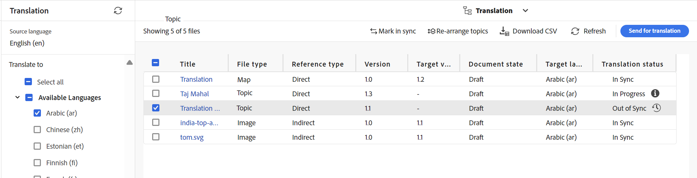

# 変更したトピックの翻訳 {#id16A5A0B6072}

一部のトピックで変更を加えた場合、それらのトピックは再翻訳が必要になります。 DITA マップから変更されたトピックを追跡できます。 ソース言語コピーフォルダーから、マップコンソールからDITA マップファイルを選択し、「翻訳」タブを選択します。 再翻訳が必要かどうかを問わず、各トピックのステータスを表示できます。

変更したトピックを再翻訳のために送信するには、次の手順を実行します。

1. エディターの&#x200B;**マップコンソール**&#x200B;から、ソース言語コピーフォルダーからDITA マップファイルを選択します。

1. 「**翻訳**」タブを選択します。

1. 左側の&#x200B;**翻訳** パネルで、ステータスを確認する&#x200B;**使用可能な言語**&#x200B;を選択し、**適用**&#x200B;を選択します。

   各トピックの翻訳ステータスを表示できます。 翻訳用に送信されたものよりも別のリビジョンのトピックが利用可能な場合は、**同期なし** ステータスが表示されます。

   >[!NOTE]
   >
   > 翻訳ワークフローは、ソース言語フォルダーに保存されたトピックファイルの最後に保存されたリビジョンと、翻訳されたバージョンを比較します。

   矢印を選択して詳細を表示すると、同期されていない特定の言語コピーを表示できます。

   

1. チェックボックスをオンにして、再翻訳のために送信するトピックを選択します。

   同期されていないトピックを選択すると、タイトルバーの上に「**同期でマーク**」ボタンが表示されます。

   「**同期でマーク**」ボタンを使用すると、DITA マップ内のトピックの同期外ステータスを上書きできます。  例えば、翻訳の必要がない軽微な変更を行った場合、ステータスをIn Syncにマークできます。

   >[!NOTE]
   >
   > 「**同期でマーク**」ボタンを選択すると、選択した非同期トピックのトピックステータスが「同期中」に設定されます。

1. 「**翻訳用に送信」ボタン**&#x200B;を選択できます。

1. 新しい翻訳プロジェクトを作成するか、既存の翻訳プロジェクトにトピックを追加するかを選択できます。 翻訳プロジェクトを設定するために必要な詳細を指定します。

1. 「**送信**」を選択します。

   トピックが翻訳用に送信されたことを示す確認メッセージが表示されます。

1. プロジェクトコンソールで翻訳プロジェクトに移動します。 新しい翻訳ジョブ カードがフォルダーに作成されます。 省略記号を選択して、フォルダーのアセットを表示します。

   {width="300"}

1. 翻訳を開始するには、翻訳ジョブ カードの矢印を選択し、リストから&#x200B;**開始**&#x200B;を選択します。 ジョブが開始されたことを知らせるメッセージが表示されます。

   翻訳ジョブカードの下部にある省略記号を選択すると、翻訳されるトピックのステータスを表示することもできます。

   >[!NOTE]
   >
   > 人間による翻訳サービスを使用している場合は、翻訳用にコンテンツを書き出す必要があります。 翻訳されたコンテンツが完成したら、それを翻訳プロジェクトに読み込む必要があります。

1. 翻訳が完了すると、ステータスは&#x200B;**レビューの準備完了**&#x200B;に変わります。 省略記号を選択してトピックの詳細を表示し、ツールバーから次のいずれかの操作を行います。

   - 「**Assetsで表示**」を選択して、翻訳を表示および検証します。

   - 変更が正しく翻訳されたと思われる場合は、**翻訳を受け入れる**&#x200B;を選択します。 確認メッセージが表示されます。

   - ジョブを再実行する必要があると思われる場合は、**翻訳を拒否**&#x200B;を選択します。 拒否メッセージが表示されます。

   >[!NOTE]
   >
   > 翻訳されたアセットを承認または却下することが重要です。そうしないと、ファイルは一時的な場所にとどまり、DAMにコピーされません。

1. Assets UIのソース言語フォルダーにあるDITA マップファイルに戻ります。 再翻訳されたトピックは同期しています。

**親トピック：**&#x200B;[&#x200B; コンテンツ翻訳の概要](translation.md)
