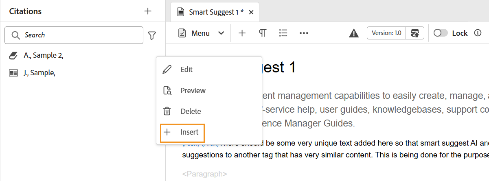

# コンテンツへの引用の追加と管理

引用は、コンテンツに追加された情報のソースへの参照です。 引用文献を使用すると、ソース情報の作成者にクレジットを付与し、読者がソース情報を追跡するのに役立ちます。 引用文を追加すると、コンテンツの信頼性が高まり、盗用を防ぐことができます。 また、よく研究されたコンテンツを表示することもできます。

Adobe Experience Manager Guidesでは、引用文を追加および読み込んで、コンテンツに適用できます。 これらの引用は、書籍、Web サイト、ジャーナルの任意のソースから追加できます。

Experience Manager Guidesでは、引用の編集、プレビュー、並べ替えを行うことができます。 コンテンツに引用文を追加したら、Native PDFを使用して出力を生成できます。 ネイティブのPDF出力に文献目録ページや参照ページを追加することもできます。

Experience Manager Guidesは、Modern Language Association （MLA）、American Psychological Association （APA）、Chicago、Institute for Electrical and Electronics Engineers （IEEE）、American Heart Association （AHA）など、複数のスタイルの引用をサポートしています。 これらは、明確かつ一貫して使用することをお勧めします。

>[!NOTE]
>
>現在、Experience Manager Guidesは、引用に対してネイティブ PDFのみをサポートしています。

## 引用文献の追加

引用を追加するには、次の手順に従います。

1. 左側のパネルで「**引用文献**  アイコンを選択します。

   **引用** パネルが開きます。

   {width="350" align="left"}

1. **引用** パネルで、「」を選択します。 ドロップダウンから、新しい引用を追加するか、引用を読み込むかを選択できます。

1. **新しい引用** を選択して、新しい引用を追加します。

   **引用文献を追加** ダイアログボックスが開きます。

   {width="300" align="left"}

1. **引用を追加** ダイアログボックスのフィールドに入力します。

   >[!NOTE]
   >
   >ISBN、DOI、PubMed ID も追加できます。 AEM Guidesによって、他のフィールドが自動的に設定されます。

   | 書籍 | Web サイト | ジャーナル |
   | --- | ---|---|
   | **Source**   ドロップダウンから、引用のソースを本として選択します。 | **Source**  ドロップダウンから、Web サイトとしての引用のソースを選択します。 | **Source**   ドロップダウンから、引用のソースをジャーナルとして選択します。 |
   | **検索条件**   ドロップダウンから **ISBN** または **DOI** を選択して、引用にリンクされたデジタル ID を検索します。    DOI:ISBN  デジタルオブジェクト Id：一意の数値ブック Id | **検索条件**   ドロップダウンから **DOI** を選択し、引用にリンクされたデジタル ID を検索します。 | **検索方法**   ドロップダウンから **DOI** または PubMed ID を選択して、引用にリンクされているデジタル ID を検索します。     |
   | **作成者**   引用文献の作成者の姓と名を追加します。 「」を選択すると、さらに名前を追加できます。 | **作成者**   引用文献の作成者の姓と名を追加します。 「」を選択すると、さらに名前を追加できます。 | **作成者**   引用文献の作成者の姓と名を追加します。  を選択すると、名前をさらに追加できます。 |
   | **タイトル**   本のタイトルを追加します。 | **タイトル**   web ページのタイトルを追加します。 | **タイトル**   記事のタイトルを追加します。 |
   | **編集者**   本の編集者を追加します。 | **Web サイト名**   Web サイトの名前を追加します。 | **雑誌名**   記事が見つかった作品のタイトルを追加します。 |
   | **エディション**   本のエディションを追加します。 | **URL**   コンテンツを参照する web サイトの Web リンクを追加します。 | **年**   記事が公開される年を追加します。 |
   | **市区町村**   公開の市区町村を追加します。 | **アクセス日**  web サイトのコンテンツにアクセスした日付を追加します。 | **ボリューム**   シリーズ内の作業のボリュームを追加します。 |
   | **発行者**   本の発行者の名前を追加します。 | **公開日**   web サイトのコンテンツを公開した日付を追加します。 | **数値**   系列内のボリュームの数値を追加します。 |
   | **年**   本が公開される年を追加します。 | **更新日**   web サイトのコンテンツを更新した日付を追加します。 | **ページ**   記事が見つかったページ番号またはページ範囲を追加します。 |
   | **バージョン**   ブックのバージョンを追加します。 | **一意の ID**   引用に一意の ID を追加します。 一意の ID は、その引用の一意の ID です。 | **URL** Web リンクをジャーナルに追加します。 |
   | **シリーズ**   本のシリーズを追加します。 |  | **一意の ID**   引用に一意の ID を追加します。一意の ID は、その引用の一意の ID です。 |
   | **URL**   ブックに Web リンクを追加します。 |
   | **一意の ID**   引用に一意の ID を追加します。 一意の ID は、その引用の一意の ID です。 |

1. 「**完了**」を選択します。

   新しい引用が引用パネルに追加されます。

>[!NOTE]
>
> 引用フィールドに一意の ID を追加する必要があります。  引用を追加した後は、一意の ID を変更できません。

## 引用文献のインポート

引用を読み込むには、次の手順に従います。

1. 左側のパネルで、「**引用** 」を選択します。

   **引用** パネルが開きます。

1. **引用** パネルで、「」を選択し、ドロップダウンから「**読み込み**」を選択します。
1. システムから.bib ファイルを参照して読み込みます。

   >[!TIP]
   >
   > .bib ファイル名の拡張子は、BibTeX Bibliographic Database ファイルです。 これは、特定の情報源に関する参照を一覧表示する特別にフォーマットされたテキストファイルです。

   ファイルが正常に読み込まれると、参照が引用パネルに表示されます。

   >[!NOTE]
   > <ol><li> Experience Manager Guidesでは、一意で既に存在しない引用のみを読み込みます。
    &gt; <li> Experience Manager Guidesでは、書籍、ジャーナルまたは web サイトから引用文を読み込むことができます。 現在、他のソースからの引用はサポートされていません。

## 引用の管理

左側のパネルでは、引用文献がアルファベット順に並べ替えられています。 トピックで使用するソースに応じて引用文を検索します。

### フィルター

検索バーの横にある「**フィルター**」  イコンを選択し、ドロップダウンリストからソースオプションを選択して引用リストをフィルタリングします。 1 つまたは複数の選択が可能です。

* **すべてのソース**：すべてのソースを含む引用の完全なリストが表示されます。

* **書籍**：書籍を元にした引用のリストを表示します。

* **Web サイト**:Web サイトから取得した引用のリストを表示します。

* **ジャーナル**：ジャーナルをソースとする引用のリストが表示されます。

### 検索

コンテンツの引用文献を検索します。

1. 左側のパネルで、「引用」を選択します。
**引用** パネルが開きます。

1. 検索バーを使用して、長いリストから適切な引用を検索します。

### 引用スタイルの変更 {#change-citation-style}

システム管理者は、**設定** の **一般** タブにある **引用** ドロップダウンから引用のスタイルを変更できます。
これらのスタイルによって、プレビューペインまたはネイティブのPDF出力での引用文献の表示方法が決まります。

ドロップダウンでは、次のオプションを使用できます。

| MLA | APA | シカゴ | IEEE | AHA |
|---|---|---|---|---|
| 現代語協会のスタイル   | アメリカ心理学会スタイル | シカゴのスタイルマニュアル | 電気電子技術者協会 | American Heart Association スタイル |
| 例：  Crawford, Claire, et al. *Emotional Content of Dark Memories*. Edited by Memory, vol 16, 2010, Amsterdam. | 例：  Crawford, C., J., &amp;, C.（2010）。 *Emotional Content of Dark Memories* （505-16 編） 10.1080/ 09658210902067289 | 例：  Crawford、Claire など *暗い思い出の感情的内容*。 505-16、2010。 | 例：  C. Crawford, J. , and C. *Emotional Content of Dark Memories* アムステルダム、2010 年。 | 例：  C. Crawford, J. , and C. *Emotional Content of Dark Memories* アムステルダム、2010 年。 |

## 引用を編集

引用を編集するには、次の手順に従います。

1. リストの引用文献の名前にポインタを合わせます。 「**オプション** アイコン  を選択します。

1. **編集** を選択します。

**引用文献の編集** ダイアログボックスが開きます。

1. 必要な変更を行います。「**完了**」を選択します。
選択した引用文献が編集されます。

>[!NOTE]
>
>引用を追加した後は、一意の ID を変更できません。

## 引用のプレビュー

引用をプレビューするには、次の手順に従います。

リストの引用文献の名前にポインタを合わせます。 を選択     **オプション** アイコンを  リックします。

1. **プレビュー** を選択します。
プレビューウィンドウで、引用の内容と形式をプレビューできます。

   >[!NOTE]
   >
   >プレビューは、管理者が **設定** で選択した引用スタイルに基づいています。

1. プレビューボックスを閉じるには、画面上の任意の場所を選択します。

   {width="550" align="left"}

>[!NOTE]
>
> また、Assets UI またはエディターの「プレビュー」タブで、トピックに挿入された引用をプレビューすることもできます。

## 引用文献の挿入

トピックに引用を挿入するには、次の手順を実行します。
1. リポジトリパネルでトピックを選択し、ダブルクリックして編集ウィンドウで開きます。
1. 引用を追加するトピックの場所にカーソルを置きます。

メインのツールバーまたは左側のパネルからトピックに引用文献を挿入できます。

### メインツールバーから

1. メインツールバーの「**引用文献**  アイコンを選択します。
1. **引用** ダイアログボックスで、引用を選択します。 複数の引用を選択することもできます。
   {width="300" align="left"}
1. 引用文献をフィルターするには、[ 引用文献 **] ダイアログ ボックスの検索パネルで最初の数文字を入力し** す。

1. 「**完了**」を選択します。
選択した引用文献は、トピックのカーソル位置に追加されます。

### 左パネルから

>[!NOTE]
> 
>左側のパネルから **引用** アイコンを表示するには、システム管理者が **設定** の **パネル** タブで **引用** オプションを有効にする必要があります。

1. 左側のパネルで **Citations**  アイコンを選択します。
1. **引用文献** パネルから引用文献をドラッグし、トピック内の適切な場所にドロップします。

   また、「**オプション**」から「**挿入**」  選択して、引用文を挿入することもできます。

   
1. 複数の引用を選択するには、トピック内の引用を右クリックし、ショートカット メニューから **引用を修正** を選択します。
1. **引用** ダイアログから、挿入する引用を選択します。
1. 「**完了**」を選択して、トピックに追加します。

トピックに引用文献を挿入したら、Web エディタで引用文献をプレビューできます。 また、Native PDFを使用して、引用付きのコンテンツを公開することもできます。

## 引用文献の削除

引用文献は、引用文献パネルまたは挿入したトピックから削除できます。

### 引用文献パネルからの引用文献の削除

引用文献パネルから引用文献を削除するには、次の手順に従います。

1. リストの引用文献の名前にポインタを合わせます。
1. 「 **オプション**」アイコンを選択します。
1. 「」を選択します   **削除** .
確認ダイアログボックスが開きます。
1. **はい** を選択します。
選択した引用文献が引用文献パネルから削除されます。

### トピックから引用文献を削除する

トピックで既に使用されている引用を削除するには、次の手順に従います。

トピックで、引用の最後にカーソルを置きます。

1. トピック内の引用を右クリックし、ショートカット メニューから **引用を修正** を選択します。 引用ダイアログが開きます。
   

1. ドキュメントに挿入する引用文献を選択できます。

   >[!NOTE]
   >
   >トピックで既に使用されている引用は、ダイアログから選択した引用に置き換えられます。

1. 「**完了**」を選択します。

## 引用を含んだコンテンツ出力の生成

トピックに引用文を挿入したら、Native PDFを使用して引用文を含むコンテンツを公開できます。

ネイティブ PDF出力では、引用文は、引用文を挿入したコンテンツ内に表示されます。 参考文献ページを作成することもできます。 引用文献を選択すると、文献目録ページにリダイレクトされます。

PDF テンプレートで **引用** ページレイアウトを作成し、ドキュメントに含めます。 本で使用されているすべての引用は、PDFの出力に表示される 1 ページにリストされます。 ページレイアウトの作成について詳しくは、[ ページレイアウトの作成 ](../native-pdf/components-pdf-template.md#create-page-layout) を参照してください。

引用文献ページの表示と操作性を変更するには、[[PDF テンプレートのカスタマイズ ](../native-pdf/pdf-template.md)] をクリックします。

### 引用に対するコンテンツスタイルの適用

トピックに追加された引用文献に書式を適用します。

1. ネイティブ PDF出力プリセットの **テンプレート** パネルで **スタイルシート** を選択します。   すべてのスタイルオプションを含む **スタイル** パネルが開きます。

1. 検索パネルで `<cite>` を検索します。

スタイルについて詳しくは、[ 共通のコンテンツスタイルの操作 ](../native-pdf/stylesheet.md) を参照してください。
