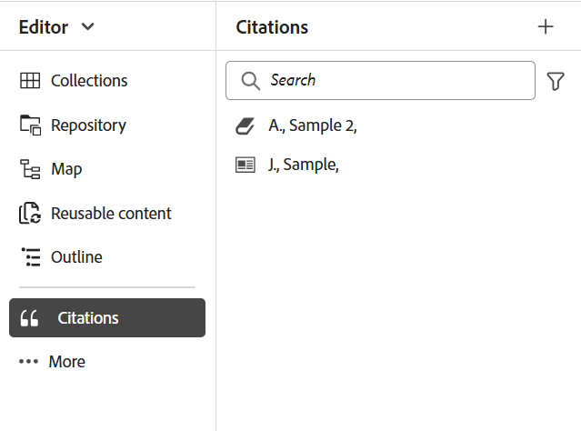
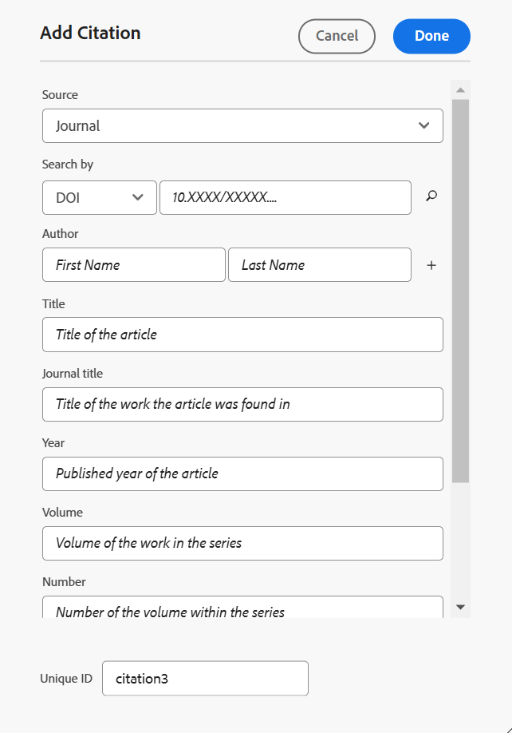
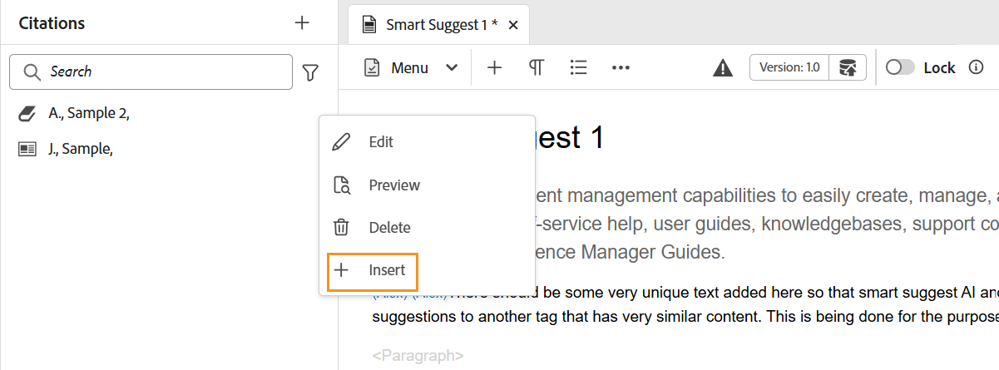
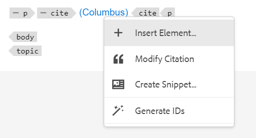

# コンテンツ内の引用の追加と管理

引用は、コンテンツに追加された情報のソースへの参照です。 引用を使用すると、ソース情報の作成者にクレジットを割り当て、読者がソース情報をフォローアップするのに役立ちます。 引用を追加すると、コンテンツの信頼性が向上し、盗用を防ぐことができます。 また、入念に調査されたコンテンツを表示することができます。

Adobe Experience Manager Guidesでは、引用を追加および読み込み、コンテンツに適用できます。 ブック、web サイト、ジャーナルの任意のソースからこれらの引用を追加できます。

Experience Manager Guidesでは、引用を編集、プレビュー、並べ替えできます。 引用をコンテンツに追加した後、ネイティブ PDFを使用して出力を生成できます。 また、ネイティブPDF出力に書誌ページや参照ページを追加することもできます。

Experience Manager Guidesは、Modern Language Association （MLA）、American Psychological Association （APA）、Chicago、Institute for Electrical and Electronics Engineers （IEEE）、American Heart Association （AHA）など、複数のスタイルの引用をサポートしています。 これらの用語を明確かつ一貫性のある方法で使用することをお勧めします。

>[!NOTE]
>
>現在、Experience Manager Guidesでは、引用に対するネイティブ PDFのみがサポートされています。

## 引用を追加

引用を追加するには、次の手順に従います。

1. 左側のパネルで「**引用** 」アイコンを選択します。

   **引用** パネルが開きます。

   {width="350" align="left"}

1. **引用** パネルで、を選択します。 ドロップダウンから、新しい引用を追加するか、引用を読み込むかを選択できます。

1. **New citation**&#x200B;を選択して、新しいcitationを追加します。

   **引用を追加** ダイアログボックスが開きます。

   web エディターの {width="300" align="left"}

1. **引用を追加** ダイアログボックスのフィールドに入力します。

   >[!NOTE]
   >
   >ISBN、DOI、またはPubMed IDを指定することもできます。 AEM Guidesは、その他のフィールドに自動的に入力します。

   | 書籍 | Web サイト | ジャーナル |
   | --- | ---|---|
   | **Source**   ドロップダウンから、ブックとして引用のソースを選択します。 | **Source**  ドロップダウンから、Web サイトとしての引用のソースを選択します。 | **Source**   ドロップダウンから、引用のソースをジャーナルとして選択します。 |
   | **検索方法**   ドロップダウンから&#x200B;**ISBN**&#x200B;または&#x200B;**DOI**&#x200B;を選択して、引用にリンクされたデジタル IDを検索します。    DOI: デジタルオブジェクト識別子  ISBN：一意の数値書籍識別子 | **検索方法**   ドロップダウンから&#x200B;**DOI**&#x200B;を選択して、引用にリンクされたデジタル IDを検索します。 | **検索条件：** <ul><li>ドロップダウンから&#x200B;**DOI**&#x200B;または&#x200B;**PubMed ID**&#x200B;を選択して、引用にリンクされたデジタル IDを検索します。</li><li>ドロップダウンから&#x200B;**任意のフィールド**&#x200B;を選択して、*タイトル*、*ジャーナル タイトル*、*作成者*、*年*、*ボリューム*、*数値*、*ページ*&#x200B;などのすべてのジャーナルフィールドを検索します。  検索では、入力されたテキストに基づいて、最も近い一致する引用が返されます。</li> |
   | **作成者**  引用の作成者の姓と名を追加します。 を選択して、さらに名前を追加します。 | **作成者**  引用の作成者の姓と名を追加します。 を選択して、さらに名前を追加します。 | **作成者**  引用の作成者の姓と名を追加します。 を選択して、さらに名前を追加します。 |
   | **タイトル**  本のタイトルを追加します。 | **タイトル**   Web ページのタイトルを追加します。 | **タイトル**  記事のタイトルを追加します。 |
   | **編集者**  本の編集者を追加します。 | **Web サイト名**   Web サイトの名前を追加します。 | **ジャーナルのタイトル**  記事が見つかった作品のタイトルを追加します。 |
   | **エディション**  本のエディションを追加します。 | **URL**   Web サイトのweb リンクを追加して、コンテンツを参照します。 | **年**  記事が公開された年を追加します。 |
   | **市区町村**  公開の市区町村を追加します。 | **アクセス日**  web サイトのコンテンツにアクセスする日付を追加します。 | **Volume**   シリーズ内の作業量を追加します。 |
   | **発行者**  本の発行者の名前を追加します。 | **公開日**   web サイトのコンテンツが公開される日付を追加します。 | **数値**  系列のボリュームの数を追加します。 |
   | **年**  本が公開された年を追加します。 | **更新日**   web サイトのコンテンツが更新される日付を追加します。 | **ページ**  記事が見つかったページ番号またはページ範囲を追加します。 |
   | **バージョン**  本のバージョンを追加します。 | **一意のID**  引用に一意のIDを追加します。 一意のIDは、その引用の一意のIDです。 | **URL**  Web リンクをジャーナルに追加します。 |
   | **シリーズ**   ブックのシリーズを追加します。 | | **一意のID**  引用の一意のIDを追加します。一意のIDは、その引用の一意のIDです。 |
   | **URL**   Web リンクをブックに追加します。 |  |  |
   | **一意のID**  引用に一意のIDを追加します。 一意のIDは、その引用の一意のIDです。 |  |  |

1. 「**完了**」を選択します。

   引用パネルに新しい引用が追加されます。

>[!NOTE]
>
> 引用フィールドに一意のIDを追加することは必須です。  引用が追加されると、一意のIDを変更することはできません。

## 引用の読み込み

引用を読み込むには、次の手順に従います。

1. 左側のパネルで、**引用** を選択します。

   **引用** パネルが開きます。

1. **引用** パネルで、を選択し、ドロップダウンから&#x200B;**読み込み**&#x200B;を選択します。
1. システムから.bib ファイルを参照して読み込みます。

   >[!TIP]
   >
   > .bib ファイル名拡張子は、BibTeXのBibliographical Database ファイルです。 これは、特定の情報源に関する参照をリストする、特別にフォーマットされたテキストファイルです。

   ファイルが正常に読み込まれたら、引用パネルで参照を表示できます。

   >[!NOTE]
   > <ol><li> Experience Manager Guidesは、一意で、まだ存在しない引用のみを読み込みます。
    &gt; <li> Experience Manager Guidesは、ブック、ジャーナル、またはWeb サイトから引用を読み込むことができます。 現在、他のソースからの引用はサポートしていません。

## 引用の管理

引用は、左側のパネルでアルファベット順に並べ替えられます。 トピックで使用するソースに従って引用を検索します。

### フィルター

検索バーの横にある&#x200B;**フィルター**  アイコンを選択し、ドロップダウンからソースオプションを選択して、引用リストをフィルタリングします。 単一と複数の選択の両方が可能です。

* **すべてのソース**：すべてのソースを含む引用の完全なリストが表示されます。

* **ブック**：ブックから取得した引用のリストが表示されます。

* **Web サイト**: Web サイトから取得した引用のリストが表示されます。

* **ジャーナル**：ジャーナルから送信された引用のリストが表示されます。

### 検索

コンテンツの引用を検索します。

1. 左側のパネルで、「引用」を選択します。
**引用** パネルが開きます。

1. 検索バーを使用して、長いリストから適切な引用を検索します。

### 引用スタイルを変更 {#change-citation-style}

システム管理者は、**設定**&#x200B;の「**一般**」タブの「**引用**」ドロップダウンから引用のスタイルを変更できます。
これらのスタイルは、プレビューペインまたはネイティブ PDF出力での引用の表示方法を決定します。

ドロップダウンでは、次のオプションを使用できます。

| MLA | APA | シカゴ | IEEE | AHA |
|---|---|---|---|---|
| 現代言語の関連付けスタイル   | アメリカ心理学会スタイル | シカゴ・マニュアル・オブ・スタイル | （社）電気電子技術者協会 | アメリカ心臓協会スタイル |
| 例：  Crawford, Claire, et al. *暗い記憶の感情的な内容*。Edited by Memory, vol 16, 2010, Amsterdam. | 例：  Crawford, C., J., &amp; , C. （2010）。 *暗い思い出の感情的な内容* （505-16編）。 10.1080/ 09658210902067289 | 例：  Crawford, Claire, et al. *暗い思い出の感情的なコンテンツ*。 505-16 2010年。 | 例：  C. Crawford, J.、C.、*暗い記憶の感情的コンテンツ*。 アムステルダム、2010年。 | 例：  C. Crawford, J.、C.、*暗い記憶の感情的コンテンツ*。 アムステルダム、2010年。 |

## 引用の編集

引用を編集するには、次の手順に従います。

1. リストから引用の名前にカーソルを合わせます。 「 オプション **」アイコンの「**」を選択します。

1. **編集**&#x200B;を選択します。

**引用を編集** ダイアログボックスが開きます。

1. 必要な変更を行います。**完了**を選択します。
選択した引用が編集されます。

>[!NOTE]
>
>引用が追加されると、一意のIDを変更することはできません。

## 引用のプレビュー

引用をプレビューするには、次の手順に従います。

リストから引用の名前にカーソルを合わせます。 Select      **オプション** アイコン。

1. 「**プレビュー**」を選択します。
プレビューペインで、引用の内容と形式をプレビューできます。

   >[!NOTE]
   >
   >プレビューは、管理者が&#x200B;**設定**&#x200B;で選択した引用スタイルに基づいています。

1. 画面の任意の場所を選択して、プレビューボックスを閉じます。

   {width="550" align="left"}

>[!NOTE]
>
> Assets UIまたはエディターの「プレビュー」タブから、トピックに挿入された引用をプレビューすることもできます。

## 引用の挿入

トピックに引用を挿入するには、次の手順を実行します。
1. リポジトリパネルでトピックを選択し、ダブルクリックして編集ウィンドウで開きます。
1. 引用を追加するトピックの場所にカーソルを置きます。

メインツールバーまたは左側のパネルから、トピックに引用を挿入できます。

### メインツールバーから

1. メインツールバーの&#x200B;**引用**  アイコンを選択します。
1. **引用** ダイアログボックスで、引用を選択します。 また、複数の引用を選択することもできます。
   {width="300" align="left"}
1. **引用** ダイアログボックスの検索パネルに最初のいくつかのアルファベットを入力すると、引用をフィルタリングできます。

1. **完了**を選択します。
選択した引用は、トピック内のカーソル位置に追加されます。

### 左側のパネルから

>[!NOTE]
> 
>左側のパネルから&#x200B;**引用** アイコンを表示するには、システム管理者が&#x200B;**設定**&#x200B;の&#x200B;**パネル** タブで&#x200B;**引用** オプションを有効にする必要があります。

1. 左側のパネルで「**引用** 」アイコンを選択します。
1. **引用** パネルから引用をドラッグし、トピック内の適切な場所にドロップします。

   **** オプション から&#x200B;**挿入**&#x200B;を選択して、引用を挿入することもできます。

   
1. 複数の引用を選択するには、トピック内の引用を右クリックし、ショートカットメニューから「**引用を変更**」を選択します。
1. **引用** ダイアログから挿入する引用を選択します。
1. 「**完了**」を選択して、トピックに追加します。

トピックに引用を挿入したら、エディターでそれらをプレビューできます。 また、ネイティブPDFを使用して、引用を含むコンテンツを公開することもできます。

## 引用の削除

引用パネルまたは挿入したトピックから引用を削除できます。

### 引用パネルからの引用の削除

引用パネルから引用を削除するには、次の手順に従います。

1. リストから引用の名前にカーソルを合わせます。
1.  **オプション** アイコンを選択します。
1. を選択します   **削除** 。
確認ダイアログボックスが開きます。
1. **はい**を選択します。
選択した引用は、引用パネルから削除されます。

### トピックからの引用の削除

トピックで既に使用されている引用を削除するには、次の手順に従います。

トピックで、引用文の最後にカーソルを置きます。

1. トピック内の引用を右クリックし、ショートカットメニューから「**引用を変更**」を選択します。 引用ダイアログが開きます。
   

1. 文書に挿入する引用を選択できます。

   >[!NOTE]
   >
   >トピックで既に使用されている引用は、ダイアログから選択した引用に置き換えられます。

1. 「**完了**」を選択します。

## 引用を含むコンテンツの出力を生成

トピックに引用を挿入したら、ネイティブ PDFを使用して引用を含むコンテンツを公開できます。

ネイティブ PDF出力では、引用文は挿入したコンテンツ内に表示されます。 また、参考文献ページを作成することもできます。 引用を選択すると、参考文献ページにリダイレクトされます。

PDF テンプレートで&#x200B;**引用** ページレイアウトを作成し、ドキュメントに含めます。 ブックで使用されているすべての引用が、PDF出力に表示される1 ページに一覧表示されます。 ページレイアウトの作成について詳しくは、[ ページレイアウトの作成](../native-pdf/components-pdf-template.md#create-page-layout)を参照してください。

引用ページの表示と操作性を変更するには、[PDF テンプレートのカスタマイズ ](../native-pdf/pdf-template.md)を表示します。

### コンテンツのスタイルを引用に適用

トピックに追加されたときに、引用に書式を適用します。

1. ネイティブ PDF出力プリセットの&#x200B;**テンプレート** パネルで「**スタイルシート**」を選択します。   すべてのスタイル設定オプションを含む&#x200B;**スタイル** パネルが開きます。

1. 検索パネルで、`<cite>`を検索します。

スタイルについて詳しくは、[共通のコンテンツスタイルを使用する](../native-pdf/stylesheet.md)を参照してください。
