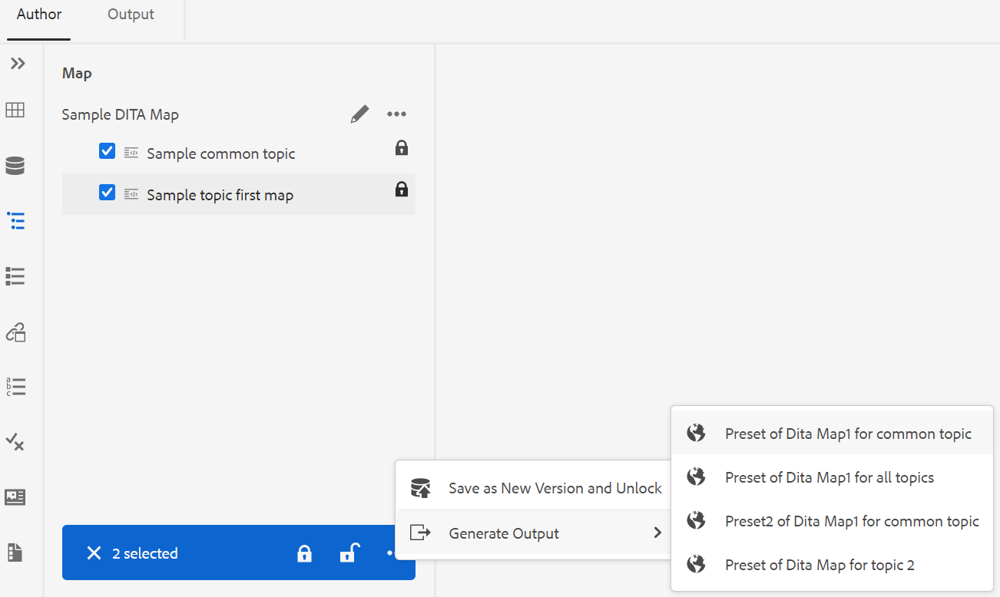

# リポジトリパネルまたはマップビューパネルからの出力を生成します。 {#id218CL6010AE}

>[!NOTE]
>
> 以前はAdobe Experience Manager Guidesで使用できた Quick Generate パネルは、バージョン 4.0 および 2502 から非推奨（廃止予定）になりました。 [ クイック生成 ] パネルにアクセスして、[ リポジトリ ] パネルまたは [ マップ ビュー ] パネルから出力を生成することはできません。

また、DITA マップ用に作成した出力プリセットを使用して、リポジトリパネルまたはマップビューパネルから出力を生成することもできます。

- リポジトリパネルまたはマップビューパネル内の **クイック生成** 機能を使用して、選択した単一のトピックまたは DITA マップ全体の出力を生成します。

  >[!NOTE]
  >
  > また、お気に入りパネルまたは検索パネルから **クイック生成** 機能にアクセスすることもできます。

- マップビューパネル内の **出力を生成** 機能を使用して、選択した複数のトピックの出力を生成します。

## 1 つまたは複数の DITA マップで使用されるトピックをパブリッシュする

次の手順を実行して、DITA マップ内の 1 つ以上のトピックの出力を生成します。

1. **Author** タブで、公開する DITA マップのトピックを選択します。

1. 選択したトピックのオプションメニューから「**クイック生成**」を選択します。
   {width="650" align="left"}

1. 単一の DITA マップで使用されているトピックを公開するには、公開に使用するマップの出力プリセットを選択し、「**生成**」をクリックします。
   {width="350" align="left"}

1. 出力生成プロセスのステータスが表示されます。 出力を表示するには、トピックの上にマウスポインターを置き、「出力を表示」をクリックします。

1. 複数のトピックで共通のトピックが使用されている場合は、各種の DITA マップと、公開に使用する出力プリセットを選択し、「**生成**」をクリックします。

   {width="350" align="left"}

1. 出力生成プロセスのステータスが表示されます。

   - **トピック**：出力を生成するトピックとして選択した項目の一覧が表示されます。
   - **プリセット**：選択したトピックを含む出力プリセットを表示します。
   - **マップ**：選択したトピックを含む DITA マップが一覧表示されます。
   - **ステータス**：各トピックの公開ステータスを表示します。
出力を表示するには、トピックの上にマウスポインターを置き、「出力を表示」をクリックします。
     {width="800" align="left"}

## Web エディタからの DITA マップの出力の生成

次の手順を実行して、DITA マップ全体の出力を生成します。

1. **Author** タブで、公開する DITA マップを選択します。

1. DITA マップの「オプション」メニューから「**クイック生成**」を選択します。

   {width="650" align="left"}

1. 公開に使用する DITA マップの出力プリセットを選択し、「**生成**」をクリックします。

1. 出力生成プロセスのステータスが表示されます。 出力を表示するには、トピックの上にマウスポインターを置き、「出力を表示」をクリックします。

## 複数のトピックに対する出力の生成

次の手順を実行し、DITA マップ内の複数のトピックの出力をマップビューパネルから生成します。

1. **作成者** タブで、公開するトピックを選択します。

1. 下部のオプションメニューから「**出力を生成**」を選択します。

1. パブリッシュに使用する DITA マップの出力プリセットを選択します。

   >[!NOTE]
   >
   > 選択したすべてのトピックを含むカレント DITA マップの出力プリセットだけが表示されます。

   {width="650" align="left"}

1. 出力生成プロセスのステータスが表示されます。出力を表示するには、トピックの上にマウスポインターを置いて、「出力を表示」をクリックします。

**親トピック：**[ Web エディターからの記事ベースの公開 ](web-editor-article-publishing.md)
