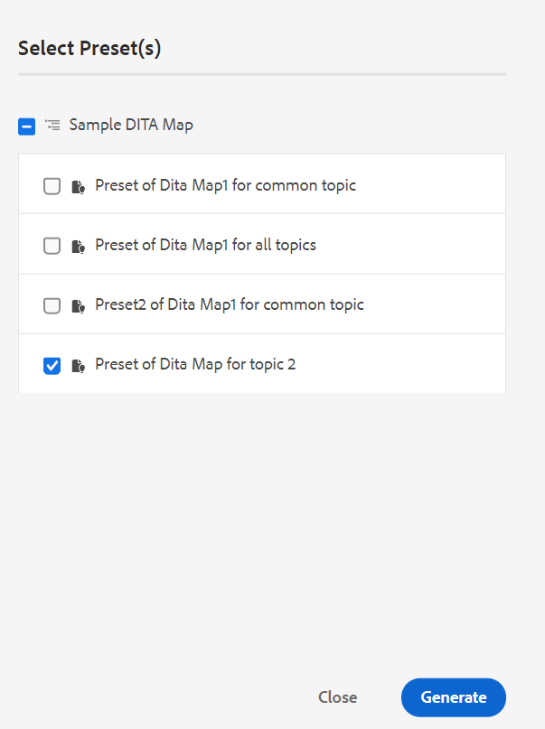

# リポジトリーパネルまたはマップビューパネルから出力を生成 {#id218CL6010AE}

>[!NOTE]
>
> 以前はAdobe Experience Manager Guidesで使用されていたクイック生成パネルは、バージョン 4.0および2502以降、非推奨（廃止予定）になりました。 クイック生成パネルにアクセスして、リポジトリパネルまたはマップビューパネルから出力を生成することはできません。

DITA マップ用に作成された出力プリセットを使用して、リポジトリパネルまたはマップビューパネルから出力を生成することもできます。

- リポジトリパネルまたはマップビューパネル内の&#x200B;**クイック生成**&#x200B;機能を使用して、選択した単一トピックまたはDITA マップ全体の出力を生成します。

  >[!NOTE]
  >
  > お気に入りパネルまたは検索パネルから&#x200B;**クイック生成**&#x200B;機能にアクセスすることもできます。

- マップビューパネルの&#x200B;**出力を生成**&#x200B;機能を使用して、選択した複数のトピックの出力を生成します。

## 1つ以上のDITA マップで使用されるトピックを公開する

DITA マップ内の1つ以上のトピックの出力を生成するには、次の手順を実行します。

1. 「**作成者**」タブで、公開するDITA マップ内のトピックを選択します。

1. 選択したトピックのオプションメニューから「**クイック生成**」を選択します。
   {width="650"}

1. 単一のDITA マップで使用されるトピックを公開するには、公開に使用するマップの出力プリセットを選択し、**生成**をクリックします。
   {width="350"}

1. 出力生成プロセスのステータスが表示されます。 出力を表示するには、トピックの上にマウスポインターを置き、「出力を表示」をクリックします。

1. 複数のトピックで使用される共通のトピックがある場合は、様々なDITA マップと、公開に使用する出力プリセットを選択し、**生成**&#x200B;をクリックします。

   {width="350"}

1. 出力生成プロセスのステータスが表示されます。

   - **トピック**：出力が生成される選択したトピックを一覧表示します。
   - **プリセット**：選択したトピックを含む出力プリセットを表示します。
   - **マップ**：選択したトピックを含むDITA マップを一覧表示します。
   - **ステータス**：各トピックの公開ステータスを表示します。
出力を表示するには、トピックの上にマウスポインターを置き、「出力を表示」をクリックします。
     

## Web エディターからのDITA マップの出力の生成

DITA マップ全体の出力を生成するには、次の手順を実行します。

1. 「**作成者**」タブで、公開するDITA マップを選択します。

1. DITA マップのオプションメニューから「**クイック生成**」を選択します。

   {width="650"}

1. 公開に使用するDITA マップの出力プリセットを選択し、**生成**&#x200B;をクリックします。

1. 出力生成プロセスのステータスが表示されます。 出力を表示するには、トピックの上にマウスポインターを置き、「出力を表示」をクリックします。

## 複数のトピックの出力を生成

マップビューパネルからDITA マップ内の複数のトピックの出力を生成するには、次の手順を実行します。

1. 「**作成者**」タブで、公開するトピックを選択します。

1. 下部のオプションメニューから「**出力を生成**」を選択します。

1. 公開に使用するDITA マップの出力プリセットを選択します。

   >[!NOTE]
   >
   > 選択したすべてのトピックを含む現在のDITA マップの出力プリセットのみが表示されます。

   {width="650"}

1. 出力生成プロセスのステータスが表示されます。出力を表示するには、トピックの上にマウスポインターを置き、「出力を表示」をクリックします。

**親トピック：**[ Web エディターからの記事ベースの公開](web-editor-article-publishing.md)
