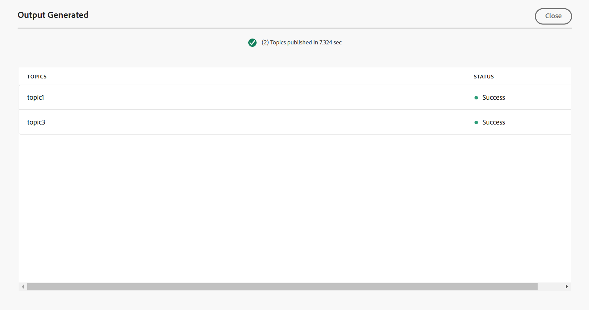

# エディターからナレッジベースの出力プリセットを作成する {#id218CL400JW3}

DITA マップの出力プリセットを作成するには、次の手順を実行します。

1. Assets UIで、編集するマップファイルに移動します。

1. マップファイルの排他的ロックを取得するには、マップファイルを選択し、**チェックアウト**&#x200B;を選択します。

1. マップファイルのアクションメニューから「**トピックを編集**」オプションを選択します。

   マップファイルがエディターで編集用に開きます。

   >[!NOTE]
   >
   > 高度なマップエディターを使用して、マップから任意のトピックを追加または削除できます。 詳細については、[高度なマップエディターの操作](map-editor-advanced-map-editor.md#)を参照してください。

1. 「**マップコンソールで開く**」アイコンを選択します。 マップがマップコンソールで開きます。

1. 「**出力プリセット**」タブに移動し、「+」アイコンを選択して、DITA マップの出力プリセットを作成します。

1. 「**Type**」ドロップダウンから「**ナレッジベース**」を選択し、名前を入力して、**新しい出力プリセット**」ダイアログボックスで「**Adobe Experience Manager**」を選択します。
1. 「**現在のフォルダープロファイルに追加**」オプションを選択して、現在のフォルダープロファイルの出力プリセットを作成します。  アイコンは、フォルダープロファイルレベルのプリセットを示します。

   [&#x200B; グローバルおよびフォルダープロファイル出力プリセットの管理](./web-editor-manage-output-presets.md)の詳細をご覧ください。

1. 「**追加**」を選択します。

   ナレッジベース用のプリセットが作成されます。

   

プリセットを作成したら、特定のナレッジベース記事の出力を生成できます。 これを行うには、**記事** タブに移動し、出力を生成するトピックを選択します。
1. 上部の「**出力を生成**」を選択して、出力を生成します。

   

1. **公開用にファイルを確認** プロンプトで、**公開**&#x200B;を選択して、公開および確認するファイルを選択します。

   

出力生成プロセスのステータスを表示します。 **トピック**&#x200B;列には、出力が生成されるトピックが一覧表示され、**ステータス**&#x200B;列には各トピックの公開ステータスが表示されます。

出力を表示するには、「生成された出力」ダイアログボックスを閉じ、プリセットページで「**出力を表示**」を選択します。

>[!NOTE]
>
> オプションメニューから、既存の出力プリセットの名前を変更、複製、または削除することもできます。

**親トピック：**&#x200B;[&#x200B; エディターからの記事ベースの公開](web-editor-article-publishing.md)
