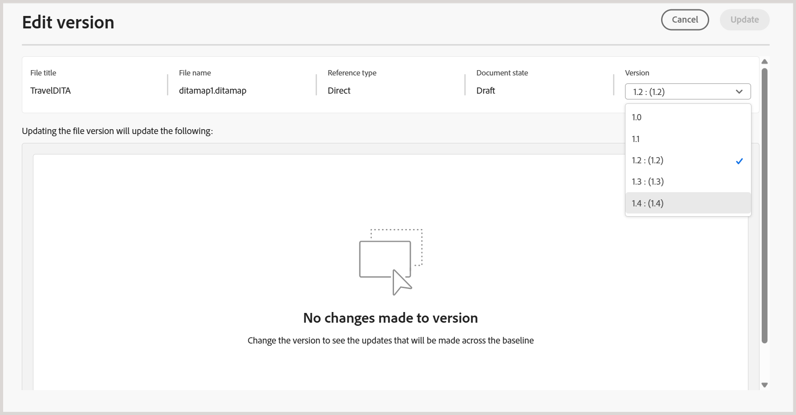

# Experience Manager Guidesの新しいベースライン（Beta）

>[!NOTE]
>
> この記事は、Experience Manager Guides 2026.03.0 リリースで利用可能なパフォーマンスと安定性の向上を提供する、現在&#x200B;*Beta*&#x200B;機能として利用可能な新しいベースラインに適用されます。 設定で新しいベースライン機能を有効にするには、カスタマーサクセス チームにお問い合わせください。

新しいベースライン機能は、大規模で複雑なマップに関連する重要な信頼性とパフォーマンスの問題に対処します。 再設計されたベースラインアーキテクチャにより、より高速で、より安定した、より一貫性のあるベースラインエクスペリエンスを提供します。 詳細な解説の前に、新しいベースライン機能の機能を紹介する簡単なチュートリアル動画をご覧ください。

>[!VIDEO](https://video.tv.adobe.com/v/3483154/aem-guides)

新しいベースラインモデルは、一般的な課題に対処することでベースライン処理を強化します。

- 大きなベースラインで作業する際の読み込みが遅く、応答性が低い
- 部分的な更新または検証の失敗によるベースラインの状態の一貫性の低下
- 大規模なベースラインコンテンツを管理する際の可視性と制御が限定的
- ベースラインの作成、更新、再構築の際にパフォーマンスが低下するボトルネック

次の節では、新しいベースラインモデルについて説明します。これには、導入された機能強化、移行前に考慮すべき主な動作の変更、新しいベースラインへの移行と使用の手順が含まれます。

- [新しいベースラインで導入された主な機能強化](#key-enhancements-introduced-in-the-new-baseline)
- [新しいベースラインに移行する前に把握しておくべき動作の変更](#behavior-changes-to-know-before-migrating-to-the-new-baseline)
- [新しいベースラインへの移行](#migrate-to-new-baseline)
- [新しいベースラインの使用](#use-the-new-baseline)

## 新しいベースラインで導入された主な機能強化

新しいベースラインでは、作業方法を変更することなく、ベースライン管理をより迅速かつ容易に拡張できるように、大幅な改善が加えられています。 次の目的で新しいベースラインに移行することを検討してください。

- **パフォーマンスとスケーラビリティの向上：** ベースライン データ モデルとレンダリング動作は、増分読み込みと合理化されたデータ構造を使用して、応答性を向上させ、大規模なベースラインで効率的に拡張するように最適化されました。
- **より強力なUIとバックエンドの一貫性：** ベースラインに対して行われた変更（バージョンや依存関係の更新など）は、バックエンドの検証に成功した後にのみUIに反映されるようになりました。これにより、無効なベースラインを作成できなくなります。
- **フィルタリング、並べ替え、ナビゲーション：** ベースラインは、ドキュメントの状態、ラベル、ファイルタイプ、参照タイプ、ベースライン全体のGUID ベース検索など、複数の属性に対する包括的なフィルタリングをサポートします。 ページネーションは大きなベースラインでサポートされており、ラベルのないファイルを含めるオプションがあります。
- **依存関係の影響を明確に表示：**&#x200B;依存関係の影響（追加または削除された依存関係）は、バージョンの変更が適用される前にプレビューとして表示され、変更内容を適用する前に確認できます。
- **より柔軟なラベル管理：** ベースライン内のバージョン間でラベルを移動できるため、様々なトピックバージョン間でラベルを管理する際の柔軟性が向上します。
- **決定論的な編集と保存動作：**&#x200B;のベースライン編集では、行レベルの更新がサポートされ、バージョンの更新中にのみリソース集約的なデータ（バージョン木や依存関係の違いなど）を読み込み、1つの手順で決定論的に保存操作を完了できます。予期しない保存失敗や部分的な更新を減らすことができます。
- **より信頼性の高いベースラインの作成：**&#x200B;のベースラインは、実行時の解析ではなく、保存された参照データを使用して作成され、必要なバージョン情報は事前に検証されて、ベースラインの不完全または無効を防ぎます。
- **APIとオートメーションのサポート：**&#x200B;新しいベースラインモデルは、REST APIとJava SDKを通じて完全にサポートされ、オートメーションと外部ワークフローとの統合が可能になります。

## 新しいベースラインに移行する前に把握しておくべき動作の変更

新しいベースラインモデルに移行する前に、次の動作の変更を確認してください。 これらの変更は、ベースラインの作成、更新、管理方法に影響します。また、既存のワークフローに影響を与える可能性があります。

| 領域 | 変更（説明） |
|------|-------------|
| **参照解決** | ダイレクトマップ参照は&#x200B;**DIRECT**&#x200B;に分類されます。 無効な参照はスキップされ、`reltable`からの参照は引き続き除外されます。 |
| **自動的に選択** | バージョン選択は、直接参照を解決する直前に評価され、正確なバージョン解決が保証されます。 |
| **ベースライン作成ルール** | バージョン **1.0**&#x200B;は必須です。 バージョンが欠落しているベースラインや、あいまいなベースラインは、移行後に解決が異なる場合があります。 |
| **移行の処理** | 無効な参照はスキップされます。 **DIRECT**&#x200B;参照が優先され、ピンなし参照は最新バージョンに移動され、追加のメタデータがバージョン **5.0**&#x200B;以降から追加されます。 |
| **ベースラインデータモデル** | 新しいグラフベースのベースラインモデルでは、可変フィールドが削除され、以前のベースラインモデルとの下位互換性がありません。 |
| **APIの使用状況** | ベースライン操作は、REST APIとJava SDKでサポートされています。 生のベースラインオブジェクトは公開されなくなりました。 |
| **バージョンのパージ** | 移行後、バージョンのパージでは、新しいベースラインリポジトリに保存されたベースラインのみを考慮します。 |

## 新しいベースラインへの移行

カスタマーサクセスチームで機能を有効にしたら、既存のベースラインを新しいベースラインに移行する必要があります。

既存のベースラインを新しいベースラインに移行するには、次の手順を実行します。

1. 上部のAdobe Experience Manager ロゴを選択し、**ツール**&#x200B;を選択します。
1. **ツール** パネルで、**ガイド**&#x200B;を選択します。
1. **Bulk Processor** タイルを選択します。

   {align="left"}

   **Guides Bulk Processor** ページが表示されます。

1. ページの右上隅にある「**新しいプロセス**」を選択して、新しい処理タスクを開始します。

   **新しいプロセス** ダイアログが表示されます。

1. ダイアログに次の詳細を入力します。

   1. **機能タイプ**: ドロップダウンから&#x200B;**ベースライン**&#x200B;を選択します。
   1. **フォルダーとファイルを選択**：移動して、処理する1つまたは複数のフォルダーとファイルを選択します。
   1. **無視するフォルダーを選択**：オプションで、選択した親フォルダー内のサブフォルダーを選択して、移行から除外します。

   {align="left"}

1. 「**作成**」を選択します。

**アセット処理が正常にトリガーされました**&#x200B;というポップアップが表示されます。 処理タスクのステータスは、ページで表示できます。

**ログを表示**&#x200B;を選択して、移行タスクのログを確認およびダウンロードすることもできます。

{align="left"}

ログレポートには、移行されたマップの数、正常に移行されたベースライン、および関連する詳細など、移行の詳細が表示されます。

{align="left"}

>[!NOTE]
>
> エラーを防ぐために、移行中、特に作業コピーでベースラインを編集しないでください。 移行後、バージョンが見つからない場合、一部のベースラインで再構築が必要になる場合があります。

## 新しいベースラインの使用

新しいベースラインモデルでは、Experience Manager Guidesの既存のベースラインフィーチャーと同じワークフローとユーザーインターフェイスを使用します。 使用可能なオプションを使用して、[Map コンソール &#x200B;](./web-editor-baseline.md)からベースラインを作成および管理できます。

>[!NOTE]
>
> 新しいベースラインモデルでは、マップダッシュボードからのベースラインの作成と管理はサポートされていません。

この節では、新しいベースラインモデルで導入された変更と機能強化のみを説明します。 一般的なベースラインワークフローは、明示的に言及しない限り変更されません。

**新しいベースライン UI**&#x200B;で利用可能な新しい/強化オプション

**新しいベースラインモデル**&#x200B;を使用して作成されたベースラインを操作する場合、次の更新が適用されます。

- オプションメニューの「**ベースラインを書き出し**」オプションは、手動アップデートと自動アップデートの両方を使用して作成されたベースラインの名前が&#x200B;**ダウンロード**&#x200B;に変更されます。

  

- 動的ベースラインは、**ベースライン** パネルから直接開き、オプションメニューの使用可能なアクションを使用して管理できます。

  

  新しいベースラインモデルを使用して作成された動的ベースラインに対して導入された新しいオプションを使用することもできます。
   - **プロパティを編集**：既存のベースラインのプロパティを編集できます。
   - **再構築**：変更が発生するたびに、動的ベースラインを再構築できます。

     {align="left"}

- **ダウンロード** アクションは、ページ分割されたダウンロードをサポートしています。 適用されたフィルターに一致するすべてのベースラインコンテンツは、現在のページに表示されるコンテンツだけでなく、ダウンロードに含まれます。
- ファイル名またはファイルの場所に加えて、GUIDでファイルをフィルタリングします。 ラベルのない&#x200B;**フィルターファイル**&#x200B;に対する追加オプションも使用できます。

  
- 新しいベースラインモデルでは、決定論的編集がサポートされており、検証済みの依存関係の解決を使用して一度に1つの参照を更新できます。

  +++新しいベースラインの参照を編集する手順

  ベースラインを編集するには、次の手順を実行します。

   - **ベースライン** パネルからベースラインを開きます。

     ベースラインの参照の表形式表示が表示されます。

   - 編集するファイルに移動し、カーソルを合わせます。
   - 「**編集**」アイコンを選択します。

     {align="left"}

     **バージョンを編集** ダイアログが表示されます。
   - **バージョン** ドロップダウンから必要なバージョンを選択します（例えば、バージョン 1.0から1.1に変更）。

     {align="left"}

     追加および削除された依存関係が評価され、プレビューとして表示されます。 変更を適用する前に、変更を確認します。

     

     依存関係の変更が検出されない場合は、空の状態のメッセージが表示されます。

   - **更新**&#x200B;を選択して変更を適用します。

  ベースラインは、選択したバージョンで更新されます。
  +++
