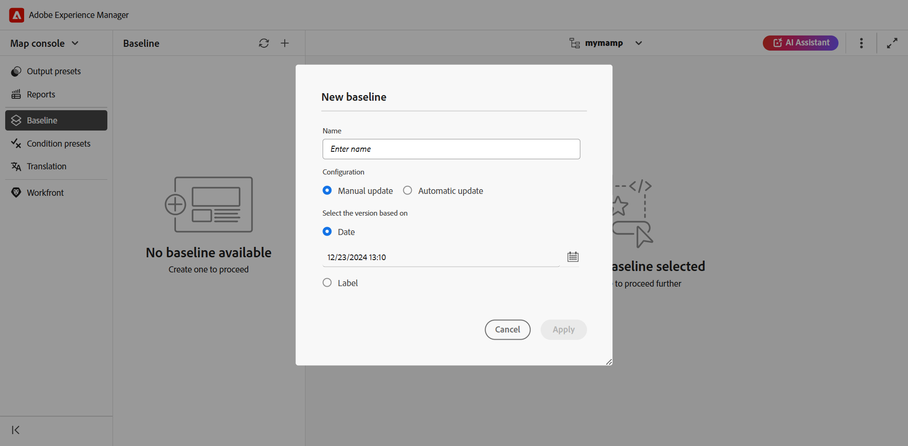
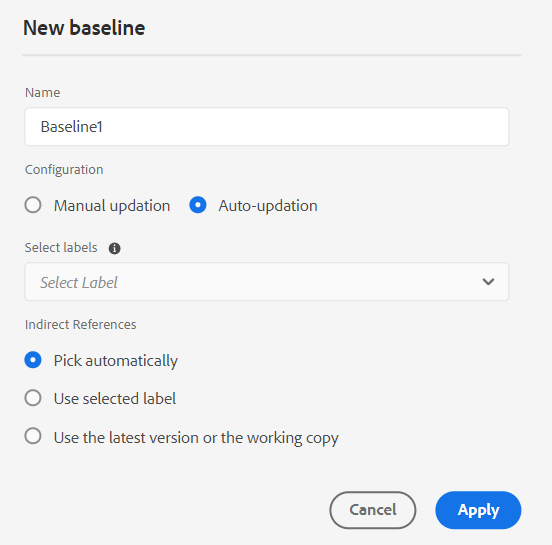
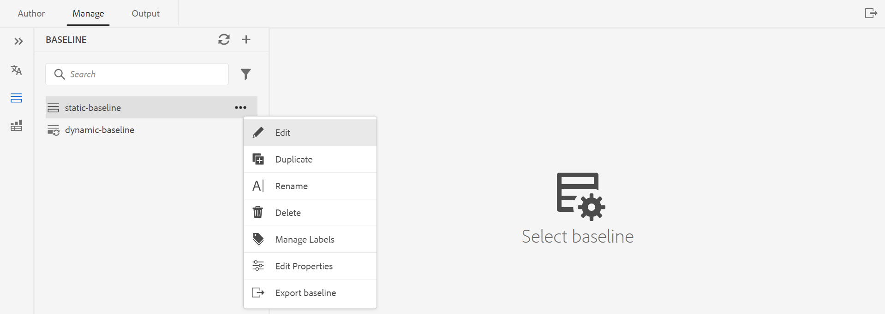
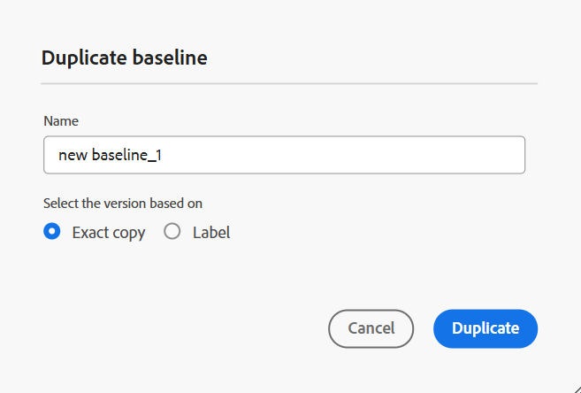

# マップコンソールでのベースラインの作成と管理 {#id223MB0ZF043}

>[!NOTE]
>
> Experience Manager Guides 2026.03.0 リリースでは、パフォーマンスと安定性が向上した新しいベースライン（Beta）が利用可能です。 このベースラインを使用するには、カスタマーサクセスチームに連絡して、この機能を有効にします。 [新しいベースライン （Beta） &#x200B;](./web-editor-baseline-v2.md)について詳しく説明します。

ベースライン機能を使用すると、トピックとアセットのバージョンを作成し、公開または翻訳に使用できます。 例えば、DITA マップに`topicA`と`imageA`がある場合、ベースラインを作成して、3番目のバージョンの`topicA`を使用し、4番目のバージョンの`ImageA`を使用できます。 ベースラインを設定したら、様々なバージョンのトピックを1回の手順で公開または翻訳できます。

出力プリセットでは、ベースラインの選択はオプションであり、DITA マップには複数のベースラインを含めることができます。 ただし、DITA マップ内の各出力プリセットは、1つのベースラインにのみ関連付けることができます。 公開時にベースラインが指定されていない場合、出力は最新バージョンのコンテンツを使用して公開されます。

同様に、コンテンツを翻訳するベースラインの選択はオプションです。 ただし、ベースラインを使用してコンテンツを翻訳する場合は、ベースラインのコンテンツも翻訳されたコピーとともに保存されます。 その後、翻訳されたベースラインを使用して、外部パブリッシャーとの共有やアーカイブなど、さらに操作を実行できます。

>[!TIP]
>
> マップコンソールからこのベースライン機能を使用することをお勧めします。 ただし、[&#x200B; マップダッシュボードを使用してベースラインを作成および管理することもできます](./generate-output-use-baseline-for-publishing.md)。

「**ベースライン**」タブでは、次のアクションを実行できます。

- [ベースラインの作成](#create-a-baseline)
- [ベースラインの管理](#manage-baselines)

## ベースラインの作成

マップコンソールからベースラインを作成するには、次の手順を実行します。

1. [&#x200B; マップコンソール &#x200B;](./open-files-map-console.md)でDITA マップファイルを開きます。
1. 「**ベースライン**」タブに移動し、右上の「+」アイコンを選択して、ベースラインの作成を開始します。
1. **新しいベースライン** ダイアログボックスで、次の詳細を入力します。

   {width="500"}

   - ベースラインの名前を&#x200B;**名前** フィールドに入力します。
   - **構成**&#x200B;で、[手動アップデート &#x200B;](#configuring-baseline-for-manual-update)または[自動アップデート &#x200B;](#configuring-baseline-for-automatic-update)を選択します。
   - **適用**&#x200B;を選択します。

ベースラインが作成されます。 ベースラインの作成は非同期で行われるので、他のファイルで作業を続けることができます。 ベースラインを作成すると、ベースラインが作成されたことを確認するポップアップメッセージが表示され、同じベースラインのインボックス通知も受け取ります。

### 手動アップデート用のベースラインの設定

特定のバージョンのトピックと参照コンテンツが特定の日時に利用可能な静的ベースライン、またはトピックのバージョンに定義されたラベルを使用して、手動で作成できます。

**に基づいてバージョンを選択し、**&#x200B;で次のいずれかのオプションを選択します。

- **日付**：指定した日時に基づいてトピックのバージョンを選択します。
- **ラベル**：適用されたラベルに従ってトピックを選択するには、このオプションを選択します。 トピックにラベルが指定されている場合、そのラベルはドロップダウンに一覧表示されます。 リストからラベルを選択できます。 テキストボックスにラベルを追加することもできます。

  >[!NOTE]
  >
  > ラベルを選択すると、すべてのラベルが正常に取得され、完全に読み込まれるまで、ラベルローダーは表示されたままになります。 読み込まれると、ラベルは大文字と小文字を区別しないアルファベット順で表示されます。 これらは20のバッチで取得され、ドロップダウンで無限スクロールが有効になり、スクロールしながら追加のバッチが読み込まれます。

  静的ベースラインの直接参照の場合、ラベルは最新の保存済みバージョンのマップから取得されます。 例えば、トピック Aのバージョン 1.0と1.1に対してラベル `Label Release 1.0`と`Label Release 1.1`を作成し、バージョン 1.0として保存されたマップにトピック Aを追加した場合です。 この場合、静的ベースラインラベルのドロップダウンでラベル `Label Release 1.0`と`Label Release 1.1`を表示できます。

  「**ラベル、**」を選択すると、直接参照と間接参照を選択できます。
   - DITA マップ内の直接参照の場合、指定したラベルが適用されていない最新バージョンのトピックを使用するオプションが表示されます。

     >[!NOTE]
     >
     > 存在しないラベルを入力し、「**ベースラインを作成しない**」オプションを選択すると、ベースラインの作成が失敗し、ベースラインパネルのベースライン名の近くにエラーメッセージが表示されます。

   - DITA マップ内の間接参照の場合、指定したラベルが適用されていない最新バージョンのトピックを使用する追加オプションが表示されます。 参照コンテンツの&#x200B;**自動的に選択**&#x200B;を選択することもできます。また、システムは、参照コンテンツのバージョンに対応する参照コンテンツのバージョンを自動的に選択します。

日付としてラベルまたはバージョンを選択すると、マップ内のすべての参照トピックとメディアファイルが適切に選択されます。 このトピックの選択は、ユーザーインターフェイスには表示されませんが、バックエンドに保存されます。

### 自動更新のベースラインの設定

ベースラインの作成に対してこのオプションを選択すると、適用されたラベルに従ってトピックが自動的に選択されます。

自動更新設定を使用して作成されたベースラインは、動的に更新されます。 ベースラインを生成する、ベースラインをダウンロードする、ベースラインを使用して翻訳プロジェクトを作成する場合、更新されたラベルに基づいてファイルが動的に選択されます。 例えば、ベースラインにラベルリリース 1.0を含むトピックのバージョン 1.2を使用し、ラベルリリース 1.0を含むバージョン 1.5以降を更新した場合、ベースラインは動的に更新され、バージョン 1.5が使用されます。

{width="300"}

- **ラベル**: トピックにラベルが指定されている場合は、**ラベル** ドロップダウンを使用して、[&#x200B; リストされたラベル &#x200B;](#labels-list)から選択します。

  最初に選択したラベルは、後のラベルよりも優先度が高くなります。

  >[!NOTE]
  >
  >ラベルが引っ張られている間は、ローダーが表示され、ドロップダウンは無効になります。

  動的ベースラインの場合、ラベルは最新の保存済みバージョンとマップの現在の作業コピーから取得されます。 例えば、トピック Aのバージョン 1.0および1.1に対してラベル `Label Release A.1.0 `および`Label Release A.1.1`を作成し、トピック Bのバージョン 1.0および1.1に対してラベル `Label Release B.1.0`および`Label Release B.1.1`を作成した場合です。 次に、バージョン 1.0のマップ Aにトピック Aを追加し、1.0*（作業用コピー）のマップ Aにトピック Bを追加できます。 この場合、動的ベースラインラベルのドロップダウンで`Label Release A.1.0 `、`Label Release A.1.1`、`Label Release B.1.0`および`Label Release B.1.1`を表示できます。
- **間接参照**: DITA マップ内の間接参照には、次のオプションが指定されます。

   - **自動的に選択**：参照されるコンテンツの&#x200B;**自動的に選択**&#x200B;を選択できます。システムは、参照されるコンテンツのバージョンに対応する参照されるコンテンツのバージョンを自動的に選択します。
   - **選択したラベルを使用**：選択したラベルがトピックのバージョンに定義されたベースラインを作成できます。
   - **最新バージョンまたは作業用コピーを使用**：指定したラベルが適用されていない最新バージョンのトピックを使用するか、バージョンが作成されていない場合は、トピックの作業用コピーを使用してベースラインを作成します。

## ベースラインの管理

ベースラインダッシュボードの様々な機能を使用して、既存のベースラインを管理できます。

- ベースラインパネルのテキストボックスを使用して、既存のベースラインを検索できます。 「**フィルターを適用**」アイコンを使用して、すべてのベースラインを表示するか、作成ステータスが「成功」、「進行中」、「失敗」のベースラインを一覧表示します。
- ベースラインパネルの&#x200B;**更新** アイコンを使用して、すべてのベースラインを再確認し、マップビューで開いたDITA マップのベースラインの新しいリストを表示します。
- ベースラインを選択して、**ベースライン** パネルで既存の静的ベースラインのコンテンツを表示または編集します。 ベースライン編集ウィンドウには、DITA マップファイル、マップの内容またはトピック、参照コンテンツが表示されます。

  >[!NOTE]
  >
  >静的ベースラインの編集操作は、参照変更が少ない場合にのみ推奨されます。 すべての参照を再計算する必要があるため、メイン DITA マップのバージョンを変更する場合は、編集操作はお勧めしません。 これにより、大規模なDITA マップのベースライン更新エラーが発生する可能性があります。 大きなDITA マップの場合は、新しいベースラインを作成したり、ベースラインのプロパティを編集したりできます。
  >
  >動的ベースラインの場合の編集操作では、動的ベースラインの参照が実行時にラベルを使用して生成されるため、ベースラインのプロパティを編集できます。

  ベースラインの{}

### 既存のベースラインで使用可能なアクション

オプションメニューから、ベースラインに対して次の操作を実行することもできます。

**ベースラインを複製**

ベースラインを複製し、必要に応じて変更できます。

{width="300"}
*ラベルに基づいてベースラインを複製するか、正確なコピーを作成します。*

1. ベースラインのオプションメニューから「**複製**」を選択します。 「**ベースラインを複製**」ダイアログボックスが開きます。
>[!NOTE]
>
> ベースラインのデフォルト名は`<selected baseline name>`_suffixです（sample-baseline_1など）。 必要に応じて名前を変更できます。

   **に基づいてバージョンを選択**&#x200B;すると、**正確なコピー** オプションまたは&#x200B;**ラベル** オプションのいずれかを選択できます。

   - **正確なコピー**: Experience Manager Guidesは、すべてのトピックの同じバージョンを選択し、複製されたベースラインの正確なコピーを作成します。
   - **ラベル**: ドロップダウンを使用すると、リストされている[&#x200B; ラベル &#x200B;](#labels-list)のいずれかを選択できます。 Experience Manager Guidesは、選択したラベルが定義されているトピックのバージョンを選択し、残りのトピックについては、複製されたベースラインからバージョンを選択します。 例えば、ドロップダウンからラベル `Release 1.0`を選択すると、このラベルを定義したトピックのバージョンが選択されます。 その他のすべてのトピックについては、複製されたベースラインからバージョンを選択します。
1. 「**重複**」を選択します。

- **既存のベースライン**&#x200B;の名前を変更&#x200B;**するか、**&#x200B;削除**します。
- 静的ベースラインの既存のラベルを追加、削除、または変更できる&#x200B;**ラベルの管理**。 管理者が定義済みのラベルを設定している場合は、ラベルを追加ドロップダウンリストにラベルが表示されます。 ラベルの追加について詳しくは、[&#x200B; ラベルを使用](web-editor-use-label.md#)を参照してください。

  >[!NOTE]
  >
  > ラベルを追加または削除するプロセスは非同期で実行されるため、他のファイルの作業を続行できます。 ラベルが追加または削除されると、ラベルが追加または削除されたことを確認するポップアップメッセージが表示され、同じラベルのインボックス通知も受け取ります。

- ベースラインの作成中に設定した既存の静的ベースラインの&#x200B;**プロパティ**&#x200B;を編集します。
- **ベースラインの書き出し** オプションを使用すると、Microsoft Excel ファイルにベースラインのスナップショットが書き出されます。これには、タイトル、ファイル名、ファイルの種類、バージョン番号、ドキュメントの状態、その他の関連情報など、すべての重要な詳細情報が含まれます。

### ラベルのリスト {#labels-list}

ドロップダウンにリストされているラベルは、次の条件に基づいています。
- ラベルは、（ベースラインが作成される） DITA マップ内のトピックのいずれかのバージョンに追加する必要があります。
- また、ラベルの選択には、DITA マップの第1 レベルの参照（トピックまたはサブマップ）のみが考慮されます。

## ベースラインフィルター

**ベースラインフィルター** パネルの「フィルター」アイコンを使用すると、ベースライン編集ウィンドウで開いたベースラインにフィルターを適用できます。

{width="300"}

- ファイル名またはファイルの場所に基づいてファイルをフィルタリングします。
- ファイルタイプ、参照タイプなど、様々な列の値に基づいてファイルをフィルタリングします。
- ベースライン編集ウィンドウに表示する列を選択します。

>[!NOTE]
>
> 列見出しを選択し、ベースライン編集ウィンドウの列に基づいてファイルを並べ替えることができます。

**ベースラインの保存またはリセット**

ベースラインを編集したら、**保存**&#x200B;を選択して、ベースラインへの変更を保存します。 変更を保存してベースラインをリセットしない場合は、**リセット**&#x200B;を選択できます。 **リセット**&#x200B;を選択すると、保存されていない変更が失われるという警告が表示されます。

**親トピック：**&#x200B;[&#x200B;出力生成](generate-output.md)

