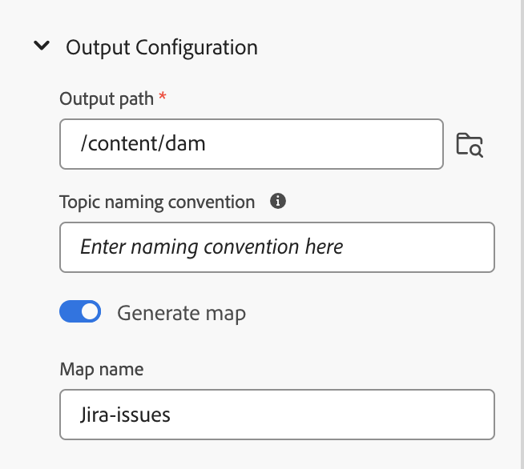

# データソースからのデータの使用

**データソース** は、組織のデータを保存および管理するシステムです。 これらは、JIRA、SQL データベース、PIM、PLM などのレコードシステムです。 AEM Guidesには、データソースに接続し、データソースのデータを使用する機能が用意されています。

また、ファイルコネクタを使用して JSON データファイルに接続することもできます。 コンピューターから JSON ファイルをアップロードするか、Adobe Experience Manager Assets から参照します。 次に、ジェネレーターを使用してコンテンツスニペットまたはトピックを作成します。

## データソースパネル

左側のパネルで「**データソース** 」を選択し、接続されているデータソースを表示します。 データソースパネルが開き、接続されているすべてのデータソースが表示されます。

管理者は、設定に基づいて、データソースコネクタを設定できます。

 クラウドサービス 

- 2023 年 10 月リリース以降を使用している場合は、Cloud Service インストールおよび設定ガイドの [ ユーザーインターフェイスからのデータソースコネクタの設定 ](../cs-install-guide/conf-data-source-connector-tools.md) の方法を参照してください。

- 2023 年 7 月または 2023 年 9 月のリリースを使用している場合は、Cloud Service インストールおよび設定ガイドで [ データソースコネクタの設定 ](../cs-install-guide/conf-data-source-connector.md) の方法を参照してください。

    

  オンプレミスソフトウェア 

- 4.3.1 リリース以降を使用している場合は、オンプレミスのインストールおよび設定ガイドの [ ユーザーインターフェイスからのデータソースコネクタの設定 ](../cs-install-guide/conf-data-source-connector-tools.md) 方法を参照してください。

- 4.3 リリースを使用している場合は、オンプレミスのインストールおよび設定ガイドで [ データソースコネクタの設定 ](../cs-install-guide/conf-data-source-connector.md) を参照してください。

>[!NOTE]
>
> 管理者がコネクタを設定したデータソースが表示されます。

## リスト表示またはタイル表示を表示

様々なデータソースをリスト形式またはタイル形式で表示するには、リスト表示とタイル表示を切り替えることができます。

データソースを選択して、選択したデータソースで使用可能なコンテンツスニペットジェネレーターとトピックジェネレーターを表示します。

### リスト表示 

{width="300" align="left"}

*接続されているデータソースのリスト*

### タイル表示   

{width="300" align="left"}

*接続されたデータソースをタイルで表示します。*

データソースのデータは、次の 2 つの方法で使用できます。
- コンテンツスニペットの挿入
- トピックの作成

## データソースからコンテンツスニペットを挿入する

AEM Guidesは、データソースに接続する機能を提供します。 データを取得し、トピックに挿入して編集できます。 コンテンツスニペットジェネレーターを使用してコンテンツスニペットを簡単に作成し、トピック内で再利用できます。

コンテンツスニペットジェネレーターを使用してコンテンツスニペットを作成し、トピックに挿入するには、次の手順を実行します。

1. **データソース** を選択します    左側のパネルに接続されたデータソースが表示されます。

1. データソースを選択し、選択したデータソースで使用可能なコンテンツスニペットジェネレーターを表示します。

   {width="300" align="left"}

   *データソースパネルには、使用可能なコンテンツスニペットジェネレーターが一覧表示されます。*

1. 「**追加**」を選択して、新しいコンテンツスニペットジェネレーターを追加します。 **コンテンツスニペットジェネレーターを追加** パネルが開きます。

1. 「**データクエリ**」テキストボックスにクエリを入力します。  **サンプルクエリをコピー** を選択すると、データクエリをすばやくコピーできます。 クエリを手動で作成する代わりに、サンプルクエリをコピーして「**データクエリ**」テキストボックスに貼り付けることができます。 次に、データ要件に従ってクエリを編集するだけです。

   >[!NOTE]
   >
   >Experience Managerには、様々なデータソース内のすべてのリソースに対する様々なサンプルクエリが用意されています。 これらは、データの取得元のデータソースにマッピングされます。

1. ファイルコネクタを使用している場合は、コンピューターから JSON ファイルをアップロードするか、Adobe Experience Manager Assets から JSON ファイルを参照できます。

   >[!NOTE]
   >
   > ファイルコネクタを使用する場合は、データクエリの代わりにファイルをアップロードまたは参照するためのオプションを表示します。

1. **データマッピングテンプレート** ドロップダウンから、データソースにマッピングするテンプレートを選択します。
選択したデータソースに対する標準のテンプレートがドロップダウンに表示されます。 例えば、「PostgreSQL」データソースという名前のデータソースの「sql-table」テンプレートを表示できます。

   >[!NOTE]
   >  
   > 管理者がカスタマイズしたテンプレートを設定している場合は、（管理者が行ったテンプレートパス設定に基づいて）それらのテンプレートもドロップダウンリストに表示されます。
   >   
   >テンプレートで Velocity ツールを使用することもできます。 詳細情報 [Velocity ツールの使用 ](#use-velocity-tools)。

1. **Resource** ドロップダウンが、REST Client、Salsify、Akeneo、Microsoft ADO などの一部のコネクタに対して表示されます。  ドロップダウンから任意のリソースを選択し、そのリソースに接続して、ジェネレーターを使用してコンテンツスニペットまたはトピックを作成します。

   >[!NOTE]
   >
   > 管理者は、データソースコネクタの設定時に、デフォルトのリソースを設定したり、複数の URL にリソースを追加したりできます。

1. 「**取得**」をクリックしてデータソースからデータを取得し、SQL クエリによって生成されたデータにテンプレートを適用します。

1. データは、プレビューまたは DITA ソースビューで表示できます。

   1. プレビューには、コンテンツに挿入した際のデータの表示方法が表示されます。 プレビューには、選択したテンプレートの形式でデータのごく一部が表示されます。
次に例を示します。
      - SQL テーブル テンプレートを選択した場合は、SQL データを表形式で表示できます。
      - Jira 順序付きリストテンプレートを選択した場合は、Jira の課題の順序付きリストを表示できます。

   1. ソースビューには、DITA ソースビューのデータが表示されます。
      {width="800" align="left"}
      *コンテンツスニペットジェネレーターを追加 データをソースモードまたはプレビューモードで表示します。*

1. クエリの結果を保存するには、ジェネレータの名前を入力し、[**追加**] をクリックします。   新しいコンテンツスニペットジェネレーターがリストに追加されます。

   >[!NOTE]
   >
   > 新しいコンテンツジェネレーターの名前は、ファイル命名規則に従う必要があります。 コンテンツスニペットジェネレーターの名前にスペースを含めることはできません。 また、既存のコンテンツ ジェネレータの名前で新しいコンテンツ ジェネレータを保存することはできません。 エラーが発生しました。

### コンテンツスニペットジェネレーターのオプション

コンテンツスニペットジェネレーターを右クリックして、オプションを開きます。 オプションを使用すると、次の操作を実行できます。

- **プレビュー**：このオプションを使用してパネルを開き、出力でのデータの表示方法のごく一部を表示します。
- **挿入**：選択したコンテンツスニペットを、web エディターで編集用に開かれたトピックに挿入する場合に使用します。 データはスニペットとして挿入されるので、トピック内のデータを Web エディターで編集することもできます。

  >[!NOTE]
  > 
  > 「挿入」オプションは、トピックの編集中にのみ表示されます。

- **編集**：コンテンツスニペットジェネレーターで変更を加えて保存するには、このオプションを使用します。
- **削除**：選択したコンテンツスニペットジェネレーターを削除するには、このオプションを使用します。
- **複製**：選択したコンテンツスニペットジェネレーターの複製またはコピーを作成するには、このオプションを使用します。 複製はデフォルトで接尾辞（generator_1 など）で作成されます。

### クエリスニペットの挿入

**クエリ挿入スニペット** を使用することもでき  す。   をクリックして、データスニペットをトピックに挿入します。  ドロップダウンからジェネレーターを選択したり、クエリを編集したり、テンプレートを変更してトピックにデータを挿入したりできます。

{width="800" align="left"}

*データスニペットを編集して挿入します*。

## トピックジェネレーターを使用したトピックの作成

トピックジェネレーターは、ソースからのデータを含んだトピックを作成するのに役立ちます。 トピック ジェネレータを簡単に作成し、ジェネレータを使用してトピックを生成できます。 各トピックには、テーブル、リスト、段落など、様々な形式のデータを含めることができます。   例えば、トピックでは、すべての新製品の詳細と、販売を中止するすべての製品のリストを含むテーブルを追加できます。

トピックジェネレータは、すべてのトピックに対して、データと DITA マップを含むトピックを作成できます。 また、これらのトピックをコンテンツに `<conref>` すこともできます。 これにより、データとデータソースの同期を維持し、簡単に更新できます。

### トピックの作成

トピックジェネレーターを使用してトピックを作成するには、次の手順を実行します。

1. データソースを選択して、選択したデータソースで使用可能なコンテンツスニペットジェネレーターとトピックジェネレーターを表示します。

   {width="300" align="left"}

   *接続されたデータソースのトピックジェネレーターを追加*

1. 「**追加**」  を選択し、ドロップダウンから「**トピックジェネレーター**」を選択して、新しいトピックジェネレーターを追加します。 **トピックジェネレーターを追加** パネルが開きます。

1. **トピックジェネレーターを追加** パネルの次の 3 つのタブにあるフィールドに値を入力します。

   **設定を取得**

   {width="300" align="left"}

   *トピックジェネレーターのデータクエリ、データマッピングテンプレート、ルートノードの詳細を追加し、「設定を取得」パネルで一意の名前を付けます。*

   1. 「**データクエリ**」テキストボックスにクエリを入力します。 **サンプルクエリをコピー** を選択すると、データクエリをすばやくコピーできます。 クエリを手動で作成する代わりに、サンプルクエリをコピーして「**データクエリ**」テキストボックスに貼り付けることができます。 次に、データ要件に従ってクエリを編集するだけです。

      >[!NOTE]
      >
      >Experience Managerには、様々なデータソース内のすべてのリソースに対する様々なサンプルクエリが用意されています。 これらは、データの取得元のデータソースにマッピングされます。

   1. ファイルコネクタを使用している場合は、コンピューターから JSON ファイルをアップロードするか、Adobe Experience Manager Assets から JSON ファイルを参照できます。

      >[!NOTE]
      >
      > ファイルコネクタを使用する場合は、データクエリの代わりにファイルをアップロードまたは参照するためのオプションを表示します。

   1. **データマッピングテンプレート** ドロップダウンから、データソースにマッピングするテンプレートを選択します。

      >[!NOTE]
      >
      > 管理者がカスタマイズしたテンプレートを設定している場合は、（管理者が行ったテンプレートパス設定に基づいて）それらのテンプレートもドロップダウンリストに表示されます。 たとえば、順序付きリスト、表、段落、またはその他の DITA エレメントを含むトピックテンプレートを作成できます。

   1. **ルートノード** を入力します。 これは、データにアクセスするノードです。 次に、トピック ジェネレータは、ルート ノードで定義されたレベルに各トピックを作成します。 例えば、Jira のルートノードとして「issues」を追加できます。 したがって、クエリによって 13 件の問題が返された場合は、各問題に対して 1 つのトピックの 13 のトピックが返されます。

   1. 「**取得**」をクリックしてデータソースからデータを取得し、SQL クエリによって生成されたデータにテンプレートを適用します。 プレビューには、選択したテンプレートの形式でトピックが表示されるほんの一部が表示されます。 例えば、1 つの Jira の課題を、クエリから生成されたすべてのフィールドと共に表示できます。
   1. トピック ジェネレータの名前を入力します。

      >[!NOTE]
      > 
      > 新しいトピックジェネレータの名前は、ファイル命名規則に従う必要があります。 トピック ジェネレータの名前にスペースを含めることはできません。 また、既存のトピック ジェネレータの名前で新しいトピック ジェネレータを保存することはできません。 エラーが発生しました。

   **出力設定**

   {width="300" align="left"}

   *出力設定パネルに出力パスとトピック命名規則の詳細を入力します。 DITA マップを生成し、名前を付けます。*

   1. トピックを保存する **出力パス** の詳細を入力します。
   1. **トピックの命名規則** では、値または velocity タグを持つ変数を入力できます。 新しいトピックは命名規則に従います。 例えば、`$key` を入力して、Jira キーに基づいてトピックを作成できます。
   1. 生成されたすべてのトピックを含むマップを作成する場合は、「**マップを生成**」オプションを有効にします。
   1. 新しい DITA マップの名前を入力します。

   >[!NOTE]
   >
   > トピックジェネレータは、トピックと同じ出力パス上に DITA マップを生成します。

   **メタデータ**

   ドロップダウンから、トピックに渡すメタデータプロパティを選択します。 **名前** ドロップダウンリストには、カスタムプロパティとデフォルトプロパティの両方が表示されます。

   例えば、次のスクリーンショットでは、`dc:description`、`dc:language`、`dc:title` および `docstate` がデフォルトのプロパティとなっており、これらのプロパティの値を定義できます。 author などのカスタムプロパティを作成し、その値を定義できます。

   {width="300" align="left"}

   *トピックに渡すメタデータプロパティをメタデータパネルに追加します。*

1. ジェネレータの名前を入力し、[**保存**] をクリックしてクエリー結果を保存します。 新しいトピック ジェネレータがリストに追加されます。

1. 「**保存して生成**」をクリックして、トピック・ジェネレータを保存し、トピック・ジェネレータから新しいトピックを生成します。

   {width="650" align="left"}

   *既存のトピックジェネレーターから新しいトピックを生成*

   >[!NOTE]
   >
   > トピックが既に存在する場合、ジェネレータは既存のトピック内のデータを更新します。

### トピックジェネレーターのオプション

トピック ジェネレータを右クリックして、**オプション** を開きます。 オプションを使用すると、次の操作を実行できます。

- **生成**：このオプションは、選択したトピックジェネレーターのトピックを生成します。 また、このオプションを使用して、既存のトピックを更新することもできます。 データソースに接続し、更新されたデータを取得します。 コンテンツの生成中、このオプションは無効になり、ローダーが表示されます。
  >[!NOTE]
  >
  >トピックが既に存在する場合は、トピック内のデータを上書きするか、新しいバージョンとして保存できます。

  

  *トピックを生成します。ファイルが既に存在する場合は、新しいバージョンとして保存するか、上書きします。*
- **ログを表示**：コンテンツ生成ログファイルを表示する場合は、このオプションを選択します。 ログファイルが新しいタブで開きます。 エラー、警告、情報メッセージおよび例外は、ログ・ファイルで確認できます。 このオプションは、選択したトピック ジェネレータのコンテンツを生成した場合に有効になります。

- **プレビュー**：このオプションを使用してパネルを開き、出力でのデータの表示方法のごく一部を表示します。

- **編集**：トピックジェネレーターを変更して保存するには、このオプションを使用します。 このオプションは、コンテンツの生成中は無効になっています。
- **削除**：選択したトピックジェネレーターを削除するには、このオプションを使用します。 このオプションは、コンテンツの生成中は無効になっています。
- **複製**：このオプションは、選択したトピックジェネレーターの複製またはコピーを作成します。 複製は、デフォルトでサフィックス（`topic-sample_1` など）で作成されます。

## データソーステンプレートでの Velocity ツールの使用 {#use-velocity-tools}

Experience Managerテンプレートは Velocity ツール（バージョン 2.0）もサポートしています。 これらのツールを使用すると、データソースから取得したデータに様々な機能を適用できます。 [Velocity ツール ](https://velocity.apache.org/tools/2.0/generic.html) の使用方法と、適用できる関数について説明します。

テンプレートで速度ツールを使用するには、次の手順を実行します。
1. Web エディターで Velocity テンプレートを編集します。
1. ツールとその関数を `<tool.function>` 形式で追加します。 次に例を示します。
   - 計算ツールを使用して乱数を生成するには、`$mathTool.random` を使用します。
   - 数学ツールを使用して数値の合計を生成するには、`$mathTool.add(num1, num2)` を使用します。
1. テンプレートを使用して、コンテンツスニペットまたはトピックを作成します。
1. テンプレートをデータに適用した後、プレビューまたは DITA ソースビューでデータを表示できます。

Velocity テンプレート内で次のツールを使用して、コネクタから取得するデータに様々な関数を適用できます。
-`$alternatorTool`
- `$classTool`
- `$contextTool`
- `$conversionTool`
- `$dateTool`
- `$comparisonDateTool`
- `$displayTool`
- `$escapeTool`
- `$fieldTool`
- `$loopTool`
- `$linkTool`
- `$listTool`
- `$mathTool`
- `$numberTool`
- `$renderTool`
- `$resourceTool`
- `$sortTool`
