# データソースからのデータを利用する

**データソース**&#x200B;は、組織のデータを保存および管理するシステムです。 JIRA、SQL データベース、PIM、PLMなどの記録システムです。 AEM Guidesには、データソースに接続し、そのデータを使用する機能が用意されています。

ファイルコネクタを使用してJSON データファイルに接続することもできます。 コンピューターからJSON ファイルをアップロードするか、Adobe Experience Manager アセットから参照します。 次に、ジェネレーターを使用してコンテンツスニペットまたはトピックを作成します。

## データソースパネル

左側のパネルで「**データソース** 」を選択して、接続されたデータソースを表示します。 データソースパネルが開き、接続されているすべてのデータソースが表示されます。

設定に基づいて、管理者はデータソースコネクタを設定できます。

 クラウドサービス 

- 2023年10月リリース以降を使用している場合は、Cloud Services インストールおよび設定ガイドのユーザーインターフェイス [&#128279;](../cs-install-guide/conf-data-source-connector-tools.md)からデータソースコネクタを設定する方法について説明します。

- 2023年7月または2023年9月リリースを使用している場合は、Cloud Services インストールおよび設定ガイドの「[&#x200B; データソースコネクタを設定する](../cs-install-guide/conf-data-source-connector.md)」の方法を参照してください。

    

  オンプレミスソフトウェア 

- 4.3.1 リリース以降を使用している場合は、オンプレミス インストールおよび設定ガイドのユーザーインターフェイス [&#128279;](../cs-install-guide/conf-data-source-connector-tools.md)からデータソースコネクタを設定する方法を説明します。

- 4.3 リリースを使用している場合は、オンプレミスのインストールおよび設定ガイドの「[&#x200B; データソースコネクタを設定する](../cs-install-guide/conf-data-source-connector.md)」の方法を参照してください。

>[!NOTE]
>
> 管理者がコネクタを設定したデータソースを表示します。

## リスト表示またはタイル表示を表示

リスト表示とタイル表示を切り替えて、様々なデータソースをリスト形式またはタイル形式で表示できます。

データソースを選択して、選択したデータソースで利用可能なコンテンツスニペットジェネレーターとトピックジェネレーターを表示します。

### リスト表示

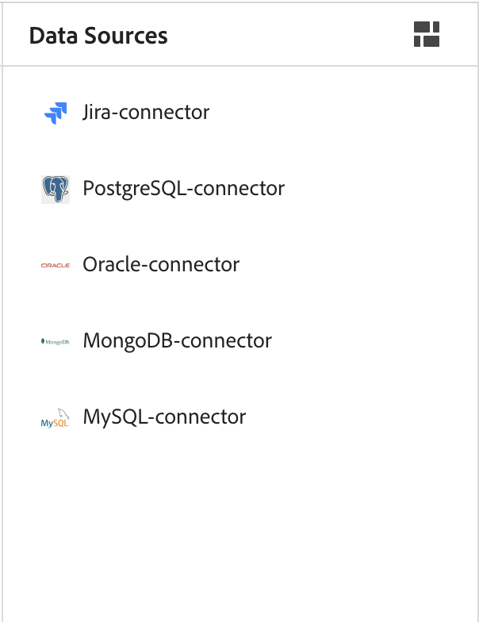{width="300"}

*接続されたデータソースのリスト。*

### タイル表示

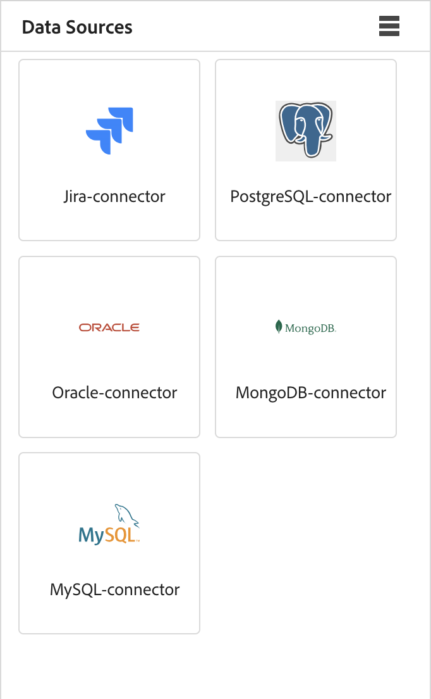{width="300"}

*接続されたデータ ソースをタイルとして表示します。*

データソースのデータは、次の2つの方法で使用できます。
- コンテンツスニペットの挿入
- トピックの作成

## データソースからコンテンツスニペットを挿入する

Adobe Experience Manager Guidesには、データソースに接続する機能が用意されています。 データを取得し、トピックに挿入して編集できます。 コンテンツスニペットジェネレーターを使用してコンテンツスニペットを簡単に作成し、トピック内で再利用できます。

コンテンツスニペットジェネレーターを使用してコンテンツスニペットを作成し、トピックに挿入するには、次の手順を実行します。

1. 左側のパネルで「**データソース** 」を選択して、接続されたデータソースを表示します。

1. データソースを選択して、選択したデータソースで使用可能なコンテンツスニペットジェネレーターを表示します。

   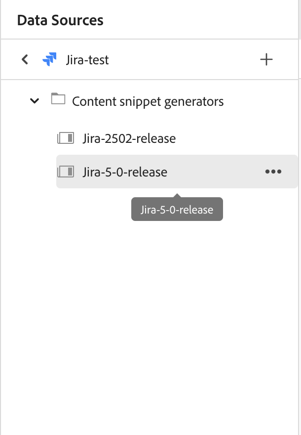{width="300"}

   *データソースパネルには、使用可能なコンテンツスニペットジェネレーターが一覧表示されます。*

1. **追加**&#x200B;を選択して、新しいコンテンツスニペットジェネレーターを追加します。 **コンテンツスニペットジェネレーターを追加** パネルが開きます。

   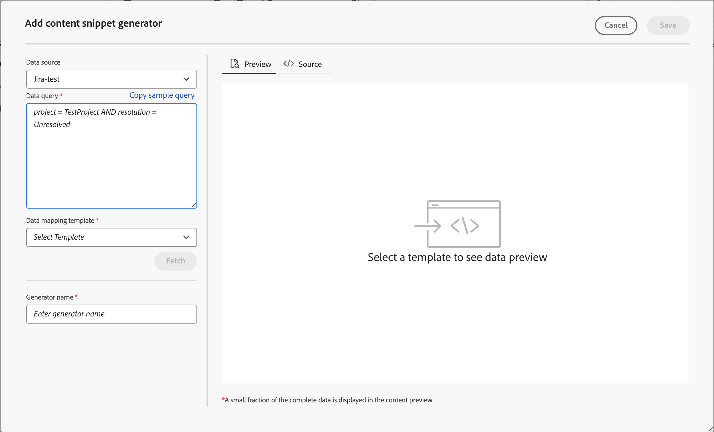{width="500"}

1. 「**データクエリ**」テキストボックスにクエリを入力します。  「**サンプルクエリをコピー**」を選択して、データクエリをすばやくコピーします。 手動でクエリを作成する代わりに、サンプルクエリを&#x200B;**データクエリ** テキストボックスにコピーして貼り付けることができます。 次に、データ要件に従ってクエリを編集するだけです。

   >[!NOTE]
   >
   > Experience Managerには、様々なデータソースのすべてのリソースに対して異なるサンプルクエリが用意されています。 これらは、データの取得元となるデータソースにマッピングされます。

1. ファイルコネクタを使用する場合は、コンピューターからJSON ファイルをアップロードするか、Adobe Experience Manager assetsからJSON ファイルを参照できます。

   >[!NOTE]
   >
   > ファイルコネクタを使用する場合は、データクエリの代わりにファイルをアップロードまたは参照するオプションを表示します。

1. **データマッピングテンプレート** ドロップダウンから、データソースとマッピングするテンプレートを選択します。
選択したデータソースのすぐに使用できるテンプレートがドロップダウンに表示されます。 例えば、「PostgreSQL」という名前のデータソースの「sql-table」テンプレートを表示できます。

   >[!NOTE]
   >  
   > 管理者がカスタマイズしたテンプレートを設定している場合、そのテンプレートもドロップダウンリストに表示されます（管理者が行ったテンプレートパス設定に基づいて）。
   >   
   >テンプレートでVelocity ツールを使用することもできます。 [速度ツールの使用方法について詳しくは、](#use-velocity-tools)を参照してください。

1. REST Client、Salsify、Akeneo、Microsoft ADOなどの一部のコネクタの&#x200B;**リソース** ドロップダウンが表示されます。  ドロップダウンから任意のリソースを選択して接続し、コンテンツスニペットまたは生成ツールを使用してトピックを作成します。

   >[!NOTE]
   >
   > 管理者は、データソースコネクタの設定中に、デフォルトリソースを設定したり、複数のURLのリソースを追加したりできます。

1. 「**Fetch**」を選択して、データソースからデータを取得し、SQL クエリの結果となるデータにテンプレートを適用します。

1. データは、プレビューまたはDITA ソースビューで表示できます。

   1. プレビューには、コンテンツに挿入されたときにデータがどのように表示されるかが示されます。 プレビューには、選択したテンプレートの形式のデータのほんの一部が表示されます。
例：
      - SQL-table テンプレートを選択した場合は、SQL データを表形式で表示できます。
      - Jira-ordered-list テンプレートを選択した場合は、Jiraの課題の順序付きリストを表示できます。

   1. ソースビューには、DITA ソースビューのデータが表示されます。

      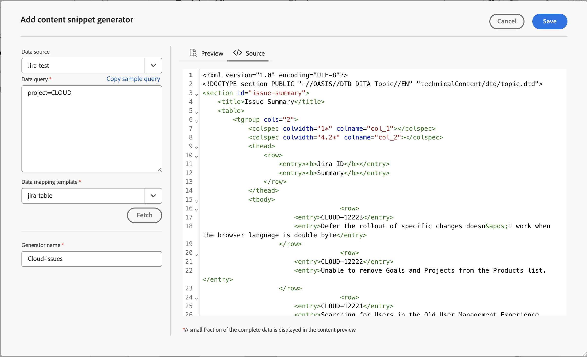{width="500"}
      *コンテンツスニペットジェネレーターを追加します。 ソース モードまたはプレビューモードでデータを表示します。*

1. クエリの結果を保存するには、ジェネレーターの名前を入力し、**追加**&#x200B;を選択します。   新しいコンテンツスニペットジェネレーターがリストに追加されます。

   >[!NOTE]
   >
   > 新しいコンテンツジェネレーターの名前については、ファイル命名規則に従う必要があります。 コンテンツスニペットジェネレーターの名前にスペースを含めることはできません。 また、既存のコンテンツジェネレーターの名前で新しいコンテンツジェネレーターを保存することはできません。 エラーが発生します。

### コンテンツスニペットジェネレーターのオプション

コンテンツスニペットジェネレーターを右クリックしてオプションを開きます。 オプションを使用すると、次の操作を実行できます。

- **プレビュー**：このオプションを使用してペインを開き、データが出力にどのように表示されるかのほんの一部を表示します。
- **挿入**：このオプションを使用すると、選択したコンテンツスニペットを、エディターで編集用に開いたトピックに挿入できます。 データがスニペットとして挿入されると、エディターでトピック内のデータを編集することもできます。

  >[!NOTE]
  > 
  > 挿入オプションは、トピックの編集中にのみ表示されます。

- **編集**：このオプションを使用して、コンテンツスニペットジェネレーターで変更を加え、保存します。
- **削除**：選択したコンテンツスニペットジェネレーターを削除するには、このオプションを使用します。
- **重複**：このオプションを使用して、選択したコンテンツスニペットジェネレーターの重複またはコピーを作成します。 デフォルトでは、接尾辞（generator_1など）を付けて複製が作成されます。

### クエリデータの挿入

ツールバーの&#x200B;**クエリデータ** を使用して、データスニペットをトピックに挿入することもできます。  ドロップダウンからジェネレーターを選択したり、クエリを編集したり、テンプレートを変更してトピックにデータを挿入したりできます。

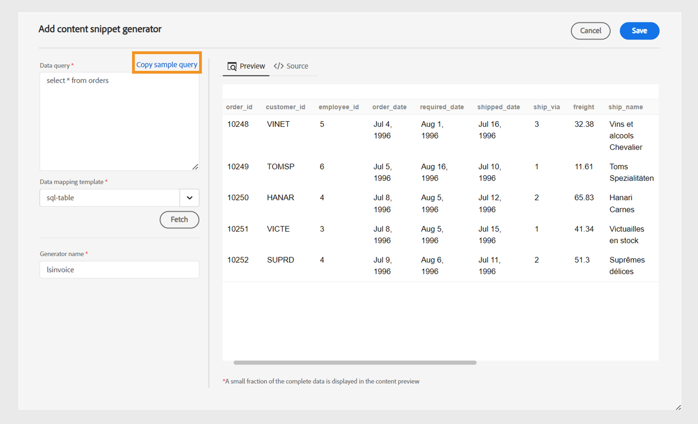

*データスニペットを編集して挿入します。*

## トピックジェネレーターを使用したトピックの作成

トピックジェネレーターは、ソースからのデータを含むトピックを作成するのに役立ちます。 トピックジェネレーターをすばやく作成し、ジェネレーターを使用してトピックを生成できます。 各トピックには、表、リスト、段落など、様々な形式のデータを含めることができます。   例えば、トピックでは、すべての新製品の詳細と、販売を中止されるすべての製品のリストを含むテーブルを追加できます。

トピックジェネレーターは、データを含むトピックとすべてのトピックのDITA マップを作成できます。 これらのトピックをコンテンツ内で`<conref>`することもできます。 これにより、データソースとデータを同期させ、簡単に更新できます。

### トピックの作成

トピックジェネレーターを使用してトピックを作成するには、次の手順を実行します。

1. データソースを選択して、選択したデータソースで利用可能なコンテンツスニペットジェネレーターとトピックジェネレーターを表示します。

   {width="300"}

   *接続されたデータ ソースのトピック ジェネレーターを追加します。*

1. **追加** を選択し、ドロップダウンから&#x200B;**トピックジェネレーター**&#x200B;を選択して、新しいトピックジェネレーターを追加します。 **トピックジェネレーターを追加** パネルが開きます。

1. **トピックジェネレーター** パネルの次の3つのタブの下のフィールドに値を入力します。

   **設定を取得**

   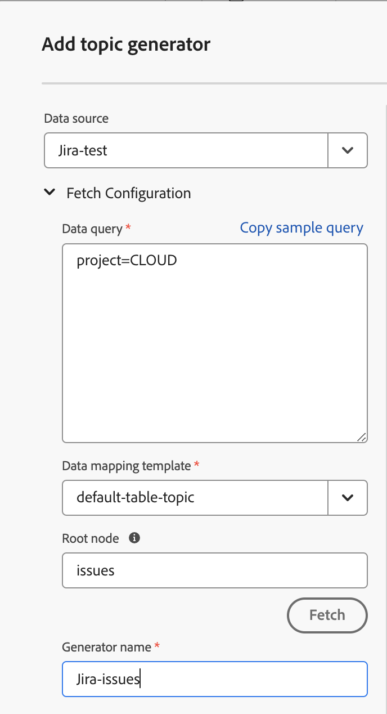{width="300"}

   *トピックジェネレーターのデータクエリ、データマッピングテンプレート、ルートノードの詳細を追加し、フェッチ設定パネルで一意の名前を付けます。*

   1. 「**データクエリ**」テキストボックスにクエリを入力します。 「**サンプルクエリをコピー**」を選択して、データクエリをすばやくコピーします。 手動でクエリを作成する代わりに、サンプルクエリを&#x200B;**データクエリ** テキストボックスにコピーして貼り付けることができます。 次に、データ要件に従ってクエリを編集するだけです。

      >[!NOTE]
      >
      >Experience Managerには、様々なデータソースのすべてのリソースに対して異なるサンプルクエリが用意されています。 これらは、データの取得元となるデータソースにマッピングされます。

   1. ファイルコネクタを使用する場合は、コンピューターからJSON ファイルをアップロードするか、Adobe Experience Manager assetsからJSON ファイルを参照できます。

      >[!NOTE]
      >
      > ファイルコネクタを使用する場合は、データクエリの代わりにファイルをアップロードまたは参照するオプションを表示します。

   1. **データマッピングテンプレート** ドロップダウンから、データソースとマッピングするテンプレートを選択します。

      >[!NOTE]
      >
      > 管理者がカスタマイズしたテンプレートを設定している場合、そのテンプレートもドロップダウンリストに表示されます（管理者が行ったテンプレートパス設定に基づいて）。 例えば、順序付きリスト、表、段落またはその他のDITA要素を含むトピックテンプレートを作成できます。

   1. **ルートノード**&#x200B;を入力します。 これは、データにアクセスするノードです。 次に、トピックジェネレーターは、ルートノードで定義されたレベルで各トピックを作成します。 例えば、「イシュー」をJiraのルートノードとして追加できます。 つまり、クエリが13件の問題を返す場合、13件のトピック、各問題に1つのトピックが返されます。

   1. 「**Fetch**」を選択して、データソースからデータを取得し、SQL クエリの結果となるデータにテンプレートを適用します。 プレビューには、選択したテンプレートの形式でトピックがどのように表示されるかのほんの一部が表示されます。 例えば、クエリの結果のすべてのフィールドを含む1つのJira イシューを表示できます。
   1. トピックジェネレーターの名前を入力します。

      >[!NOTE]
      > 
      > 新しいトピックジェネレーターの名前については、ファイルの命名規則に従う必要があります。 トピックジェネレーター名にスペースを含めることはできません。 また、既存のトピックジェネレーターの名前で新しいトピックジェネレーターを保存することはできません。 エラーが発生します。

   **出力設定**

   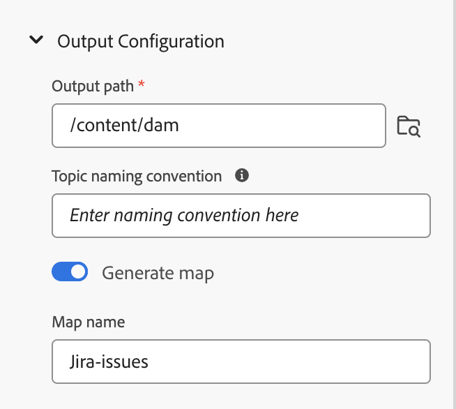{width="300"}

   *出力パスとトピックの命名規則の詳細を出力設定パネルに入力します。 DITA マップを生成し、名前を付けます。*

   1. トピックを保存する&#x200B;**出力パス**&#x200B;の詳細を入力します。
   1. **トピックの命名規則**&#x200B;では、速度タグを使用して値または変数を入力できます。 新しいトピックは条約に従います。 例えば、`$key`を入力して、Jira キーに基づいてトピックを作成できます。
   1. 生成されたすべてのトピックを含むマップを作成する場合は、「**マップを生成**&#x200B;する」オプションを有効にします。
   1. 新しいDITA マップの名前を入力します。

   >[!NOTE]
   >
   > トピックジェネレーターは、トピックと同じ出力パスにDITA マップを生成します。

   **メタデータ**

   ドロップダウンからメタデータプロパティを選択して、トピックに渡します。 **名前** ドロップダウンには、カスタム プロパティと既定のプロパティの両方が一覧表示されます。

   例えば、次のスクリーンショットでは、`dc:description`、`dc:language`、`dc:title`および`docstate`が、値を定義できるデフォルトのプロパティです。 オーサーなどのカスタムプロパティを作成し、その値を定義できます。

   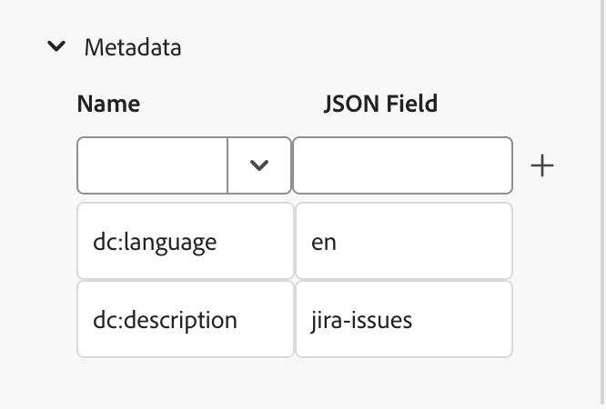{width="300"}

   *メタデータパネルでメタデータプロパティを追加して、トピックに渡します。*

1. ジェネレーターの名前を入力し、**保存**&#x200B;を選択してクエリの結果を保存します。 新しいトピックジェネレーターがリストに追加されます。

1. 「**保存して生成**」を選択して、トピックジェネレーターを保存し、トピックジェネレーターから新しいトピックを生成します。

   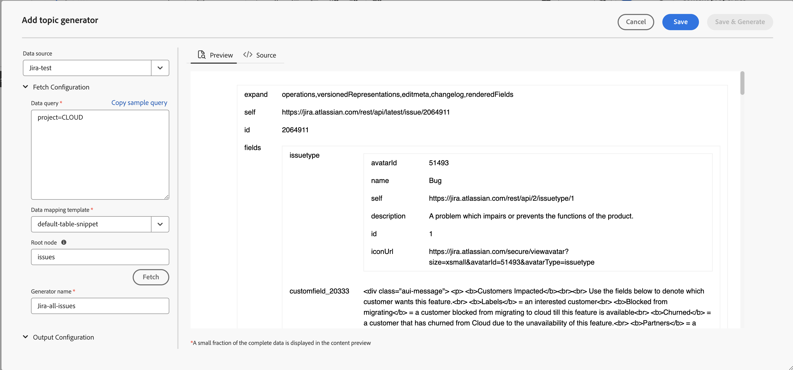

   *既存のトピックジェネレーターから新しいトピックを生成します。*

   >[!NOTE]
   >
   > トピックが既に存在する場合、ジェネレーターは既存のトピック内のデータを更新します。

### トピックジェネレーターのオプション

トピックジェネレーターを右クリックして、**オプション**&#x200B;を開きます。 オプションを使用すると、次の操作を実行できます。

- **生成**：このオプションは、選択したトピック ジェネレーターのトピックを生成します。 このオプションを使用して、既存のトピックを更新することもできます。 データソースに接続し、更新されたデータを取得します。 コンテンツの生成中、このオプションは無効になっており、ローダーを表示します。
  >[!NOTE]
  >
  >トピックが既に存在する場合は、トピック内のデータを上書きするか、新しいバージョンとして保存できます。

  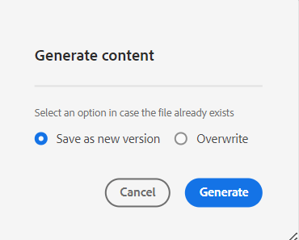

  *トピックを生成し、ファイルが既に存在する場合は、新しいバージョンとして保存するか、上書きします。*
- **ログを表示**: コンテンツ生成ログファイルを表示するには、このオプションを選択します。 ログファイルが新しいタブで開きます。 ログファイル内のエラー、警告、情報メッセージ、および例外を表示できます。 このオプションは、選択したトピックジェネレーターのコンテンツを生成した場合に有効になります。

- **プレビュー**：このオプションを使用してペインを開き、データが出力にどのように表示されるかのほんの一部を表示します。

- **編集**：このオプションを使用して、トピックジェネレーターを変更および保存します。 コンテンツの生成中は、このオプションは無効になっています。
- **削除**：選択したトピックジェネレーターを削除するには、このオプションを使用します。 コンテンツの生成中は、このオプションは無効になっています。
- **重複**：このオプションは、選択したトピックジェネレーターの重複またはコピーを作成します。 デフォルトでは、重複は接尾辞（`topic-sample_1`など）を付けて作成されます。

## データソーステンプレートでのVelocity ツールの使用 {#use-velocity-tools}

Experience Manager テンプレートは、Velocity ツール（バージョン 2.0）もサポートしています。 これらのツールは、データソースから取得したデータに様々な関数を適用するのに役立ちます。 [速度ツール &#x200B;](https://velocity.apache.org/tools/2.0/generic.html)の使用と、適用できる関数について詳しく説明します。

テンプレートでVelocity ツールを使用するには、次の手順を実行します。
1. エディターでVelocity テンプレートを編集します。
1. ツールとその機能を`<tool.function>`形式で追加します。 例：
   - 計算ツールを使用して乱数を生成するには、`$mathTool.random`を使用します。
   - 計算ツールを使用して数値の合計を生成するには、`$mathTool.add(num1, num2)`を使用します。
1. テンプレートを使用して、コンテンツスニペットやトピックを作成します。
1. テンプレートをデータに適用した後、プレビューまたはDITA ソースビューでデータを表示できます。

Velocity テンプレート内の次のツールを使用して、コネクタから取得したデータに様々な関数を適用できます。
-`$alternatorTool`
- `$classTool`
- `$contextTool`
- `$conversionTool`
- `$dateTool`
- `$comparisonDateTool`
- `$displayTool`
- `$escapeTool`
- `$fieldTool`
- `$loopTool`
- `$linkTool`
- `$listTool`
- `$mathTool`
- `$numberTool`
- `$renderTool`
- `$resourceTool`
- `$sortTool`
