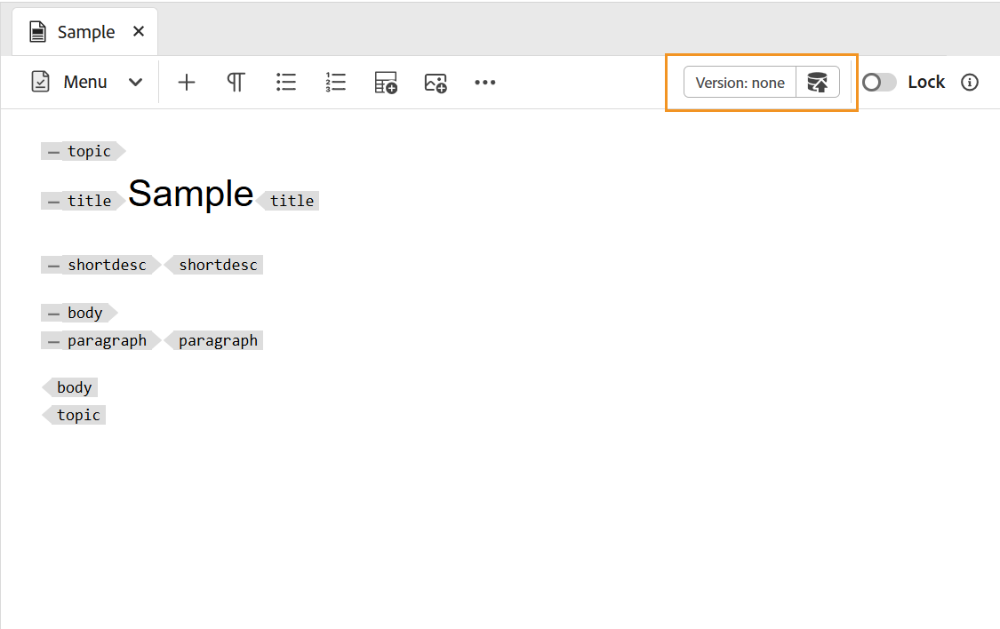

# トピックの作成 {#id2056AL00O5Z}

Adobe Experience Manager Guidesでは、トピック、タスク、コンセプト、リファレンス、用語集、DITAVAL、Markdown など、タイプの DITA トピックを作成できます。 標準のテンプレートに基づいてトピックを作成する以外に、カスタムテンプレートを定義することもできます。 これらのテンプレートは、テンプレート選択ブループリントとエディターに表示するために、フォルダープロファイルに追加する必要があります。

>[!NOTE]
>
> グローバルプロファイルおよびフォルダープロファイルの設定は、フォルダーレベルの管理者ユーザーのみが使用できます。 グローバルプロファイルおよびフォルダーレベルのプロファイルの設定について詳しくは、Adobe Experience Manager Guidesのインストールと設定の *オーサリングテンプレートの設定* を参照してください。

Experience Manager Guidesでトピックを作成するには、次の 2 つの方法があります。

- [エディターからのトピックの作成](#create-topics-from-the-editor)
- [Assets UI からのトピックの作成](#create-topics-from-the-assets-ui)

## エディターからのトピックの作成

エディターからトピックを作成するには、次の手順を実行します。

1. リポジトリパネルで「**新規ファイル**」アイコンを選択し、ドロップダウンメニューから「**トピック**」を選択します。

   {width="500" align="left"}

   このオプションには、[Experience Manager Guidesのホームページ &#x200B;](./intro-home-page.md) およびリポジトリ ビューのフォルダーのオプション メニューからもアクセスできます。

2. **新規トピック** ダイアログボックスが表示されます。

3. **新規トピック** ダイアログボックスで、次の詳細を入力します。
   - トピックのタイトル。
   - \（オプション\）* トピックのファイル名。 ファイル名は、トピックのタイトルに基づいて自動的に提示されます。 管理者が UUID 設定に基づく自動ファイル名を有効にしている場合、「名前」フィールドは表示されません。
   - トピックの基になるテンプレート。 例えば、標準の設定の場合は、「空白」、「概念」、「DITAVAL」、「参照」、「タスク」、「トピック」、「マークダウン」、「用語集」、「トラブルシューティング」の各テンプレートから選択できます。 フォルダーにフォルダープロファイルが設定されている場合は、フォルダープロファイルで設定されているトピックテンプレートのみが表示されます。
   - トピック ファイルを保存するパス。 デフォルトでは、リポジトリで現在選択されているフォルダーのパスが「パス」フィールドに表示されます。

4. 「**作成**」を選択します。

   {width="300" align="left"}

指定したパスにトピックが作成されます。 また、エディターでトピックが開いて編集できます。

{align="left"}

## Assets UI からのトピックの作成

Assets UI からトピックを作成するには、次の手順を実行します。

1. Assets UI で、トピックを作成する場所に移動します。

1. 新しいトピックを作成するには、**作成** \> **DITA トピック** を選択します。

1. 「ブループリント」ページで、作成する DITA 文書のタイプを選択し、「**次へ**」を選択します。

   {align="left"}

   デフォルトでは、Experience Manager Guidesは最もよく使用される DITA トピックテンプレートを提供します。 組織の要件に応じて、より多くのトピックテンプレートを設定できます。また、*オーサリングテンプレートを設定* のインストールで、設定に合わせてAdobe Experience Manager Guidesを設定できます。

   >[!NOTE]
   >
   > Assets UI のリストビューでは、「Type」列に「Topic」、「Task」、「Concept」、「Reference」、「Glossentry」、「Markdown」、「DITAVAL」と DITA トピックタイプが表示されます。 DITA マップは Map として表示されます。

1. プロパティページで、ドキュメント **タイトル** を指定します。

1. \（オプション\） ファイル **名前** を指定します。

   管理者が UUID 設定に基づいて自動的にファイル名を設定している場合、ファイル名を指定するオプションは表示されません。 UUID ベースのファイル名がファイルに自動的に割り当てられます。

   ファイル命名オプションが使用可能な場合は、ドキュメントの **タイトル** に基づいて名前が自動的に提案されます。 ドキュメント名を手動で指定する場合は、**Name** にスペース、アポストロフィ、または中括弧が含まれず、.xml または.dita で終わっていることを確認してください。 デフォルトでは、Experience Manager Guidesはすべての特殊文字をハイフンに置き換えます。 DITA ファイルの命名に関するベストプラクティスについては、ベストプラクティスガイドの「ファイル名」節を参照してください。

1. 「**作成**」を選択します。「トピックを作成しました」のメッセージが表示されます。

   編集するトピックをエディタで開くか、トピック ファイルをAdobe Experience Manager リポジトリに保存するかを選択できます。

**追加情報**

1. Assets UI **Create** \> **DITA Topic** またはエディタから新しいトピックを作成するたびに、一意のトピック ID が割り当てられます。 この ID の値はファイル名自体です。 また、新しいドキュメントは、トピックの最新の作業用コピーとして DAM に保存されます。 新しく作成したトピックのリビジョンを保存するまで、バージョン履歴にバージョン番号は表示されません。 トピックを編集用に開くと、ツールバーの右上隅にバージョン情報が表示されます。

   {width="550" align="left"}

2. 新しく作成したトピックのバージョン情報は *なし* と表示されます。 新しいバージョンを保存すると、そのバージョンには 1.0 というバージョン番号が割り当てられます。

3. 編集前にファイルをロックするように管理者が設定している場合、ファイルをロックするまで、ファイルを編集できません。 同様に、設定すると、ロックされているファイルを閉じる前にロックを解除するように求められます。

4. DITA トピックを作成したら、作業コピーへの変更を保存し続け、トピックの更新が完了したら新しいバージョンを作成します。

**親トピック：**&#x200B;[&#x200B; トピックの作成とプレビュー &#x200B;](create-preview-topics.md)
